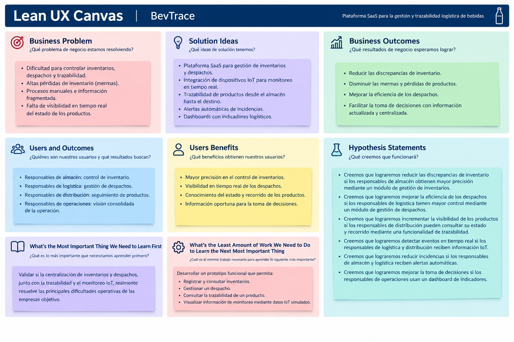

# Capítulo I: Introducción

La introducción establece el marco conceptual sobre el cual se desarrollará el proyecto. En esta sección inicial se presenta una visión general que permite comprender los objetivos principales, los antecedentes, la problemática identificada bajo la técnica 5W2H, y las asunciones e hipótesis formuladas siguiendo la metodología Lean UX. Asimismo, se definen los segmentos objetivo diferenciando claramente entre los compradores (Buyers) y los usuarios (Users) finales del sistema.

## 1.1. Startup Profile

### 1.1.1. Descripción de la Startup

En una industria donde la eficiencia logística y el control de mermas dictan la rentabilidad, **BevTrace** nace con el propósito de digitalizar y automatizar la cadena de suministro de empresas embotelladoras y distribuidoras de consumo masivo, específicamente en la distribución de bebidas en envases PET no retornables. 

Nuestra propuesta de valor es un sistema SaaS integral que une la gestión operativa con el Internet de las Cosas (IoT). Buscamos eliminar la dependencia de reportes manuales e inventarios estáticos mediante una arquitectura tecnológica que permite el monitoreo en tiempo real, la gestión centralizada de despachos y la trazabilidad inmutable del producto desde el almacén hasta su destino.

<h4 id="Mision">Misión</h4>

Desarrollar una solución tecnológica SaaS robusta y escalable que permita a las empresas embotelladoras digitalizar sus procesos de distribución y trazabilidad logística. En BevTrace nos enfocamos en mitigar la pérdida de inventario (mermas) y optimizar la asignación de despachos integrando telemetría IoT, proporcionando datos exactos y en tiempo real para la toma de decisiones.

<h4 id="Vision">Visión</h4>

Ser la plataforma logística líder en el sector de consumo masivo a nivel regional, estandarizando la trazabilidad inteligente y la digitalización de almacenes, convirtiendo el control de despachos en un proceso totalmente automatizado, transparente e impulsado por datos.

### 1.1.2. Perfiles de integrantes del equipo (CodeCraft)
<table border="1" width="100%">
  <colgroup>
    <col style="width:140px">
    <col>
  </colgroup>
  <tr>
    <td width="140" valign="top" align="center">
      
    </td>
    <td valign="top">
      <strong>Mauricio Sebastian Castillo Yataco</strong> - Ingeniería de Software  
      [Insertar descripción manual aquí].
    </td>
  </tr>
  <tr>
    <td width="140" valign="top" align="center">
      
    </td>
    <td valign="top">
      <strong>Christofer William Costa Morales</strong> - Ingeniería de Software  
      Soy estudiante de la carrera de Ingeniería de Software. Cuento con conocimientos en programación C++, edición de videos en canvas, experiencia con los formatos Start up y conocimiento con los programas de Office, como Excel.
    </td>
  </tr>
  <tr>
    <td width="140" valign="top" align="center">
      
    </td>
    <td valign="top">
      <strong>Danitza Ivonne Heredia Hoyos</strong> - Ingeniería de Software  
      [Insertar descripción manual aquí].
    </td>
  </tr>
  <tr>
    <td width="140" valign="top" align="center">
      
    </td>
        <td valign="top" align="justify">
      <strong>Enrique Augusto Ochoa Prado</strong> - Ingeniería de Software  
      Mi nombre es Enrique Augusto Ochoa Prado y actualmente tengo 19 años de edad. Me encuentro realizando mis estudios universitarios en el sexto ciclo de la carrera de Ingeniería de Software en la UPC. Durante este período académico, he adquirido conocimientos fundamentales en el desarrollo de software, abarcando áreas como programación, bases de datos y desarrollo web. Las dinámicas de trabajo colaborativo han sido una constante en mi experiencia estudiantil, donde he demostrado capacidad de integración y liderazgo en diversos equipos. Esta trayectoria me ha brindado la confianza necesaria para enfrentar desafíos de mayor alcance. Mi compromiso se centra en mantener una metodología rigurosa y perseverante que permita alcanzar resultados óptimos en conjunto con mis compañeros de proyecto.
    </td>
  </tr>
</table>

## 1.2. Solution Profile
### 1.2.1. Antecedentes y problemática

*   **What (¿Qué?):** Pérdida de inventario (mermas), desorganización en la asignación de despachos y nula trazabilidad del estado físico del producto durante las operaciones logísticas.
*   **Why (¿Por qué?):** Porque los procesos dependen de verificaciones manuales y desconectadas. No existe un ecosistema que integre la lectura masiva de productos ni el monitoreo ambiental/físico de la carga en los vehículos.
*   **Who (¿Quién?):** Afecta financieramente a las empresas embotelladoras y distribuidoras. Operativamente impacta a los Jefes/Gerentes de Logística y a los Operarios de Almacén.
*   **When (¿Cuándo?):** Durante los procesos de preparación de pedidos (picking), asignación de rutas, carga de vehículos y transporte hacia los distribuidores finales.
*   **Where (¿Dónde?):** En los centros de distribución, almacenes de las embotelladoras y durante la ruta de los camiones de transporte.
*   **How (¿Cómo?):** Se soluciona implementando una plataforma SaaS que centralice la información y se integre con hardware IoT (sensores de peso, humedad, temperatura y antenas de lectura masiva RFID) para automatizar el registro y monitorear el estado de los envases.
*   **How much (¿Cuánto?):** Las pérdidas por mermas no detectadas a tiempo y las ineficiencias en despachos representan millones en sobrecostos operativos anuales para la industria de bebidas masivas.

### 1.2.2. Lean UX Process

#### 1.2.2.1. Lean UX Problem Statements

<b>Problem Statement</b>

Actualmente, las empresas embotelladoras y distribuidoras presentan dificultades para controlar las mermas, asignar despachos y mantener la trazabilidad de sus productos, debido a procesos manuales y sistemas desconectados. Si bien existen soluciones para la gestión de almacenes, distribución y monitoreo de flotas, estas se encuentran fragmentadas y pueden presentar altos costos o complejidad de implementación. Los responsables de logística necesitan mayor visibilidad de la operación, mientras que los operarios requieren procesos más ágiles y menos verificaciones manuales. Ante esta situación, BevTrace busca integrar la gestión logística y el monitoreo IoT en una plataforma SaaS, considerando como restricciones el costo del hardware, la integración con sistemas existentes, la conectividad durante el transporte y la facilidad de adopción.

#### 1.2.2.2. Lean UX Assumptions

Los siguientes supuestos representan las creencias iniciales del equipo sobre el negocio, los usuarios, los resultados esperados y las funcionalidades principales de BevTrace.

<b>Business Assumptions</b>

- Creemos que las empresas embotelladoras y distribuidoras que presentan problemas de control de mermas y despachos están dispuestas a evaluar una solución SaaS para centralizar su operación logística.
- Creemos que la reducción de mermas y la mejora del control de despachos representan beneficios económicos relevantes para estas empresas.
- Creemos que la integración de tecnologías IoT puede diferenciar a BevTrace frente a soluciones que se limitan a la gestión tradicional de inventarios y despachos.

<b>Business Outcome Assumptions</b>

- Creemos que centralizar la información de inventarios, despachos y trazabilidad permitirá reducir las discrepancias entre los registros y la operación física.
- Creemos que disponer de información actualizada sobre la operación permitirá detectar incidencias y mejorar la toma de decisiones logísticas.

<b>User Assumptions</b>

- Creemos que los responsables de almacén necesitan reducir el tiempo dedicado a verificaciones y registros manuales de productos.
- Creemos que los responsables de logística necesitan consultar y supervisar el estado de inventarios y despachos desde un único sistema.
- Creemos que los responsables de distribución necesitan conocer el estado y recorrido de los productos durante su traslado.
- Creemos que los responsables de operaciones necesitan información consolidada para identificar incidencias y evaluar el desempeño logístico.

<b>User Outcome and Benefit Assumptions</b>

- Creemos que los usuarios podrán identificar más rápidamente las diferencias entre el inventario registrado y el inventario físico.
- Creemos que los responsables de logística podrán gestionar los despachos de manera más eficiente al disponer de información centralizada.
- Creemos que los responsables de distribución podrán detectar oportunamente incidencias durante el traslado de los productos.
- Creemos que los responsables de operaciones podrán tomar decisiones con mayor rapidez al contar con indicadores actualizados.

<b>Feature Assumptions</b>

1. <b>Gestión de inventarios</b>
    Creemos que registrar y consultar digitalmente el inventario permitirá reducir errores y discrepancias en el control de productos. 

2. <b>Gestión de despachos</b>
    Creemos que centralizar el registro y asignación de despachos permitirá mejorar su seguimiento y reducir inconsistencias durante la distribución. 

3. <b>Trazabilidad de productos</b>
    Creemos que registrar el recorrido de los productos permitirá conocer su estado desde el almacén hasta el destino. 

4. <b>Monitoreo IoT</b>
    Creemos que la integración con sensores y dispositivos IoT permitirá obtener información sobre las condiciones de los productos durante el transporte. 

5. <b>Alertas de incidencias</b>
    Creemos que las alertas automáticas permitirán detectar oportunamente eventos que puedan afectar los productos o la operación logística. 

6. <b>Dashboard de indicadores</b>
    Creemos que un dashboard con indicadores de inventario, despachos y trazabilidad permitirá a los responsables de operaciones identificar problemas y tomar decisiones oportunamente. 

#### 1.2.2.3. Lean UX Hypothesis Statements
- <b>Hipótesis 1:</b> Creemos que lograremos reducir las discrepancias de inventario si los responsables de almacén obtienen mayor precisión y visibilidad sobre los productos disponibles mediante un módulo centralizado de gestión de inventarios. Sabremos que esto es cierto cuando al menos el 70% de los responsables de almacén que utilicen la solución reporten una reducción de las diferencias entre el inventario registrado y el inventario real durante el periodo de validación.
- <b>Hipótesis 2:</b> Creemos que lograremos mejorar la eficiencia de los despachos si los responsables de logística obtienen mayor control y visibilidad sobre las operaciones de distribución mediante un módulo centralizado de gestión de despachos. Sabremos que esto es cierto cuando al menos el 70% de los responsables de logística que utilicen la solución reporten una mejora en el seguimiento y gestión de los despachos durante el periodo de validación.
- <b>Hipótesis 3:</b> Creemos que lograremos incrementar la visibilidad de los productos durante el proceso de distribución si los responsables de distribución obtienen acceso al estado y recorrido de los productos mediante una funcionalidad de trazabilidad. Sabremos que esto es cierto cuando al menos el 80% de los responsables de distribución puedan consultar correctamente el estado y recorrido de los productos durante las pruebas de validación.
- <b>Hipótesis 4:</b> Creemos que lograremos detectar oportunamente eventos ocurridos durante la distribución si los responsables de logística y distribución obtienen información operativa en tiempo real mediante la integración de dispositivos IoT. Sabremos que esto es cierto cuando al menos el 80% de los eventos generados durante las pruebas sean detectados y visualizados correctamente por los usuarios responsables.
- <b>Hipótesis 5:</b> Creemos que lograremos reducir las incidencias de inventario y distribución no detectadas oportunamente si los responsables de almacén y logística reciben información sobre eventos relevantes mediante un sistema automatizado de alertas. Sabremos que esto es cierto cuando al menos el 80% de las alertas generadas durante las pruebas sean recibidas y reconocidas correctamente por los usuarios responsables.
- <b>Hipótesis 6:</b> Creemos que lograremos mejorar la toma de decisiones logísticas si los responsables de operaciones obtienen una visión consolidada de los indicadores de inventario, despachos y trazabilidad mediante un dashboard de indicadores. Sabremos que esto es cierto cuando al menos el 80% de los responsables de operaciones puedan identificar correctamente los principales indicadores y utilizarlos para analizar situaciones relacionadas con inventarios y despachos durante las pruebas de validación.

#### 1.2.2.4. Lean UX Canvas

### 1.3. Segmentos objetivo

Basados en la distinción entre *Buyer Persona* (quien toma la decisión de compra) y *User Persona* (quien interactúa diariamente con la herramienta), se definen los siguientes segmentos:

<h3 id="segment1">Segmento Objetivo 1: Buyer Persona - Jefes y Gerentes de Logística</h3>

Este segmento es el encargado de adquirir la plataforma SaaS. Su motivación principal es el retorno de inversión (ROI) a través de la optimización de procesos.

*   **Demografía:** Profesionales entre 35 y 55 años, Ingenieros Industriales o Administradores con especialización en Supply Chain Management.
*   **Necesidades:** Visibilidad total de la operación, control estricto de mermas y KPIs actualizados al segundo para reportar a la alta gerencia.
*   **Relación con el sistema:** Interactúan principalmente con el Dashboard de KPI, configuraciones de reglas de negocio y reportes de trazabilidad IoT.

<h3 id="segment2">Segmento Objetivo 2: User Persona - Operarios y Supervisores de Almacén</h3>

Este segmento es el usuario final y operativo del sistema. El éxito de la implementación depende de que la plataforma les resulte intuitiva y eficiente.

*   **Demografía:** Hombres y mujeres entre 20 y 45 años, con educación técnica o secundaria completa.
*   **Necesidades:** Herramientas rápidas que no entorpezcan su labor física, interfaces claras para leer órdenes de trabajo y evitar el conteo manual repetitivo.
*   **Relación con el sistema:** Interactúan con el módulo de Gestión y Asignación de Despachos, operando los escáneres/antenas de lectura masiva y validando la carga física contra el sistema antes del despliegue de las unidades de transporte.
