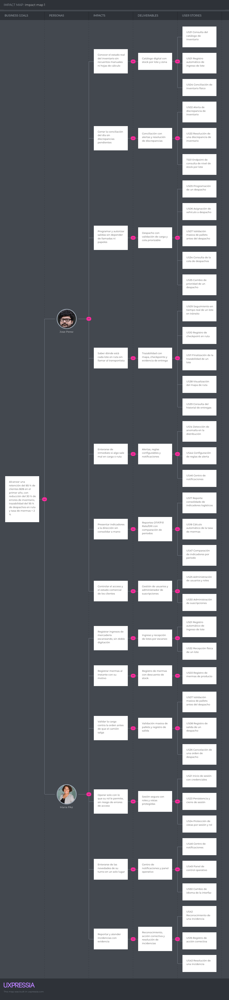

# Capítulo III: Requirements Specification

## 3.1. User Stories.

 

**Epics**

<table border="1" style="border-collapse:collapse; width:100%; table-layout:fixed;">
<tr>
  <th style="width:15%;">Epic /  Story/ ID</th>
  <th style="width:15%;">Título</th>
  <th style="width:35%;">Descripción</th>
  <th style="width:25%;">Criterios de Aceptación</th>
  <th style="width:10%;">Relacionado con (Epic ID)</th>
</tr>
<tr>
  <td>EP01</td>
  <td>Gestión de Lotes e Inventario</td>
  <td>
    <b>Como</b> Operario de Almacén o Jefe de Distribución,
    
<b>deseo</b> registrar, actualizar y conciliar el inventario de lotes de producto de forma automática,

    
<b>para</b> mantener la exactitud del inventario (ERI) y reducir los errores del conteo manual.

  </td>
  <td>-</td>
  <td>-</td>
</tr>
<tr>
  <td>EP02</td>
  <td>Gestión de Despachos</td>
  <td>
    <b>Como</b> Jefe de Distribución u Operario de Almacén,
    
<b>deseo</b> programar, autorizar y validar un despacho antes de su salida,

    
<b>para</b> asegurar que la carga coincida con la orden antes de que el transporte abandone el almacén.

  </td>
  <td>-</td>
  <td>-</td>
</tr>
<tr>
  <td>EP03</td>
  <td>Trazabilidad de Ruta</td>
  <td>
    <b>Como</b> Jefe de Distribución,
    
<b>deseo</b> dar seguimiento en tiempo real a la ubicación y estado de un lote en tránsito,

    
<b>para</b> confirmar su entrega sin depender de llamadas telefónicas con el transportista.

  </td>
  <td>-</td>
  <td>-</td>
</tr>
<tr>
  <td>EP04</td>
  <td>Monitoreo IoT y Telemetría</td>
  <td>
    <b>Como</b> Developer,
    
<b>deseo</b> vincular dispositivos IoT a los lotes de producto y capturar su telemetría (temperatura, ubicación, estado de conexión),

    
<b>para</b> proveer datos objetivos que alimenten la trazabilidad y la detección de anomalías.

  </td>
  <td>-</td>
  <td>-</td>
</tr>
<tr>
  <td>EP05</td>
  <td>Gestión de Incidencias</td>
  <td>
    <b>Como</b> Operario de Almacén o Jefe de Distribución,
    
<b>deseo</b> que el sistema detecte y notifique automáticamente anomalías en la distribución,

    
<b>para</b> reaccionar antes de que el problema se descubra recién en la etapa de entrega.

  </td>
  <td>-</td>
  <td>-</td>
</tr>
<tr>
  <td>EP06</td>
  <td>Reportería e Indicadores Operativos</td>
  <td>
    <b>Como</b> Jefe de Distribución,
    
<b>deseo</b> consolidar automáticamente los indicadores logísticos (OTIF, Fill Rate, ERI, rotación de inventario),

    
<b>para</b> presentarlos a la alta dirección sin invertir días en su elaboración manual.

  </td>
  <td>-</td>
  <td>-</td>
</tr>
<tr>
  <td>EP07</td>
  <td>Sitio Web Estático (Landing Page)</td>
  <td>
    <b>Como</b> visitante,
    
<b>deseo</b> conocer la propuesta de valor de BevTrace y sus beneficios para mi segmento,

    
<b>para</b> evaluar si es la solución adecuada para mi operación antes de contactar al equipo comercial.

  </td>
  <td>-</td>
  <td>-</td>
</tr>

<tr>
  <td>EP08</td>
  <td>Seguridad y Gestión de Accesos (IAM)</td>
  <td>
    <b>Como</b> usuario de BevTrace,
    
<b>deseo</b> autenticarme de forma segura y que el sistema administre mi cuenta y rol,

    
<b>para</b> que cada persona acceda únicamente a las funciones de su perfil.

  </td>
  <td>-</td>
  <td>-</td>
</tr>
<tr>
  <td>EP09</td>
  <td>Gestión de Suscripciones y Pagos</td>
  <td>
    <b>Como</b> Administrador,
    
<b>deseo</b> gestionar el ciclo de vida de las suscripciones de BevTrace con pago simulado,

    
<b>para</b> controlar el acceso comercial a la plataforma y mantener el registro de facturación.

  </td>
  <td>-</td>
  <td>-</td>
</tr>
<tr>
  <td>EP10</td>
  <td>Panel Operativo y Experiencia de Uso</td>
  <td>
    <b>Como</b> usuario de BevTrace,
    
<b>deseo</b> contar con un panel que consolide la operación y una interfaz en mi idioma,

    
<b>para</b> iniciar cada jornada con una visión general y usar la plataforma en mi preferencia de idioma.

  </td>
  <td>-</td>
  <td>-</td>
</tr>
</table>

 

**User Stories**

<table border="1" style="border-collapse:collapse; width:100%; table-layout:fixed;">
<tr>
  <th style="width:15%;">Epic /  Story/ ID</th>
  <th style="width:15%;">Título</th>
  <th style="width:35%;">Descripción</th>
  <th style="width:25%;">Criterios de Aceptación</th>
  <th style="width:10%;">Relacionado con (Epic ID)</th>
</tr>
<tr>
  <td>US01</td>
  <td>Registro automático de ingreso de lote</td>
  <td>
    <b>Como</b> Operario de Almacén, 
    <b>deseo</b> registrar el ingreso de un lote escaneando su código, 
    <b>para</b> actualizar el inventario sin digitación manual.
  </td>
  <td>
    <b>Escenario 1: Registro exitoso de lote</b> 
    <b>Dado</b> que un lote de producto llega al centro de acopio con un código válido, 
    <b>Cuando</b> el operario escanea el código del lote, 
    <b>Entonces</b> el sistema registra el ingreso y actualiza el inventario disponible.  
    <b>Escenario 2: Código de lote inválido</b> 
    <b>Dado</b> que el código escaneado no corresponde a un lote registrado, 
    <b>Cuando</b> el operario intenta registrar el ingreso, 
    <b>Entonces</b> el sistema rechaza el registro y solicita verificación manual.
  </td>
  <td>EP01</td>
</tr>
<tr>
  <td>US02</td>
  <td>Alerta de discrepancia de inventario</td>
  <td>
    <b>Como</b> Jefe de Distribución, 
    <b>deseo</b> recibir una alerta cuando se detecte una discrepancia de inventario, 
    <b>para</b> investigarla antes del cierre del turno.
  </td>
  <td>
    <b>Escenario 1: Discrepancia detectada</b> 
    <b>Dado</b> que el inventario físico conciliado no coincide con el inventario registrado en el sistema, 
    <b>Cuando</b> se ejecuta la conciliación diaria, 
    <b>Entonces</b> el sistema genera una alerta de discrepancia dirigida al Jefe de Distribución.  
    <b>Escenario 2: Sin discrepancias</b> 
    <b>Dado</b> que el inventario físico coincide con el inventario registrado, 
    <b>Cuando</b> se ejecuta la conciliación diaria, 
    <b>Entonces</b> el sistema marca el inventario como conciliado sin generar alertas.
  </td>
  <td>EP01</td>
</tr>
<tr>
  <td>US03</td>
  <td>Registro de mermas de producto</td>
  <td>
    <b>Como</b> Operario de Almacén, 
    <b>deseo</b> registrar el desperdicio o merma de un producto dañado, 
    <b>para</b> mantener el inventario actualizado con la cantidad real disponible.
  </td>
  <td>
    <b>Escenario 1: Registro de merma exitoso</b> 
    <b>Dado</b> que un producto presenta daño visible durante la manipulación, 
    <b>Cuando</b> el operario registra la merma indicando el motivo, 
    <b>Entonces</b> el sistema descuenta la cantidad del inventario disponible y guarda el motivo registrado.  
    <b>Escenario 2: Registro sin motivo especificado</b> 
    <b>Dado</b> que el operario intenta registrar una merma sin indicar el motivo, 
    <b>Cuando</b> se envía el registro, 
    <b>Entonces</b> el sistema rechaza el registro y solicita completar el motivo de la merma.
  </td>
  <td>EP01</td>
</tr>
<tr>
  <td>US04</td>
  <td>Conciliación de inventario físico</td>
  <td>
    <b>Como</b> Jefe de Distribución, 
    <b>deseo</b> confirmar la conciliación del inventario físico frente al inventario registrado en el sistema, 
    <b>para</b> cerrar el ciclo de auditoría diaria sin discrepancias pendientes.
  </td>
  <td>
    <b>Escenario 1: Conciliación conforme</b> 
    <b>Dado</b> que el conteo físico registrado coincide con el inventario del sistema, 
    <b>Cuando</b> el Jefe de Distribución confirma la conciliación, 
    <b>Entonces</b> el sistema marca el periodo como conciliado y actualiza el indicador ERI.  
    <b>Escenario 2: Conciliación con diferencias pendientes</b> 
    <b>Dado</b> que existen discrepancias sin resolver al momento de conciliar, 
    <b>Cuando</b> el Jefe de Distribución intenta confirmar la conciliación, 
    <b>Entonces</b> el sistema impide el cierre y lista las discrepancias pendientes de resolución.
  </td>
  <td>EP01</td>
</tr>
<tr>
  <td>US05</td>
  <td>Programación de un despacho</td>
  <td>
    <b>Como</b> Jefe de Distribución, 
    <b>deseo</b> programar un despacho indicando los lotes y el destino, 
    <b>para</b> planificar la salida de mercadería con anticipación.
  </td>
  <td>
    <b>Escenario 1: Programación exitosa</b> 
    <b>Dado</b> que los lotes seleccionados están disponibles en inventario, 
    <b>Cuando</b> el Jefe de Distribución programa el despacho con un destino y fecha, 
    <b>Entonces</b> el sistema crea el despacho en estado programado.  
    <b>Escenario 2: Lote no disponible</b> 
    <b>Dado</b> que uno de los lotes seleccionados no cuenta con stock suficiente, 
    <b>Cuando</b> se intenta programar el despacho, 
    <b>Entonces</b> el sistema rechaza la programación e indica el lote con stock insuficiente.
  </td>
  <td>EP02</td>
</tr>
<tr>
  <td>US06</td>
  <td>Asignación de vehículo a despacho</td>
  <td>
    <b>Como</b> Jefe de Distribución, 
    <b>deseo</b> asignar un vehículo de transporte a un despacho programado, 
    <b>para</b> autorizar la salida de la mercadería.
  </td>
  <td>
    <b>Escenario 1: Asignación exitosa</b> 
    <b>Dado</b> que existe un despacho programado y un vehículo disponible, 
    <b>Cuando</b> el Jefe de Distribución asigna el vehículo al despacho, 
    <b>Entonces</b> el sistema autoriza el despacho y notifica al equipo de almacén.  
    <b>Escenario 2: Vehículo no disponible</b> 
    <b>Dado</b> que el vehículo seleccionado ya está asignado a otro despacho, 
    <b>Cuando</b> el Jefe de Distribución intenta asignarlo, 
    <b>Entonces</b> el sistema rechaza la asignación e indica que el vehículo no está disponible.
  </td>
  <td>EP02</td>
</tr>
<tr>
  <td>US07</td>
  <td>Validación masiva de pallets antes del despacho</td>
  <td>
    <b>Como</b> Operario de Almacén, 
    <b>deseo</b> validar mediante lectura masiva que los pallets cargados coincidan con la orden de despacho, 
    <b>para</b> evitar errores antes de la salida del transporte.
  </td>
  <td>
    <b>Escenario 1: Carga coincide con la orden</b> 
    <b>Dado</b> que los pallets cargados fueron leídos mediante el lector masivo, 
    <b>Cuando</b> el sistema compara la lectura contra la orden de despacho, 
    <b>Entonces</b> el sistema autoriza la salida del transporte.  
    <b>Escenario 2: Discrepancia entre carga y orden</b> 
    <b>Dado</b> que la lectura masiva detecta un pallet no incluido en la orden, 
    <b>Cuando</b> el sistema realiza la comparación, 
    <b>Entonces</b> el sistema bloquea la salida y notifica la discrepancia al operario.
  </td>
  <td>EP02</td>
</tr>
<tr>
  <td>US08</td>
  <td>Registro de salida de un despacho</td>
  <td>
    <b>Como</b> Operario de Almacén, 
    <b>deseo</b> registrar la salida del transporte una vez autorizado el despacho, 
    <b>para</b> dejar constancia del inicio del trayecto.
  </td>
  <td>
    <b>Escenario 1: Registro de salida exitoso</b> 
    <b>Dado</b> que el despacho fue autorizado y la carga validada, 
    <b>Cuando</b> el operario registra la salida del transporte, 
    <b>Entonces</b> el sistema marca el despacho como en tránsito y registra la hora de salida.  
    <b>Escenario 2: Intento de salida sin autorización</b> 
    <b>Dado</b> que el despacho no cuenta con autorización previa, 
    <b>Cuando</b> el operario intenta registrar la salida, 
    <b>Entonces</b> el sistema impide el registro e indica que el despacho no está autorizado.
  </td>
  <td>EP02</td>
</tr>
<tr>
  <td>US09</td>
  <td>Seguimiento en tiempo real de un lote en tránsito</td>
  <td>
    <b>Como</b> Jefe de Distribución, 
    <b>deseo</b> visualizar la ubicación en tiempo real de un lote en tránsito, 
    <b>para</b> dar seguimiento a la entrega sin depender de llamadas telefónicas.
  </td>
  <td>
    <b>Escenario 1: Lote con señal activa</b> 
    <b>Dado</b> que un lote en tránsito cuenta con un dispositivo IoT conectado, 
    <b>Cuando</b> el Jefe de Distribución consulta el estado del lote, 
    <b>Entonces</b> el sistema muestra la ubicación y el estado actualizados.  
    <b>Escenario 2: Pérdida de conectividad del dispositivo</b> 
    <b>Dado</b> que el dispositivo IoT del lote pierde conectividad, 
    <b>Cuando</b> el sistema detecta la pérdida de señal, 
    <b>Entonces</b> el sistema marca la última ubicación conocida y notifica la pérdida de conectividad.
  </td>
  <td>EP03</td>
</tr>
<tr>
  <td>US10</td>
  <td>Registro de checkpoint en ruta</td>
  <td>
    <b>Como</b> Jefe de Distribución, 
    <b>deseo</b> que el sistema registre automáticamente cuando un lote alcanza un checkpoint de ruta, 
    <b>para</b> conocer su avance sin depender de reportes manuales.
  </td>
  <td>
    <b>Escenario 1: Checkpoint alcanzado</b> 
    <b>Dado</b> que un lote en tránsito ingresa al radio de un checkpoint definido, 
    <b>Cuando</b> el sistema detecta la posición del dispositivo IoT, 
    <b>Entonces</b> el sistema registra el checkpoint alcanzado con fecha y hora.  
    <b>Escenario 2: Checkpoint omitido</b> 
    <b>Dado</b> que un lote pasa de un checkpoint a otro sin registrar el intermedio, 
    <b>Cuando</b> el sistema detecta el salto en la secuencia, 
    <b>Entonces</b> el sistema marca el checkpoint como omitido y genera una observación en la trazabilidad.
  </td>
  <td>EP03</td>
</tr>
<tr>
  <td>US11</td>
  <td>Finalización de la trazabilidad de un lote</td>
  <td>
    <b>Como</b> Jefe de Distribución, 
    <b>deseo</b> que la trazabilidad del lote se finalice automáticamente al confirmarse la entrega, 
    <b>para</b> contar con el expediente completo del lote sin gestión manual adicional.
  </td>
  <td>
    <b>Escenario 1: Entrega confirmada en destino</b> 
    <b>Dado</b> que el lote alcanza el checkpoint final de destino, 
    <b>Cuando</b> el sistema registra la llegada, 
    <b>Entonces</b> el sistema finaliza la trazabilidad del lote y consolida el expediente.  
    <b>Escenario 2: Entrega rechazada</b> 
    <b>Dado</b> que el cliente rechaza la entrega en destino, 
    <b>Cuando</b> el operario registra el rechazo, 
    <b>Entonces</b> el sistema mantiene el lote en estado abierto y registra el motivo del rechazo.
  </td>
  <td>EP03</td>
</tr>
<tr>
  <td>US12</td>
  <td>Visualización de estado de conectividad de dispositivos</td>
  <td>
    <b>Como</b> Jefe de Distribución, 
    <b>deseo</b> visualizar qué dispositivos IoT están conectados o han perdido señal, 
    <b>para</b> actuar antes de perder visibilidad de un lote en tránsito.
  </td>
  <td>
    <b>Escenario 1: Dispositivos con estado visible</b> 
    <b>Dado</b> que existen dispositivos IoT vinculados a lotes activos, 
    <b>Cuando</b> el Jefe de Distribución consulta el panel de conectividad, 
    <b>Entonces</b> el sistema muestra el estado (conectado / desconectado) de cada dispositivo.  
    <b>Escenario 2: Dispositivo sin reportar señal por un periodo prolongado</b> 
    <b>Dado</b> que un dispositivo no reporta señal por más de 30 minutos, 
    <b>Cuando</b> el sistema evalúa el estado de conectividad, 
    <b>Entonces</b> el sistema resalta el dispositivo como crítico dentro del panel.
  </td>
  <td>EP04</td>
</tr>
<tr>
  <td>US13</td>
  <td>Notificación de reconexión de dispositivo</td>
  <td>
    <b>Como</b> Operario de Almacén, 
    <b>deseo</b> que el sistema notifique cuando un dispositivo recupera la conectividad, 
    <b>para</b> confirmar que el monitoreo del lote continúa con normalidad.
  </td>
  <td>
    <b>Escenario 1: Reconexión exitosa</b> 
    <b>Dado</b> que un dispositivo IoT que había perdido señal vuelve a transmitir datos, 
    <b>Cuando</b> el sistema detecta la reconexión, 
    <b>Entonces</b> el sistema notifica al operario y reanuda el monitoreo del lote.  
    <b>Escenario 2: Reconexión con datos incompletos</b> 
    <b>Dado</b> que el dispositivo se reconecta pero reporta datos incompletos, 
    <b>Cuando</b> el sistema valida la telemetría recibida, 
    <b>Entonces</b> el sistema marca el periodo de desconexión como información no disponible.
  </td>
  <td>EP04</td>
</tr>
<tr>
  <td>US14</td>
  <td>Detección de anomalía en la distribución</td>
  <td>
    <b>Como</b> Operario de Almacén, 
    <b>deseo</b> que el sistema genere una alerta automática cuando detecte una anomalía en la carga o en ruta, 
    <b>para</b> reportarla de inmediato sin depender de una revisión visual.
  </td>
  <td>
    <b>Escenario 1: Anomalía detectada</b> 
    <b>Dado</b> que la telemetría de un lote excede los parámetros de rango permitido, 
    <b>Cuando</b> el sistema evalúa los datos del sensor, 
    <b>Entonces</b> el sistema genera una alerta automática y notifica al responsable.  
    <b>Escenario 2: Parámetros dentro de rango</b> 
    <b>Dado</b> que la telemetría del lote se mantiene dentro de los parámetros permitidos, 
    <b>Cuando</b> el sistema evalúa los datos del sensor, 
    <b>Entonces</b> el sistema no genera ninguna alerta.
  </td>
  <td>EP05</td>
</tr>
<tr>
  <td>US15</td>
  <td>Notificación de resolución de incidencia</td>
  <td>
    <b>Como</b> Jefe de Distribución, 
    <b>deseo</b> recibir una notificación cuando se resuelva una incidencia reportada en ruta, 
    <b>para</b> mantener actualizado el estado del despacho.
  </td>
  <td>
    <b>Escenario 1: Incidencia resuelta</b> 
    <b>Dado</b> que una incidencia en ruta fue marcada como resuelta por el responsable asignado, 
    <b>Cuando</b> el sistema actualiza el estado de la incidencia, 
    <b>Entonces</b> el sistema notifica al Jefe de Distribución la resolución del caso.  
    <b>Escenario 2: Incidencia reabierta</b> 
    <b>Dado</b> que una incidencia marcada como resuelta reaparece dentro de las siguientes 24 horas, 
    <b>Cuando</b> el sistema detecta la recurrencia, 
    <b>Entonces</b> el sistema reabre la incidencia y notifica al equipo responsable.
  </td>
  <td>EP05</td>
</tr>
<tr>
  <td>US16</td>
  <td>Registro de acción correctiva</td>
  <td>
    <b>Como</b> Jefe de Distribución, 
    <b>deseo</b> registrar la acción correctiva tomada ante una incidencia, 
    <b>para</b> dejar evidencia de cómo se resolvió el problema.
  </td>
  <td>
    <b>Escenario 1: Registro exitoso de acción correctiva</b> 
    <b>Dado</b> que una incidencia se encuentra en estado reconocido, 
    <b>Cuando</b> el Jefe de Distribución registra la acción correctiva aplicada, 
    <b>Entonces</b> el sistema asocia la acción a la incidencia y actualiza su estado.  
    <b>Escenario 2: Incidencia sin reconocer</b> 
    <b>Dado</b> que la incidencia aún no ha sido reconocida por ningún responsable, 
    <b>Cuando</b> se intenta registrar una acción correctiva, 
    <b>Entonces</b> el sistema exige primero el reconocimiento de la incidencia.
  </td>
  <td>EP05</td>
</tr>
<tr>
  <td>US17</td>
  <td>Reporte consolidado de indicadores logísticos</td>
  <td>
    <b>Como</b> Jefe de Distribución, 
    <b>deseo</b> generar un reporte consolidado de indicadores logísticos (OTIF, Fill Rate, ERI, rotación de inventario), 
    <b>para</b> presentarlo a la alta dirección sin invertir días en su consolidación manual.
  </td>
  <td>
    <b>Escenario 1: Generación exitosa del reporte</b> 
    <b>Dado</b> que existe información operativa registrada para el periodo seleccionado, 
    <b>Cuando</b> el Jefe de Distribución solicita el reporte consolidado, 
    <b>Entonces</b> el sistema genera el reporte con los cuatro indicadores en menos de un minuto.  
    <b>Escenario 2: Periodo sin información suficiente</b> 
    <b>Dado</b> que el periodo seleccionado no cuenta con información operativa registrada, 
    <b>Cuando</b> se solicita el reporte, 
    <b>Entonces</b> el sistema notifica que no hay datos suficientes para consolidar el periodo.
  </td>
  <td>EP06</td>
</tr>
<tr>
  <td>US18</td>
  <td>Cálculo automático de la tasa de mermas</td>
  <td>
    <b>Como</b> Jefe de Distribución, 
    <b>deseo</b> que el sistema calcule automáticamente la tasa de mermas del periodo, 
    <b>para</b> identificar tendencias sin tener que hacerlo manualmente.
  </td>
  <td>
    <b>Escenario 1: Cálculo con datos disponibles</b> 
    <b>Dado</b> que existen registros de mermas para el periodo evaluado, 
    <b>Cuando</b> el sistema calcula el indicador de shrinkage rate, 
    <b>Entonces</b> el sistema muestra el porcentaje de merma del periodo y su variación respecto al periodo anterior.  
    <b>Escenario 2: Sin registros de mermas</b> 
    <b>Dado</b> que no se registraron mermas durante el periodo evaluado, 
    <b>Cuando</b> el sistema calcula el indicador, 
    <b>Entonces</b> el sistema muestra una tasa de merma de 0% para dicho periodo.
  </td>
  <td>EP06</td>
</tr>
<tr>
  <td>US19</td>
  <td>Conocer la propuesta de valor de BevTrace</td>
  <td>
    <b>Como</b> visitante del segmento Jefes y Gerentes de Logística, 
    <b>deseo</b> conocer los beneficios de BevTrace para mi operación, 
    <b>para</b> evaluar si es la solución adecuada para mi empresa.
  </td>
  <td>
    <b>Escenario 1: Visualización de la propuesta de valor</b> 
    <b>Dado</b> que un visitante ingresa a la Landing Page de BevTrace, 
    <b>Cuando</b> navega a la sección dirigida a su segmento, 
    <b>Entonces</b> el sitio muestra los beneficios y casos de uso relevantes para su rol.  
    <b>Escenario 2: Solicitud de contacto</b> 
    <b>Dado</b> que el visitante desea más información, 
    <b>Cuando</b> completa el formulario de contacto, 
    <b>Entonces</b> el sitio confirma el envío y registra la solicitud para el equipo comercial.
  </td>
  <td>EP07</td>
</tr>
<tr>
  <td>US20</td>
  <td>Suscripción a información comercial</td>
  <td>
    <b>Como</b> visitante, 
    <b>deseo</b> suscribirme para recibir más información sobre BevTrace, 
    <b>para</b> mantenerme al tanto de futuras actualizaciones del producto.
  </td>
  <td>
    <b>Escenario 1: Suscripción exitosa</b> 
    <b>Dado</b> que el visitante ingresa un correo electrónico válido, 
    <b>Cuando</b> confirma la suscripción, 
    <b>Entonces</b> el sitio registra el correo y muestra un mensaje de confirmación.  
    <b>Escenario 2: Correo ya suscrito</b> 
    <b>Dado</b> que el correo ingresado ya se encuentra suscrito, 
    <b>Cuando</b> el visitante intenta suscribirse nuevamente, 
    <b>Entonces</b> el sitio indica que el correo ya está registrado, sin duplicar la suscripción.
  </td>
  <td>EP07</td>
</tr>
<tr>
  <td>TS01</td>
  <td>Endpoint de consulta de nivel de stock por lote</td>
  <td>
    <b>Como</b> Developer, 
    <b>deseo</b> exponer un endpoint REST que retorne el nivel de stock actual de un lote, 
    <b>para</b> integrarlo con sistemas externos como SAP.
  </td>
  <td>
    <b>Escenario 1: Consulta exitosa</b> 
    <b>Dado</b> un identificador de lote válido, 
    <b>Cuando</b> el sistema externo realiza una solicitud GET al endpoint de stock, 
    <b>Entonces</b> el API responde con código 200 y el nivel de stock actual en formato JSON.  
    <b>Escenario 2: Lote inexistente</b> 
    <b>Dado</b> un identificador de lote que no existe en el sistema, 
    <b>Cuando</b> se realiza la solicitud GET, 
    <b>Entonces</b> el API responde con código 404 y un mensaje de error correspondiente.
  </td>
  <td>EP01</td>
</tr>
<tr>
  <td>TS02</td>
  <td>Endpoint de consulta de estado de despacho</td>
  <td>
    <b>Como</b> Developer, 
    <b>deseo</b> consultar mediante un endpoint REST el estado actual de un despacho, 
    <b>para</b> integrarlo con sistemas externos como SAP.
  </td>
  <td>
    <b>Escenario 1: Consulta exitosa</b> 
    <b>Dado</b> un identificador de despacho válido, 
    <b>Cuando</b> el sistema externo realiza una solicitud GET al endpoint de despachos, 
    <b>Entonces</b> el API responde con código 200 y el estado actual del despacho en formato JSON.  
    <b>Escenario 2: Despacho inexistente</b> 
    <b>Dado</b> un identificador de despacho que no existe en el sistema, 
    <b>Cuando</b> el sistema externo realiza la solicitud GET, 
    <b>Entonces</b> el API responde con código 404 y un mensaje de error correspondiente.
  </td>
  <td>EP02</td>
</tr>
<tr>
  <td>TS03</td>
  <td>Webhook de notificación de despacho completado</td>
  <td>
    <b>Como</b> Developer, 
    <b>deseo</b> que el sistema envíe un webhook cuando un despacho se marque como completado, 
    <b>para</b> que sistemas externos actualicen su información sin consultar constantemente el API.
  </td>
  <td>
    <b>Escenario 1: Envío exitoso del webhook</b> 
    <b>Dado</b> que un despacho cambia su estado a completado, 
    <b>Cuando</b> el sistema dispara el evento correspondiente, 
    <b>Entonces</b> el API envía una solicitud POST al endpoint suscrito con el detalle del despacho y recibe una respuesta 200.  
    <b>Escenario 2: Endpoint suscrito no disponible</b> 
    <b>Dado</b> que el endpoint suscrito no responde a la notificación, 
    <b>Cuando</b> el sistema intenta enviar el webhook, 
    <b>Entonces</b> el sistema reintenta el envío hasta 3 veces y registra el fallo si no se recibe respuesta.
  </td>
  <td>EP02</td>
</tr>
<tr>
  <td>TS04</td>
  <td>Endpoint de historial de trazabilidad de un lote</td>
  <td>
    <b>Como</b> Developer, 
    <b>deseo</b> exponer un endpoint REST que retorne el historial completo de checkpoints de un lote, 
    <b>para</b> soportar auditorías de trazabilidad end-to-end.
  </td>
  <td>
    <b>Escenario 1: Historial disponible</b> 
    <b>Dado</b> un lote con checkpoints registrados, 
    <b>Cuando</b> el sistema externo realiza una solicitud GET al endpoint de historial, 
    <b>Entonces</b> el API responde con código 200 y la lista ordenada de checkpoints en formato JSON.  
    <b>Escenario 2: Lote sin checkpoints registrados</b> 
    <b>Dado</b> un lote que aún no registra checkpoints, 
    <b>Cuando</b> se realiza la solicitud GET, 
    <b>Entonces</b> el API responde con código 200 y una lista vacía.
  </td>
  <td>EP03</td>
</tr>
<tr>
  <td>TS05</td>
  <td>Endpoint de aprovisionamiento de dispositivo IoT</td>
  <td>
    <b>Como</b> Developer, 
    <b>deseo</b> exponer un endpoint REST para aprovisionar un nuevo dispositivo IoT en el sistema, 
    <b>para</b> prepararlo antes de vincularlo a un lote.
  </td>
  <td>
    <b>Escenario 1: Aprovisionamiento exitoso</b> 
    <b>Dado</b> un identificador de dispositivo único no registrado previamente, 
    <b>Cuando</b> el sistema externo realiza una solicitud POST al endpoint de aprovisionamiento, 
    <b>Entonces</b> el API responde con código 201 y los datos del dispositivo aprovisionado.  
    <b>Escenario 2: Dispositivo ya aprovisionado</b> 
    <b>Dado</b> un identificador de dispositivo ya registrado en el sistema, 
    <b>Cuando</b> se realiza la solicitud POST con el mismo identificador, 
    <b>Entonces</b> el API responde con código 409 indicando conflicto.
  </td>
  <td>EP04</td>
</tr>
<tr>
  <td>TS06</td>
  <td>Servicio de ingesta de telemetría de sensores</td>
  <td>
    <b>Como</b> Developer, 
    <b>deseo</b> exponer un endpoint de ingesta de alta frecuencia para los datos de sensores, 
    <b>para</b> capturar la telemetría de temperatura y ubicación sin pérdida de datos.
  </td>
  <td>
    <b>Escenario 1: Ingesta exitosa</b> 
    <b>Dado</b> un dispositivo IoT vinculado y autenticado, 
    <b>Cuando</b> el dispositivo envía una solicitud POST con datos de telemetría válidos, 
    <b>Entonces</b> el API responde con código 202 y encola el dato para su procesamiento.  
    <b>Escenario 2: Payload de telemetría inválido</b> 
    <b>Dado</b> que el payload enviado no cumple con el esquema esperado, 
    <b>Cuando</b> el dispositivo envía la solicitud POST, 
    <b>Entonces</b> el API responde con código 400 y detalla el campo inválido.
  </td>
  <td>EP04</td>
</tr>
<tr>
  <td>TS07</td>
  <td>Endpoint de consulta de incidencias abiertas</td>
  <td>
    <b>Como</b> Developer, 
    <b>deseo</b> exponer un endpoint REST que permita consultar las incidencias abiertas, 
    <b>para</b> integrarlas con el sistema de monitoreo central de la planta.
  </td>
  <td>
    <b>Escenario 1: Consulta exitosa</b> 
    <b>Dado</b> que existen incidencias en estado abierto o reconocido, 
    <b>Cuando</b> el sistema externo realiza una solicitud GET al endpoint de incidencias, 
    <b>Entonces</b> el API responde con código 200 y la lista de incidencias abiertas en formato JSON.  
    <b>Escenario 2: Sin incidencias abiertas</b> 
    <b>Dado</b> que no existen incidencias abiertas al momento de la consulta, 
    <b>Cuando</b> se realiza la solicitud GET, 
    <b>Entonces</b> el API responde con código 200 y una lista vacía.
  </td>
  <td>EP05</td>
</tr>
<tr>
  <td>TS08</td>
  <td>Endpoint de exportación de indicadores operativos</td>
  <td>
    <b>Como</b> Developer, 
    <b>deseo</b> exponer un endpoint REST que permita exportar los indicadores operativos consolidados en formato JSON/CSV, 
    <b>para</b> integrarlos con herramientas externas de Business Intelligence.
  </td>
  <td>
    <b>Escenario 1: Exportación exitosa</b> 
    <b>Dado</b> un periodo con indicadores consolidados disponibles, 
    <b>Cuando</b> el sistema externo realiza una solicitud GET indicando el formato deseado, 
    <b>Entonces</b> el API responde con código 200 y el archivo de indicadores en el formato solicitado.  
    <b>Escenario 2: Formato no soportado</b> 
    <b>Dado</b> que el sistema externo solicita un formato no soportado por el API, 
    <b>Cuando</b> se realiza la solicitud GET, 
    <b>Entonces</b> el API responde con código 400 e indica los formatos disponibles.
  </td>
  <td>EP06</td>
</tr>

<tr>
  <td>US21</td>
  <td>Inicio de sesión con credenciales</td>
  <td>
    <b>Como</b> usuario de BevTrace, 
    <b>deseo</b> iniciar sesión con mi correo y contraseña, 
    <b>para</b> acceder al panel operativo asignado a mi rol.
  </td>
  <td>
    <b>Escenario 1: Inicio de sesión exitoso</b> 
    <b>Dado</b> que el usuario está registrado con credenciales válidas, 
    <b>Cuando</b> ingresa su correo y contraseña y confirma el inicio de sesión, 
    <b>Entonces</b> el sistema crea la sesión, muestra su nombre y rol en la barra de navegación y lo redirige a la vista que intentaba visitar o al panel principal.  
    <b>Escenario 2: Credenciales inválidas</b> 
    <b>Dado</b> el usuario ingresa un correo con formato inválido o una contraseña que no corresponde a su cuenta, 
    <b>Cuando</b> intenta iniciar sesión, 
    <b>Entonces</b> el sistema no crea la sesión y muestra un mensaje de error indicando que las credenciales son incorrectas.  
    <b>Escenario 3: Bloqueo temporal por intentos fallidos</b> 
    <b>Dado</b> el usuario ingresó una contraseña incorrecta varias veces consecutivas, 
    <b>Cuando</b> intenta iniciar sesión nuevamente antes de que transcurra el periodo de bloqueo, 
    <b>Entonces</b> el sistema no evalúa las credenciales e indica los segundos restantes para volver a intentarlo.
  </td>
  <td>EP08</td>
</tr>

<tr>
  <td>US22</td>
  <td>Registro de nueva cuenta de usuario</td>
  <td>
    <b>Como</b> nuevo usuario, 
    <b>deseo</b> registrarme proporcionando mis datos y una contraseña segura, 
    <b>para</b> obtener una cuenta con la que acceder a la plataforma.
  </td>
  <td>
    <b>Escenario 1: Registro exitoso</b> 
    <b>Dado</b> el nuevo usuario ingresa su nombre, un correo con formato válido, un rol y una contraseña de más de ocho caracteres con al menos una mayúscula y un número, 
    <b>Cuando</b> confirma el registro y la confirmación de contraseña coincide, 
    <b>Entonces</b> el sistema crea la cuenta, muestra la confirmación de registro y redirige al usuario a la vista de inicio de sesión.  
    <b>Escenario 2: Contraseña que no cumple la política</b> 
    <b>Dado</b> el nuevo usuario ingresa una contraseña sin mayúscula, sin número o con ocho caracteres o menos, 
    <b>Cuando</b> intenta enviar el registro, 
    <b>Entonces</b> el sistema no crea la cuenta e indica las reglas de contraseña que no se cumplen.
  </td>
  <td>EP08</td>
</tr>

<tr>
  <td>US23</td>
  <td>Persistencia y cierre de sesión</td>
  <td>
    <b>Como</b> usuario de BevTrace, 
    <b>deseo</b> que mi sesión se mantenga activa al recargar la aplicación y poder cerrarla, 
    <b>para</b> no repetir el ingreso innecesariamente y terminar mi turno de forma segura.
  </td>
  <td>
    <b>Escenario 1: Sesión restaurada</b> 
    <b>Dado</b> el usuario tiene una sesión activa no expirada, 
    <b>Cuando</b> recarga la aplicación o abre una nueva pestaña, 
    <b>Entonces</b> el sistema restaura la sesión y mantiene al usuario autenticado en la vista solicitada.  
    <b>Escenario 2: Cierre de sesión</b> 
    <b>Dado</b> el usuario tiene una sesión activa, 
    <b>Cuando</b> selecciona la opción de cerrar sesión, 
    <b>Entonces</b> el sistema elimina la sesión persistida, deja de enviar el token en las peticiones y redirige al usuario a la página de inicio.
  </td>
  <td>EP08</td>
</tr>

<tr>
  <td>US24</td>
  <td>Protección de vistas por sesión y rol</td>
  <td>
    <b>Como</b> usuario de BevTrace, 
    <b>deseo</b> que las vistas operativas requieran sesión iniciada y que la administración esté reservada al Administrador, 
    <b>para</b> la información operativa no sea accesible sin autorización.
  </td>
  <td>
    <b>Escenario 1: Acceso sin sesión</b> 
    <b>Dado</b> un visitante intenta navegar directamente a una vista protegida sin sesión activa, 
    <b>Cuando</b> el sistema evalúa el acceso a la ruta, 
    <b>Entonces</b> el sistema redirige al visitante al inicio de sesión y, tras autenticarse, lo regresa a la vista originalmente solicitada.  
    <b>Escenario 2: Acceso sin rol de administrador</b> 
    <b>Dado</b> un usuario autenticado sin el rol de administrador intenta acceder a la gestión de usuarios, 
    <b>Cuando</b> el sistema evalúa el acceso a la ruta, 
    <b>Entonces</b> el sistema bloquea la navegación y no muestra la administración de usuarios.
  </td>
  <td>EP08</td>
</tr>

<tr>
  <td>US25</td>
  <td>Administración de usuarios y roles</td>
  <td>
    <b>Como</b> Administrador, 
    <b>deseo</b> ver los usuarios registrados, cambiar su rol y activarlos o desactivarlos, 
    <b>para</b> mantener el acceso de la operación bajo control.
  </td>
  <td>
    <b>Escenario 1: Gestión de rol y estado</b> 
    <b>Dado</b> el Administrador visualiza la lista de usuarios registrados, 
    <b>Cuando</b> cambia el rol asignado a un usuario o alterna su estado entre activo e inactivo, 
    <b>Entonces</b> el sistema actualiza el rol o estado del usuario y refleja el cambio en la lista y en el resumen de usuarios por rol.  
    <b>Escenario 2: Autogestión impedida</b> 
    <b>Dado</b> el Administrador intenta cambiar el rol o desactivar su propia cuenta, 
    <b>Cuando</b> confirma la acción, 
    <b>Entonces</b> el sistema rechaza el cambio e indica que un administrador no puede modificarse a sí mismo.
  </td>
  <td>EP08</td>
</tr>

<tr>
  <td>TS09</td>
  <td>Endpoint de autenticación de usuarios</td>
  <td>
    <b>Como</b> Developer, 
    <b>deseo</b> exponer un endpoint REST que valide credenciales y retorne un token de sesión, 
    <b>para</b> que el frontend autentique a los usuarios contra la API.
  </td>
  <td>
    <b>Escenario 1: Autenticación exitosa</b> 
    <b>Dado</b> un usuario registrado y activo, 
    <b>Cuando</b> se realiza una solicitud POST al endpoint de autenticación con correo y contraseña correctos, 
    <b>Entonces</b> la API responde con código 200 y el token junto a los datos y roles del usuario en formato JSON.  
    <b>Escenario 2: Credenciales incorrectas</b> 
    <b>Dado</b> un correo o contraseña que no corresponden a un usuario activo, 
    <b>Cuando</b> se realiza la solicitud POST al endpoint de autenticación, 
    <b>Entonces</b> la API responde con código 401 y un mensaje de credenciales inválidas.
  </td>
  <td>EP08</td>
</tr>

<tr>
  <td>TS10</td>
  <td>Endpoint de registro de usuario</td>
  <td>
    <b>Como</b> Developer, 
    <b>deseo</b> exponer un endpoint REST para registrar nuevos usuarios con su rol, 
    <b>para</b> que el frontend pueda crear cuentas desde el formulario de registro.
  </td>
  <td>
    <b>Escenario 1: Registro exitoso</b> 
    <b>Dado</b> un nombre, correo, rol y contraseña que cumple la política de contraseñas, 
    <b>Cuando</b> se realiza una solicitud POST al endpoint de registro de usuarios, 
    <b>Entonces</b> la API responde con código 201 y los datos del usuario creado sin exponer la contraseña.  
    <b>Escenario 2: Correo ya registrado</b> 
    <b>Dado</b> un correo que ya pertenece a un usuario existente, 
    <b>Cuando</b> se realiza la solicitud POST al endpoint de registro, 
    <b>Entonces</b> la API responde con código 409 e indica que el correo ya se encuentra registrado.
  </td>
  <td>EP08</td>
</tr>

<tr>
  <td>US26</td>
  <td>Consulta de planes de suscripción</td>
  <td>
    <b>Como</b> Administrador, 
    <b>deseo</b> ver los planes de suscripción disponibles con sus características, 
    <b>para</b> elegir el plan adecuado para la operación.
  </td>
  <td>
    <b>Escenario 1: Visualización de planes</b> 
    <b>Dado</b> existen planes de suscripción registrados, 
    <b>Cuando</b> el usuario accede a la vista de planes, 
    <b>Entonces</b> el sistema muestra cada plan con su nombre, precio y características diferenciadas.  
    <b>Escenario 2: Sin planes disponibles</b> 
    <b>Dado</b> no existen planes de suscripción registrados, 
    <b>Cuando</b> el usuario accede a la vista de planes, 
    <b>Entonces</b> el sistema muestra un estado vacío indicando que no hay planes disponibles.
  </td>
  <td>EP09</td>
</tr>

<tr>
  <td>US27</td>
  <td>Pago simulado y activación de suscripción</td>
  <td>
    <b>Como</b> Administrador, 
    <b>deseo</b> suscribirme a un plan completando un pago simulado con tarjeta, 
    <b>para</b> activar el acceso de la organización a la plataforma.
  </td>
  <td>
    <b>Escenario 1: Pago aprobado</b> 
    <b>Dado</b> el usuario seleccionó un plan e ingresó los datos de una tarjeta válida, 
    <b>Cuando</b> confirma el pago en la vista de checkout, 
    <b>Entonces</b> el sistema registra la suscripción en estado activo, registra el pago con su fecha y muestra la confirmación de activación.  
    <b>Escenario 2: Pago rechazado</b> 
    <b>Dado</b> el usuario ingresó una tarjeta rechazada por el sistema de pago simulado, 
    <b>Cuando</b> confirma el pago, 
    <b>Entonces</b> el sistema no activa la suscripción, no registra el pago e informa el rechazo para permitir reintentarlo.
  </td>
  <td>EP09</td>
</tr>

<tr>
  <td>US28</td>
  <td>Cancelación de suscripción</td>
  <td>
    <b>Como</b> Administrador, 
    <b>deseo</b> cancelar una suscripción activa, 
    <b>para</b> detener el servicio cuando la organización ya no lo requiera.
  </td>
  <td>
    <b>Escenario 1: Cancelación exitosa</b> 
    <b>Dado</b> existe una suscripción en estado activo, 
    <b>Cuando</b> el Administrador solicita su cancelación, 
    <b>Entonces</b> el sistema actualiza la suscripción al estado cancelado y refleja el cambio en la lista de suscripciones.  
    <b>Escenario 2: Suscripción ya cancelada</b> 
    <b>Dado</b> una suscripción ya se encuentra en estado cancelado, 
    <b>Cuando</b> se intenta cancelarla nuevamente, 
    <b>Entonces</b> el sistema indica que no puede cancelarse una suscripción ya cancelada y mantiene su estado.
  </td>
  <td>EP09</td>
</tr>

<tr>
  <td>US29</td>
  <td>Consulta de facturación e historial de pagos</td>
  <td>
    <b>Como</b> Administrador, 
    <b>deseo</b> consultar mis suscripciones y el historial de pagos realizados, 
    <b>para</b> llevar el control de facturación de la organización.
  </td>
  <td>
    <b>Escenario 1: Historial con pagos</b> 
    <b>Dado</b> existen pagos registrados para la organización, 
    <b>Cuando</b> el Administrador accede a la vista de facturación, 
    <b>Entonces</b> el sistema lista los pagos ordenados del más reciente al más antiguo con su monto, plan y fecha.  
    <b>Escenario 2: Sin pagos registrados</b> 
    <b>Dado</b> la organización no ha registrado pagos, 
    <b>Cuando</b> el Administrador accede a la vista de facturación, 
    <b>Entonces</b> el sistema muestra un estado vacío indicando que no existen pagos registrados.
  </td>
  <td>EP09</td>
</tr>

<tr>
  <td>US30</td>
  <td>Administración de suscripciones</td>
  <td>
    <b>Como</b> Administrador, 
    <b>deseo</b> ver el estado de todas las suscripciones registradas, 
    <b>para</b> supervisar el estado comercial de las organizaciones en la plataforma.
  </td>
  <td>
    <b>Escenario 1: Panel de administración</b> 
    <b>Dado</b> existen suscripciones registradas, 
    <b>Cuando</b> el Administrador accede a la vista de administración de suscripciones, 
    <b>Entonces</b> el sistema muestra cada suscripción con su plan, estado y organización asociada.  
    <b>Escenario 2: Acceso restringido</b> 
    <b>Dado</b> un usuario autenticado sin rol de administrador intenta acceder a la administración de suscripciones, 
    <b>Cuando</b> el sistema evalúa el acceso a la ruta, 
    <b>Entonces</b> el sistema bloquea la navegación y no muestra la información comercial.
  </td>
  <td>EP09</td>
</tr>

<tr>
  <td>TS11</td>
  <td>Endpoint de creación de suscripción con pago</td>
  <td>
    <b>Como</b> Developer, 
    <b>deseo</b> exponer un endpoint REST que registre una suscripción a un plan y procese el pago simulado, 
    <b>para</b> que el frontend active suscripciones desde el checkout.
  </td>
  <td>
    <b>Escenario 1: Suscripción creada</b> 
    <b>Dado</b> un plan vigente y datos de tarjeta válidos, 
    <b>Cuando</b> se realiza una solicitud POST al endpoint de suscripciones, 
    <b>Entonces</b> la API responde con código 201, la suscripción en estado activo y el registro del pago asociado.  
    <b>Escenario 2: Pago rechazado</b> 
    <b>Dado</b> datos de tarjeta rechazados por el procesador simulado, 
    <b>Cuando</b> se realiza la solicitud POST al endpoint de suscripciones, 
    <b>Entonces</b> la API responde con código 402 e indica que el pago fue rechazado sin crear la suscripción.
  </td>
  <td>EP09</td>
</tr>

<tr>
  <td>TS12</td>
  <td>Endpoint de consulta de pagos</td>
  <td>
    <b>Como</b> Developer, 
    <b>deseo</b> exponer un endpoint REST que retorne el historial de pagos registrados, 
    <b>para</b> que el frontend muestre la facturación de cada organización.
  </td>
  <td>
    <b>Escenario 1: Consulta exitosa</b> 
    <b>Dado</b> existen pagos registrados, 
    <b>Cuando</b> se realiza una solicitud GET al endpoint de pagos, 
    <b>Entonces</b> la API responde con código 200 y la lista de pagos ordenada del más reciente al más antiguo en formato JSON.  
    <b>Escenario 2: Sin pagos registrados</b> 
    <b>Dado</b> no existen pagos para la organización consultada, 
    <b>Cuando</b> se realiza la solicitud GET al endpoint de pagos, 
    <b>Entonces</b> la API responde con código 200 y una lista vacía.
  </td>
  <td>EP09</td>
</tr>

<tr>
  <td>US31</td>
  <td>Consulta del catálogo de inventario</td>
  <td>
    <b>Como</b> Operario de Almacén, 
    <b>deseo</b> consultar el catálogo de productos y zonas con su stock disponible, 
    <b>para</b> conocer la disponibilidad antes de programar las operaciones.
  </td>
  <td>
    <b>Escenario 1: Visualización del catálogo</b> 
    <b>Dado</b> existen productos, zonas y lotes registrados, 
    <b>Cuando</b> el usuario accede al catálogo de inventario, 
    <b>Entonces</b> el sistema lista los productos con sus lotes, el stock disponible y la zona de almacenamiento.  
    <b>Escenario 2: Catálogo sin productos</b> 
    <b>Dado</b> no existen productos registrados, 
    <b>Cuando</b> el usuario accede al catálogo, 
    <b>Entonces</b> el sistema muestra un estado vacío sin errores.
  </td>
  <td>EP01</td>
</tr>

<tr>
  <td>US32</td>
  <td>Recepción física de un lote</td>
  <td>
    <b>Como</b> Operario de Almacén, 
    <b>deseo</b> registrar la recepción física de un lote pendiente escaneando su código, 
    <b>para</b> confirmar que la mercadería está disponible para el despacho.
  </td>
  <td>
    <b>Escenario 1: Recepción exitosa</b> 
    <b>Dado</b> un lote se encuentra en estado pendiente de recepción con un código válido, 
    <b>Cuando</b> el operario ingresa el código y confirma la recepción, 
    <b>Entonces</b> el sistema marca el lote como disponible, asigna su stock inicial como cantidad actual y registra la fecha de recepción.  
    <b>Escenario 2: Código de lote inválido</b> 
    <b>Dado</b> el código ingresado no corresponde a ningún lote registrado, 
    <b>Cuando</b> el operario confirma la recepción, 
    <b>Entonces</b> el sistema rechaza el registro e indica que el código es inválido.  
    <b>Escenario 3: Lote ya recibido</b> 
    <b>Dado</b> el lote ya fue recibido previamente, 
    <b>Cuando</b> se intenta registrar su recepción nuevamente, 
    <b>Entonces</b> el sistema rechaza la operación e indica que el lote ya fue recibido.
  </td>
  <td>EP01</td>
</tr>

<tr>
  <td>US33</td>
  <td>Resolución de una discrepancia de inventario</td>
  <td>
    <b>Como</b> Jefe de Distribución, 
    <b>deseo</b> resolver una discrepancia detectada registrando el ajuste aplicado, 
    <b>para</b> cerrar la auditoría con la trazabilidad del ajuste de stock.
  </td>
  <td>
    <b>Escenario 1: Resolución con ajuste de stock</b> 
    <b>Dado</b> una discrepancia fue identificada durante la conciliación, 
    <b>Cuando</b> el Jefe registra su resolución con una nota explicativa, 
    <b>Entonces</b> el sistema marca la discrepancia como resuelta y ajusta el stock del lote a la cantidad contada.  
    <b>Escenario 2: Nota de resolución insuficiente</b> 
    <b>Dado</b> la nota de resolución tiene menos de tres caracteres, 
    <b>Cuando</b> se intenta registrar la resolución, 
    <b>Entonces</b> el sistema rechaza la operación y solicita una nota explicativa.
  </td>
  <td>EP01</td>
</tr>

<tr>
  <td>US34</td>
  <td>Consulta de la cola de despachos</td>
  <td>
    <b>Como</b> Jefe de Distribución, 
    <b>deseo</b> consultar la cola de despachos con el detalle de cada orden, 
    <b>para</b> priorizar y supervisar las salidas del día.
  </td>
  <td>
    <b>Escenario 1: Visualización de la cola</b> 
    <b>Dado</b> existen despachos registrados, 
    <b>Cuando</b> el Jefe accede a la cola de despachos, 
    <b>Entonces</b> el sistema lista las órdenes con su estado, prioridad y destino, y al seleccionar una muestra su detalle con los lotes y el vehículo asignados.  
    <b>Escenario 2: Cola sin despachos</b> 
    <b>Dado</b> no existen despachos registrados, 
    <b>Cuando</b> el Jefe accede a la cola, 
    <b>Entonces</b> el sistema muestra un estado vacío.
  </td>
  <td>EP02</td>
</tr>

<tr>
  <td>US35</td>
  <td>Cambio de prioridad de un despacho</td>
  <td>
    <b>Como</b> Jefe de Distribución, 
    <b>deseo</b> cambiar la prioridad de un despacho programado, 
    <b>para</b> atender con urgencia las salidas críticas.
  </td>
  <td>
    <b>Escenario 1: Prioridad actualizada</b> 
    <b>Dado</b> un despacho se encuentra en estado programado o autorizado, 
    <b>Cuando</b> el Jefe cambia su prioridad, 
    <b>Entonces</b> el sistema actualiza la prioridad de la orden y refleja el cambio en la cola.  
    <b>Escenario 2: Orden no editable</b> 
    <b>Dado</b> un despacho se encuentra en tránsito o completado, 
    <b>Cuando</b> se intenta cambiar su prioridad, 
    <b>Entonces</b> el sistema rechaza el cambio e indica que la orden ya no es editable.
  </td>
  <td>EP02</td>
</tr>

<tr>
  <td>US36</td>
  <td>Cancelación de una orden de despacho</td>
  <td>
    <b>Como</b> Jefe de Distribución, 
    <b>deseo</b> cancelar una orden de despacho programada, 
    <b>para</b> liberar el stock reservado cuando la salida ya no procede.
  </td>
  <td>
    <b>Escenario 1: Cancelación con liberación de stock</b> 
    <b>Dado</b> un despacho se encuentra en estado programado o autorizado, 
    <b>Cuando</b> el Jefe cancela la orden, 
    <b>Entonces</b> el sistema marca la orden como cancelada y libera el stock reservado de los lotes asignados.  
    <b>Escenario 2: Cancelación no permitida</b> 
    <b>Dado</b> un despacho se encuentra en tránsito o completado, 
    <b>Cuando</b> se intenta cancelar la orden, 
    <b>Entonces</b> el sistema rechaza la cancelación e indica que la orden ya no es editable.
  </td>
  <td>EP02</td>
</tr>

<tr>
  <td>US37</td>
  <td>Confirmación de entrega del despacho</td>
  <td>
    <b>Como</b> Jefe de Distribución, 
    <b>deseo</b> que el despacho se complete al confirmarse la entrega del lote en destino, 
    <b>para</b> cerrar la orden con la evidencia de entrega para los indicadores.
  </td>
  <td>
    <b>Escenario 1: Entrega confirmada</b> 
    <b>Dado</b> un despacho se encuentra en tránsito y su trazabilidad registra la llegada del lote al destino final, 
    <b>Cuando</b> se confirma la recepción de la carga en destino, 
    <b>Entonces</b> el sistema marca el despacho como entregado, registra la cantidad entregada y la fecha de entrega, y consolida los datos para el cálculo de OTIF.  
    <b>Escenario 2: Entrega pendiente</b> 
    <b>Dado</b> la entrega del lote aún no ha sido confirmada en el destino, 
    <b>Cuando</b> se consulta el estado del despacho, 
    <b>Entonces</b> el sistema lo mantiene en tránsito sin registrar fecha de entrega.
  </td>
  <td>EP02</td>
</tr>

<tr>
  <td>US38</td>
  <td>Visualización del mapa de ruta</td>
  <td>
    <b>Como</b> Jefe de Distribución, 
    <b>deseo</b> visualizar la ruta de un lote en el mapa con sus checkpoints, 
    <b>para</b> conocer gráficamente el avance de la entrega.
  </td>
  <td>
    <b>Escenario 1: Ruta con checkpoints</b> 
    <b>Dado</b> un lote tiene trazabilidad iniciada y checkpoints registrados, 
    <b>Cuando</b> el Jefe abre el mapa de ruta, 
    <b>Entonces</b> el sistema dibuja la ruta con los checkpoints alcanzados y los pendientes.  
    <b>Escenario 2: Lote sin trazabilidad</b> 
    <b>Dado</b> un lote no tiene trazabilidad iniciada, 
    <b>Cuando</b> se abre su mapa de ruta, 
    <b>Entonces</b> el sistema indica que no existe información de ruta para el lote.
  </td>
  <td>EP03</td>
</tr>

<tr>
  <td>US39</td>
  <td>Consulta del historial de entregas</td>
  <td>
    <b>Como</b> Jefe de Distribución, 
    <b>deseo</b> consultar el historial de entregas con el expediente de cada lote, 
    <b>para</b> auditar las operaciones completadas sin revisar registros manuales.
  </td>
  <td>
    <b>Escenario 1: Expediente completo</b> 
    <b>Dado</b> existen registros de entrega, 
    <b>Cuando</b> el Jefe accede al historial, 
    <b>Entonces</b> el sistema lista las entregas y al seleccionar una muestra el expediente con sus checkpoints y registros de ruta.  
    <b>Escenario 2: Historial sin registros</b> 
    <b>Dado</b> no existen registros de entrega, 
    <b>Cuando</b> el Jefe accede al historial, 
    <b>Entonces</b> el sistema muestra un estado vacío.
  </td>
  <td>EP03</td>
</tr>

<tr>
  <td>US40</td>
  <td>Aprovisionamiento de un dispositivo IoT</td>
  <td>
    <b>Como</b> Jefe de Distribución, 
    <b>deseo</b> registrar un nuevo dispositivo IoT con su código y modelo, 
    <b>para</b> dejarlo listo para vincularse a los vehículos y lotes en tránsito.
  </td>
  <td>
    <b>Escenario 1: Aprovisionamiento exitoso</b> 
    <b>Dado</b> el código de dispositivo es único y el modelo es válido, 
    <b>Cuando</b> se registra el dispositivo, 
    <b>Entonces</b> el sistema lo crea y lo muestra en el panel de dispositivos listo para vincular.  
    <b>Escenario 2: Código duplicado</b> 
    <b>Dado</b> el código ingresado ya pertenece a otro dispositivo, 
    <b>Cuando</b> se intenta aprovisionar, 
    <b>Entonces</b> el sistema rechaza el registro e indica que el código ya existe.
  </td>
  <td>EP04</td>
</tr>

<tr>
  <td>US41</td>
  <td>Consulta de lecturas y desconexiones</td>
  <td>
    <b>Como</b> Jefe de Distribución, 
    <b>deseo</b> consultar las lecturas de ubicación y los periodos de desconexión de un dispositivo, 
    <b>para</b> evaluar la calidad del monitoreo del lote.
  </td>
  <td>
    <b>Escenario 1: Telemetría disponible</b> 
    <b>Dado</b> un dispositivo tiene lecturas registradas, 
    <b>Cuando</b> el Jefe lo selecciona en el panel, 
    <b>Entonces</b> el sistema muestra sus lecturas de ubicación y sus periodos de desconexión.  
    <b>Escenario 2: Dispositivo sin lecturas</b> 
    <b>Dado</b> un dispositivo no tiene lecturas registradas, 
    <b>Cuando</b> el Jefe lo selecciona, 
    <b>Entonces</b> el sistema indica que no hay información de telemetría disponible.
  </td>
  <td>EP04</td>
</tr>

<tr>
  <td>US42</td>
  <td>Reconocimiento de una incidencia</td>
  <td>
    <b>Como</b> Jefe de Distribución, 
    <b>deseo</b> reconocer una incidencia generada por una alerta, 
    <b>para</b> asignar responsable antes de tratar el caso.
  </td>
  <td>
    <b>Escenario 1: Incidencia reconocida</b> 
    <b>Dado</b> una incidencia fue generada por una alerta, 
    <b>Cuando</b> el Jefe la reconoce, 
    <b>Entonces</b> el sistema actualiza su estado a reconocido y registra el reconocimiento.  
    <b>Escenario 2: Reconocimiento previo requerido</b> 
    <b>Dado</b> la incidencia aún no ha sido reconocida, 
    <b>Cuando</b> se intenta registrar una acción correctiva sobre ella, 
    <b>Entonces</b> el sistema exige el reconocimiento previo de la incidencia.
  </td>
  <td>EP05</td>
</tr>

<tr>
  <td>US43</td>
  <td>Resolución de una incidencia</td>
  <td>
    <b>Como</b> Jefe de Distribución, 
    <b>deseo</b> marcar como resuelta una incidencia atendida, 
    <b>para</b> cerrar el caso con la evidencia de su atención.
  </td>
  <td>
    <b>Escenario 1: Resolución exitosa</b> 
    <b>Dado</b> una incidencia está reconocida y cuenta con una acción correctiva registrada, 
    <b>Cuando</b> el Jefe la marca como resuelta, 
    <b>Entonces</b> el sistema actualiza su estado a resuelta y registra la fecha de resolución.  
    <b>Escenario 2: Acción correctiva requerida</b> 
    <b>Dado</b> una incidencia no registra ninguna acción correctiva, 
    <b>Cuando</b> se intenta marcarla como resuelta, 
    <b>Entonces</b> el sistema rechaza la resolución e indica que se requiere registrar primero una acción correctiva.
  </td>
  <td>EP05</td>
</tr>

<tr>
  <td>US44</td>
  <td>Configuración de reglas de alerta</td>
  <td>
    <b>Como</b> Jefe de Distribución, 
    <b>deseo</b> crear reglas de alerta con umbrales para los parámetros de telemetría, 
    <b>para</b> que las anomalías se detecten según los criterios de la operación.
  </td>
  <td>
    <b>Escenario 1: Regla creada</b> 
    <b>Dado</b> una regla define parámetro, condición y umbral, 
    <b>Cuando</b> el Jefe la crea, 
    <b>Entonces</b> el sistema la registra y la aplica en la detección de anomalías.  
    <b>Escenario 2: Regla con datos incompletos</b> 
    <b>Dado</b> una regla no define completamente sus datos, 
    <b>Cuando</b> se intenta crear, 
    <b>Entonces</b> el sistema rechaza el registro y solicita completar la información de la regla.
  </td>
  <td>EP05</td>
</tr>

<tr>
  <td>US45</td>
  <td>Activación de reglas de alerta</td>
  <td>
    <b>Como</b> Jefe de Distribución, 
    <b>deseo</b> activar o desactivar reglas de alerta, 
    <b>para</b> ajustar la detección de anomalías a la operación vigente.
  </td>
  <td>
    <b>Escenario 1: Estado actualizado</b> 
    <b>Dado</b> una regla de alerta está configurada, 
    <b>Cuando</b> el Jefe alterna su estado entre activa e inactiva, 
    <b>Entonces</b> el sistema actualiza el estado de la regla y la detección la aplica o la omite según corresponda.  
    <b>Escenario 2: Regla desactivada</b> 
    <b>Dado</b> una regla se encuentra desactivada, 
    <b>Cuando</b> ocurre una condición que solo esa regla cubre, 
    <b>Entonces</b> el sistema no genera la alerta correspondiente.
  </td>
  <td>EP05</td>
</tr>

<tr>
  <td>US46</td>
  <td>Centro de notificaciones</td>
  <td>
    <b>Como</b> usuario de BevTrace, 
    <b>deseo</b> consultar las notificaciones del sistema y marcarlas como leídas, 
    <b>para</b> mantener bajo control los avisos de la operación.
  </td>
  <td>
    <b>Escenario 1: Listado de notificaciones</b> 
    <b>Dado</b> existen notificaciones generadas, 
    <b>Cuando</b> el usuario abre el centro de notificaciones, 
    <b>Entonces</b> el sistema lista las notificaciones distinguiendo las leídas de las no leídas.  
    <b>Escenario 2: Marcado de lectura</b> 
    <b>Dado</b> una notificación se encuentra sin leer, 
    <b>Cuando</b> el usuario la marca como leída, 
    <b>Entonces</b> el sistema actualiza su estado y el contador de no leídas.
  </td>
  <td>EP05</td>
</tr>

<tr>
  <td>US47</td>
  <td>Comparación de indicadores por periodo</td>
  <td>
    <b>Como</b> Jefe de Distribución, 
    <b>deseo</b> comparar los indicadores del periodo seleccionado contra el periodo anterior, 
    <b>para</b> identificar tendencias sin construir comparativos manuales.
  </td>
  <td>
    <b>Escenario 1: Comparativo disponible</b> 
    <b>Dado</b> existen datos operativos registrados, 
    <b>Cuando</b> el usuario selecciona un periodo de la vista de KPIs, 
    <b>Entonces</b> el sistema muestra los indicadores del periodo comparados con el periodo anterior de igual duración.  
    <b>Escenario 2: Periodo sin datos</b> 
    <b>Dado</b> el periodo seleccionado no contiene datos operativos, 
    <b>Cuando</b> se solicita la visualización, 
    <b>Entonces</b> el sistema muestra los indicadores en cero e indica que el periodo no contiene datos.
  </td>
  <td>EP06</td>
</tr>

<tr>
  <td>US48</td>
  <td>Gestión de suscriptores y solicitudes de contacto</td>
  <td>
    <b>Como</b> Administrador, 
    <b>deseo</b> consultar los suscriptores del newsletter y las solicitudes de contacto, 
    <b>para</b> dar seguimiento comercial a los prospectos.
  </td>
  <td>
    <b>Escenario 1: Registros comerciales</b> 
    <b>Dado</b> existen suscriptores del newsletter y solicitudes de contacto, 
    <b>Cuando</b> el Administrador accede a la administración, 
    <b>Entonces</b> el sistema lista ambos registros con sus datos.  
    <b>Escenario 2: Sin registros</b> 
    <b>Dado</b> no existen suscriptores ni solicitudes, 
    <b>Cuando</b> el Administrador accede a la administración, 
    <b>Entonces</b> el sistema muestra un estado vacío.
  </td>
  <td>EP09</td>
</tr>

<tr>
  <td>US49</td>
  <td>Panel de control operativo</td>
  <td>
    <b>Como</b> usuario de BevTrace, 
    <b>deseo</b> contar con un panel que consolide el estado de los módulos operativos, 
    <b>para</b> iniciar cada jornada con una visión general de la operación.
  </td>
  <td>
    <b>Escenario 1: Consolidado visible</b> 
    <b>Dado</b> el usuario inicia sesión con éxito, 
    <b>Cuando</b> accede al panel de control, 
    <b>Entonces</b> el sistema muestra el resumen consolidado de inventario, despachos, trazabilidad, telemetría e incidencias con datos actualizados.  
    <b>Escenario 2: Módulo sin datos</b> 
    <b>Dado</b> un módulo no registra datos, 
    <b>Cuando</b> se visualiza el panel, 
    <b>Entonces</b> el sistema muestra sus indicadores en cero sin impedir la visualización del resto.
  </td>
  <td>EP10</td>
</tr>

<tr>
  <td>US50</td>
  <td>Cambio de idioma de la interfaz</td>
  <td>
    <b>Como</b> usuario de BevTrace, 
    <b>deseo</b> cambiar el idioma de la interfaz entre español e inglés, 
    <b>para</b> usar la plataforma en mi idioma preferido.
  </td>
  <td>
    <b>Escenario 1: Idioma cambiado</b> 
    <b>Dado</b> el usuario se encuentra en cualquier vista de la aplicación, 
    <b>Cuando</b> selecciona el idioma en el selector de la barra de navegación, 
    <b>Entonces</b> la interfaz muestra los textos en el idioma seleccionado en todas las vistas.  
    <b>Escenario 2: Idioma persistente</b> 
    <b>Dado</b> el usuario cambió previamente el idioma, 
    <b>Cuando</b> navega a otra vista de la aplicación, 
    <b>Entonces</b> la interfaz mantiene el idioma seleccionado.
  </td>
  <td>EP10</td>
</tr>
</table>

## 3.2. Impact Mapping.

En esta sección se presenta el Impact Mapping para nuestro modelo de negocio digital, elaborado mediante la herramienta UXPressia. Este artefacto estratégico nos permite alinear nuestras iniciativas de desarrollo de software con los objetivos comerciales de BevTrace.

Para la construcción del mapa, definimos la meta de negocio (Business Goal) bajo criterios SMART:

> Alcanzar una retención del 85 % de clientes B2B (embotelladoras y distribuidoras de bebidas) en el primer año, demostrando una mejora operativa: reducción del 30 % de los errores de inventario, trazabilidad completa del 95 % de los despachos en ruta y una tasa de mermas inferior al 2 %, medidos sobre los clientes del plan Business en Lima Metropolitana.

A partir de esta meta, estructuramos el mapa identificando a los actores clave (nuestros User Personas: José Peréz y María Paz) que nos ayudarán a lograr el objetivo. Luego, definimos los impactos (Impacts) esperados en su comportamiento diario, los entregables (Deliverables) que nuestra plataforma proveerá para provocar dichos cambios, y finalmente, las Historias de Usuario (User Stories) en el formato *"Como... deseo... para..."* que guiarán la implementación técnica de las funcionalidades.

### User Persona 1: José Peréz (Jefe de Logística)

    

**URL para una mejor visión**: [Impact Mapping BevTrace](<URL-de-UXPressia>)

### User Persona 2: María Paz (Operaria de Almacén)

Ambos segmentos se encuentran representados en el mapa presentado: el impacto de cada persona se conecta con los entregables de la plataforma y estos, a su vez, con las user stories especificadas en la sección 3.1.

## 3.3. Product Backlog

El Product Backlog se encuentra organizado por valor de negocio siguiendo la secuencia natural de la operación: primero la difusión comercial (Landing Page), a continuación la seguridad del acceso — prerequisito de todo el panel operativo — junto con el panel de control general, luego el flujo logístico en su orden de proceso (ingreso y conciliación de inventario, despacho, trazabilidad en ruta, telemetría, incidencias y reportería de indicadores), posteriormente la gestión comercial de suscripciones y, finalmente, la administración de usuarios y las preferencias de la plataforma. Dentro de cada caso de negocio, las technical stories de la API anteceden a las user stories de negocio que dependen de ellas, y ninguna funcionalidad aparece antes que la que la hace posible (por ejemplo, el endpoint de stock por lote antecede a la consulta del catálogo, y el endpoint de autenticación antecede al acceso al panel operativo). Los story points siguen la escala de Fibonacci (1 / 2 / 3 / 5 / 8).

<table border="1" style="border-collapse:collapse; width:100%; table-layout:fixed;">
<tr>
  <th style="width:8%; word-wrap:break-word; white-space:normal;"># Orden</th>
  <th style="width:12%; word-wrap:break-word; white-space:normal;">User Story Id</th>
  <th style="width:28%; word-wrap:break-word; white-space:normal;">Título</th>
  <th style="width:40%; word-wrap:break-word; white-space:normal;">Descripción</th>
  <th style="width:12%; word-wrap:break-word; white-space:normal;">Story Points   (1 / 2 / 3 / 5 / 8)</th>
</tr>
<tr>
  <td>1</td>
  <td>US19</td>
  <td>Conocer la propuesta de valor de BevTrace</td>
  <td>Landing Page con la propuesta de valor y beneficios de BevTrace por segmento.</td>
  <td>3</td>
</tr>
<tr>
  <td>2</td>
  <td>US20</td>
  <td>Suscripción a información comercial</td>
  <td>Formulario de suscripción para recibir información comercial de BevTrace.</td>
  <td>1</td>
</tr>
<tr>
  <td>3</td>
  <td>TS09</td>
  <td>Endpoint de autenticación de usuarios</td>
  <td>Endpoint REST que valida credenciales y retorna el token de sesión.</td>
  <td>2</td>
</tr>
<tr>
  <td>4</td>
  <td>TS10</td>
  <td>Endpoint de registro de usuario</td>
  <td>Endpoint REST que registra nuevos usuarios aplicando la política de contraseñas.</td>
  <td>2</td>
</tr>
<tr>
  <td>5</td>
  <td>US21</td>
  <td>Inicio de sesión con credenciales</td>
  <td>Iniciar sesión con correo y contraseña para acceder al panel del rol asignado.</td>
  <td>3</td>
</tr>
<tr>
  <td>6</td>
  <td>US22</td>
  <td>Registro de nueva cuenta de usuario</td>
  <td>Registrarme con una contraseña segura para obtener una cuenta de acceso.</td>
  <td>3</td>
</tr>
<tr>
  <td>7</td>
  <td>US23</td>
  <td>Persistencia y cierre de sesión</td>
  <td>Mantener la sesión activa entre recargas y cerrarla al finalizar el turno.</td>
  <td>2</td>
</tr>
<tr>
  <td>8</td>
  <td>US24</td>
  <td>Protección de vistas por sesión y rol</td>
  <td>Proteger las vistas operativas requiriendo sesión y rol de administrador.</td>
  <td>3</td>
</tr>
<tr>
  <td>9</td>
  <td>US49</td>
  <td>Panel de control operativo</td>
  <td>Consolidar el estado de los módulos operativos en un panel general.</td>
  <td>3</td>
</tr>
<tr>
  <td>10</td>
  <td>US01</td>
  <td>Registro automático de ingreso de lote</td>
  <td>Registrar el ingreso de un lote escaneando su código para actualizar el inventario.</td>
  <td>5</td>
</tr>
<tr>
  <td>11</td>
  <td>TS01</td>
  <td>Endpoint de consulta de nivel de stock por lote</td>
  <td>Endpoint REST que retorna el nivel de stock actual de un lote.</td>
  <td>2</td>
</tr>
<tr>
  <td>12</td>
  <td>US31</td>
  <td>Consulta del catálogo de inventario</td>
  <td>Consultar el catálogo de productos y zonas con el stock disponible.</td>
  <td>3</td>
</tr>
<tr>
  <td>13</td>
  <td>US32</td>
  <td>Recepción física de un lote</td>
  <td>Confirmar la recepción física de un lote escaneando su código.</td>
  <td>2</td>
</tr>
<tr>
  <td>14</td>
  <td>US03</td>
  <td>Registro de mermas de producto</td>
  <td>Registrar el desperdicio o merma de un producto dañado.</td>
  <td>2</td>
</tr>
<tr>
  <td>15</td>
  <td>US02</td>
  <td>Alerta de discrepancia de inventario</td>
  <td>Alertar al Jefe de Distribución cuando se detecte una discrepancia de inventario.</td>
  <td>3</td>
</tr>
<tr>
  <td>16</td>
  <td>US33</td>
  <td>Resolución de una discrepancia de inventario</td>
  <td>Resolver una discrepancia de inventario registrando el ajuste aplicado.</td>
  <td>3</td>
</tr>
<tr>
  <td>17</td>
  <td>US04</td>
  <td>Conciliación de inventario físico</td>
  <td>Confirmar la conciliación del inventario físico frente al inventario registrado.</td>
  <td>3</td>
</tr>
<tr>
  <td>18</td>
  <td>US05</td>
  <td>Programación de un despacho</td>
  <td>Programar un despacho indicando los lotes y el destino.</td>
  <td>3</td>
</tr>
<tr>
  <td>19</td>
  <td>US34</td>
  <td>Consulta de la cola de despachos</td>
  <td>Consultar la cola de despachos con el detalle de cada orden.</td>
  <td>3</td>
</tr>
<tr>
  <td>20</td>
  <td>US35</td>
  <td>Cambio de prioridad de un despacho</td>
  <td>Cambiar la prioridad de un despacho programado para atender salidas urgentes.</td>
  <td>2</td>
</tr>
<tr>
  <td>21</td>
  <td>TS02</td>
  <td>Endpoint de consulta de estado de despacho</td>
  <td>Endpoint REST para consultar el estado actual de un despacho.</td>
  <td>2</td>
</tr>
<tr>
  <td>22</td>
  <td>US06</td>
  <td>Asignación de vehículo a despacho</td>
  <td>Asignar un vehículo de transporte a un despacho programado y autorizar su salida.</td>
  <td>3</td>
</tr>
<tr>
  <td>23</td>
  <td>US07</td>
  <td>Validación masiva de pallets antes del despacho</td>
  <td>Validar mediante lectura masiva que los pallets cargados coincidan con la orden de despacho.</td>
  <td>5</td>
</tr>
<tr>
  <td>24</td>
  <td>US36</td>
  <td>Cancelación de una orden de despacho</td>
  <td>Cancelar una orden de despacho liberando el stock reservado.</td>
  <td>2</td>
</tr>
<tr>
  <td>25</td>
  <td>US08</td>
  <td>Registro de salida de un despacho</td>
  <td>Registrar la salida del transporte una vez autorizado el despacho.</td>
  <td>2</td>
</tr>
<tr>
  <td>26</td>
  <td>TS03</td>
  <td>Webhook de notificación de despacho completado</td>
  <td>Webhook que notifica a sistemas externos cuando un despacho se completa.</td>
  <td>3</td>
</tr>
<tr>
  <td>27</td>
  <td>US37</td>
  <td>Confirmación de entrega del despacho</td>
  <td>Completar el despacho al confirmarse la entrega del lote en destino.</td>
  <td>3</td>
</tr>
<tr>
  <td>28</td>
  <td>US09</td>
  <td>Seguimiento en tiempo real de un lote en tránsito</td>
  <td>Visualizar la ubicación en tiempo real de un lote en tránsito.</td>
  <td>8</td>
</tr>
<tr>
  <td>29</td>
  <td>TS04</td>
  <td>Endpoint de historial de trazabilidad de un lote</td>
  <td>Endpoint REST que retorna el historial completo de checkpoints de un lote.</td>
  <td>3</td>
</tr>
<tr>
  <td>30</td>
  <td>US10</td>
  <td>Registro de checkpoint en ruta</td>
  <td>Registrar automáticamente cuando un lote alcanza un checkpoint de ruta.</td>
  <td>5</td>
</tr>
<tr>
  <td>31</td>
  <td>US11</td>
  <td>Finalización de la trazabilidad de un lote</td>
  <td>Finalizar automáticamente la trazabilidad del lote al confirmarse la entrega en destino.</td>
  <td>3</td>
</tr>
<tr>
  <td>32</td>
  <td>US38</td>
  <td>Visualización del mapa de ruta</td>
  <td>Visualizar la ruta de un lote en el mapa con sus checkpoints.</td>
  <td>3</td>
</tr>
<tr>
  <td>33</td>
  <td>US39</td>
  <td>Consulta del historial de entregas</td>
  <td>Consultar el historial de entregas y el expediente de cada lote.</td>
  <td>3</td>
</tr>
<tr>
  <td>34</td>
  <td>TS05</td>
  <td>Endpoint de aprovisionamiento de dispositivo IoT</td>
  <td>Endpoint REST para aprovisionar un nuevo dispositivo IoT en el sistema.</td>
  <td>3</td>
</tr>
<tr>
  <td>35</td>
  <td>TS06</td>
  <td>Servicio de ingesta de telemetría de sensores</td>
  <td>Endpoint de ingesta de alta frecuencia para datos de sensores IoT.</td>
  <td>8</td>
</tr>
<tr>
  <td>36</td>
  <td>US40</td>
  <td>Aprovisionamiento de un dispositivo IoT</td>
  <td>Aprovisionar un dispositivo IoT con código y modelo únicos.</td>
  <td>3</td>
</tr>
<tr>
  <td>37</td>
  <td>US41</td>
  <td>Consulta de lecturas y desconexiones</td>
  <td>Consultar las lecturas de ubicación y desconexiones de un dispositivo.</td>
  <td>3</td>
</tr>
<tr>
  <td>38</td>
  <td>US12</td>
  <td>Visualización de estado de conectividad de dispositivos</td>
  <td>Visualizar qué dispositivos IoT están conectados o han perdido señal.</td>
  <td>3</td>
</tr>
<tr>
  <td>39</td>
  <td>US13</td>
  <td>Notificación de reconexión de dispositivo</td>
  <td>Notificar cuando un dispositivo recupera la conectividad.</td>
  <td>2</td>
</tr>
<tr>
  <td>40</td>
  <td>US14</td>
  <td>Detección de anomalía en la distribución</td>
  <td>Generar una alerta automática cuando se detecte una anomalía en la carga o en ruta.</td>
  <td>5</td>
</tr>
<tr>
  <td>41</td>
  <td>TS07</td>
  <td>Endpoint de consulta de incidencias abiertas</td>
  <td>Endpoint REST que permite consultar las incidencias abiertas.</td>
  <td>2</td>
</tr>
<tr>
  <td>42</td>
  <td>US42</td>
  <td>Reconocimiento de una incidencia</td>
  <td>Reconocer una incidencia generada por una alerta para asignar responsable.</td>
  <td>2</td>
</tr>
<tr>
  <td>43</td>
  <td>US43</td>
  <td>Resolución de una incidencia</td>
  <td>Resolver una incidencia con acción correctiva registrada.</td>
  <td>2</td>
</tr>
<tr>
  <td>44</td>
  <td>US16</td>
  <td>Registro de acción correctiva</td>
  <td>Registrar la acción correctiva tomada ante una incidencia.</td>
  <td>2</td>
</tr>
<tr>
  <td>45</td>
  <td>US15</td>
  <td>Notificación de resolución de incidencia</td>
  <td>Notificar al Jefe de Distribución cuando se resuelva una incidencia reportada en ruta.</td>
  <td>2</td>
</tr>
<tr>
  <td>46</td>
  <td>US44</td>
  <td>Configuración de reglas de alerta</td>
  <td>Crear reglas de alerta con umbrales para la detección de anomalías.</td>
  <td>3</td>
</tr>
<tr>
  <td>47</td>
  <td>US45</td>
  <td>Activación de reglas de alerta</td>
  <td>Activar o desactivar reglas de alerta según la operación.</td>
  <td>2</td>
</tr>
<tr>
  <td>48</td>
  <td>US46</td>
  <td>Centro de notificaciones</td>
  <td>Gestionar las notificaciones del centro con marcado de lectura.</td>
  <td>2</td>
</tr>
<tr>
  <td>49</td>
  <td>US47</td>
  <td>Comparación de indicadores por periodo</td>
  <td>Comparar los indicadores del periodo seleccionado contra el periodo anterior.</td>
  <td>5</td>
</tr>
<tr>
  <td>50</td>
  <td>US18</td>
  <td>Cálculo automático de la tasa de mermas</td>
  <td>Calcular automáticamente la tasa de mermas del periodo.</td>
  <td>3</td>
</tr>
<tr>
  <td>51</td>
  <td>US17</td>
  <td>Reporte consolidado de indicadores logísticos</td>
  <td>Generar un reporte consolidado de OTIF, Fill Rate, ERI y rotación de inventario.</td>
  <td>5</td>
</tr>
<tr>
  <td>52</td>
  <td>TS08</td>
  <td>Endpoint de exportación de indicadores operativos</td>
  <td>Endpoint REST que exporta los indicadores operativos consolidados en JSON/CSV.</td>
  <td>2</td>
</tr>
<tr>
  <td>53</td>
  <td>US26</td>
  <td>Consulta de planes de suscripción</td>
  <td>Consultar los planes de suscripción disponibles con sus características.</td>
  <td>3</td>
</tr>
<tr>
  <td>54</td>
  <td>US27</td>
  <td>Pago simulado y activación de suscripción</td>
  <td>Activar una suscripción mediante un pago simulado con tarjeta.</td>
  <td>5</td>
</tr>
<tr>
  <td>55</td>
  <td>TS11</td>
  <td>Endpoint de creación de suscripción con pago</td>
  <td>Endpoint REST que registra la suscripción y procesa el pago simulado.</td>
  <td>3</td>
</tr>
<tr>
  <td>56</td>
  <td>US28</td>
  <td>Cancelación de suscripción</td>
  <td>Cancelar una suscripción activa cuando la organización ya no la requiera.</td>
  <td>2</td>
</tr>
<tr>
  <td>57</td>
  <td>US29</td>
  <td>Consulta de facturación e historial de pagos</td>
  <td>Consultar el historial de pagos y la facturación de la organización.</td>
  <td>3</td>
</tr>
<tr>
  <td>58</td>
  <td>TS12</td>
  <td>Endpoint de consulta de pagos</td>
  <td>Endpoint REST que retorna el historial de pagos registrados.</td>
  <td>2</td>
</tr>
<tr>
  <td>59</td>
  <td>US30</td>
  <td>Administración de suscripciones</td>
  <td>Supervisar el estado de todas las suscripciones registradas.</td>
  <td>3</td>
</tr>
<tr>
  <td>60</td>
  <td>US48</td>
  <td>Gestión de suscriptores y solicitudes de contacto</td>
  <td>Consultar los suscriptores del newsletter y las solicitudes de contacto.</td>
  <td>2</td>
</tr>
<tr>
  <td>61</td>
  <td>US25</td>
  <td>Administración de usuarios y roles</td>
  <td>Gestionar usuarios, roles y estado de cuentas desde la administración.</td>
  <td>3</td>
</tr>
<tr>
  <td>62</td>
  <td>US50</td>
  <td>Cambio de idioma de la interfaz</td>
  <td>Cambiar el idioma de la interfaz entre español e inglés.</td>
  <td>1</td>
</tr>
</table>

 
