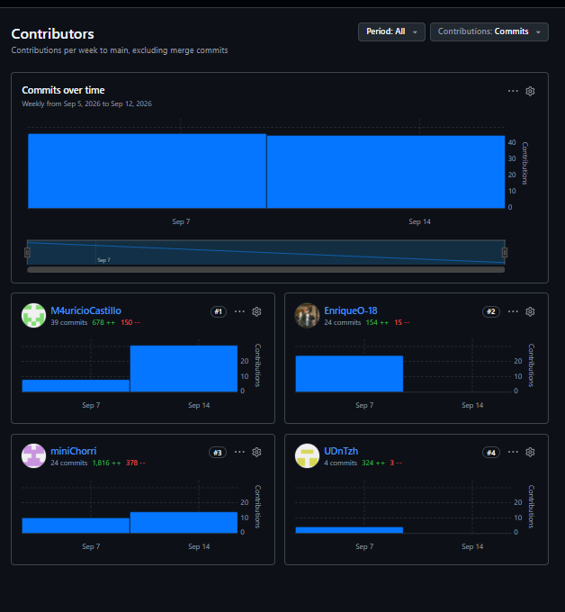

# Universidad Peruana de Ciencias Aplicadas
## Carrera de Ingeniería de Software

**Curso:** 1ASI0729 Desarrollo de Aplicaciones Open Source  
**NRC:** 16692

---

# Informe del Trabajo Final

**Docente:** Velásquez Núñez, Ángel Augusto 
**Equipo:** Codecraft  
**Proyecto:** BevTrace

### Integrantes

| Código     | Apellidos y Nombres                |
|:-----------|:-----------------------------------|
| u202113229 | Castillo Yataco, Mauricio Sebastian|
| U201910803 | Heredia Hoyos, Danitza Ivonne      |
| U202315968 | Costa Morales, Christofer William  |
|            | Enrique Augusto Ochoa Prado        |

**Período:** 2026-20  
**Fecha:** Setiembre 2026

## Registro de Versiones del Informe

| Versión | Fecha      | Autor            | Descripción de modificación |
| :--- |:-----------|:-----------------| :--- |
| AV1 | 09-09-2026 | Equipo Codecraft | Estructura inicial correspondiente a la primera entrega. |

## Project Report Collaboration Insights

**URL del repositorio del informe:** https://github.com/Codecraft-16692/Codecraft-Report

Evidencias de colaboración y participación del equipo para la entrega AV1:

## Contenido Student Outcome

**ABET – EAC - Student Outcome 3:** Capacidad de comunicarse efectivamente con un
rango de audiencias.

<table>
  <tr>
    <th>Criterio Específico</th>
    <th>Nombre del Integrante</th>
    <th>Acciones Realizadas</th>
    <th>Conclusión</th>
  </tr>
  <tr>
    <td rowspan="4">Comunica oralmente con efectividad a diferentes rangos de audiencia</td>
    <td>Castillo Yataco, Mauricio Sebastian</td>
    <td><b>AV1:</b> Desarrollo del Capitulo 1 y 2 y Diagramas de clase y base de datos</td>
    <td rowspan="4"><b>AV1:</b> El equipo evidenció una comunicación oral efectiva al sustentar los capítulos que cada integrante desarrolló, logrando explicar con claridad tanto los fundamentos del negocio (Startup Profile, análisis de requisitos) como las decisiones técnicas derivadas de ellos (diagramas de clases, base de datos, diseño de producto). La distribución de capítulos entre los integrantes permitió que cada uno dominara su segmento y lo comunicara de forma coherente ante la audiencia, evidenciando comprensión real del contenido más allá de una simple lectura del informe.</td>
  </tr>
  <tr>
    <td>Danitza Ivonne Heredia Hoyos</td>
    <td><b>AV1:</b> Desarrollo del Capitulo 1 y revisión de preguntas de las entrevistas y capitulo 4</td>
  </tr>
  <tr>
    <td>Costa Morales, Christofer William </td>
    <td><b>AV1:</b> Desarrollo del Capitulo 2, 3 y 5, además de las correcciones pertinentes en los demás capitulos</td>
  </tr>
  <tr>
    <td>Enrique Augusto Ochoa Prado </td>
    <td><b>AV1:</b> Desarrollo del capitulo 4</td>
  </tr>
  <tr>
    <td rowspan="4">Comunica por escrito con efectividad a diferentes rangos de audiencia</td>
    <td>Castillo Yataco, Mauricio Sebastian</td>
    <td><b>AV1:</b> Desarrollo del Capitulo 1 y 2 y Diagramas de clase y base de datos</td>
    <td rowspan="4"><b>AV1:</b> El equipo demostró capacidad de comunicación escrita efectiva mediante la redacción estructurada y consistente de los cinco capítulos del informe. La revisión cruzada de capítulos y preguntas de entrevista contribuyó a mantener coherencia terminológica y de formato en todo el documento, mientras que el uso de recursos complementarios (diagramas de clases, base de datos y prototipos en Figma) reforzó la claridad y comprensión del contenido escrito para distintos tipos de lector.</td>
  </tr>
  <tr>
    <td>Danitza Ivonne Heredia Hoyos</td>
    <td><b>AV1:</b> Desarrollo del Capitulo 1 y revisión de preguntas de las entrevistas y capitulo 4</td>
  </tr>
  <tr>
    <td>Costa Morales, Christofer William </td>
    <td><b>AV1:</b> Desarrollo del Capitulo 2, 3 y 5, además de las correcciones pertinentes en los demás capitulos</td>
  </tr>
  <tr>
    <td>Enrique Augusto Ochoa Prado </td>
    <td><b>AV1:</b> Desarrollo del capitulo 4 y figma</td>
  </tr>