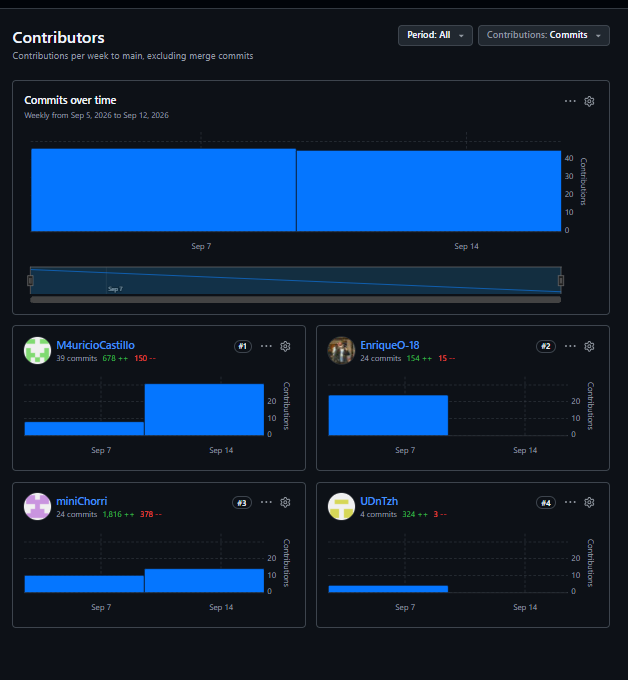

# Universidad Peruana de Ciencias Aplicadas
## Carrera de Ingeniería de Software

**Curso:** 1ASI0729 Desarrollo de Aplicaciones Open Source  
**NRC:** 16692

---

# Informe del Trabajo Final

**Docente:** Velásquez Núñez, Ángel Augusto 
**Equipo:** Codecraft  
**Proyecto:** BevTrace

### Integrantes

| Código     | Apellidos y Nombres                |
|:-----------|:-----------------------------------|
| u202113229 | Castillo Yataco, Mauricio Sebastian|
| U201910803 | Heredia Hoyos, Danitza Ivonne      |
| U202411222 | Enrique Augusto Ochoa Prado        |

**Período:** 2026-20  
**Fecha:** Setiembre 2026

## Registro de Versiones del Informe

| Versión | Fecha      | Autor            | Descripción de modificación |
| :--- |:-----------|:-----------------| :--- |
| AV1 | 09-09-2026 | Castillo Yataco, Mauricio Sebastian | Estructura inicial correspondiente a la primera entrega. |
| TB1 | 08-10-2026 | Ochoa Prado, Enrique Augusto | Segunda entrega: capítulos I-V completos, aplicación web por bounded contexts y despliegue. |

## Project Report Collaboration Insights

**URL del repositorio del informe:** https://github.com/Codecraft-16692/Codecraft-Report

Evidencias de colaboración y participación del equipo para la entrega AV1:

## Contenido Student Outcome

**ABET – EAC - Student Outcome 3:** Capacidad de comunicarse efectivamente con un
rango de audiencias.

<table>
  <tr>
    <th>Criterio Específico</th>
    <th>Nombre del Integrante</th>
    <th>Acciones Realizadas</th>
    <th>Conclusión</th>
  </tr>
  <tr>
    <td rowspan="3">Comunica oralmente con efectividad a diferentes rangos de audiencia</td>
    <td>Castillo Yataco, Mauricio Sebastian</td>
    <td><b>AV1:</b> Desarrollo del Capitulo 1 y 2 y Diagramas de clase y base de datos  <b>TB1:</b> Lideré el diseño UX/UI de BevTrace y la implementación del bounded context de Inventory Management (registro de lotes, mermas y conciliación de inventario), además de la elaboración de wireframes y mockups.</td>
    <td rowspan="3"><b>AV1:</b> El equipo evidenció una comunicación oral efectiva al sustentar los capítulos que cada integrante desarrolló, logrando explicar con claridad tanto los fundamentos del negocio (Startup Profile, análisis de requisitos) como las decisiones técnicas derivadas de ellos (diagramas de clases, base de datos, diseño de producto). La distribución de capítulos entre los integrantes permitió que cada uno dominara su segmento y lo comunicara de forma coherente ante la audiencia, evidenciando comprensión real del contenido más allá de una simple lectura del informe.  <b>TB1:</b> Durante la exposición del TB1, cada integrante explicó de forma oral el bounded context a su cargo (inventario, despachos, trazabilidad, telemetría, incidencias, analítica, IAM y suscripción), sus decisiones de diseño y la arquitectura por contextos del frontend Angular, comunicando con claridad el flujo de atención completo de BevTrace ante la audiencia.</td>
  </tr>
  <tr>
    <td>Danitza Ivonne Heredia Hoyos</td>
    <td><b>AV1:</b> Desarrollo del Capitulo 1 y revisión de preguntas de las entrevistas y capitulo 4  <b>TB1:</b> Lideré el Event Storming a nivel de diseño y la implementación del bounded context de Incident & Alert Management, y participé en la recolección de requerimientos mediante entrevistas.</td>
  </tr>
  <tr>
    <td>Enrique Augusto Ochoa Prado </td>
    <td><b>AV1:</b> Desarrollo del capitulo 4  <b>TB1:</b> Lideré la implementación del frontend Angular por bounded contexts, la elaboración de los wireflows y user flows por objetivo de usuario y la coordinación del equipo.</td>
  </tr>
  <tr>
    <td rowspan="3">Comunica por escrito con efectividad a diferentes rangos de audiencia</td>
    <td>Castillo Yataco, Mauricio Sebastian</td>
    <td><b>AV1:</b> Desarrollo del Capitulo 1 y 2 y Diagramas de clase y base de datos  <b>TB1:</b> Lideré el diseño UX/UI de BevTrace y la implementación del bounded context de Inventory Management (registro de lotes, mermas y conciliación de inventario), además de la elaboración de wireframes y mockups.</td>
    <td rowspan="3"><b>AV1:</b> El equipo demostró capacidad de comunicación escrita efectiva mediante la redacción estructurada y consistente de los cinco capítulos del informe. La revisión cruzada de capítulos y preguntas de entrevista contribuyó a mantener coherencia terminológica y de formato en todo el documento, mientras que el uso de recursos complementarios (diagramas de clases, base de datos y prototipos en Figma) reforzó la claridad y comprensión del contenido escrito para distintos tipos de lector.  <b>TB1:</b> En el TB1 la comunicación escrita se mantuvo mediante la documentación por bounded contexts (wireflows, user flows y reportes de evidencia), la redacción de issues y pull requests bajo Conventional Commits, y la actualización del informe, manteniendo consistencia terminológica y de formato en todo el documento.</td>
  </tr>
  <tr>
    <td>Danitza Ivonne Heredia Hoyos</td>
    <td><b>AV1:</b> Desarrollo del Capitulo 1 y revisión de preguntas de las entrevistas y capitulo 4  <b>TB1:</b> Lideré el Event Storming a nivel de diseño y la implementación del bounded context de Incident & Alert Management, y participé en la recolección de requerimientos mediante entrevistas.</td>
  </tr>
  <tr>
    <td>Enrique Augusto Ochoa Prado </td>
    <td><b>AV1:</b> Desarrollo del capitulo 4 y figma  <b>TB1:</b> Lideré la implementación del frontend Angular por bounded contexts, la elaboración de los wireflows y user flows por objetivo de usuario y la coordinación del equipo.</td>
  </tr>
