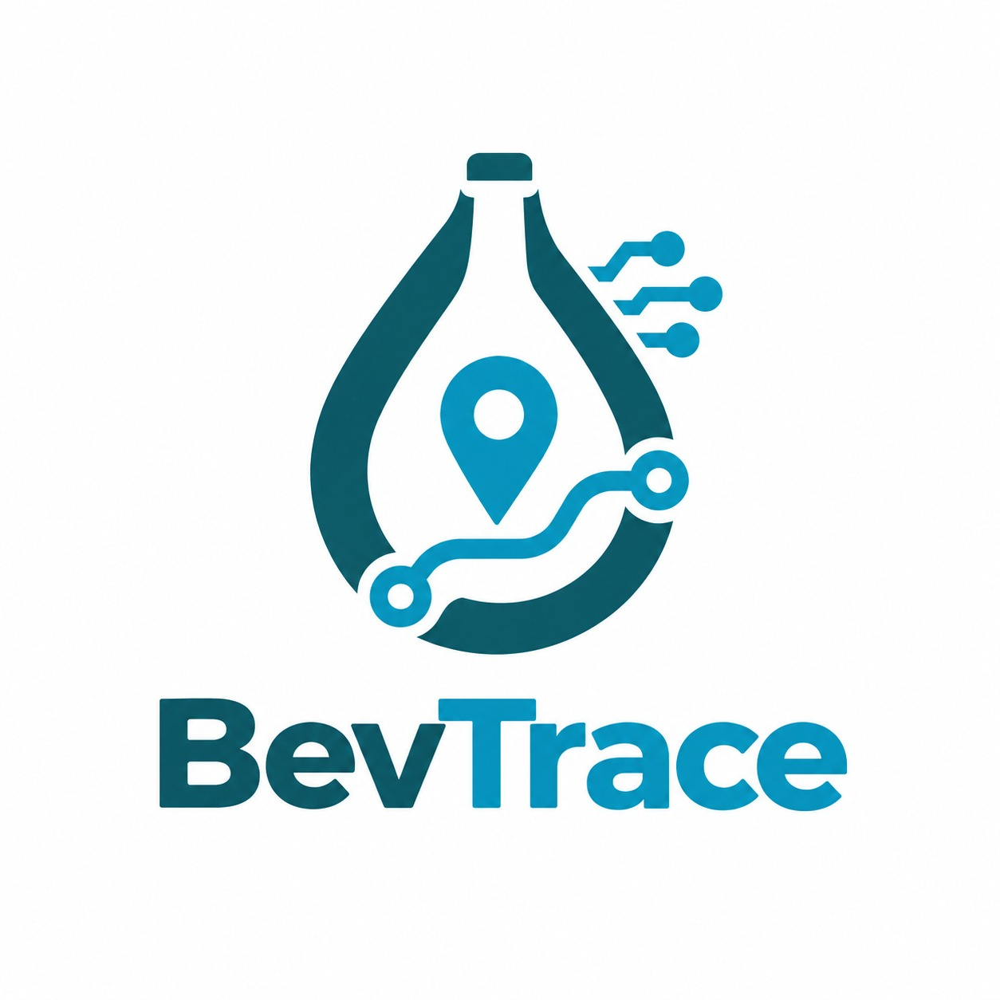
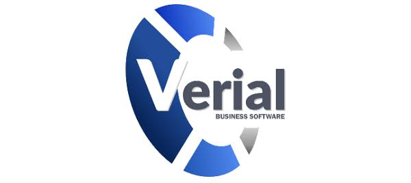
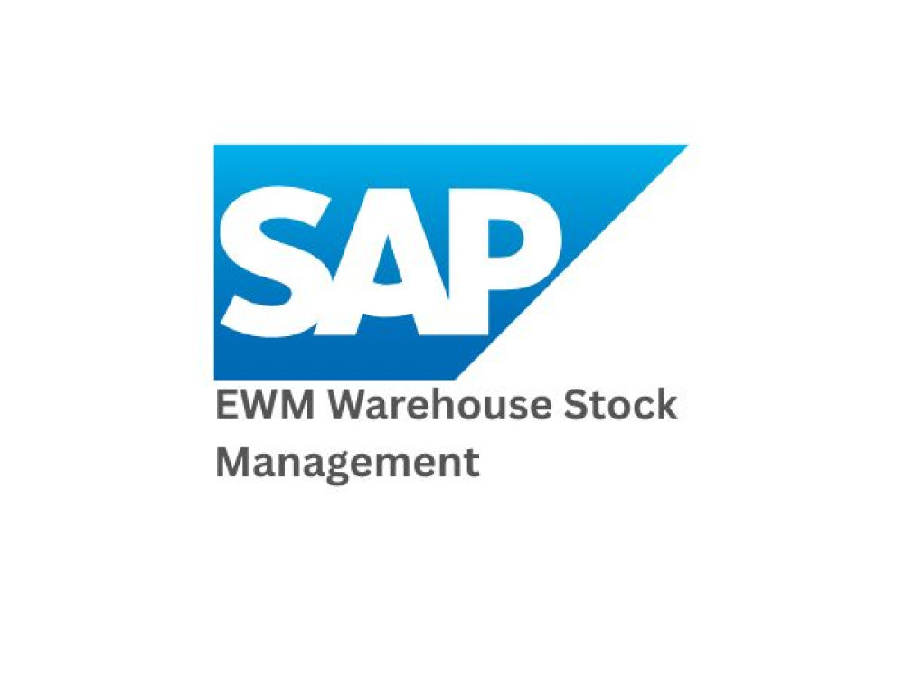
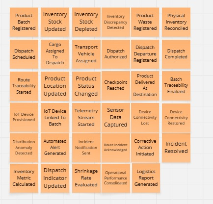

# Capítulo II: Requirements Elicitation & Analysis

## 2.1. Competidores.

Para desarrollar una solución realmente útil, es fundamental comprender el entorno competitivo y las alternativas que actualmente utilizan las empresas embotelladoras y distribuidoras. Este análisis permite identificar cómo se gestionan hoy los procesos logísticos y qué limitaciones presentan las soluciones existentes.

En esta etapa, se analizan distintos tipos de competidores con el objetivo de entender sus fortalezas y debilidades, y así posicionar a BevTrace como una propuesta que responda de manera más efectiva a las necesidades reales del sector.

### 2.1.1. Análisis competitivo.

### Competitive Analysis Landscape

|          **¿Por qué llevar a cabo este análisis?**              |    Identificar fortalezas, debilidades y estrategias de los principales competidores en logística de embotelladoras y trazabilidad del proceso (Verial, WebFleet, SAP EWM) para poder posicionar nuestra plataforma en el mercado.            |      Objetivo: Determinar que valor agredado ofrece nuestro producto para diferenciarse de la competencia y que     |                         
|------------------------|----------------------------------------------|---|

| Categoría              | Aspecto                                      |  |  |  |  |  
|:------------------------|:----------------------------------------------|:---:|:---:|:---:|:---:|
| Perfil                 | Overview                                      |  SaaS que digitaliza y automatiza la cadena de suministro de em- botelladoras/distribuidoras de be- bidas en envases PET no retornables, uniendo gestión operativa con IoT   |   ERP español specializado en distribución de bebidas: preventa, autoventa, rutas y trazabilidad de lotes.  |  Plataforma SaaS de telemática y gestión de flotas de Bridgestone, con foco en localización y navegación.   |  Módulo empresarial de SAP para gestión avanzada de almacenes (Extended Warehouse Management).    | 
| Perfil                 | Ventaja competitiva (¿qué valor ofrece?)      |   Monitoreo en tiempo real vía telemetría IoT,  trazabilidad inmutable del producto desde almacén hasta destino y gestión centralizada de despachos, especializado en PET no retornable  |Cumplimiento normativo (Verifactu), control de lote origen y del destino específico para HORECA y retail de bebidas|   Precisión GPS en tiempo real, marca reconocida globalmente, integraciones con hardware vehicular certificado.  |  Robustez enterprise, integración nativa con todo el ecosistema SAP (finanzas, MM, SD) ya instalado en grandes embotelladoras   |   
| Perfil de Marketing    | Mercado objetivo                              |  Empresas embotelladoras/distribuidoras de consumo masivo con envases PET no retornables; usuarios: responsables de almacén, logística, distribución y operaciones    |  PyMEs (pequeñas y medianas empresas ) y distribuidoras mayoristas de bebidas en España.   |  Empresas con flotas de transporte de cualquier industria, a nivel global.   |   Grandes corporativos y embotelladoras multinacionales (ej. grupos AB InBev, Coca-Cola FEMSA)  |   
| Perfil de Marketing    | Estrategias de marketing                      |    Mostrar nuestra especialidad en el sector de embotelladoras con campañas y comerciales que comparan nuestros producto con otros competidores |   Versiones de prueba gratuitas de 30 días, marketing de contenido enfocado en dolor operativo (cuadres de caja/lote)  |   Alianzas con fabricantes de vehículos, presencia en ferias de logística internacionales.   |   Venta consultiva B2B (asesoramiento) de largo ciclo, a través de partners certificados SAP.   |    
| Perfil de Producto     | Productos & Servicios                         |   Gestión de inventarios, gestión de despachos, trazabilidad de productos, monitoreo IoT, alertas de incidencias, dashboard de indicadores |   Preventa, autoventa, TPV (Terminal Punto de Venta), trazabilidad de lote, facturación electrónica  |  Rastreo GPS, navegación profesional, analítica de conducción y combustible.   |   Gestión de inventario multi-almacén, picking/packing, integración con RFID/IoT.  |    
| Perfil de Producto     | Precios & Costos                              | Suscripción SaaS para medianas y pequeñas empresas     |   Suscripción SaaS de gama media, accesible para PyME.   |   Suscripción por vehículo/mes; costo medio-alto según hardware  |   Licenciamiento enterprise de alto costo, requiere implementación por consultora.  |   
| Perfil de Producto     | Canales de distribución (Web y/o Móvil)       |  Web y app movil para los jefes de logistica y los operarios de almacen   |   Web y app móvil para vendedores/repartidores.  |   App móvil y hardware IoT propietario instalado en vehículo  |   Web (Fiori) y integraciones vía SAP Cloud Platform.  |     
| Análisis SWOT          | Fortalezas                                    |  Enfoque único que combina IoT con trazabilidad del proceso y especialización en empresas que usan PET    |  Especialización vertical profunda en bebidas   |   Marca global, hardware confiable y probado  |  Escala enterprise, soporte 24/7, ecosistema completo.    |    
| Análisis SWOT          | Debilidades                                   |  Por ser una nueva Startup carece de una base solida de usuarios y de experiencias reales con la aplicación   |   Sin telemetría IoT propia; trazabilidad principalmente documental/manual.   |  No gestiona inventario de almacén ni mermas de producto.    |  Costo y complejidad de implementación inaccesibles para PyMEs embotelladoras.   |    
| Análisis SWOT          | Oportunidades                                 |   Brecha de mercado explícita: ningún competidor combina hoy información operativa y telemetría IoT en un solo producto  |    Podría integrar sensores IoT como partner en vez de competidor |    Podría expandirse a trazabilidad de producto, no solo de vehículo. |Interés creciente en módulos IoT dentro de su propio roadmap (SAP Leonardo/IoT)|    
| Análisis SWOT          | Amenazas                                      | ERPs de bebidas (Verial) podrían incorporar IoT como feature; consultoras locales replican el mismo enfoque a medida para clientes grandes    |    Nuevos entrantes con IoT nativo (como BevTrace) le quitan el diferencial de trazabilidad.  |  Jugadores locales más baratos y especializados en el sector de bebidas   |   Soluciones SaaS ágiles y económicas capturando el segmento medio antes de que el cliente crezca a ”talla SAP”.   |    

### 2.1.2. Estrategias y tácticas frente a competidores.

A partir del análisis SWOT, BevTrace no compite en igualdad de condiciones con los tres competidores identificados: cada uno domina una porción distinta de la cadena de valor (gestión comercial, telemetría de transporte, o infraestructura enterprise), y ninguno cubre el problema completo — información operativa + IoT + trazabilidad, pero ninguno cubre los puntos que identificamos de la problematica. Por eso, la estrategia general de BevTrace no es "competir de frente" en ningún segmento, sino posicionarse en el espacio vacío que estos tres dejan entre sí, y usar tácticas específicas para neutralizar el riesgo de que cada uno se mueva hacia ese espacio.

**Frente a Verial:** 
Estrategia: Desplazamiento por profundidad tecnológica. Posicionarnos como el siguiente paso natural para un cliente que ya usa un ERP de bebidas y quiere pasar de trazabilidad documental a trazabilidad medida en tiempo real. 

Tactica: Comunicación comparativa directa (Excel/ERP vs. IoT en tiempo real) y evaluar integrarnos como complemento IoT en vez de exigir reemplazo total

**Frente a WebFleet:**

Estrategia: Redefinición del problema. Cambiar el eje de comparación de "quién rastrea mejor un vehículo" a "quién rastrea mejor un producto en todo su recorrido"

Tactica: Mensaje de complementariedad ("sigue usando tu GPS de flota, nosotros cubrimos lo que él no ve") dirigido a clientes que ya tienen GPS de flota pero siguen con problemas de almacén no resueltos.

**Frente a SAP EWM:**

Estrategia: Apela al segmento desatendido. No pelear en cuentas grandes donde SAP ya está instalado; capturar el segmento medio que SAP excluye por costo y complejidad.

Tactica: Mensaje dirigido a empresas que "superaron el Excel pero no pueden pagar/operar un SAP", con tiempo de implementación como argumento de venta.

## 2.2. Entrevistas.

Las entrevistas son clave para la metodología de diseño centrado en el usuario al permitirnos recolectar información cualitativa directamente de los actores que enfrentan la problemática identificada. A través del diálogo estructurado, se busca comprender las necesidades, comportamientos, frustraciones y expectativas de los segmentos objetivos, validando o refutando las hipótesis planteadas previamente.

### 2.2.1. Diseño de entrevistas.

Teniendo en cuenta la importancia en la información que nos pueden proveer los entrevistados, se presentan las preguntas clave para cada segmento objetivo. Para eso se consideran dos tipos de preguntas: las personales, orientadas a conocer el perfil del entrevistado y las específicas, las cuales están enfocadas en los procesos actuales, herramientas utilizadas, desafíos operativos y expectativas frente a una solución tecnológica como BevTrace.

<h4 id="Segmento1">Segmento objetivo: Jefes y Gerentes de Logística</h4>

**Objetivo:** Conocer cómo supervisan la distribución y qué información necesitan para tomar decisiones.

<h4 id="PreguntaPersonal1">Preguntas Personales</h4>

*   ¿Cuál es su nombre?
*   ¿Cuál es su edad?
*   ¿Cuál es su cargo actual dentro de la distribuidora o embotelladora?
*   ¿Cuál es su formación académica?
*   ¿Qué dispositivos o canales digitales utilizas con mayor frecuencia en tu trabajo?

<h4 id="PreguntasEspe1">Preguntas específicas:</h4>

*   ¿Cómo realizas actualmente el seguimiento de los productos durante su distribución?
*   ¿Cómo registran actualmente el control de inventario y las variables físicas (peso, humedad) durante el almacenamiento y transporte?
*   ¿Cuáles son los principales problemas que enfrentas al supervisar las operaciones?
*   ¿Cómo gestionan la trazabilidad de los despachos hacia los distribuidores finales?
*   En los últimos cierres de mes, ¿con qué frecuencia han tenido discrepancias por mermas no detectadas a tiempo o registros incompletos?
*   ¿Cuánto tiempo les toma preparar la consolidación de datos y reportes de eficiencia logística?
*   ¿Qué tan dispuestos estarían a reemplazar los registros manuales por una plataforma digital que capture automáticamente datos de sensores IoT en los vehículos?
*   ¿Cuáles son las principales barreras que han enfrentado para digitalizar el control de almacén y despachos?
*   ¿Qué funcionalidades debería tener una herramienta digital para facilitar la supervisión de las operaciones?

<h4 id="Segmento2">Segmento objetivo: Operarios y Supervisores de Almacén</h4>

**Objetivo:** Conocer cómo gestionan inventarios y despachos e identificar sus principales dificultades.

<h4 id="PreguntaPersonal2">Preguntas Personales</h4>

*   ¿Cuál es su nombre?
*   ¿Cuál es su edad?
*   ¿Cuál es su rol dentro del almacén o centro de distribución?
*   ¿Cuál es su nivel de estudios?
*   ¿Qué dispositivos utilizas con mayor frecuencia durante tu trabajo?

<h4 id="PreguntasEspe2">Preguntas específicas:</h4>

*   ¿Cómo gestionas actualmente el inventario y los despachos de la empresa?
*   ¿Qué procesos de preparación de pedidos, picking o carga aún dependen de registros en papel o sistemas no integrados?
*   ¿Cómo gestionan hoy la validación y lectura masiva de pallets de envases PET antes de su salida?
*   ¿Qué desafíos específicos han enfrentado relacionados con el conteo manual y la integridad de los datos de inventario?
*   ¿Cómo se enteran de un daño en la mercadería o discrepancia en la carga? ¿Existe algún mecanismo de alerta temprana?
*   ¿Cuánto tiempo y esfuerzo destinan a registrar manualmente la salida de unidades de transporte?
*   ¿Qué requisitos de facilidad de uso serían indispensables para que adopten una plataforma SaaS en su rutina diaria de almacén?
*   ¿Qué características debería tener una herramienta digital para facilitar tus actividades?
*   ¿Qué tipo de capacitación o acompañamiento necesitaría su equipo para migrar del conteo manual a un sistema de lectura masiva con IoT?
*   ¿Qué información necesitas consultar con mayor frecuencia para realizar tu trabajo?

### 2.2.2. Registro de entrevistas

**Segmento objetivo: Jefes y Gerentes de Logística**

<table>
    <colgroup></colgroup>
    <thead>
        <tr>
            <th colspan="2">Entrevista #1 </th>
        </tr>
    </thead>
    <tbody>
        <tr>
            <td>Nombre</td>
            <td>David</td>
        </tr>
        <tr>
            <td>Apellidos</td>
            <td>Castillo</td>
        </tr>
        <tr>
            <td>Edad</td>
            <td>45 años</td>
        </tr>
        <tr>
            <td>Distrito</td>
            <td>Chorrillos</td>
        </tr>
        <tr>
            <td>Evidencia</td>
            <td>

</td>
        </tr>
        <tr>
            <td>Link</td>
            <td>https://sl1nk.com/qgqi6qh</td>
        </tr>
        <tr>
            <td>Timing donde inicia la entrevista </td>
            <td></td>
        </tr>
        <tr>
            <td>Duración de la entrevista </td>
            <td>8:31 min</td>
</tr>
        <tr>
            <td>Resumen</td>
            <td>
            El Sr. David Castillo, de 45 años, es Jefe de distribución de materiales con formación en administración[cite: 3]. Gestiona la recepción y distribución de materia prima hacia las plantas de producción utilizando principalmente el sistema SAP[cite: 3]. Su labor exige una coordinación precisa con proveedores y transportistas, ya que los principales cuellos de botella se generan por incumplimientos en los tiempos de entrega (adelantos o retrasos), lo que impacta directamente en la capacidad espacial del almacén y genera riesgos de quiebres de stock[cite: 3].
               
            <b>Comportamiento y Necesidades:</b> Es un profesional enfocado en la exactitud de los datos y la revisión de indicadores de rendimiento logístico (como ERI, OTIF, Fill Rate y rotación de inventario)[cite: 3]. Realiza controles diarios de inventario y auditorías mensuales para corregir discrepancias de inmediato[cite: 3]. Identifica que el mayor desafío en la gestión de almacenes no es el fallo del sistema, sino el error humano y la mala calidad de la información al ingresar los datos tarde o de forma incorrecta[cite: 3]. Necesita que cualquier herramienta digital a implementar sea altamente flexible y adaptable a la cultura y ritmo cambiante de cada operación específica, evitando flujos rígidos[cite: 3]. 
               
            <b>Tecnología, Marcas y Canales:</b> Está altamente familiarizado con plataformas ERP robustas (SAP) y software de rastreo para el seguimiento de unidades de transporte[cite: 3]. Utiliza diariamente laptop, celular y herramientas en la nube de forma simultánea[cite: 3]. Confía en la estabilidad de sus sistemas actuales, remarcando que las caídas de servidor son inusuales, por lo que su disposición a adoptar nuevas tecnologías dependerá de qué tan bien solucionen el ingreso manual de datos y se adapten a sus procesos sin entorpecerlos[cite: 3].
            </td>
        </tr>
    </tbody>
</table>

**Segmento objetivo: Operarios y Supervisores de Almacén**

<table>
    <colgroup></colgroup>
    <thead>
        <tr>
            <th colspan="2">Entrevista #1 </th>
        </tr>
    </thead>
    <tbody>
        <tr>
            <td>Nombre</td>
            <td>Maria</td>
        </tr>
        <tr>
            <td>Apellidos</td>
            <td>Lopez</td>
        </tr>
        <tr>
            <td>Edad</td>
            <td>32 años</td>
        </tr>
        <tr>
            <td>Distrito</td>
            <td>Chorrillos</td>
        </tr>
        <tr>
            <td>Evidencia</td>
            <td>

</td>
        </tr>
        <tr>
            <td>Link</td>
            <td>https://l1nq.com/k758tyw</td>
        </tr>
        <tr>
            <td>Timing donde inicia la entrevista </td>
            <td></td>
        </tr>
        <tr>
            <td>Duración de la entrevista </td>
            <td>9:27 min</td>
</tr>
        <tr>
            <td>Resumen</td>
            <td>
            La Sra. María López, de 32 años, es operaria de almacén encargada de apoyar en la recepción, organización, conteo y preparación de la mercadería antes del despacho. Su día a día involucra la verificación manual de cargas y pallets, un proceso que actualmente depende de una mezcla ineficiente de anotaciones en papel impreso y registros posteriores en computadora. Esto genera redundancia operativa, ya que los operarios deben revisar la información varias veces para confirmar que todo coincida, provocando retrasos cuando hay un alto volumen de movimiento.
               
            <b>Comportamiento y Necesidades:</b> María busca agilidad y la reducción de tareas repetitivas. Reconoce que el conteo manual propicia errores humanos y que la falta de un mecanismo de alerta automática hace que los daños o discrepancias en la mercadería se detecten tarde, a menudo mediante simples revisiones visuales. Necesita un sistema intuitivo, rápido, con botones grandes y pocos pasos que le permita ver el inventario en tiempo real, identificar pallets fácilmente y recibir alertas automáticas. Además, requiere que cualquier transición tecnológica se acompañe de capacitaciones prácticas en campo y con soporte técnico presencial durante las primeras semanas.
               
            <b>Tecnología, Marcas y Canales:</b> Está habituada al uso de celulares y computadoras de manera cotidiana, y emplea lectores de códigos de barras de forma ocasional cuando están disponibles. Valora las interfaces sencillas que no exigen conocimientos técnicos avanzados, priorizando herramientas en tiempo real que se puedan usar desde los dispositivos móviles que ya maneja en el almacén para registrar automáticamente entradas y salidas, eliminando definitivamente la dependencia del papel y la transcripción manual de datos.
            </td>
        </tr>
    </tbody>
</table>

### 2.2.3. Análisis de entrevistas
## 2.3. Needfinding
### 2.3.1. User Personas
### 2.3.2. User Task Matrix
### 2.3.3. User Journey Mapping
### 2.3.4. Empathy Mapping

## 2.4. Big Picture Event Storm

Antes de definir funcionalidades, módulos o componentes técnicos para <strong>BevTrace</strong>,
el equipo realizó una sesión de <strong>Big Picture Event Storming</strong> con el objetivo de
comprender el dominio del negocio desde una perspectiva general. Esta actividad permitió
visualizar los principales eventos que ocurren dentro de la cadena de suministro, desde
la gestión de inventarios y lotes de bebidas hasta la planificación de despachos, control
de mermas, seguimiento de rutas mediante telemetría de datos externos, alertas de incidencias
y reportes de rendimiento operativo.

El proceso se desarrolló de manera colaborativa, priorizando el descubrimiento del negocio
sin enfocarse inicialmente en pantallas, bases de datos, integraciones externas o detalles de implementación.
El equipo recopiló eventos significativos del dominio y los organizó como una primera
aproximación visual al flujo general de la organización. Esta dinámica permitió identificar
procesos clave, posibles cuellos de botella en los despachos, riesgos de pérdida de mercadería (mermas) 
y oportunidades para mejorar la trazabilidad y la eficiencia logística.

La primera etapa consistió en recolectar eventos de dominio. En esta fase, los integrantes
propusieron sucesos relevantes expresados en pasado, como hechos que ya ocurrieron dentro
del negocio. Esta forma de redacción permitió representar acontecimientos reales del dominio,
por ejemplo: un lote de producto fue registrado, el stock de inventario fue actualizado,
un despacho fue autorizado, un punto de control fue alcanzado, una anomalía de distribución 
fue detectada o un reporte logístico fue generado.

  
  
<em>Figura: Primera etapa del Big Picture Event Storming, enfocada en la recolección de eventos de dominio para BevTrace.</em>

Como resultado de esta etapa, se identificaron grupos iniciales de eventos relacionados con
la administración de inventarios, gestión de mermas, programación de despachos, monitoreo de 
rutas (mediante integración de datos externos), resolución de incidencias y análisis de métricas.
Esta exploración permitió reconocer que el dominio de BevTrace no se limita únicamente al
control estático de almacén, sino que integra flujos operativos y de transporte que deben
mantenerse conectados para asegurar la trazabilidad del producto hasta su destino.

A partir de los eventos recolectados, el equipo pudo detectar áreas críticas del negocio:
el registro preciso de entradas y salidas, la asignación eficiente de cargas a los vehículos, 
la detección oportuna de discrepancias de inventario, el reporte de anomalías en tránsito y 
la evaluación de las tasas de pérdida. Estos elementos fueron considerados como insumos 
principales para la posterior identificación de procesos, bounded contexts y funcionalidades del sistema.

## 2.5. Ubiquitous Language

Este glosario asegura que el equipo de desarrollo, los responsables de almacén y los 
supervisores de logística compartan un marco conceptual idéntico, garantizando que el 
producto final sea una extensión fiel de las operaciones de distribución de consumo masivo. 
Los términos definidos aquí reflejan estrictamente el lenguaje del negocio y rigen toda 
la comunicación del proyecto.

| Término | Definición |
|---|---|
| **Distribution Hub** | Centro logístico principal donde se recepcionan, almacenan y preparan las bebidas para su distribución. Es el punto de origen de la cadena operativa. |
| **Product Batch** | Agrupación específica de bebidas en envases PET que comparten características de producción. Es la unidad fundamental para rastrear ingresos y salidas. |
| **Inventory Stock** | Cantidad total de productos disponibles físicamente en el almacén en un momento dado, listos para ser asignados a nuevas órdenes de despacho. |
| **Inventory Discrepancy** | Diferencia detectada entre la cantidad de producto que debería existir según los registros documentales y la cantidad física real hallada. |
| **Product Waste (Merma)** | Pérdida irrecuperable de producto ocurrida por daños, vencimientos o manipulación inadecuada dentro del almacén o durante el traslado. |
| **Dispatch Order** | Instrucción formal que autoriza la preparación, carga y salida de un volumen específico de productos hacia un destino preestablecido. |
| **Cargo** | Conjunto de productos que han sido separados del inventario general y asignados a un vehículo de transporte para cumplir con un despacho programado. |
| **Route Traceability** | Capacidad de reconstruir el historial y la progresión de un despacho a lo largo de su viaje, basándose en confirmaciones de avance y puntos de control. |
| **Checkpoint** | Ubicación geográfica o hito de control en el proceso de distribución donde se registra una actualización válida sobre el estado del despacho. |
| **Telemetry Stream** | Flujo de datos operativos continuos recibidos a través de fuentes externas (como servicios de rastreo de terceros) para actualizar el estado del despacho. |
| **Distribution Anomaly** | Evento inesperado que altera el plan original de entrega, como un retraso prolongado, una desviación de ruta o un problema con la carga. |
| **Corrective Action** | Medida inmediata y documentada tomada por el personal de logística para resolver una incidencia en ruta y asegurar la continuidad de la distribución. |
| **Proof of Delivery** | Confirmación oficial que certifica que los productos correspondientes a un despacho fueron recibidos exitosamente en el destino planificado. |
| **Shrinkage Rate** | Indicador clave que mide el porcentaje de inventario perdido (mermas) en relación con el volumen total operado en un periodo específico. |

**Beneficios esperados del lenguaje ubicuo:**

- Elimina ambigüedades entre los miembros del equipo técnico y los expertos del negocio al
  estandarizar los conceptos operativos de la logística y distribución de bebidas.
- Asegura que cualquier conversación, requerimiento o documentación del proyecto se exprese
  en términos de la cadena de suministro real, facilitando la validación del sistema.
- Previene interpretaciones erróneas sobre el manejo de mermas, inventarios y entregas al
  definir límites claros y responsabilidades para cada concepto operativo.
- Mantiene la consistencia del negocio independientemente de las herramientas o fuentes de datos
  externas empleadas para registrar el comportamiento de los despachos.
