# Capítulo IV: Product Design

El presente capítulo aborda las decisiones de diseño adoptadas para el desarrollo del producto BevTrace, incluyendo su Landing Page. Se detallan los lineamientos visuales, la organización de la información y los criterios de experiencia de usuario que buscan garantizar una interfaz clara, coherente y adecuada al contexto del sector logístico y de distribución de bebidas embotelladas.

## 4.1. Style Guidelines.

### 4.1.1. General Style Guidelines.

Las decisiones visuales de BevTrace responden a la naturaleza operativa del producto: una plataforma pensada para que gerentes de logística y distribución supervisen despachos y trazabilidad sin fricción visual ni ambigüedad en la lectura de datos. Por ello, el equipo CodeCraft prioriza un diseño funcional y sobrio por encima de elementos ornamentales, buscando que cada componente de la interfaz refuerce la percepción de control y confiabilidad sobre la cadena de distribución.

A continuación se describen los criterios de estilo adoptados para BevTrace, aplicando principios de Diseño de Experiencia de Usuario (UX) e Interfaz de Usuario (UI) orientados a un público empresarial (B2B) del sector de bebidas embotelladas, cuyo objetivo principal al interactuar con el producto es reducir el tiempo de respuesta ante incidencias logísticas y eliminar el registro manual de información.

#### Branding

La marca BevTrace se apoya en dos ideas centrales: la ruta (el trayecto que recorre el producto desde el almacén hasta el punto de destino) y el registro confiable de esa información. El isotipo del logotipo integra un trazo tipo ruta o checkpoint, evocando el seguimiento en tiempo real de despachos, junto con un wordmark de trazo sólido y sin adornos que refuerza la seriedad del producto ante un público de decisión (gerentes de operaciones, logística y TI). Se descarta cualquier elemento gráfico superfluo que reste claridad al isotipo, tanto en formatos grandes (Landing Page, presentaciones comerciales) como en formatos reducidos (ícono de aplicación, favicon del sistema).

Para preservar la legibilidad del logotipo, se define un área de resguardo mínima equivalente a la altura de la letra inicial del wordmark, dentro de la cual no puede ubicarse ningún otro elemento visual. Asimismo, se establecen dos variantes de uso: una versión a color para fondos claros y una versión invertida (blanca) para fondos oscuros o imágenes de fondo, evitando en ambos casos distorsiones de proporción o rotaciones del isotipo.

  

#### Typography

BevTrace adopta <strong>Roboto</strong> como tipografía principal para toda la interfaz, al ser la fuente predeterminada de Material Design y, por consiguiente, de Angular Material, framework de componentes utilizado en el desarrollo de la Web Application. Esta decisión asegura consistencia tipográfica entre el Landing Page y la aplicación web, sin necesidad de cargar fuentes adicionales que impacten el rendimiento. Para la visualización de datos técnicos y numéricos (identificadores de lote, coordenadas GPS, códigos de despacho, timestamps de trazabilidad) se emplea <strong>Roboto Mono</strong>, cuyo espaciado monoespaciado facilita la alineación tabular y evita confusión entre caracteres similares (0, O, 1, l) en reportes operativos donde la exactitud del dato es crítica.

La jerarquía tipográfica se establece de la siguiente manera, tomando como referencia la escala tipográfica de Angular Material, a fin de mantener coherencia entre el diseño planteado y su futura implementación:

- **Encabezado principal (H1)**: 2.5rem (40px) en escritorio, 2rem (32px) en móvil.
- **Subtítulos de sección (H2)**: 2rem (32px) en escritorio, 1.75rem (28px) en móvil.
- **Títulos de componente (H3/H4)**: 1.5rem (24px) a 1.25rem (20px).
- **Cuerpo de texto (p)**: 1rem (16px), con interlineado (line-height) de 1.6 para facilitar la lectura de párrafos extensos.
- **Etiquetas y botones (span/button)**: 0.875rem (14px) a 1rem (16px).

  

Esta jerarquía tipográfica busca garantizar una lectura clara de la información operativa en todas las resoluciones, priorizando el contraste suficiente entre el texto y el fondo según las pautas WCAG 2.1 AA, en línea con el enfoque de accesibilidad adoptado para el producto.

#### Colors

La paleta de colores de BevTrace refuerza los atributos de confianza, precisión y monitoreo en tiempo real que caracterizan al producto, dirigido a un público B2B del sector logístico. Se organiza en tres categorías: colores de marca, colores neutros y colores funcionales de estado.

**Paleta principal**

| Color | Uso | Valor |
|---|---|---|
| Azul Petróleo (Primario) | Identidad de marca, elementos clave de navegación | `#0D5C63` |
| Azul Cian (Secundario) | Acentos, elementos interactivos | `#00A8CC` |

**Colores neutros**

| Color | Uso | Valor |
|---|---|---|
| Neutro oscuro | Texto principal, fondos oscuros | `#2B2B2B` |
| Neutro claro | Fondos de sección, tarjetas | `#F5F5F5` |

**Colores funcionales**

| Color | Uso | Valor |
|---|---|---|
| Verde (Éxito) | Confirmaciones, despachos completados | `#2E7D32` |
| Ámbar (Alerta) | Advertencias, retrasos en tránsito | `#F9A825` |
| Rojo (Error) | Errores, incidencias críticas de trazabilidad | `#C62828` |

  

Esta distribución cromática busca transmitir a los clientes de BevTrace una imagen de control operativo y confiabilidad, reservando los colores funcionales exclusivamente para estados del sistema, a fin de evitar ambigüedad en la comunicación visual de alertas críticas de la cadena de distribución.

#### Spacing

BevTrace utiliza un sistema de espaciado modular basado en una unidad base de 8px, múltiplo estándar compatible con el sistema de grid de Angular Material. Esta unidad se multiplica para definir los distintos niveles de espaciado en la interfaz, garantizando consistencia visual y un ritmo predecible entre secciones, componentes y elementos internos.

- **Espaciado base**: 8px, unidad mínima del sistema.
- **Espaciado entre elementos relacionados** (ej. ítems de una lista de despachos): 16px (2 unidades).
- **Espaciado entre componentes** (ej. tarjetas de monitoreo): 24px (3 unidades).
- **Padding de secciones principales**: 48px (6 unidades), para separar bloques de contenido en el Landing Page.

#### Tono de Comunicación

La voz y el tono de BevTrace están diseñados para reflejar la precisión y confiabilidad que caracterizan al producto, dirigiéndose principalmente a gerentes de logística, operaciones y tecnología de empresas embotelladoras y distribuidoras. La comunicación busca proyectar control operativo y transparencia en cada etapa de la cadena de distribución.

- **Tono**: Formal y profesional, orientado a la confiabilidad operativa.
- **Actitud**: Resolutiva y directa, enfocada en comunicar beneficios concretos (reducción de reportes manuales, visibilidad en tiempo real, trazabilidad inmutable del producto).
- **Lenguaje**: Claro y preciso, evitando ambigüedad en mensajes relacionados con el estado de despachos o alertas del sistema.
- **Voz**: Experta y confiable, posicionando a BevTrace como una solución tecnológica sólida para la gestión logística del sector de bebidas embotelladas.

Este enfoque comunicacional busca generar confianza en los clientes de BevTrace, asegurando que la plataforma automatiza y centraliza la gestión de despachos de forma segura, eliminando la dependencia de reportes manuales propensos a error.

### 4.1.2. Web Style Guidelines.

Las directrices de estilo web de BevTrace se centran en la claridad operativa, la coherencia visual entre el Landing Page y la Web Application, y la eficiencia en la visualización de datos de trazabilidad en tiempo real.

**1) Layout**

- **Sistema de Grid**: Se utiliza un diseño de cuadrícula flexible mediante Angular Material, permitiendo que las tarjetas de monitoreo y los paneles de despacho se adapten a distintas resoluciones.
- **Headers y Footers**: El encabezado se mantiene fijo, brindando acceso constante a la navegación principal. El pie de página centraliza enlaces legales e información de contacto.
- **Cards**: Las tarjetas son el componente principal para mostrar información de despachos, estados de trazabilidad y métricas operativas, utilizando bordes redondeados y sombras suaves consistentes con Angular Material.

**2) Responsive Design**

- **Desktop**: Navegación principal totalmente visible, contenido distribuido en múltiples columnas para aprovechar el espacio en estaciones de monitoreo.
- **Tablet**: Adaptación a diseño de dos columnas, manteniendo elementos táctiles de tamaño adecuado.
- **Mobile**: Diseño de una sola columna, con navegación colapsada en menú desplegable, priorizando el acceso rápido a alertas y estados críticos desde dispositivos móviles.

**3) Interaction Design**

- **Botones**: Utilizan los colores de marca (Azul Petróleo y Azul Cian), con retroalimentación visual al interactuar, priorizando la confirmación clara de acciones críticas (por ejemplo, registrar un despacho).
- **Formularios**: Diseñados para minimizar errores de entrada de datos, con validaciones visuales inmediatas en campos críticos como identificadores de lote o coordenadas.

**4) Images and Icons**

- **Imágenes**: Se prioriza el uso de imágenes relacionadas al entorno logístico e industrial (almacenes, flotas de distribución, plantas embotelladoras).
- **Íconos**: Estilo lineal y minimalista, representando conceptos clave como monitoreo (radar/GPS), trazabilidad (ruta) y estado de despacho.

## 4.2. Information Architecture.

### 4.2.1. Organization Systems.

### 4.2.2. Labeling Systems.

### 4.2.3. SEO Tags and Meta Tags

### 4.2.4. Searching Systems.

### 4.2.5. Navigation Systems.

## 4.3. Landing Page UI Design.

### 4.3.1. Landing Page Wireframe.

### 4.3.2. Landing Page Mock-up.

## 4.4. Web Applications UX/UI Design.

### 4.4.1. Web Applications Wireframes.

### 4.4.2. Web Applications Wireflow Diagrams.

### 4.4.2. Web Applications Mock-ups.

### 4.4.3. Web Applications User Flow Diagrams.

## 4.5. Web Applications Prototyping.

## 4.6. Domain-Driven Software Architecture.

### 4.6.1. Design-Level Event Storming.

Para identificar los eventos de dominio, es recomendable realizar una sesión de Event Storming. Esta técnica permite visualizar y comprender el flujo de eventos dentro del dominio, facilitando la identificación de los *Bounded Contexts*.
El desarrollo del proceso del Domain-Driven Design se realizó en la aplicación Miro: [https://sl1nk.com/17uavc5]

### Paso 1: Timelines

Posteriormente, organizamos los eventos en líneas de tiempo para visualizar el flujo de interacciones y secuencias entre eventos de negocio. Se identificaron los siguientes 6 flujos principales (Bounded Contexts):

* **Inventory Management Flow:** cubre las necesidades de los responsables de almacén para registrar, consultar y mantener un control preciso de los productos, reduciendo las discrepancias.
* **Dispatch Management Flow:** enfocado en las necesidades operativas de los responsables de logística para registrar, asignar y supervisar los envíos salientes desde los almacenes hacia los centros de distribución.
* **Product Traceability Flow:** dedicado a los responsables de distribución para conocer el estado y la ruta exacta de los productos desde el almacén hasta su destino final.
* **IoT Telemetry Flow:** maneja la integración tecnológica que permite recopilar información operativa en tiempo real sobre los productos durante su distribución.
* **Incident & Alert Management Flow:** módulo automatizado que permite la identificación oportuna de eventos anómalos o inconsistencias que puedan afectar el inventario o causar retrasos en el transporte.
* **Operations Analytics Flow:** dirigido a los responsables de operaciones para visualizar información consolidada sobre inventarios, despachos y trazabilidad para la toma de decisiones logísticas.

Esta organización temporal facilitó la comprensión de dependencias y secuencias críticas entre la operación logística humana y la automatización del sistema.

#### Paso 2: Commands

En este paso definimos los comandos que los diferentes actores pueden ejecutar en el sistema. Los comandos representan las intenciones o acciones (en verbo imperativo) que mutan el estado de la aplicación y desencadenan los eventos en el dominio logístico.

| Actor | Comandos |
|-------|----------|
| **Logistics Manager** | Schedule Dispatch, Assign Transport Vehicle, Authorize Dispatch, Link IoT Device To Batch, Acknowledge Route Incident, Initiate Corrective Action, Resolve Incident. |
| **Warehouse Manager** | Register Product Batch, Reconcile Physical Inventory, Detect Inventory Discrepancy. |
| **Warehouse Operator** | Update Inventory Stock, Register Product Waste, Assign Cargo To Dispatch, Register Dispatch Departure. |
| **Distribution Manager** | Start Route Traceability, Change Product Status, Deliver Product At Destination, Finalize Batch Traceability. |
| **Operations Manager** | Evaluate Shrinkage Rate, Generate Logistics Report. |
| **System Admin** | Provision IoT Device. |
| **System / Analytics Engine** | Deplete Inventory Stock, Start Telemetry Stream, Capture Sensor Data, Update Product Location, Reach Checkpoint, Lose Device Connectivity, Restore Device Connectivity, Detect Distribution Anomaly, Generate Automated Alert, Send Incident Notification, Complete Dispatch, Consolidate Operational Performance, Calculate Inventory Metric, Update Dispatch Indicator. |

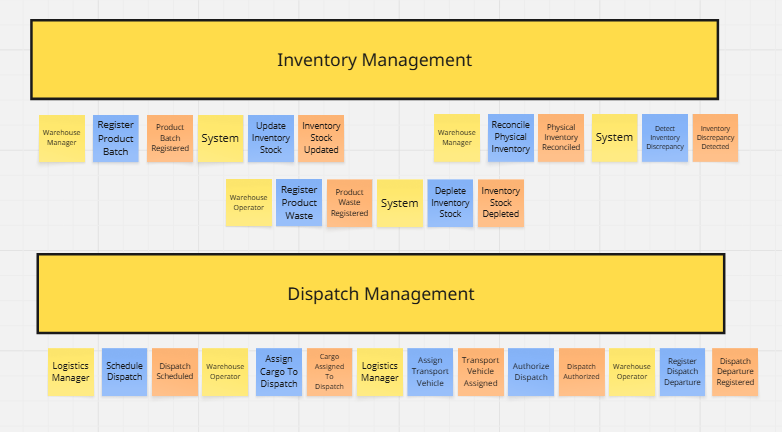
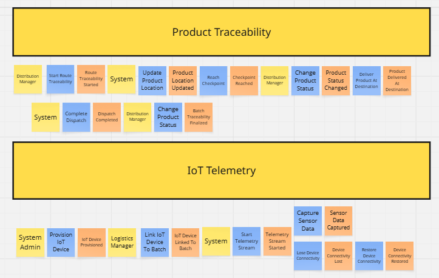
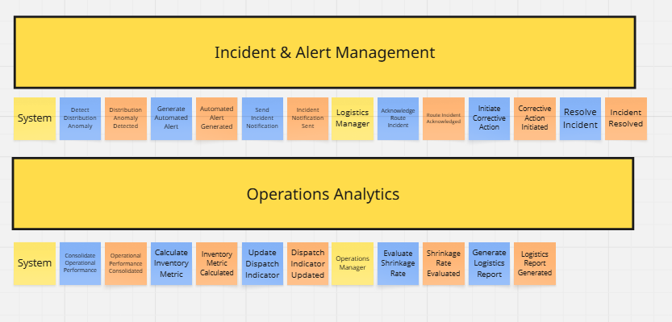

#### Paso 3: Policies and Actors

En este paso identificamos las políticas de negocio (reglas WHEN/THEN) y los actores responsables de cada flujo. Las políticas representan las reglas automáticas que el sistema ejecuta en respuesta a ciertos eventos, garantizando el estricto control de inventarios y la visibilidad de la distribución sin depender de la intervención humana constante.

Las políticas identificadas fueron:

* **WHEN** physical inventory is reconciled and discrepancies are found **THEN** auto-detect inventory discrepancy and flag for review.
* **WHEN** product waste is registered **THEN** auto-deplete inventory stock and evaluate shrinkage rate.
* **WHEN** dispatch departure is registered **THEN** auto-start route traceability and initialize telemetry stream.
* **WHEN** checkpoint is reached via telemetry **THEN** auto-update product location.
* **WHEN** telemetry stream loses device connectivity **THEN** generate automated alert for the logistics manager.
* **WHEN** sensor data captures an unexpected delay or route deviation **THEN** detect distribution anomaly.
* **WHEN** distribution anomaly is detected **THEN** generate automated alert and send incident notification to the distribution team.
* **WHEN** route incident is resolved **THEN** update dispatch indicator and consolidate operational performance.
* **WHEN** product is delivered at destination **THEN** auto-complete dispatch and finalize batch traceability.
* **WHEN** logistics report is generated **THEN** auto-calculate and update global shrinkage and performance metrics.

Estas políticas permiten automatizar procesos críticos del sistema, reduciendo drásticamente el error humano y asegurando respuestas oportunas ante incidencias en ruta o discrepancias de stock que podrían generar pérdidas económicas o retrasos en la entrega de bebidas.

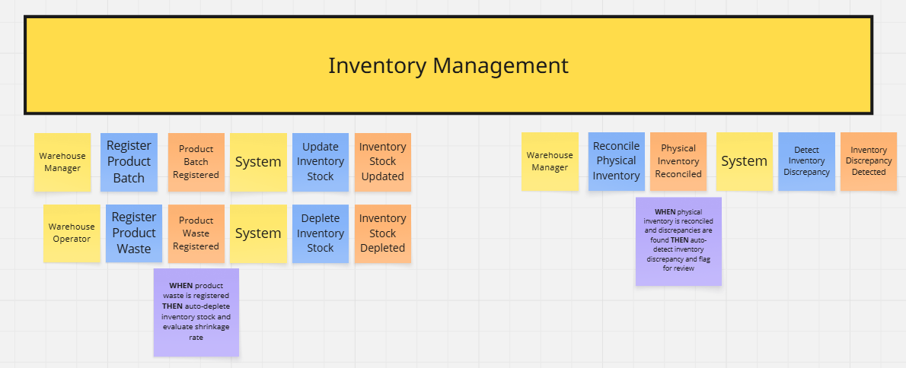
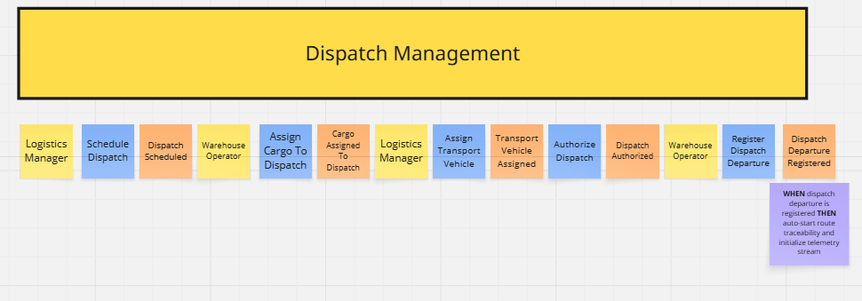
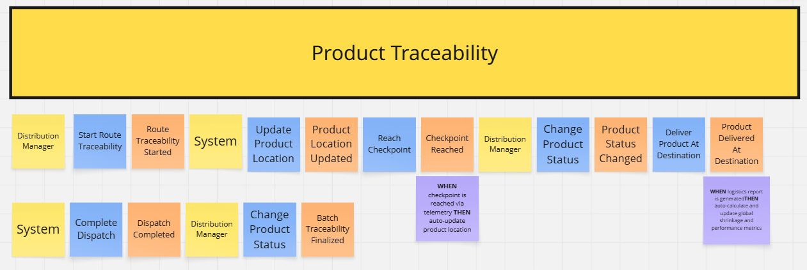
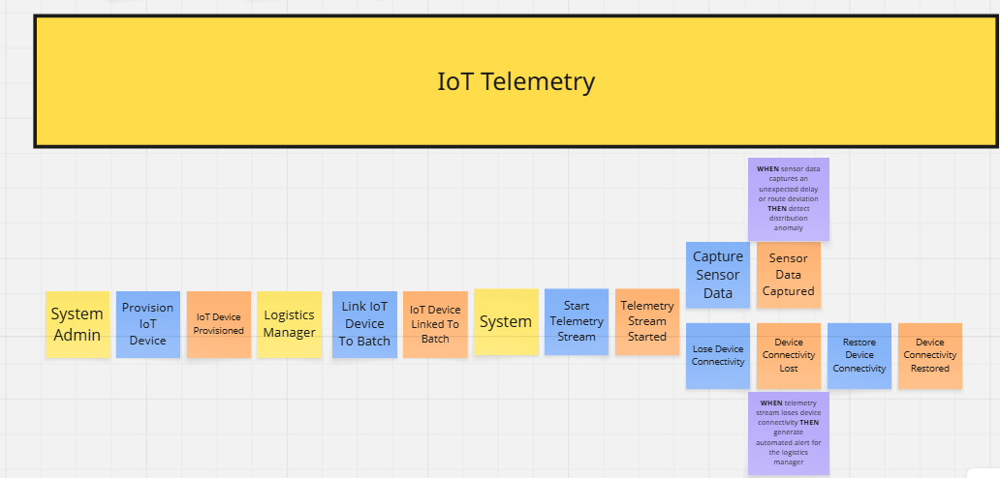
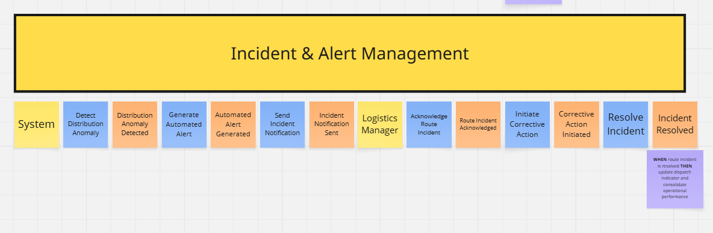
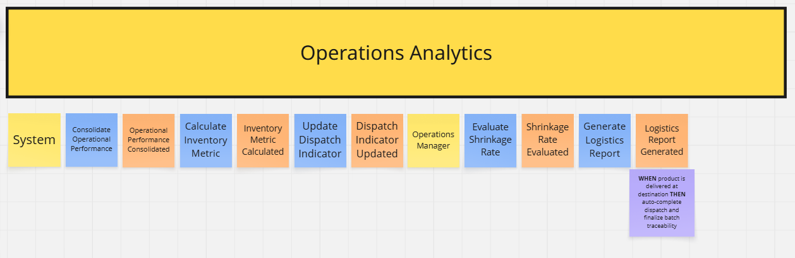

Una vez identificados los eventos, flujos, comandos y políticas del dominio, se procedió al descubrimiento de contextos candidatos. Esta etapa permitió agrupar elementos relacionados según su cohesión funcional y sus reglas de negocio compartidas, delimitando áreas específicas como el control de inventarios, la gestión de despachos, la trazabilidad de rutas, el monitoreo por telemetría y el manejo de incidencias logísticas. De esta manera, el equipo logró estructurar el dominio de BevTrace en contextos con responsabilidades claramente diferenciadas y alineadas a los módulos de la arquitectura del software.

#### Paso 4: Read Models

Los Read Models representan las vistas de consulta críticas que los actores utilizan para tomar decisiones dentro del sistema. Para mantener el enfoque en el Core Domain, el modelado destaca las 4 vistas principales (post-its verdes) que cruzan mayor cantidad de información operativa:

* **Inventory & Shrinkage Catalog:** utilizado por el Warehouse Manager y los operadores para verificar el stock de bebidas disponible en tiempo real, los lotes registrados y las mermas (waste) detectadas.
* **Dispatch & Fleet Assignment Board:** panel operativo utilizado por el Logistics Manager para consultar los envíos programados, asignar carga a los vehículos y autorizar las salidas desde el centro de distribución.
* **Active Route Traceability Map:** vista esencial utilizada por el Distribution Manager para monitorear la ubicación en tiempo real de los despachos, validar los puntos de control (checkpoints) alcanzados y gestionar alertas de incidencias.
* **Logistics Performance & KPI Dashboard:** panel gerencial utilizado por el Operations Manager para visualizar el rendimiento de las entregas, evaluar la tasa global de mermas (shrinkage rate) y analizar el impacto de las anomalías en la distribución.

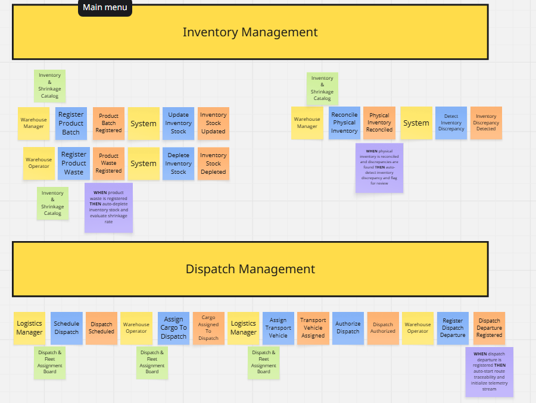
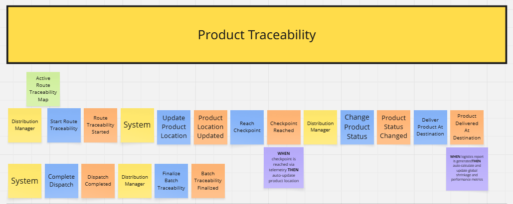
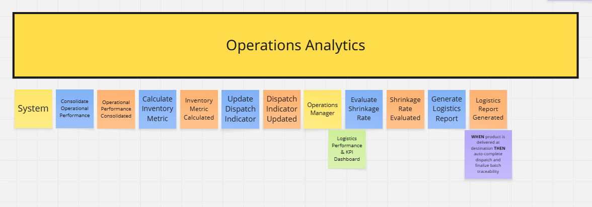

#### Paso 5: External Systems

En este paso identificamos los sistemas externos que interactúan con el dominio, pero que están fuera del control directo del sistema (representados con post-its rosados). Dado el enfoque actual del producto, el rastreo se apoya en servicios simulados en lugar de hardware físico.

* **Maps API (Geocoding / Routing):** sistema externo utilizado únicamente para validar las direcciones de los destinos y trazar las rutas estáticas planificadas, sin requerir rastreo satelital en tiempo real.
* **Fleet Tracking API:** servicio externo que provee el flujo de datos de ubicación, puntos de control alcanzados y estado de conectividad de los vehículos en ruta.
* **Notification Gateway:** plataforma de mensajería externa utilizada en el contexto de gestión de incidencias para despachar alertas automáticas a los responsables logísticos.
* **Cloud Storage Service:** servicio de almacenamiento en la nube utilizado para resguardar de forma segura los comprobantes de entrega (Proof of Delivery) y los reportes logísticos generados.

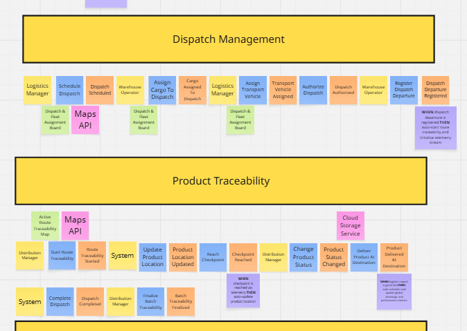
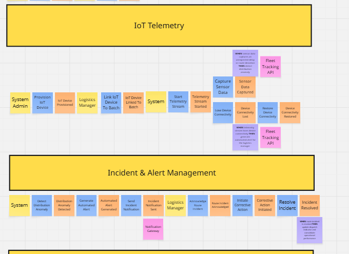
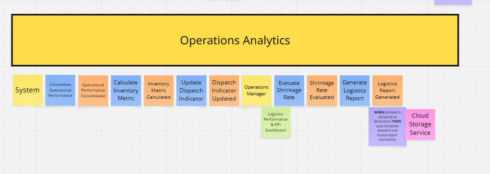

#### Paso 6: Add Aggregates

En este paso identificamos los Aggregates, que representan los objetos de dominio centrales que agrupan entidades relacionadas y se tratan como una sola unidad de consistencia. Cada aggregate (post-it amarillo grande) actúa como el punto central alrededor del cual giran los eventos y comandos operativos de la cadena de suministro:

* **Product Batch & Inventory Ledger:** gestiona el registro de lotes de bebidas, la disponibilidad de stock, el registro de mermas y el cuadre físico.
* **Dispatch Order & Cargo Assignment:** controla la programación de salidas, autorizaciones y la asignación de productos a los vehículos de transporte.
* **Traceability Log & Delivery Record:** controla la trazabilidad de la ruta, el registro de puntos de control alcanzados y la confirmación de entrega en destino.
* **Telemetry Stream & Device Link:** centraliza la captura de datos (simulados) de ubicación y gestiona el estado de conexión de la flota.
* **Incident Record & Alert Engine:** gestiona la detección de anomalías, la emisión de notificaciones automáticas y el flujo de acciones correctivas.
* **Logistics Report & Performance KPI:** encapsula el cálculo de tasas de mermas operativas y la generación de documentos de auditoría logística.
  
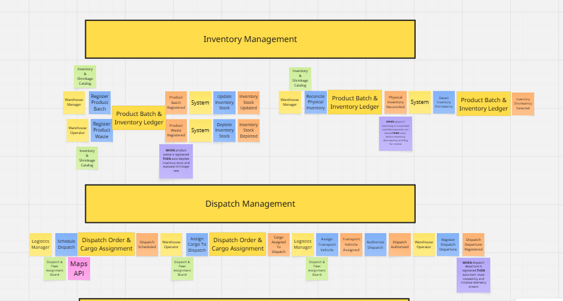
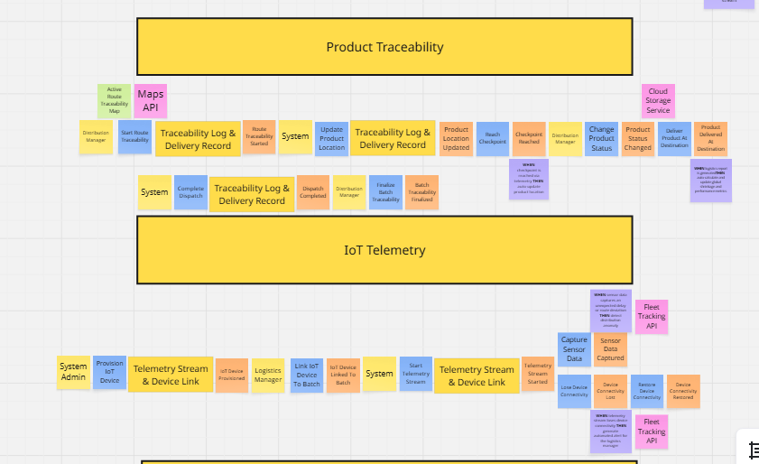
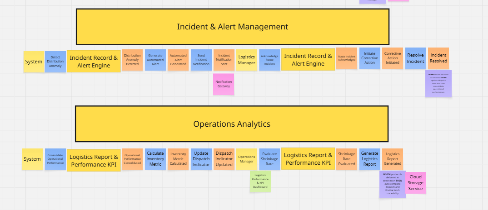

#### Paso 7: Bounded Contexts

Finalmente, definimos los Bounded Contexts que agrupan los flujos relacionados en contextos delimitados con responsabilidades claras. Tras la abstracción de la arquitectura, se definieron un total de 6 contextos independientes:

| Bounded Context | Descripción de Componentes Clave |
|-----------------|----------------------------------|
| **BC: Inventory Management** | Contiene el Aggregate `Product Batch & Inventory Ledger` para controlar integralmente el estado del almacén. |
| **BC: Dispatch Management** | Agrupa el Aggregate `Dispatch Order & Cargo Assignment` para orquestar la preparación y salida de los vehículos. |
| **BC: Product Traceability** | Contiene el Aggregate `Traceability Log & Delivery Record` para el seguimiento continuo de la carga hasta su destino. |
| **BC: IoT Telemetry** | Gestiona el Aggregate `Telemetry Stream & Device Link` para procesar los datos de ruta simulados. |
| **BC: Incident & Alert Management** | Agrupa el Aggregate `Incident Record & Alert Engine` para el manejo centralizado de excepciones y alertas. |
| **BC: Operations Analytics** | Contiene el Aggregate `Logistics Report & Performance KPI` para la evaluación de mermas y toma de decisiones gerenciales. |

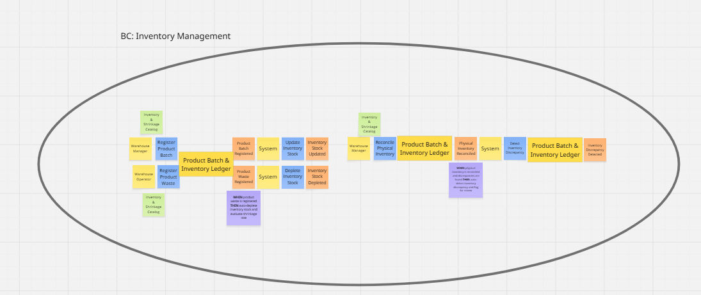
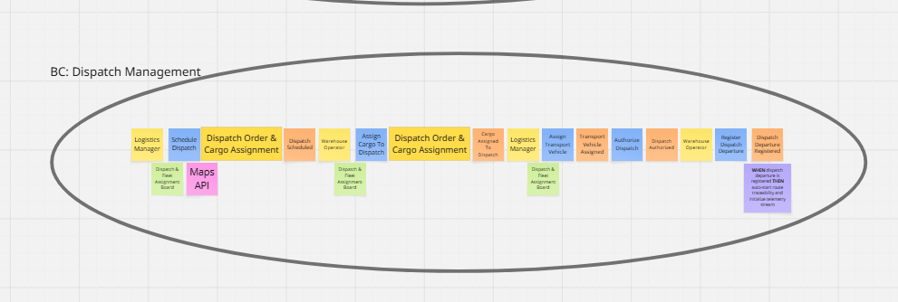
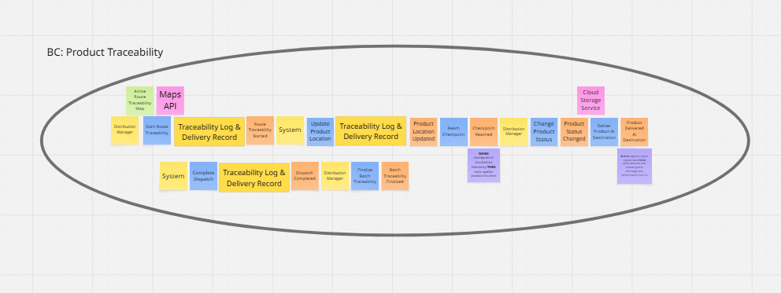
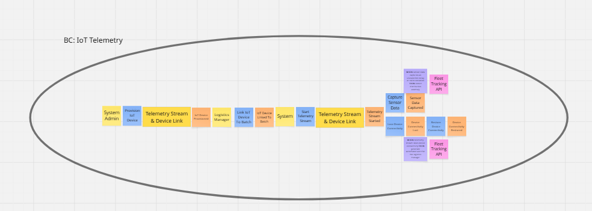
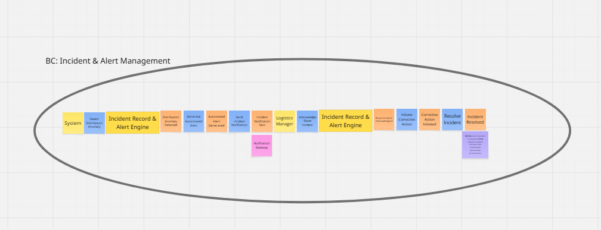
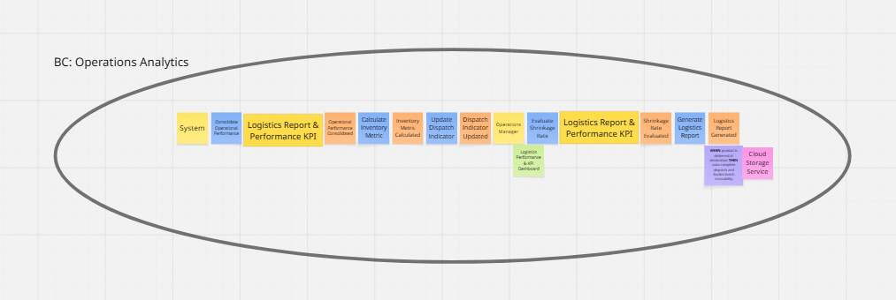

## 4.6.2. Software Architecture Context Diagram

En este nivel se presenta una vista de alto nivel de la arquitectura, donde el foco está en el sistema de software BevTrace como una "caja negra" y en las interacciones que mantiene con sus usuarios y con otros sistemas externos.

El context diagram muestra a la **BevTrace Platform** como un recuadro en el centro, rodeado por los principales actores y sistemas con los que se comunica:

- **Logistics Manager:** usuario interno responsable de programar los despachos, asignar la flota de transporte, autorizar las salidas desde los centros de distribución, gestionar incidencias en ruta y evaluar métricas operativas gerenciales.

- **Warehouse Operator:** usuario operativo encargado de controlar el stock físico, registrar la entrada y salida de lotes de bebidas, reportar mermas (waste) y asignar la carga física a los vehículos antes del despacho.

- **Telemetry Mock API:** simulador externo que inyecta datos de avance y puntos de control (checkpoints) alcanzados. Reemplaza temporalmente a los dispositivos GPS/IoT físicos, enviando telemetría de ubicación y estado de conectividad de la flota hacia BevTrace de forma automática mediante endpoints REST.

- **Maps API:** sistema externo (como Google Maps o Mapbox) utilizado para la geocodificación de las direcciones de los destinos y el trazado de las rutas estáticas planificadas para los despachos.

- **Notification Gateway:** plataforma externa de mensajería (ej. Twilio o SendGrid) utilizada para enviar notificaciones transaccionales y alertas automáticas a los responsables logísticos cuando se detectan anomalías o retrasos en la distribución.

- **Cloud Storage Service:** servicio en la nube utilizado para almacenar de forma segura y permanente los comprobantes de entrega (Proof of Delivery) y los reportes logísticos inmutables generados para el área gerencial.

En el diagrama se representan las relaciones entre estos elementos. El Logistics Manager y el Warehouse Operator interactúan con BevTrace a través de la interfaz web. La Telemetry Mock API envía datos entrantes hacia BevTrace de forma automática. BevTrace se encarga de orquestar las integraciones salientes con los servicios externos (validación de rutas, notificaciones por mensajería y almacenamiento de documentos). Esta vista permite entender el alcance del sistema, los límites de responsabilidad y el ecosistema logístico en el que se inserta BevTrace antes de entrar a detalles de implementación.

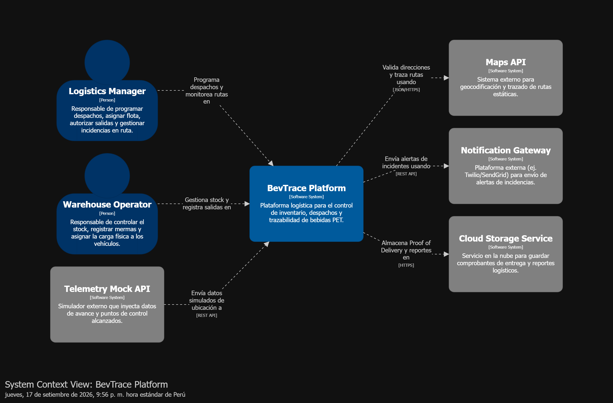

---

## 4.6.3. Software Architecture Container Diagrams

En el nivel de contenedores, la atención se desplaza desde "quién usa el sistema" hacia "cómo se organiza internamente el sistema en aplicaciones y fuentes de datos". El container diagram muestra los elementos de alto nivel de la arquitectura de BevTrace, sus responsabilidades principales y la forma en que se comunican entre sí y con los sistemas externos.

La arquitectura lógica de BevTrace se estructura en los siguientes contenedores:

- **Landing Page:** aplicación web estática que presenta la propuesta de valor de BevTrace y sus soluciones de trazabilidad para la cadena de suministro. Está desarrollada con tecnologías web estándar (HTML, CSS y JavaScript). Cuando el usuario desea acceder a la aplicación, delega la entrega del bundle al servidor web.

- **Web Application:** servidor web implementado con **Nginx** que actúa como servidor de archivos estáticos. Recibe la delegación de la Landing Page y entrega el bundle compilado de la SPA Angular al navegador del usuario. Este contenedor separa la responsabilidad de servir el contenido estático de la lógica de negocio del backend.

- **BevTrace Web Client Application (SPA):** aplicación web principal implementada en **Angular** que corre directamente en el navegador del usuario. Una vez entregado el bundle por el Web Application, el Logistics Manager y el Warehouse Operator interactúan con esta SPA para gestionar inventarios, autorizar despachos, monitorear la ruta y evaluar analíticas. Concentra la lógica de presentación para los contextos de Inventory Management, Dispatch Management, Product Traceability, Incident & Alert Management y Operations Analytics.

- **API Application:** backend implementado con **C# y .NET Core**, que expone una API REST y encapsula la lógica de negocio, reglas de validación logística y orquestación de trazabilidad. Este contenedor agrupa los componentes backend por contexto (Inventory Component, Dispatch Component, Traceability Component, Telemetry Component, Incident & Alert Component, Analytics Component y Shared Component).

- **Database:** base de datos relacional **MySQL**, donde se persiste la información estructurada del sistema: catálogos de productos, disponibilidad de stock, órdenes de despacho, asignación de carga, logs de trazabilidad en ruta, registro de incidencias y métricas operativas.

En el diagrama se observa que:

- Los usuarios acceden primero a la **Landing Page**, que delega la entrega del bundle al **Web Application (Nginx)**, el cual sirve el bundle compilado al navegador del usuario como la **SPA Angular**.
- La **SPA** se comunica exclusivamente con la **API Application** mediante peticiones **HTTP/HTTPS** con mensajes **JSON**, siguiendo un estilo REST.
- La **API Application** persiste y consulta datos en la **Database** mediante **Entity Framework Core** y mapeo objeto–relacional.
- La **Telemetry Mock API** envía telemetría entrante directamente a la **API Application** mediante peticiones POST al endpoint de ingesta, sin intervención de la SPA.
- La **API Application** interactúa con los sistemas externos salientes: el **Maps API** para validar direcciones, el **Notification Gateway** para el envío de alertas críticas en ruta, y el **Cloud Storage Service** para el resguardo de comprobantes de entrega.

Esta vista permite apreciar cómo se distribuyen las responsabilidades entre la capa de presentación (Landing Page, Web Application y SPA), la capa de lógica de negocio (API Application) y la capa de persistencia (Database).

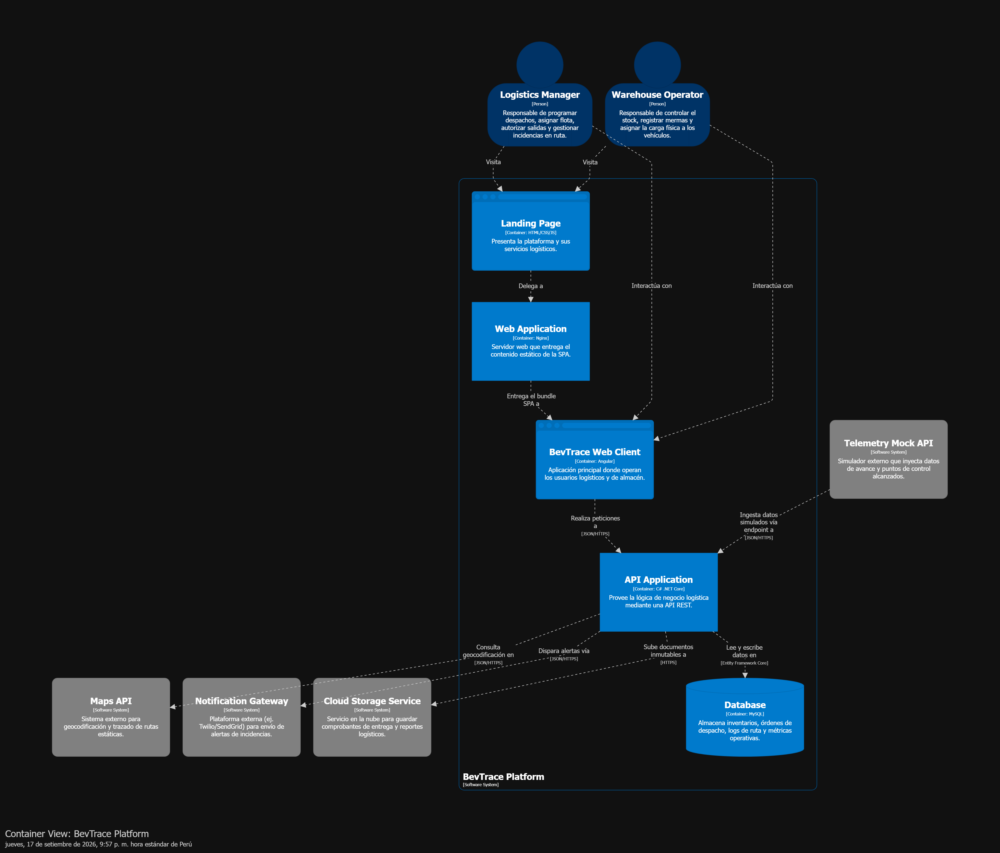

---

## 4.6.4. Software Architecture Components Diagrams

En el nivel de componentes se detalla la descomposición interna de los contenedores, mostrando los bloques estructurales que conforman cada uno y las relaciones entre ellos. Dado que la **SPA** y la **Database** se abordan en sus respectivos diseños, en esta sección se pone especial énfasis en el contenedor **API Application** (C# / .NET Core), donde reside la mayor parte de la lógica de negocio y las reglas logísticas.

El component diagram de la **API Application** agrupa la arquitectura interna siguiendo los 6 bounded contexts definidos en el dominio de BevTrace. Cada módulo backend representa un componente principal dentro del contenedor:

- **Inventory Management Component:** se encarga de gestionar la entrada de lotes de bebidas, el registro de mermas (waste), la reconciliación física y la actualización del stock disponible. Interactúa estrechamente con la base de datos para garantizar la consistencia del inventario en el almacén.

- **Dispatch Management Component:** orquesta la programación de salidas. Gestiona la creación de la orden de despacho, la asignación de carga a los vehículos y la autorización final de salida. Se integra con la **Maps API** para validar las direcciones de destino.

- **Product Traceability Component:** registra el avance de la ruta una vez que el vehículo abandona el almacén. Gestiona el registro de puntos de control (checkpoints) y el cambio de estado hasta la confirmación de entrega. Se integra con el **Cloud Storage Service** para guardar de forma inmutable el Proof of Delivery (PoD).

- **IoT Telemetry Component:** implementa el endpoint de ingesta que recibe los datos enviados automáticamente por la **Telemetry Mock API**. Almacena las simulaciones de ubicación y el estado de conectividad de los vehículos, traduciendo estos datos externos a eventos de dominio internos.

- **Incident & Alert Component:** constituye el motor de control de excepciones. Evalúa los datos recibidos de la telemetría para detectar anomalías operativas (desvíos de ruta o retrasos). Al detectar una incidencia crítica, se integra con el **Notification Gateway** para despachar alertas automáticas a los responsables.

- **Operations Analytics Component:** consolida la información de inventarios, despachos e incidencias para calcular métricas de rendimiento (KPIs) y evaluar la tasa de mermas operativas. Genera los reportes logísticos gerenciales y los envía al **Cloud Storage Service**.

- **Shared Component:** provee componentes compartidos, value objects comunes, clases base, eventos de dominio y mecanismos de infraestructura transversales utilizados por todos los módulos backend, favoreciendo la reutilización de código en .NET.

En el diagrama se refleja cómo:

- La **SPA** consume los servicios expuestos por cada módulo backend a través de la **API Application**, utilizando endpoints REST específicos por contexto.
- La **Telemetry Mock API** envía datos entrantes directamente al **IoT Telemetry Component** mediante HTTP POST, sin pasar por la SPA.
- El **IoT Telemetry Component** y el **Incident & Alert Component** trabajan en conjunto: el primero ingesta la data simulada y publica el evento correspondiente; el segundo lo evalúa y, si detecta una anomalía, dispara la notificación externa.
- Las integraciones externas se delegan a sus respectivos contextos (Dispatch valida rutas con Maps API, Incident envía notificaciones, y Traceability/Analytics suben archivos a la nube).
- Todos los módulos backend persisten el estado de sus Aggregates en la **Database** compartida y reutilizan capacidades provistas por el **Shared Component**.

De esta forma, los component diagrams muestran cómo los contenedores se descomponen en componentes coherentes con los bounded contexts del dominio logístico y cómo estos colaboran entre sí para orquestar la distribución de BevTrace.

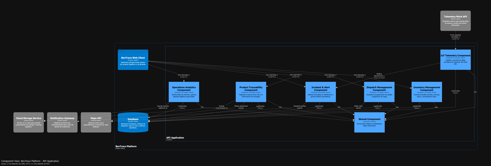

# 4.7 Software Object-Oriented Design

### 4.7.1 Class Diagram

El siguiente diagrama de clases general representa la vista global del modelo de dominio de BevTrace, integrando los 6 contextos delimitados (Bounded Contexts) en un solo esquema. Se modela la herencia de los actores principales (`LogisticsManager` y `WarehouseOperator`) desde una clase base genérica `User`. Asimismo, expone cómo interactúan las entidades transversales del sistema; por ejemplo, cómo una orden de despacho se conecta con la trazabilidad en ruta, o cómo un vehículo físico se vincula con un dispositivo de telemetría. Este diseño de alto nivel promueve una separación clara de responsabilidades y facilita la implementación de una arquitectura basada en el enfoque de Domain-Driven Design (DDD).

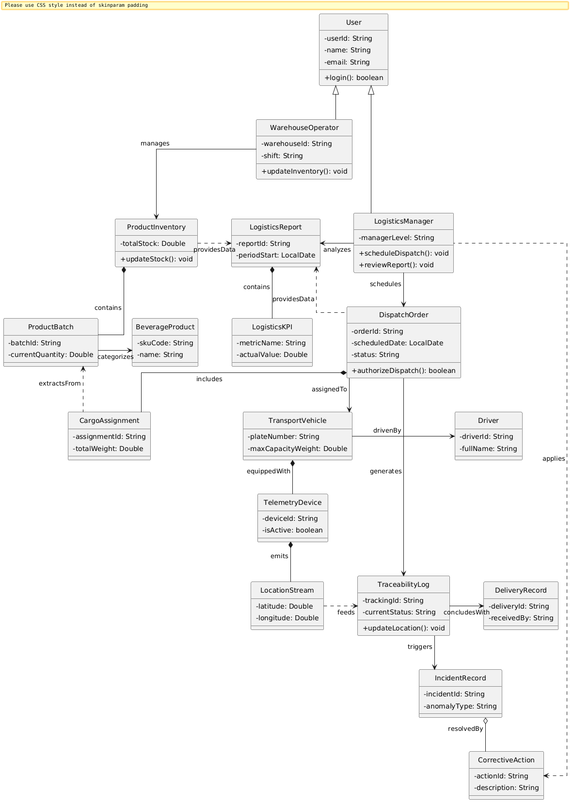

#### Bounded Context: Inventory Management

El diagrama de clases presentado pertenece al contexto delimitado de **Inventory Management**, el cual representa el núcleo de las funcionalidades relacionadas con el control del almacén de bebidas. Este contexto tiene como **Aggregate Root principal a `ProductInventory`**, el cual orquesta las relaciones con otras entidades y garantiza la consistencia del stock físico. El inventario se compone de múltiples lotes (`ProductBatch`), los cuales a su vez categorizan productos específicos (`BeverageProduct`) y se ubican en zonas físicas del almacén (`WarehouseZone`). Adicionalmente, la entidad `WasteRecord` encapsula los datos relacionados con las mermas operativas, permitiendo calcular su impacto financiero. 

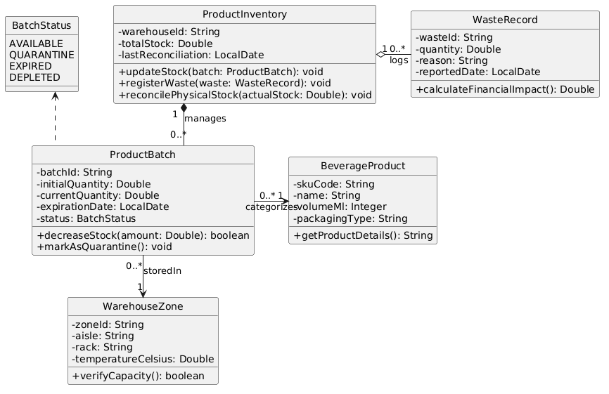

#### Bounded Context: Dispatch Management

Este diagrama representa el contexto de **Dispatch Management**, el cual centraliza la programación y orquestación de salidas. En este contexto, el **Aggregate Root es `DispatchOrder`**, el cual contiene la lógica para autorizar y planificar la distribución. El diseño separa claramente las responsabilidades: la orden agrupa la carga física (`CargoAssignment`), traza la ruta planificada (`RoutePlan` y `DeliveryDestination`), y se asigna a un vehículo específico (`TransportVehicle`), el cual es conducido por un chofer autorizado (`Driver`). Esta estructura modular permite validar capacidades y disponibilidades antes de iniciar cualquier despacho, preservando la integridad del modelo logístico.

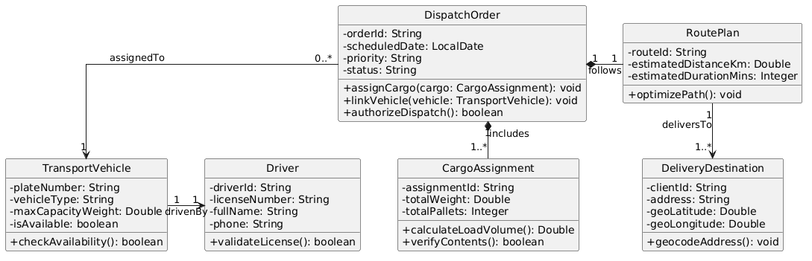

## 4.8. Database Design.

### 4.8.1. Database Diagrams.
