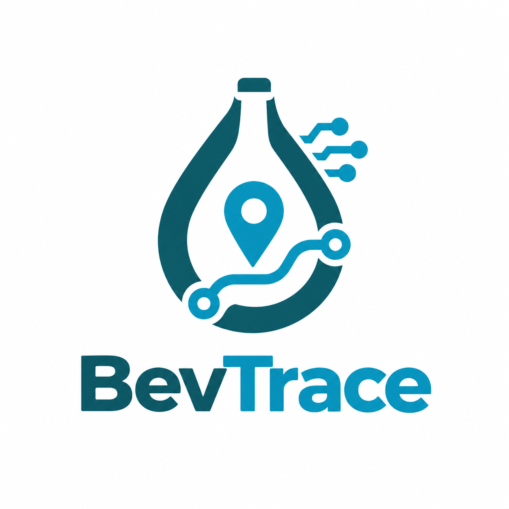
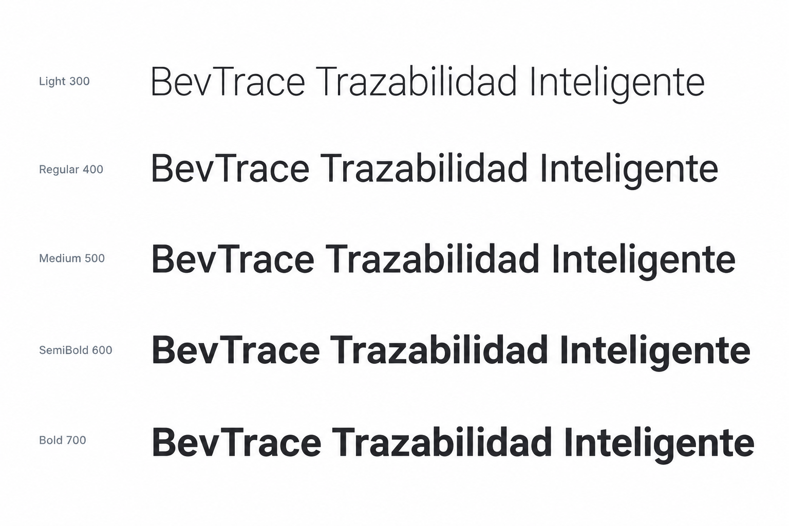
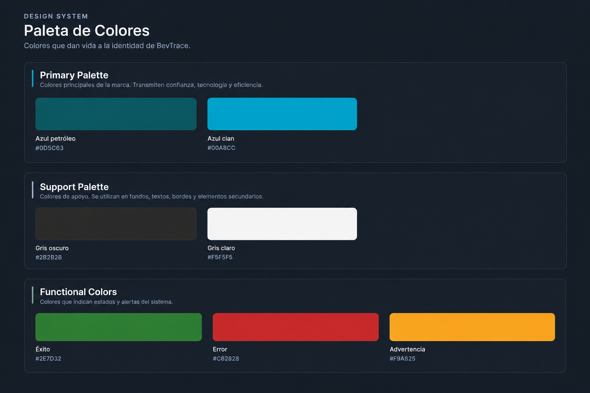

# Capítulo IV: Product Design

El presente capítulo aborda las decisiones de diseño adoptadas para el desarrollo del producto BevTrace, incluyendo su Landing Page. Se detallan los lineamientos visuales, la organización de la información y los criterios de experiencia de usuario que buscan garantizar una interfaz clara, coherente y adecuada al contexto del sector logístico y de distribución de bebidas embotelladas.

## 4.1. Style Guidelines.

### 4.1.1. General Style Guidelines.

Las decisiones visuales de BevTrace responden a la naturaleza operativa del producto: una plataforma pensada para que gerentes de logística y distribución supervisen despachos y trazabilidad sin fricción visual ni ambigüedad en la lectura de datos. Por ello, el equipo CodeCraft prioriza un diseño funcional y sobrio por encima de elementos ornamentales, buscando que cada componente de la interfaz refuerce la percepción de control y confiabilidad sobre la cadena de distribución.

A continuación se describen los criterios de estilo adoptados para BevTrace, aplicando principios de Diseño de Experiencia de Usuario (UX) e Interfaz de Usuario (UI) orientados a un público empresarial (B2B) del sector de bebidas embotelladas, cuyo objetivo principal al interactuar con el producto es reducir el tiempo de respuesta ante incidencias logísticas y eliminar el registro manual de información.

#### Branding

La marca BevTrace se apoya en dos ideas centrales: la ruta (el trayecto que recorre el producto desde el almacén hasta el punto de destino) y el registro confiable de esa información. El isotipo del logotipo integra un trazo tipo ruta o checkpoint, evocando el seguimiento en tiempo real de despachos, junto con un wordmark de trazo sólido y sin adornos que refuerza la seriedad del producto ante un público de decisión (gerentes de operaciones, logística y TI). Se descarta cualquier elemento gráfico superfluo que reste claridad al isotipo, tanto en formatos grandes (Landing Page, presentaciones comerciales) como en formatos reducidos (ícono de aplicación, favicon del sistema).

Para preservar la legibilidad del logotipo, se define un área de resguardo mínima equivalente a la altura de la letra inicial del wordmark, dentro de la cual no puede ubicarse ningún otro elemento visual. Asimismo, se establecen dos variantes de uso: una versión a color para fondos claros y una versión invertida (blanca) para fondos oscuros o imágenes de fondo, evitando en ambos casos distorsiones de proporción o rotaciones del isotipo.

  

#### Typography

BevTrace adopta <strong>Roboto</strong> como tipografía principal para toda la interfaz, al ser la fuente predeterminada de Material Design y, por consiguiente, de Angular Material, framework de componentes utilizado en el desarrollo de la Web Application. Esta decisión asegura consistencia tipográfica entre el Landing Page y la aplicación web, sin necesidad de cargar fuentes adicionales que impacten el rendimiento. Para la visualización de datos técnicos y numéricos (identificadores de lote, coordenadas GPS, códigos de despacho, timestamps de trazabilidad) se emplea <strong>Roboto Mono</strong>, cuyo espaciado monoespaciado facilita la alineación tabular y evita confusión entre caracteres similares (0, O, 1, l) en reportes operativos donde la exactitud del dato es crítica.

La jerarquía tipográfica se establece de la siguiente manera, tomando como referencia la escala tipográfica de Angular Material, a fin de mantener coherencia entre el diseño planteado y su futura implementación:

- **Encabezado principal (H1)**: 2.5rem (40px) en escritorio, 2rem (32px) en móvil.
- **Subtítulos de sección (H2)**: 2rem (32px) en escritorio, 1.75rem (28px) en móvil.
- **Títulos de componente (H3/H4)**: 1.5rem (24px) a 1.25rem (20px).
- **Cuerpo de texto (p)**: 1rem (16px), con interlineado (line-height) de 1.6 para facilitar la lectura de párrafos extensos.
- **Etiquetas y botones (span/button)**: 0.875rem (14px) a 1rem (16px).

  

Esta jerarquía tipográfica busca garantizar una lectura clara de la información operativa en todas las resoluciones, priorizando el contraste suficiente entre el texto y el fondo según las pautas WCAG 2.1 AA, en línea con el enfoque de accesibilidad adoptado para el producto.

#### Colors

La paleta de colores de BevTrace refuerza los atributos de confianza, precisión y monitoreo en tiempo real que caracterizan al producto, dirigido a un público B2B del sector logístico. Se organiza en tres categorías: colores de marca, colores neutros y colores funcionales de estado.

**Paleta principal**

| Color | Uso | Valor |
|---|---|---|
| Azul Petróleo (Primario) | Identidad de marca, elementos clave de navegación | `#0D5C63` |
| Azul Cian (Secundario) | Acentos, elementos interactivos | `#00A8CC` |

**Colores neutros**

| Color | Uso | Valor |
|---|---|---|
| Neutro oscuro | Texto principal, fondos oscuros | `#2B2B2B` |
| Neutro claro | Fondos de sección, tarjetas | `#F5F5F5` |

**Colores funcionales**

| Color | Uso | Valor |
|---|---|---|
| Verde (Éxito) | Confirmaciones, despachos completados | `#2E7D32` |
| Ámbar (Alerta) | Advertencias, retrasos en tránsito | `#F9A825` |
| Rojo (Error) | Errores, incidencias críticas de trazabilidad | `#C62828` |

  

Esta distribución cromática busca transmitir a los clientes de BevTrace una imagen de control operativo y confiabilidad, reservando los colores funcionales exclusivamente para estados del sistema, a fin de evitar ambigüedad en la comunicación visual de alertas críticas de la cadena de distribución.

#### Spacing

BevTrace utiliza un sistema de espaciado modular basado en una unidad base de 8px, múltiplo estándar compatible con el sistema de grid de Angular Material. Esta unidad se multiplica para definir los distintos niveles de espaciado en la interfaz, garantizando consistencia visual y un ritmo predecible entre secciones, componentes y elementos internos.

- **Espaciado base**: 8px, unidad mínima del sistema.
- **Espaciado entre elementos relacionados** (ej. ítems de una lista de despachos): 16px (2 unidades).
- **Espaciado entre componentes** (ej. tarjetas de monitoreo): 24px (3 unidades).
- **Padding de secciones principales**: 48px (6 unidades), para separar bloques de contenido en el Landing Page.

#### Tono de Comunicación

La voz y el tono de BevTrace están diseñados para reflejar la precisión y confiabilidad que caracterizan al producto, dirigiéndose principalmente a gerentes de logística, operaciones y tecnología de empresas embotelladoras y distribuidoras. La comunicación busca proyectar control operativo y transparencia en cada etapa de la cadena de distribución.

- **Tono**: Formal y profesional, orientado a la confiabilidad operativa.
- **Actitud**: Resolutiva y directa, enfocada en comunicar beneficios concretos (reducción de reportes manuales, visibilidad en tiempo real, trazabilidad inmutable del producto).
- **Lenguaje**: Claro y preciso, evitando ambigüedad en mensajes relacionados con el estado de despachos o alertas del sistema.
- **Voz**: Experta y confiable, posicionando a BevTrace como una solución tecnológica sólida para la gestión logística del sector de bebidas embotelladas.

Este enfoque comunicacional busca generar confianza en los clientes de BevTrace, asegurando que la plataforma automatiza y centraliza la gestión de despachos de forma segura, eliminando la dependencia de reportes manuales propensos a error.

### 4.1.2. Web Style Guidelines.

Las directrices de estilo web de BevTrace se centran en la claridad operativa, la coherencia visual entre el Landing Page y la Web Application, y la eficiencia en la visualización de datos de trazabilidad en tiempo real.

**1) Layout**

- **Sistema de Grid**: Se utiliza un diseño de cuadrícula flexible mediante Angular Material, permitiendo que las tarjetas de monitoreo y los paneles de despacho se adapten a distintas resoluciones.
- **Headers y Footers**: El encabezado se mantiene fijo, brindando acceso constante a la navegación principal. El pie de página centraliza enlaces legales e información de contacto.
- **Cards**: Las tarjetas son el componente principal para mostrar información de despachos, estados de trazabilidad y métricas operativas, utilizando bordes redondeados y sombras suaves consistentes con Angular Material.

**2) Responsive Design**

- **Desktop**: Navegación principal totalmente visible, contenido distribuido en múltiples columnas para aprovechar el espacio en estaciones de monitoreo.
- **Tablet**: Adaptación a diseño de dos columnas, manteniendo elementos táctiles de tamaño adecuado.
- **Mobile**: Diseño de una sola columna, con navegación colapsada en menú desplegable, priorizando el acceso rápido a alertas y estados críticos desde dispositivos móviles.

**3) Interaction Design**

- **Botones**: Utilizan los colores de marca (Azul Petróleo y Azul Cian), con retroalimentación visual al interactuar, priorizando la confirmación clara de acciones críticas (por ejemplo, registrar un despacho).
- **Formularios**: Diseñados para minimizar errores de entrada de datos, con validaciones visuales inmediatas en campos críticos como identificadores de lote o coordenadas.

**4) Images and Icons**

- **Imágenes**: Se prioriza el uso de imágenes relacionadas al entorno logístico e industrial (almacenes, flotas de distribución, plantas embotelladoras).
- **Íconos**: Estilo lineal y minimalista, representando conceptos clave como monitoreo (radar/GPS), trazabilidad (ruta) y estado de despacho.

## 4.2. Information Architecture.

### 4.2.1. Organization Systems.

### 4.2.2. Labeling Systems.

### 4.2.3. SEO Tags and Meta Tags

### 4.2.4. Searching Systems.

### 4.2.5. Navigation Systems.

## 4.3. Landing Page UI Design.

### 4.3.1. Landing Page Wireframe.

### 4.3.2. Landing Page Mock-up.

## 4.4. Web Applications UX/UI Design.

### 4.4.1. Web Applications Wireframes.

### 4.4.2. Web Applications Wireflow Diagrams.

### 4.4.2. Web Applications Mock-ups.

### 4.4.3. Web Applications User Flow Diagrams.

## 4.5. Web Applications Prototyping.

## 4.6. Domain-Driven Software Architecture.

### 4.6.1. Design-Level Event Storming.

Para identificar los eventos de dominio, es recomendable realizar una sesión de Event Storming. Esta técnica permite visualizar y comprender el flujo de eventos dentro del dominio, facilitando la identificación de los *Bounded Contexts*.
El desarrollo del proceso del Domain-Driven Design se realizó en la aplicación Miro: [https://sl1nk.com/17uavc5]

### Paso 1: Timelines

Posteriormente, organizamos los eventos en líneas de tiempo para visualizar el flujo de interacciones y secuencias entre eventos de negocio. Se identificaron los siguientes 6 flujos principales (Bounded Contexts):

* **Inventory Management Flow:** cubre las necesidades de los responsables de almacén para registrar, consultar y mantener un control preciso de los productos, reduciendo las discrepancias.
* **Dispatch Management Flow:** enfocado en las necesidades operativas de los responsables de logística para registrar, asignar y supervisar los envíos salientes desde los almacenes hacia los centros de distribución.
* **Product Traceability Flow:** dedicado a los responsables de distribución para conocer el estado y la ruta exacta de los productos desde el almacén hasta su destino final.
* **IoT Telemetry Flow:** maneja la integración tecnológica que permite recopilar información operativa en tiempo real sobre los productos durante su distribución.
* **Incident & Alert Management Flow:** módulo automatizado que permite la identificación oportuna de eventos anómalos o inconsistencias que puedan afectar el inventario o causar retrasos en el transporte.
* **Operations Analytics Flow:** dirigido a los responsables de operaciones para visualizar información consolidada sobre inventarios, despachos y trazabilidad para la toma de decisiones logísticas.

Esta organización temporal facilitó la comprensión de dependencias y secuencias críticas entre la operación logística humana y la automatización del sistema.
### 4.6.2. Software Architecture Context Diagram.

### 4.6.3. Software Architecture Container Diagrams.

### 4.6.4. Software Architecture Components Diagrams.

## 4.7. Software Object-Oriented Design.

### 4.7.1. Class Diagrams.

## 4.8. Database Design.

### 4.8.1. Database Diagrams.
