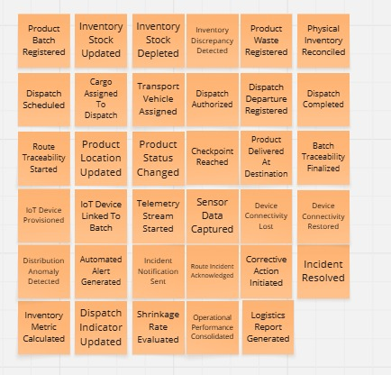

## 2.4. Big Picture Event Storm

Antes de definir funcionalidades, módulos o componentes técnicos para <strong>BevTrace</strong>,
el equipo realizó una sesión de <strong>Big Picture Event Storming</strong> con el objetivo de
comprender el dominio del negocio desde una perspectiva general. Esta actividad permitió
visualizar los principales eventos que ocurren dentro de la cadena de suministro, desde
la gestión de inventarios y lotes de bebidas hasta la planificación de despachos, control
de mermas, seguimiento de rutas mediante telemetría de datos externos, alertas de incidencias
y reportes de rendimiento operativo.

El proceso se desarrolló de manera colaborativa, priorizando el descubrimiento del negocio
sin enfocarse inicialmente en pantallas, bases de datos, integraciones externas o detalles de implementación.
El equipo recopiló eventos significativos del dominio y los organizó como una primera
aproximación visual al flujo general de la organización. Esta dinámica permitió identificar
procesos clave, posibles cuellos de botella en los despachos, riesgos de pérdida de mercadería (mermas) 
y oportunidades para mejorar la trazabilidad y la eficiencia logística.

La primera etapa consistió en recolectar eventos de dominio. En esta fase, los integrantes
propusieron sucesos relevantes expresados en pasado, como hechos que ya ocurrieron dentro
del negocio. Esta forma de redacción permitió representar acontecimientos reales del dominio,
por ejemplo: un lote de producto fue registrado, el stock de inventario fue actualizado,
un despacho fue autorizado, un punto de control fue alcanzado, una anomalía de distribución 
fue detectada o un reporte logístico fue generado.

  
  
<em>Figura: Primera etapa del Big Picture Event Storming, enfocada en la recolección de eventos de dominio para BevTrace.</em>

Como resultado de esta etapa, se identificaron grupos iniciales de eventos relacionados con
la administración de inventarios, gestión de mermas, programación de despachos, monitoreo de 
rutas (mediante integración de datos externos), resolución de incidencias y análisis de métricas.
Esta exploración permitió reconocer que el dominio de BevTrace no se limita únicamente al
control estático de almacén, sino que integra flujos operativos y de transporte que deben
mantenerse conectados para asegurar la trazabilidad del producto hasta su destino.

A partir de los eventos recolectados, el equipo pudo detectar áreas críticas del negocio:
el registro preciso de entradas y salidas, la asignación eficiente de cargas a los vehículos, 
la detección oportuna de discrepancias de inventario, el reporte de anomalías en tránsito y 
la evaluación de las tasas de pérdida. Estos elementos fueron considerados como insumos 
principales para la posterior identificación de procesos, bounded contexts y funcionalidades del sistema.

