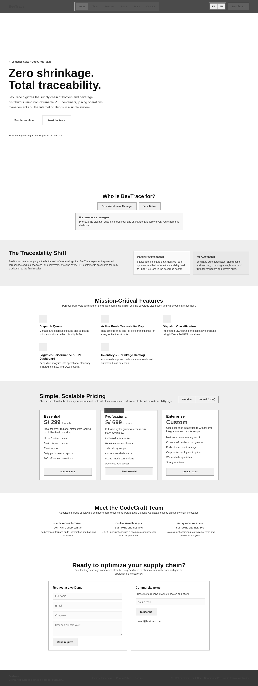
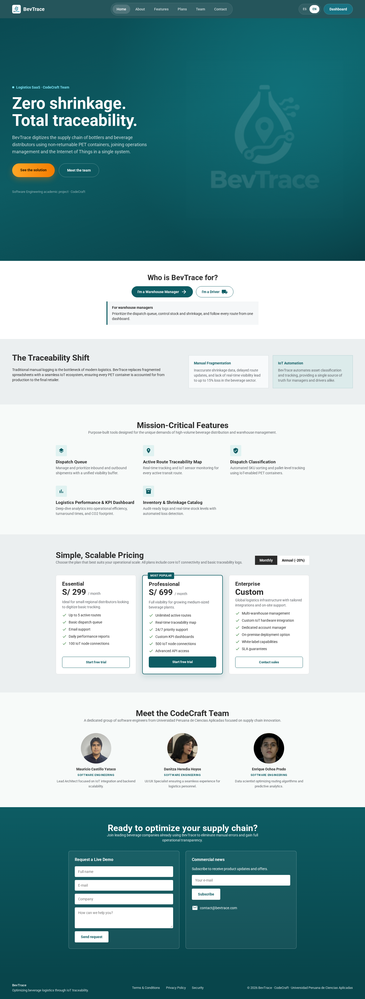

## 4.3. Landing Page UI Design.

### 4.3.1. Landing Page Wireframe.

En esta sección se presenta el wireframe de la Landing Page de BevTrace, donde se define la estructura de cada sección: hero de propuesta de valor, segmentos objetivo, beneficios de trazabilidad, características principales, planes de suscripción, equipo y formulario de contacto.

  

<i>Wireframe de la Landing Page — versión estructural en escala de grises (Desktop 1440 px)</i>

### 4.3.2. Landing Page Mock-up.

Los mock-ups aplican el sistema visual definitivo de BevTrace sobre la estructura validada en el wireframe: tipografía Roboto, paleta verde institucional y tarjetas limpias para cada sección.

  

<i>Mock-up de la Landing Page — Desktop 1440 px</i>

