## 4.4. Web Applications UX/UI Design.

### 4.4.1. Web Applications Wireframes.

### 4.4.2. Web Applications Wireflow Diagrams.

Los wireflows se organizan **por objetivo de usuario (user goal)**: cada diagrama conecta en escala de grises las pantallas de un objetivo mediante flechas de navegación etiquetadas con los disparadores de cada transición, siguiendo las rutas reales implementadas en el frontend Angular. Las pantallas corresponden a los wireframes del producto.

  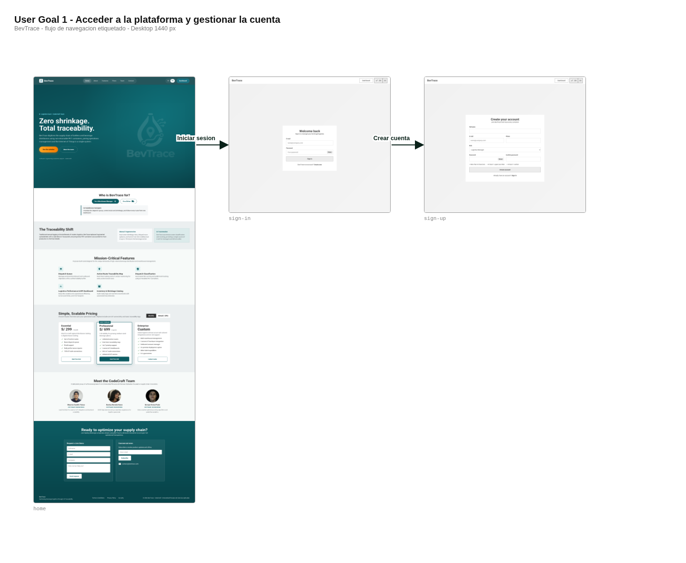

<i>Wireflow User Goal 1 — Acceder a la plataforma y gestionar la cuenta</i>

  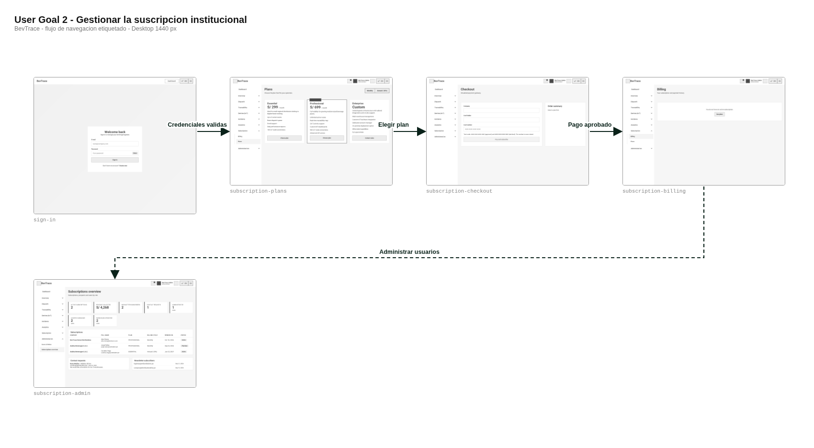

<i>Wireflow User Goal 2 — Gestionar la suscripción institucional</i>

  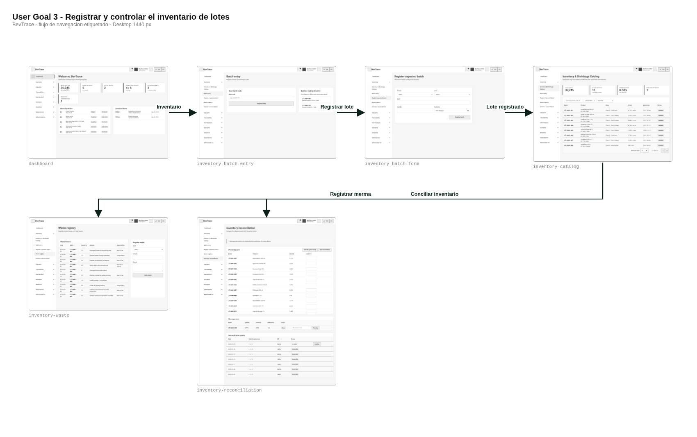

<i>Wireflow User Goal 3 — Registrar y controlar el inventario de lotes</i>

  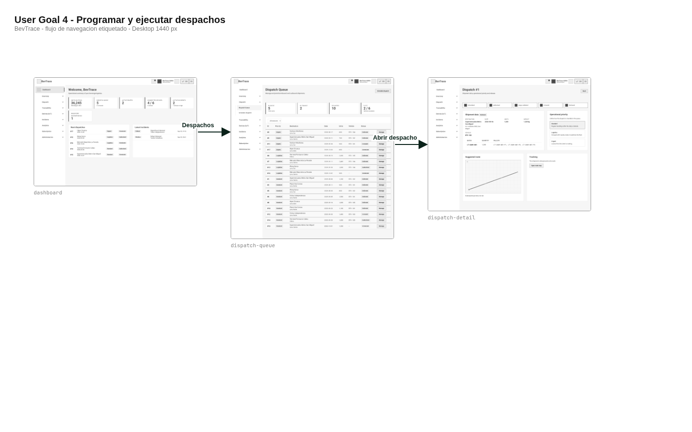

<i>Wireflow User Goal 4 — Programar y ejecutar despachos</i>

  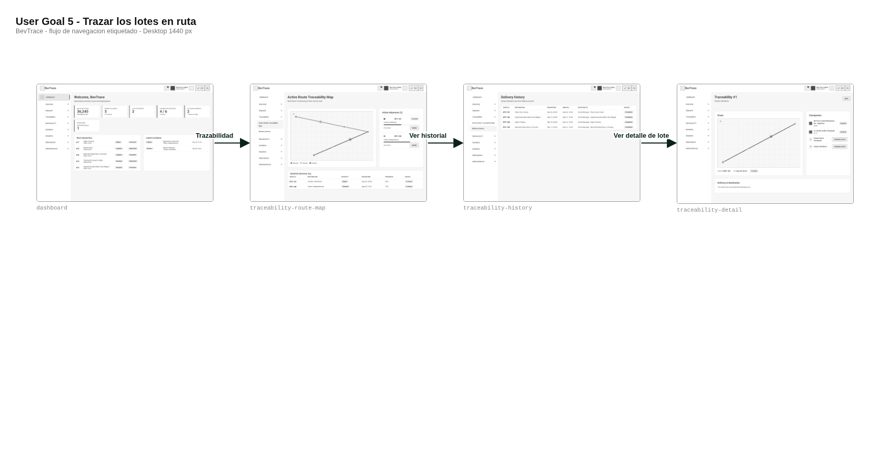

<i>Wireflow User Goal 5 — Trazar los lotes en ruta</i>

  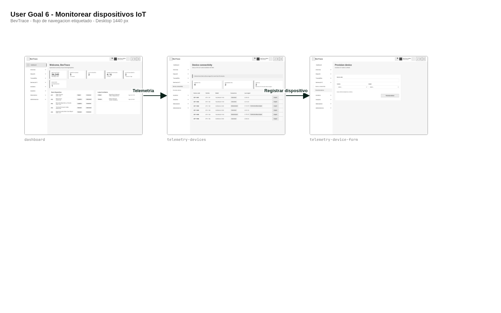

<i>Wireflow User Goal 6 — Monitorear dispositivos IoT</i>

  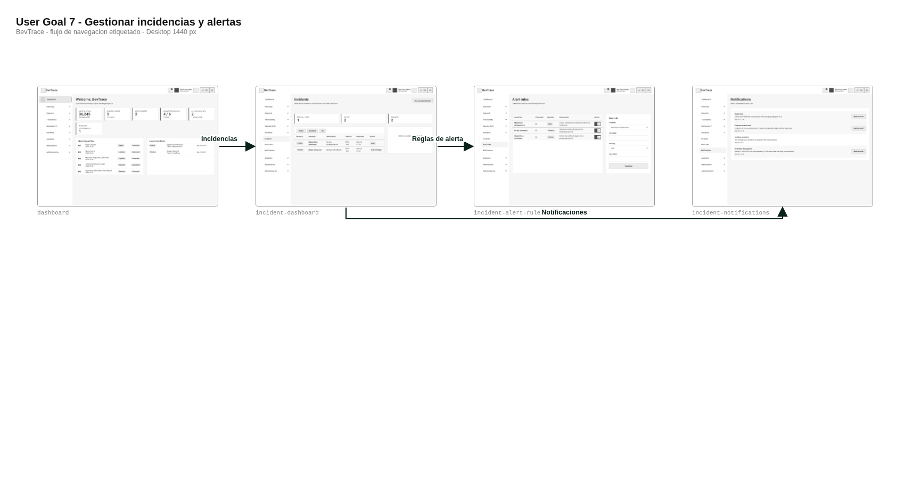

<i>Wireflow User Goal 7 — Gestionar incidencias y alertas</i>

  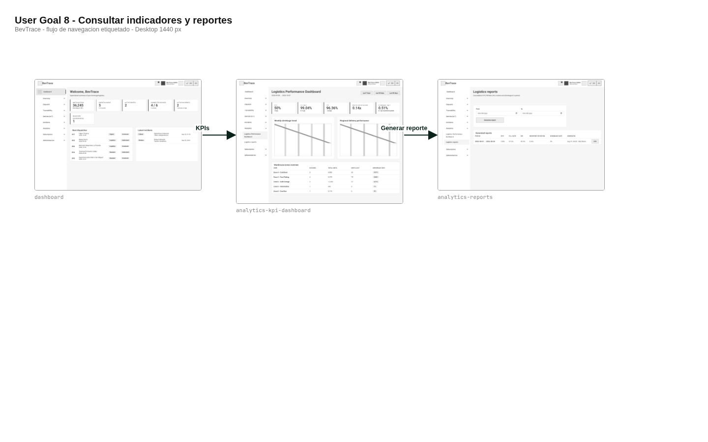

<i>Wireflow User Goal 8 — Consultar indicadores y reportes</i>

### 4.4.3. Web Applications Mock-ups.

### 4.4.4. Web Applications User Flow Diagrams.

Cada objetivo de usuario se documenta con su **user flow en mock-ups de alta fidelidad**, incluyendo el happy path y los flujos alternativos, sobre las rutas reales del frontend:

  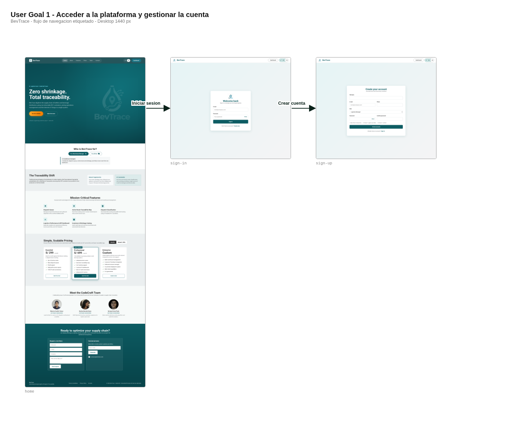

<i>User Flow User Goal 1 — Acceder a la plataforma y gestionar la cuenta</i>

  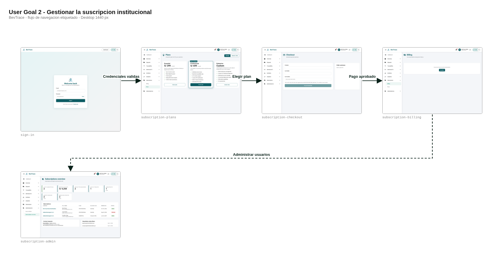

<i>User Flow User Goal 2 — Gestionar la suscripción institucional</i>

  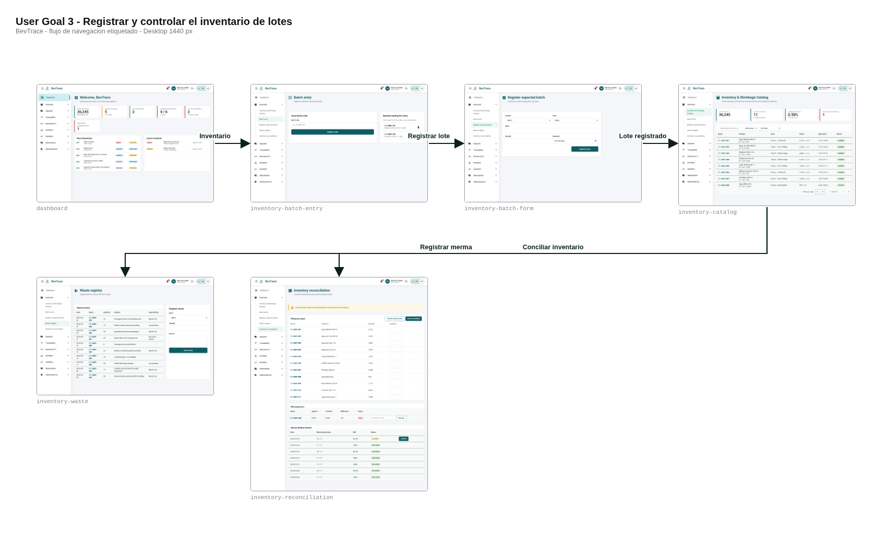

<i>User Flow User Goal 3 — Registrar y controlar el inventario de lotes</i>

  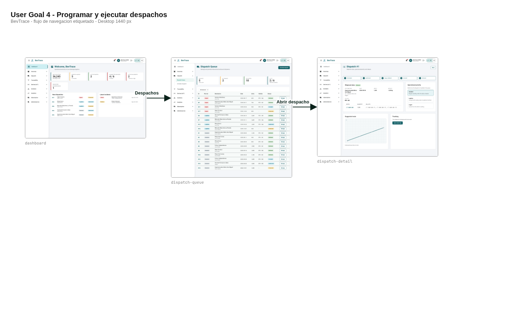

<i>User Flow User Goal 4 — Programar y ejecutar despachos</i>

  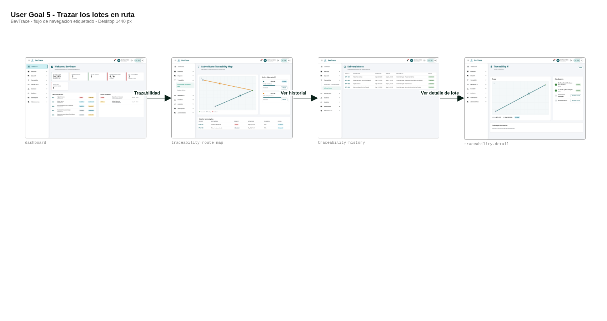

<i>User Flow User Goal 5 — Trazar los lotes en ruta</i>

  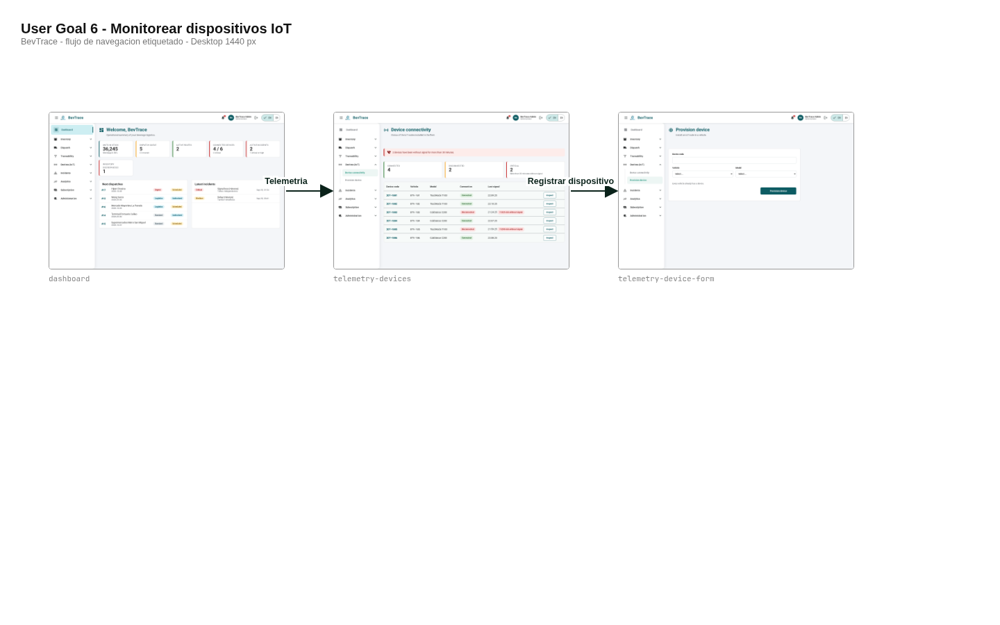

<i>User Flow User Goal 6 — Monitorear dispositivos IoT</i>

  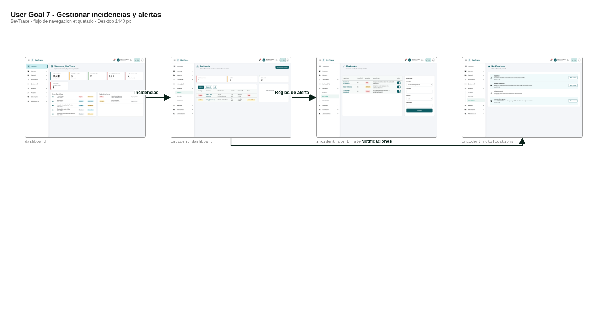

<i>User Flow User Goal 7 — Gestionar incidencias y alertas</i>

  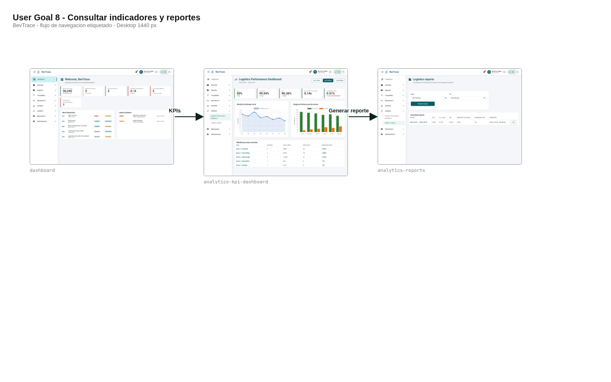

<i>User Flow User Goal 8 — Consultar indicadores y reportes</i>

