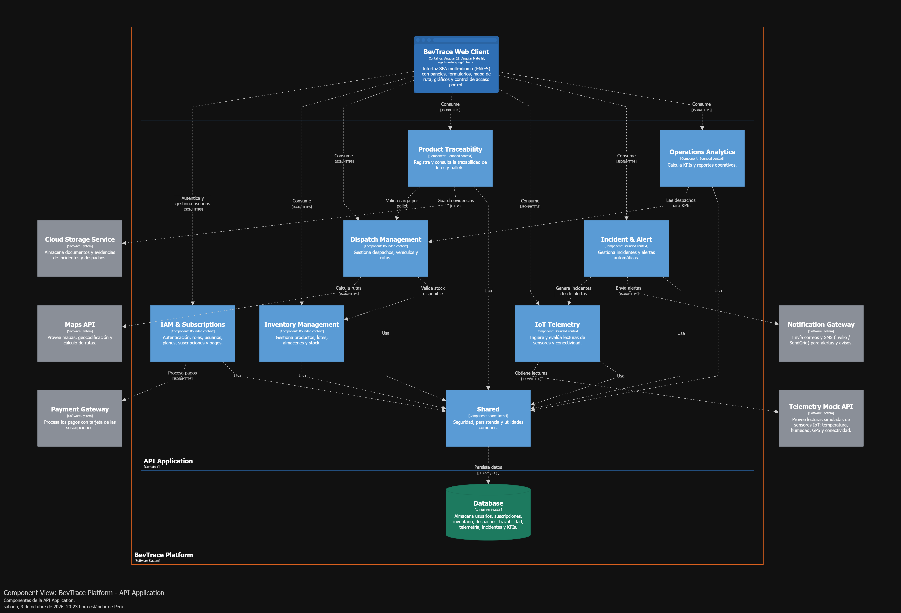
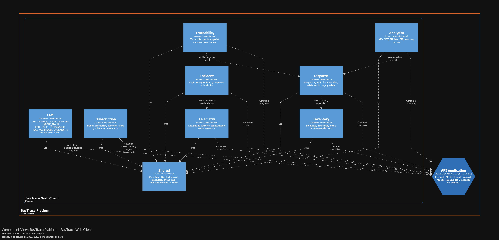

## 4.6.4. Software Architecture Components Diagrams

En el nivel de componentes se detalla la descomposición interna de los contenedores, mostrando los bloques estructurales que conforman cada uno y las relaciones entre ellos. Dado que la **Database** se aborda en su respectivo diseño, en esta sección se pone especial énfasis en el contenedor **API Application** (C# / .NET Core), donde reside la mayor parte de la lógica de negocio y las reglas logísticas, y en la organización por bounded contexts de la **SPA**.

El component diagram de la **SPA** refleja sus nueve bounded contexts: **IAM**, **Subscription**, **Inventory**, **Dispatch**, **Traceability**, **Telemetry**, **Incident**, **Analytics** y **Shared**. Todos los contextos utilizan el **Shared** (BaseApiEndpoint, BaseStore, layout, internacionalización y notificaciones). Además, el contexto Dispatch consulta a Inventory para validar stock y capacidad, Traceability valida la carga por pallet con Dispatch, Incident genera incidentes a partir de las alertas de Telemetry y Analytics lee los despachos para calcular los KPIs. Cada contexto consume su componente homólogo en la API Application.

El component diagram de la **API Application** agrupa la arquitectura interna siguiendo los bounded contexts definidos en el dominio de BevTrace. Cada módulo backend representa un componente principal dentro del contenedor:

- **IAM & Subscriptions Component:** gestiona la autenticación, los roles (administrador, Logistics Manager y Warehouse Operator), los usuarios, los planes de suscripción y los pagos. Se integra con el **Payment Gateway** para procesar los pagos con tarjeta.

- **Inventory Management Component:** se encarga de gestionar la entrada de lotes de bebidas, el registro de mermas (waste), la reconciliación física y la actualización del stock disponible. Interactúa estrechamente con la base de datos para garantizar la consistencia del inventario en el almacén.

- **Dispatch Management Component:** orquesta la programación de salidas. Gestiona la creación de la orden de despacho, la asignación de carga y vehículos con validación de capacidad y la autorización final de salida. Consulta al Inventory Management Component para validar el stock disponible y se integra con la **Maps API** para calcular rutas y validar las direcciones de destino.

- **Product Traceability Component:** registra el avance de la ruta una vez que el vehículo abandona el almacén. Gestiona el registro de puntos de control (checkpoints), la validación de la carga por pallet con el Dispatch Management Component y el cambio de estado hasta la confirmación de entrega. Se integra con el **Cloud Storage Service** para guardar las evidencias y el Proof of Delivery (PoD).

- **IoT Telemetry Component:** obtiene las lecturas de la **Telemetry Mock API** (ubicación, temperatura, humedad y conectividad), las almacena y las traduce a eventos de dominio internos. Identifica además las unidades con conectividad crítica.

- **Incident & Alert Component:** constituye el motor de control de excepciones. Evalúa los datos del IoT Telemetry Component para detectar anomalías operativas (desvíos de ruta, retrasos o variaciones fuera de umbral) y registra y da seguimiento a los incidentes. Al detectar una incidencia crítica, se integra con el **Notification Gateway** para despachar alertas automáticas a los responsables.

- **Operations Analytics Component:** consolida la información de inventarios, despachos e incidencias para calcular métricas de rendimiento (OTIF, Fill Rate, ERI, rotación y mermas). Lee los despachos del Dispatch Management Component y genera los reportes logísticos gerenciales.

- **Shared Component:** provee la seguridad, la persistencia, los value objects comunes, las clases base, los eventos de dominio y los mecanismos de infraestructura transversales utilizados por todos los módulos backend, favoreciendo la reutilización de código en .NET.

En el diagrama se refleja cómo:

- Cada contexto de la **SPA** consume los servicios expuestos por su componente homólogo en la **API Application**, utilizando endpoints REST específicos por contexto.
- El **IoT Telemetry Component** y el **Incident & Alert Component** trabajan en conjunto: el primero obtiene la data de telemetría y publica el evento correspondiente; el segundo lo evalúa y, si detecta una anomalía, dispara la notificación externa.
- Las integraciones externas se delegan a sus respectivos contextos (IAM & Subscriptions procesa pagos con el Payment Gateway, Dispatch calcula rutas con Maps API, Incident envía notificaciones, IoT Telemetry consulta la Telemetry Mock API y Traceability guarda archivos en la nube).
- Todos los módulos backend reutilizan las capacidades del **Shared Component**, que persiste el estado de los Aggregates en la **Database** compartida.

De esta forma, los component diagrams muestran cómo los contenedores se descomponen en componentes coherentes con los bounded contexts del dominio logístico y cómo estos colaboran entre sí para orquestar la distribución de BevTrace.

