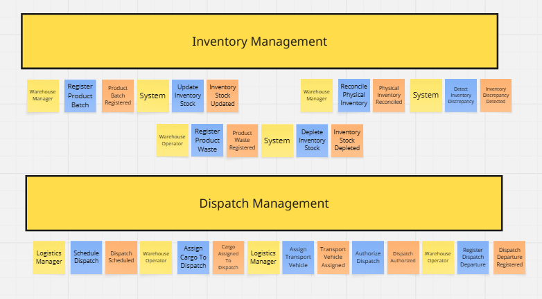
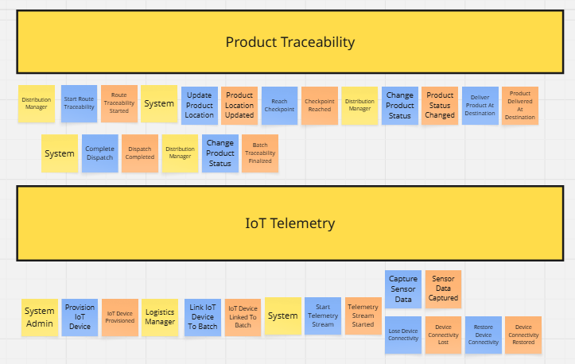
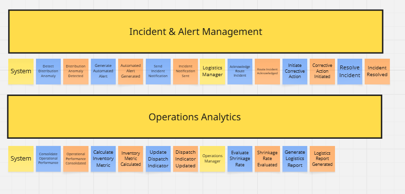

## 4.6. Domain-Driven Software Architecture.

### 4.6.1. Design-Level Event Storming.

Para identificar los eventos de dominio, es recomendable realizar una sesión de Event Storming. Esta técnica permite visualizar y comprender el flujo de eventos dentro del dominio, facilitando la identificación de los *Bounded Contexts*.
El desarrollo del proceso del Domain-Driven Design se realizó en la aplicación Miro: [https://sl1nk.com/17uavc5]

### Paso 1: Timelines

Posteriormente, organizamos los eventos en líneas de tiempo para visualizar el flujo de interacciones y secuencias entre eventos de negocio. Se identificaron los siguientes 6 flujos principales (Bounded Contexts):

* **Inventory Management Flow:** cubre las necesidades de los responsables de almacén para registrar, consultar y mantener un control preciso de los productos, reduciendo las discrepancias.
* **Dispatch Management Flow:** enfocado en las necesidades operativas de los responsables de logística para registrar, asignar y supervisar los envíos salientes desde los almacenes hacia los centros de distribución.
* **Product Traceability Flow:** dedicado a los responsables de distribución para conocer el estado y la ruta exacta de los productos desde el almacén hasta su destino final.
* **IoT Telemetry Flow:** maneja la integración tecnológica que permite recopilar información operativa en tiempo real sobre los productos durante su distribución.
* **Incident & Alert Management Flow:** módulo automatizado que permite la identificación oportuna de eventos anómalos o inconsistencias que puedan afectar el inventario o causar retrasos en el transporte.
* **Operations Analytics Flow:** dirigido a los responsables de operaciones para visualizar información consolidada sobre inventarios, despachos y trazabilidad para la toma de decisiones logísticas.

Esta organización temporal facilitó la comprensión de dependencias y secuencias críticas entre la operación logística humana y la automatización del sistema.

#### Paso 2: Commands

En este paso definimos los comandos que los diferentes actores pueden ejecutar en el sistema. Los comandos representan las intenciones o acciones (en verbo imperativo) que mutan el estado de la aplicación y desencadenan los eventos en el dominio logístico.

| Actor | Comandos |
|-------|----------|
| **Logistics Manager** | Schedule Dispatch, Assign Transport Vehicle, Authorize Dispatch, Link IoT Device To Batch, Acknowledge Route Incident, Initiate Corrective Action, Resolve Incident. |
| **Warehouse Manager** | Register Product Batch, Reconcile Physical Inventory, Detect Inventory Discrepancy. |
| **Warehouse Operator** | Update Inventory Stock, Register Product Waste, Assign Cargo To Dispatch, Register Dispatch Departure. |
| **Distribution Manager** | Start Route Traceability, Change Product Status, Deliver Product At Destination, Finalize Batch Traceability. |
| **Operations Manager** | Evaluate Shrinkage Rate, Generate Logistics Report. |
| **System Admin** | Provision IoT Device. |
| **System / Analytics Engine** | Deplete Inventory Stock, Start Telemetry Stream, Capture Sensor Data, Update Product Location, Reach Checkpoint, Lose Device Connectivity, Restore Device Connectivity, Detect Distribution Anomaly, Generate Automated Alert, Send Incident Notification, Complete Dispatch, Consolidate Operational Performance, Calculate Inventory Metric, Update Dispatch Indicator. |

#### Paso 3: Policies and Actors

En este paso identificamos las políticas de negocio (reglas WHEN/THEN) y los actores responsables de cada flujo. Las políticas representan las reglas automáticas que el sistema ejecuta en respuesta a ciertos eventos, garantizando el estricto control de inventarios y la visibilidad de la distribución sin depender de la intervención humana constante.

Las políticas identificadas fueron:

* **WHEN** physical inventory is reconciled and discrepancies are found **THEN** auto-detect inventory discrepancy and flag for review.
* **WHEN** product waste is registered **THEN** auto-deplete inventory stock and evaluate shrinkage rate.
* **WHEN** dispatch departure is registered **THEN** auto-start route traceability and initialize telemetry stream.
* **WHEN** checkpoint is reached via telemetry **THEN** auto-update product location.
* **WHEN** telemetry stream loses device connectivity **THEN** generate automated alert for the logistics manager.
* **WHEN** sensor data captures an unexpected delay or route deviation **THEN** detect distribution anomaly.
* **WHEN** distribution anomaly is detected **THEN** generate automated alert and send incident notification to the distribution team.
* **WHEN** route incident is resolved **THEN** update dispatch indicator and consolidate operational performance.
* **WHEN** product is delivered at destination **THEN** auto-complete dispatch and finalize batch traceability.
* **WHEN** logistics report is generated **THEN** auto-calculate and update global shrinkage and performance metrics.

Estas políticas permiten automatizar procesos críticos del sistema, reduciendo drásticamente el error humano y asegurando respuestas oportunas ante incidencias en ruta o discrepancias de stock que podrían generar pérdidas económicas o retrasos en la entrega de bebidas.

Una vez identificados los eventos, flujos, comandos y políticas del dominio, se procedió al descubrimiento de contextos candidatos. Esta etapa permitió agrupar elementos relacionados según su cohesión funcional y sus reglas de negocio compartidas, delimitando áreas específicas como el control de inventarios, la gestión de despachos, la trazabilidad de rutas, el monitoreo por telemetría y el manejo de incidencias logísticas. De esta manera, el equipo logró estructurar el dominio de BevTrace en contextos con responsabilidades claramente diferenciadas y alineadas a los módulos de la arquitectura del software.

#### Paso 4: Read Models

Los Read Models representan las vistas de consulta críticas que los actores utilizan para tomar decisiones dentro del sistema. Para mantener el enfoque en el Core Domain, el modelado destaca las 4 vistas principales (post-its verdes) que cruzan mayor cantidad de información operativa:

* **Inventory & Shrinkage Catalog:** utilizado por el Warehouse Manager y los operadores para verificar el stock de bebidas disponible en tiempo real, los lotes registrados y las mermas (waste) detectadas.
* **Dispatch & Fleet Assignment Board:** panel operativo utilizado por el Logistics Manager para consultar los envíos programados, asignar carga a los vehículos y autorizar las salidas desde el centro de distribución.
* **Active Route Traceability Map:** vista esencial utilizada por el Distribution Manager para monitorear la ubicación en tiempo real de los despachos, validar los puntos de control (checkpoints) alcanzados y gestionar alertas de incidencias.
* **Logistics Performance & KPI Dashboard:** panel gerencial utilizado por el Operations Manager para visualizar el rendimiento de las entregas, evaluar la tasa global de mermas (shrinkage rate) y analizar el impacto de las anomalías en la distribución.

#### Paso 5: External Systems

En este paso identificamos los sistemas externos que interactúan con el dominio, pero que están fuera del control directo del sistema (representados con post-its rosados). Dado el enfoque actual del producto, el rastreo se apoya en servicios simulados en lugar de hardware físico.

* **Maps API (Geocoding / Routing):** sistema externo utilizado únicamente para validar las direcciones de los destinos y trazar las rutas estáticas planificadas, sin requerir rastreo satelital en tiempo real.
* **Fleet Tracking API:** servicio externo que provee el flujo de datos de ubicación, puntos de control alcanzados y estado de conectividad de los vehículos en ruta.
* **Notification Gateway:** plataforma de mensajería externa utilizada en el contexto de gestión de incidencias para despachar alertas automáticas a los responsables logísticos.
* **Cloud Storage Service:** servicio de almacenamiento en la nube utilizado para resguardar de forma segura los comprobantes de entrega (Proof of Delivery) y los reportes logísticos generados.

#### Paso 6: Add Aggregates

En este paso identificamos los Aggregates, que representan los objetos de dominio centrales que agrupan entidades relacionadas y se tratan como una sola unidad de consistencia. Cada aggregate (post-it amarillo grande) actúa como el punto central alrededor del cual giran los eventos y comandos operativos de la cadena de suministro:

* **Product Batch & Inventory Ledger:** gestiona el registro de lotes de bebidas, la disponibilidad de stock, el registro de mermas y el cuadre físico.
* **Dispatch Order & Cargo Assignment:** controla la programación de salidas, autorizaciones y la asignación de productos a los vehículos de transporte.
* **Traceability Log & Delivery Record:** controla la trazabilidad de la ruta, el registro de puntos de control alcanzados y la confirmación de entrega en destino.
* **Telemetry Stream & Device Link:** centraliza la captura de datos (simulados) de ubicación y gestiona el estado de conexión de la flota.
* **Incident Record & Alert Engine:** gestiona la detección de anomalías, la emisión de notificaciones automáticas y el flujo de acciones correctivas.
* **Logistics Report & Performance KPI:** encapsula el cálculo de tasas de mermas operativas y la generación de documentos de auditoría logística.
  

#### Paso 7: Bounded Contexts

Finalmente, definimos los Bounded Contexts que agrupan los flujos relacionados en contextos delimitados con responsabilidades claras. Tras la abstracción de la arquitectura, se definieron un total de 6 contextos independientes:

| Bounded Context | Descripción de Componentes Clave |
|-----------------|----------------------------------|
| **BC: Inventory Management** | Contiene el Aggregate `Product Batch & Inventory Ledger` para controlar integralmente el estado del almacén. |
| **BC: Dispatch Management** | Agrupa el Aggregate `Dispatch Order & Cargo Assignment` para orquestar la preparación y salida de los vehículos. |
| **BC: Product Traceability** | Contiene el Aggregate `Traceability Log & Delivery Record` para el seguimiento continuo de la carga hasta su destino. |
| **BC: IoT Telemetry** | Gestiona el Aggregate `Telemetry Stream & Device Link` para procesar los datos de ruta simulados. |
| **BC: Incident & Alert Management** | Agrupa el Aggregate `Incident Record & Alert Engine` para el manejo centralizado de excepciones y alertas. |
| **BC: Operations Analytics** | Contiene el Aggregate `Logistics Report & Performance KPI` para la evaluación de mermas y toma de decisiones gerenciales. |

## 4.6.2. Software Architecture Context Diagram

En este nivel se presenta una vista de alto nivel de la arquitectura, donde el foco está en el sistema de software BevTrace como una "caja negra" y en las interacciones que mantiene con sus usuarios y con otros sistemas externos.

El context diagram muestra a la **BevTrace Platform** como un recuadro en el centro, rodeado por los principales actores y sistemas con los que se comunica:

- **Visitante:** prospecto que conoce BevTrace desde la landing page, revisa los planes de suscripción y solicita contacto con el equipo comercial.

- **Logistics Manager:** usuario interno responsable de programar los despachos, asignar la flota de transporte, autorizar las salidas desde los centros de distribución, gestionar incidencias en ruta y evaluar métricas operativas gerenciales.

- **Warehouse Operator:** usuario operativo encargado de controlar el stock físico, registrar la entrada y salida de lotes de bebidas, reportar mermas (waste), validar y escanear los pallets y asignar la carga física a los vehículos antes del despacho.

- **Administrador:** usuario que gestiona las cuentas de usuario, los roles de acceso y las suscripciones de la plataforma.

- **Telemetry Mock API:** simulador externo que provee lecturas de ubicación, temperatura, humedad y estado de conectividad de la flota, además de los puntos de control (checkpoints) alcanzados. Reemplaza temporalmente a los dispositivos GPS/IoT físicos y se comunica con BevTrace mediante endpoints REST.

- **Maps API:** sistema externo (como Google Maps o Mapbox) utilizado para la geocodificación de las direcciones de los destinos y el trazado de las rutas planificadas para los despachos.

- **Notification Gateway:** plataforma externa de mensajería (ej. Twilio o SendGrid) utilizada para enviar notificaciones transaccionales y alertas automáticas a los responsables logísticos cuando se detectan anomalías o retrasos en la distribución.

- **Cloud Storage Service:** servicio en la nube utilizado para almacenar de forma segura y permanente los comprobantes de entrega (Proof of Delivery), las evidencias de incidentes y los reportes logísticos generados para el área gerencial.

- **Payment Gateway:** pasarela de pagos externa que procesa los pagos con tarjeta de las suscripciones de la plataforma.

En el diagrama se representan las relaciones entre estos elementos. El Visitante accede a la landing page y, cuando decide registrarse, es dirigido a la aplicación web. El Logistics Manager, el Warehouse Operator y el Administrador interactúan con BevTrace a través de la interfaz web. BevTrace se encarga de orquestar las integraciones con los servicios externos: obtención de telemetría, validación de rutas, notificaciones por mensajería, almacenamiento de documentos y procesamiento de pagos. Esta vista permite entender el alcance del sistema, los límites de responsabilidad y el ecosistema logístico en el que se inserta BevTrace antes de entrar a detalles de implementación.

---

## 4.6.3. Software Architecture Container Diagrams

En el nivel de contenedores, la atención se desplaza desde "quién usa el sistema" hacia "cómo se organiza internamente el sistema en aplicaciones y fuentes de datos". El container diagram muestra los elementos de alto nivel de la arquitectura de BevTrace, sus responsabilidades principales y la forma en que se comunican entre sí y con los sistemas externos.

La arquitectura lógica de BevTrace se estructura en los siguientes contenedores:

- **Landing Page:** aplicación web estática desplegada en Vercel que presenta la propuesta de valor de BevTrace, los planes de suscripción y un formulario de contacto. Está desarrollada con tecnologías web estándar (HTML, CSS y JavaScript). Envía las solicitudes de contacto a la API Application y, cuando el usuario desea acceder a la aplicación, lo redirige al servidor web.

- **Web Application:** servidor web implementado con **Nginx** que actúa como servidor de archivos estáticos. Recibe al usuario redirigido desde la Landing Page y entrega el bundle compilado de la SPA Angular al navegador. Este contenedor separa la responsabilidad de servir el contenido estático de la lógica de negocio del backend.

- **BevTrace Web Client Application (SPA):** aplicación web principal implementada en **Angular 21** que corre directamente en el navegador del usuario. Una vez entregado el bundle por el Web Application, el Logistics Manager, el Warehouse Operator y el Administrador interactúan con esta SPA, que está disponible en inglés y español (ngx-translate) y controla el acceso según el rol del usuario. Se organiza en nueve contextos: IAM, Subscription, Inventory, Dispatch, Traceability, Telemetry, Incident, Analytics y Shared, e incorpora Angular Material para la interfaz y ng2-charts para los gráficos de KPIs.

- **API Application:** backend implementado con **C# y .NET Core**, que expone una API REST y encapsula la lógica de negocio, la seguridad, las reglas de validación logística y la orquestación de trazabilidad. Este contenedor agrupa los componentes backend por contexto (IAM & Subscriptions, Inventory Management, Dispatch Management, Product Traceability, IoT Telemetry, Incident & Alert, Operations Analytics y Shared).

- **Database:** base de datos relacional **MySQL**, donde se persiste la información estructurada del sistema: usuarios y suscripciones, catálogos de productos, disponibilidad de stock, órdenes de despacho, asignación de carga, logs de trazabilidad en ruta, telemetría, registro de incidencias y métricas operativas.

En el diagrama se observa que:

- El **Visitante** accede a la **Landing Page**, que envía las solicitudes de contacto a la **API Application** y redirige al **Web Application (Nginx)** para el inicio de sesión y el registro. Los demás usuarios acceden directamente al **Web Application**, que sirve el bundle compilado al navegador como la **SPA Angular**.
- La **SPA** se comunica con la **API Application** mediante peticiones **HTTP/HTTPS** con mensajes **JSON**, siguiendo un estilo REST bajo el prefijo `/api/v1`.
- La **API Application** persiste y consulta datos en la **Database** mediante **Entity Framework Core** y mapeo objeto–relacional.
- La **API Application** interactúa con los sistemas externos: la **Telemetry Mock API** para obtener lecturas de sensores, el **Maps API** para obtener rutas y validar direcciones, el **Notification Gateway** para el envío de alertas críticas, el **Cloud Storage Service** para el resguardo de comprobantes y evidencias, y el **Payment Gateway** para procesar los pagos de suscripción.

Esta vista permite apreciar cómo se distribuyen las responsabilidades entre la capa de presentación (Landing Page, Web Application y SPA), la capa de lógica de negocio (API Application) y la capa de persistencia (Database).

---

## 4.6.4. Software Architecture Components Diagrams

En el nivel de componentes se detalla la descomposición interna de los contenedores, mostrando los bloques estructurales que conforman cada uno y las relaciones entre ellos. Dado que la **Database** se aborda en su respectivo diseño, en esta sección se pone especial énfasis en el contenedor **API Application** (C# / .NET Core), donde reside la mayor parte de la lógica de negocio y las reglas logísticas, y en la organización por bounded contexts de la **SPA**.

El component diagram de la **SPA** refleja sus nueve bounded contexts: **IAM**, **Subscription**, **Inventory**, **Dispatch**, **Traceability**, **Telemetry**, **Incident**, **Analytics** y **Shared**. Todos los contextos utilizan el **Shared** (BaseApiEndpoint, BaseStore, layout, internacionalización y notificaciones). Además, el contexto Dispatch consulta a Inventory para validar stock y capacidad, Traceability valida la carga por pallet con Dispatch, Incident genera incidentes a partir de las alertas de Telemetry y Analytics lee los despachos para calcular los KPIs. Cada contexto consume su componente homólogo en la API Application.

El component diagram de la **API Application** agrupa la arquitectura interna siguiendo los bounded contexts definidos en el dominio de BevTrace. Cada módulo backend representa un componente principal dentro del contenedor:

- **IAM & Subscriptions Component:** gestiona la autenticación, los roles (administrador, Logistics Manager y Warehouse Operator), los usuarios, los planes de suscripción y los pagos. Se integra con el **Payment Gateway** para procesar los pagos con tarjeta.

- **Inventory Management Component:** se encarga de gestionar la entrada de lotes de bebidas, el registro de mermas (waste), la reconciliación física y la actualización del stock disponible. Interactúa estrechamente con la base de datos para garantizar la consistencia del inventario en el almacén.

- **Dispatch Management Component:** orquesta la programación de salidas. Gestiona la creación de la orden de despacho, la asignación de carga y vehículos con validación de capacidad y la autorización final de salida. Consulta al Inventory Management Component para validar el stock disponible y se integra con la **Maps API** para calcular rutas y validar las direcciones de destino.

- **Product Traceability Component:** registra el avance de la ruta una vez que el vehículo abandona el almacén. Gestiona el registro de puntos de control (checkpoints), la validación de la carga por pallet con el Dispatch Management Component y el cambio de estado hasta la confirmación de entrega. Se integra con el **Cloud Storage Service** para guardar las evidencias y el Proof of Delivery (PoD).

- **IoT Telemetry Component:** obtiene las lecturas de la **Telemetry Mock API** (ubicación, temperatura, humedad y conectividad), las almacena y las traduce a eventos de dominio internos. Identifica además las unidades con conectividad crítica.

- **Incident & Alert Component:** constituye el motor de control de excepciones. Evalúa los datos del IoT Telemetry Component para detectar anomalías operativas (desvíos de ruta, retrasos o variaciones fuera de umbral) y registra y da seguimiento a los incidentes. Al detectar una incidencia crítica, se integra con el **Notification Gateway** para despachar alertas automáticas a los responsables.

- **Operations Analytics Component:** consolida la información de inventarios, despachos e incidencias para calcular métricas de rendimiento (OTIF, Fill Rate, ERI, rotación y mermas). Lee los despachos del Dispatch Management Component y genera los reportes logísticos gerenciales.

- **Shared Component:** provee la seguridad, la persistencia, los value objects comunes, las clases base, los eventos de dominio y los mecanismos de infraestructura transversales utilizados por todos los módulos backend, favoreciendo la reutilización de código en .NET.

En el diagrama se refleja cómo:

- Cada contexto de la **SPA** consume los servicios expuestos por su componente homólogo en la **API Application**, utilizando endpoints REST específicos por contexto.
- El **IoT Telemetry Component** y el **Incident & Alert Component** trabajan en conjunto: el primero obtiene la data de telemetría y publica el evento correspondiente; el segundo lo evalúa y, si detecta una anomalía, dispara la notificación externa.
- Las integraciones externas se delegan a sus respectivos contextos (IAM & Subscriptions procesa pagos con el Payment Gateway, Dispatch calcula rutas con Maps API, Incident envía notificaciones, IoT Telemetry consulta la Telemetry Mock API y Traceability guarda archivos en la nube).
- Todos los módulos backend reutilizan las capacidades del **Shared Component**, que persiste el estado de los Aggregates en la **Database** compartida.

De esta forma, los component diagrams muestran cómo los contenedores se descomponen en componentes coherentes con los bounded contexts del dominio logístico y cómo estos colaboran entre sí para orquestar la distribución de BevTrace.

