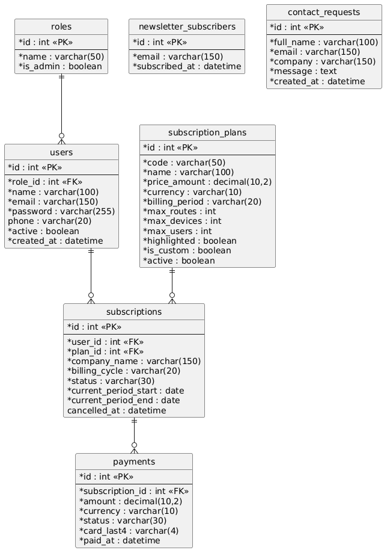
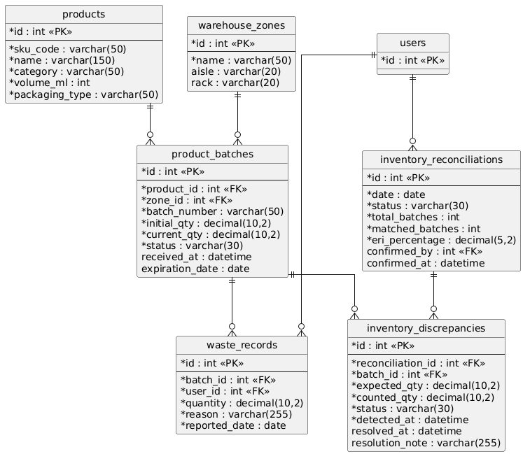
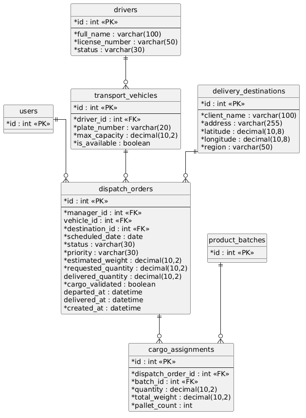
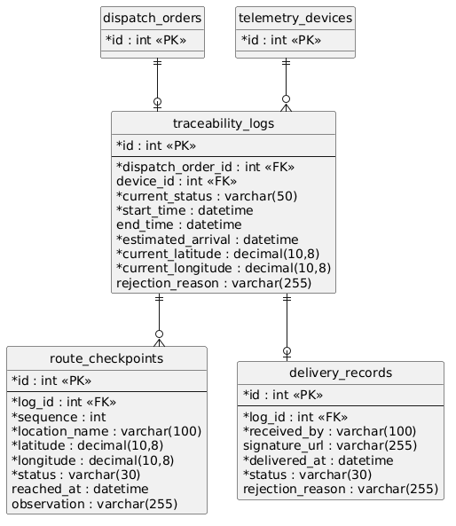
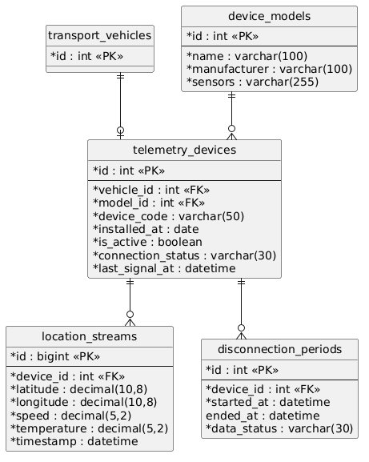
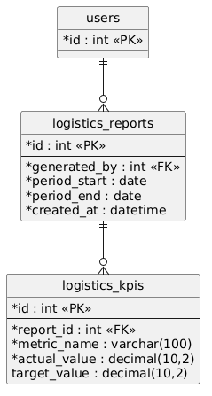

## 4.8 Database Design

### 4.8.1 Database Diagram

El siguiente diagrama general representa la arquitectura de base de datos relacional completa para la plataforma BevTrace. Este esquema unifica todos los Bounded Contexts logísticos, junto con la gestión de identidad y suscripciones, ilustrando las relaciones principales mediante el uso de llaves foráneas (Foreign Keys). El diseño emplea restricciones de integridad referencial entre las tablas de cada contexto y evita la redundancia de datos separando las entidades maestras (productos, zonas, vehículos, conductores, destinos y modelos de dispositivo) de las tablas transaccionales que las referencian. Los estados de negocio (por ejemplo, el estado de un lote, de un despacho o de un incidente) se almacenan como columnas controladas por la capa de dominio.

#### Bounded Context: IAM & Subscriptions

Este esquema detalla el contexto de identidad, acceso y contratación de la plataforma. La tabla `roles` define los perfiles de autorización (administrador, Logistics Manager y Warehouse Operator) y se relaciona con `users`, que almacena el nombre, correo, contraseña, teléfono, estado de la cuenta y fecha de creación de cada persona registrada. La contratación se modela con `subscription_plans`, que describe cada plan por su código, precio, moneda, periodo de facturación y límites de rutas, dispositivos y usuarios. Cada cliente se vincula a un plan mediante la tabla `subscriptions`, que registra la empresa, el ciclo de facturación, el estado y el periodo vigente. Los cobros asociados se guardan en `payments`, conservando únicamente los últimos cuatro dígitos de la tarjeta, el monto y el resultado del pago. Finalmente, `newsletter_subscribers` y `contact_requests` almacenan los correos suscritos al boletín y las solicitudes comerciales enviadas desde la landing page.

#### Bounded Context: Inventory Management

Este esquema detalla el contexto de gestión de inventario, estructurado para ofrecer un control granular del almacén. La tabla maestra `products` define los SKU, categoría, volumen y tipo de empaque de cada bebida. El control físico recae sobre la tabla `product_batches`, la cual registra cada lote ingresado, su número, cantidad inicial y actual, estado y fecha de expiración, y se vincula tanto a `products` como a `warehouse_zones` (para ubicar el lote en pasillos o estantes del almacén). La tabla `waste_records` permite auditar cualquier pérdida o merma asociada a un lote específico, registrando el usuario que la reportó, la cantidad afectada, el motivo y la fecha. Para garantizar la consistencia del stock, `inventory_reconciliations` registra cada conciliación física con su porcentaje de exactitud (ERI) y el usuario que la confirmó, mientras que `inventory_discrepancies` guarda las diferencias detectadas entre la cantidad esperada y la contada de cada lote, junto con su estado y nota de resolución.

#### Bounded Context: Dispatch Management

Este esquema representa la lógica de orquestación de salidas. El núcleo es la tabla `dispatch_orders`, que consolida el plan de despacho asociando un gerente responsable (`users`), la fecha programada, el estado, la prioridad, el peso estimado y las cantidades solicitada y entregada, además de la marca de validación de la carga y los instantes de salida y entrega. Para garantizar la entrega, la orden se relaciona con `delivery_destinations`, que almacena la dirección, las coordenadas y la región del cliente receptor. En cuanto a los recursos móviles, el sistema relaciona la orden con `transport_vehicles`, tabla que especifica la placa, la capacidad máxima y la disponibilidad del camión. Estos vehículos son operados por los conductores definidos en la tabla `drivers`, que registra su nombre, número de licencia y estado. Por último, la tabla `cargo_assignments` actúa como el detalle de la orden, vinculando los lotes específicos del inventario con la orden de despacho correspondiente, especificando la cantidad, el peso exacto y el número de paletas cargadas.

#### Bounded Context: Product Traceability

Este esquema modela la trazabilidad en ruta de los despachos. La tabla central `traceability_logs` mantiene un registro vivo del viaje, referenciando a la orden de despacho y al dispositivo de telemetría del vehículo, e indicando el estado actual, los instantes de inicio y fin, el tiempo estimado de llegada, la posición actual y el motivo de rechazo cuando corresponde. Durante el recorrido, el sistema almacena los hitos geográficos en la tabla `route_checkpoints`, que registra el orden, el lugar, las coordenadas, el estado (pendiente, alcanzado u omitido), la hora de llegada y las observaciones. Una vez concluido el viaje, se genera un registro en `delivery_records`, que documenta quién recibió la carga, el enlace a la firma, el momento de la entrega, el resultado (entregado o rechazado) y el motivo del rechazo.

#### Bounded Context: IoT Telemetry

Este esquema encapsula la ingesta de datos provenientes de los simuladores de telemetría. La tabla `telemetry_devices` vincula a un vehículo con su identificador de hardware específico, su fecha de instalación y su estado de actividad, basándose en la especificación técnica almacenada en el catálogo `device_models` (nombre, fabricante y sensores). El estado de conectividad y la hora de la última señal se mantienen en la propia tabla de dispositivos, lo que permite identificar las unidades en estado crítico tras más de 30 minutos sin señal. La ingesta se realiza en la tabla `location_streams`, optimizada para altos volúmenes de registros, donde se guardan las coordenadas (latitud y longitud), la velocidad, la temperatura y el instante de cada lectura. Finalmente, `disconnection_periods` registra cada intervalo en que un dispositivo estuvo sin conexión, indicando su inicio, su fin y si los datos de ese periodo están disponibles.

#### Bounded Context: Incident & Alert Management

Este esquema representa el motor lógico de manejo de excepciones en ruta. La base del sistema recae en la tabla `alert_rules`, que define las condiciones (temperatura máxima, minutos de retraso o minutos de pérdida de señal), los umbrales de tolerancia operativos y la severidad asignada a cada regla. Cuando se rompe una regla durante la ruta, se genera una entrada en la tabla `incident_records`, detallando el tipo de anomalía, la severidad, el log de trazabilidad afectado, el estado (abierto, reconocido o resuelto), los instantes de detección, reconocimiento y resolución, el usuario que lo reconoció y el número de veces que fue reabierto. Paralelamente, los usuarios pueden registrar las acciones de mitigación tomadas a través de la tabla `corrective_actions`, indicando la descripción de la solución, el usuario que la aplicó y el momento de aplicación. Los avisos dirigidos al personal quedan almacenados en la tabla `notifications`, con su rol destinatario, categoría, mensaje y estado de lectura.

#### Bounded Context: Operations Analytics

Este esquema representa la estructura de almacenamiento orientada al análisis gerencial. La generación de informes se centraliza en la tabla `logistics_reports`, que registra el usuario que lo generó, el periodo evaluado y la fecha de creación. Cada reporte consolida sus indicadores en la tabla `logistics_kpis`, donde se guarda el nombre de la métrica (OTIF, Fill Rate, ERI, rotación de inventario o merma), su valor actual y, de existir, la meta definida. Los valores de estos indicadores se calculan a partir de la información de los contextos de inventario, despacho e incidentes, por lo que este contexto solo conserva el resultado de cada cálculo para su consulta histórica y su exportación.

