## 5.2. Landing Page, Services & Applications Implementation.

### 5.2.2. Sprint 2

Durante el Sprint 2, el equipo CodeCraft se enfocó en el desarrollo de la primera versión de la <strong>FrontEnd Web Application</strong> de BevTrace, construida como una SPA en <strong>Angular 21</strong> con Angular Material. Este sprint permitió transformar la propuesta de valor presentada en la Landing Page en una experiencia interna navegable para los usuarios de la distribución de bebidas: el <em>Warehouse Operator</em>, el <em>Logistics Manager</em> y el <em>Administrador</em>.

El desarrollo abarcó los nueve contextos de la SPA definidos en el Capítulo IV: <strong>Shared</strong>, <strong>IAM</strong>, <strong>Subscription</strong>, <strong>Inventory</strong>, <strong>Dispatch</strong>, <strong>Traceability</strong>, <strong>Telemetry</strong>, <strong>Incident</strong> y <strong>Analytics</strong>. Cada contexto se organizó con las capas <code>domain</code>, <code>application</code>, <code>infrastructure</code> y <code>presentation</code>, siguiendo el enfoque DDD. La aplicación cuenta con soporte bilingüe ES/EN mediante <code>ngx-translate</code> y aplica la guía de estilos del Capítulo IV (Roboto, paleta Azul Petróleo/Azul Cian y espaciado base de 8px).

Para este entregable, los datos se obtienen de una <strong>Mock API</strong> construida con <code>json-server</code> y desplegada en <strong>Railway</strong>, que expone los recursos de todos los contextos bajo el prefijo <code>/api/v1</code>. La Frontend Web Application se encuentra desplegada en <strong>Vercel</strong>. El desarrollo de los Web Services reales se abordará en sprints posteriores.

<strong>Repositorio Frontend:</strong> <a href="https://github.com/Codecraft-16692/BevTrace-FrontEnd" target="_blank">https://github.com/Codecraft-16692/BevTrace-FrontEnd</a>

<strong>Repositorio Mock API (carpeta <code>server</code>):</strong> <a href="https://github.com/Codecraft-16692/BevTrace-BackEnd" target="_blank">https://github.com/Codecraft-16692/BevTrace-BackEnd</a>

<strong>Frontend Web Application desplegada (Vercel):</strong> <a href="https://bev-trace-front-end.vercel.app" target="_blank">https://bev-trace-front-end.vercel.app</a>

<strong>Mock API desplegada (Railway):</strong> <a href="https://bevtrace-backend-production.up.railway.app/api/v1" target="_blank">https://bevtrace-backend-production.up.railway.app/api/v1</a>

#### 5.2.2.1. Sprint Planning 2

<table border="1" cellpadding="4" cellspacing="0">
  <thead>
    <tr><th colspan="2" style="text-align:center;">Sprint Planning Sprint 2</th></tr>
  </thead>
  <tbody>
    <tr><td colspan="2" style="text-align:center;"><strong>Sprint Planning Background</strong></td></tr>
    <tr><td>Date</td><td>30/09/2026</td></tr>
    <tr><td>Time</td><td>4:00 p.m.</td></tr>
    <tr><td>Location</td><td>WhatsApp, Microsoft Teams y Class (UPC)</td></tr>
    <tr><td>Prepared By</td><td>Castillo Yataco, Mauricio Sebastian</td></tr>
    <tr>
      <td>Attendees (to planning meeting)</td>
      <td>
        Castillo Yataco, Mauricio Sebastian 
        Heredia Hoyos, Danitza Ivonne 
        Ochoa Prado, Enrique Augusto
      </td>
    </tr>
    <tr><td colspan="2" style="text-align:center;"><strong>Sprint 1 Review Summary</strong></td></tr>
    <tr>
      <td colspan="2" align="justify">
        Se completó el desarrollo de la Landing Page de BevTrace, que presenta la propuesta de valor y los beneficios de la plataforma por segmento (US19) y el formulario de suscripción a información comercial (US20). Durante la revisión se confirmó que la página comunica con claridad el valor del producto a los visitantes externos y los redirige hacia la aplicación web.
      </td>
    </tr>
    <tr><td colspan="2" style="text-align:center;"><strong>Sprint 1 Retrospective Summary</strong></td></tr>
    <tr>
      <td colspan="2" align="justify">
        El equipo identificó que el trabajo del Sprint 1 se concentró en pocas ramas y pocos integrantes. Además, el retiro del curso de uno de los integrantes redujo el equipo a tres personas, por lo que se acordó redistribuir las responsabilidades por bounded context para el Sprint 2. Como acciones de mejora se acordó aplicar GitFlow con una rama <code>feature/*</code> por contexto, usar Conventional Commits en todos los aportes e integrar los cambios mediante Pull Requests hacia <code>develop</code>.
      </td>
    </tr>
    <tr><td colspan="2" style="text-align:center;"><strong>Sprint Goal &amp; User Stories</strong></td></tr>
    <tr>
      <td colspan="2" align="justify">
        <strong>Sprint 2 Goal (Outcome–Impact–Customer–Confirmation):</strong>  
        <em>Our focus is on allowing warehouse operators and logistics managers to explore the main BevTrace operational workflows through the first navigable Angular web application.</em>  
        <em>We believe it delivers a clearer understanding of how Warehouse Operators and Logistics Managers would manage inventory, dispatches, route traceability, device telemetry, incidents and logistics indicators in their daily work, by letting them simulate the complete distribution flow from a unified interface.</em>  
        <em>This will be confirmed when a user can sign in or sign up, review the subscription plans, register batches and waste, reconcile the inventory, schedule and validate a dispatch, follow a batch in transit, check the connectivity of devices, review incidents and corrective actions, consult the logistics KPIs, switch between English and Spanish, and use the deployed version connected to the Mock API.</em>
      </td>
    </tr>
    <tr><td>Sprint 2 Velocity</td><td>64 Story Points</td></tr>
    <tr>
      <td>Sum of Story Points</td>
      <td>64 SP (Inventory: 13 · Dispatch: 13 · Traceability: 16 · Telemetry: 5 · Incident: 9 · Analytics: 8)</td>
    </tr>
  </tbody>
</table>

#### 5.2.2.2. Aspect Leaders and Collaborators

En esta sección se presenta la matriz <strong>Leadership-and-Collaboration (LACX)</strong> del Sprint 2. Su propósito es identificar los aspectos principales del sprint y asignar responsabilidades de liderazgo (<strong>L</strong>) y colaboración (<strong>C</strong>) para fortalecer la coordinación y trazabilidad del trabajo dentro del equipo CodeCraft. Los aspectos se derivan del Sprint 2 Goal:

<ul>
  <li><strong>Shared, Inventory, Dispatch &amp; Analytics:</strong> layout, internacionalización y clases base; gestión de lotes, mermas, discrepancias y conciliación; programación y validación de despachos; reporte de indicadores logísticos.</li>
  <li><strong>IAM, Subscription &amp; Incident:</strong> autenticación y roles; planes y suscripción; detección, resolución y acciones correctivas de incidencias.</li>
  <li><strong>Traceability, Telemetry &amp; Mock API:</strong> seguimiento de lotes en tránsito, checkpoints, conectividad de dispositivos y servidor de datos de prueba (carpeta <code>server</code>).</li>
</ul>

<table border="1" cellpadding="4" cellspacing="0" align="center">
  <thead>
    <tr>
      <th>Team Member (Last Name, First Name)</th>
      <th>GitHub Username</th>
      <th>Shared, Inventory, Dispatch &amp; Analytics</th>
      <th>IAM, Subscription &amp; Incident</th>
      <th>Traceability, Telemetry &amp; Mock API</th>
    </tr>
  </thead>
  <tbody>
    <tr><td>Castillo Yataco, Mauricio Sebastian</td><td>M4uricioCastillo</td><td>L</td><td>C</td><td>C</td></tr>
    <tr><td>Heredia Hoyos, Danitza Ivonne</td><td>UDnTzh</td><td>C</td><td>L</td><td>C</td></tr>
    <tr><td>Ochoa Prado, Enrique Augusto</td><td>EnriqueO-18</td><td>C</td><td>C</td><td>L</td></tr>
  </tbody>
</table>

<ul>
  <li><strong>L</strong> = Líder del aspecto</li>
  <li><strong>C</strong> = Colaborador en el aspecto</li>
</ul>

#### 5.2.2.3. Sprint Backlog 2

El Sprint Backlog 2 reúne las historias de usuario y tareas necesarias para implementar la primera versión de la Frontend Web Application de BevTrace, organizadas por bounded context. Las historias de usuario provienen del Product Backlog del Capítulo III y las tareas son monitoreadas mediante <strong>Jira</strong>.

  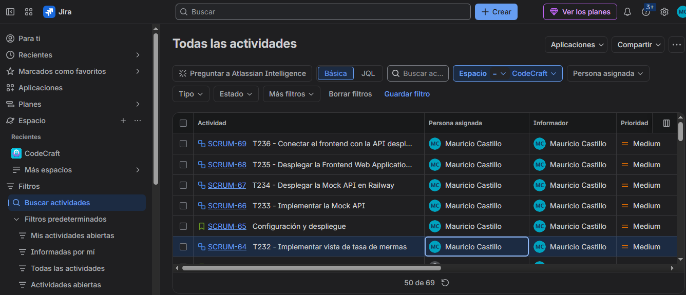
  
<em>Figura: Tablero del Sprint 2 en Jira (Proyecto BevTrace)</em>

<table border="1" cellpadding="4" cellspacing="0">
  <thead>
    <tr><th colspan="8" style="text-align:center;">Sprint # 2</th></tr>
    <tr><th colspan="2">User Story</th><th colspan="6">Work-Item / Task</th></tr>
    <tr>
      <th>Id</th><th>Title</th><th>Id</th><th>Title</th><th>Description</th>
      <th>Estimation (Hours)</th><th>Assigned To</th><th>Status</th>
    </tr>
  </thead>
  <tbody>
    <tr>
      <td rowspan="3">—</td><td rowspan="3">Componentes base y layout principal (Shared)</td>
      <td>T201</td><td>Implementar layout, toolbar, sidebar y footer</td>
      <td>Desarrollar el layout principal con toolbar, sidebar, dashboard principal, vista 404, componentes de banner y chips de estado, y el mapa de ruta, aplicando la paleta (Azul Petróleo / Azul Cian) y la tipografía Roboto de la guía de estilos.</td>
      <td>4h</td><td>Castillo, Mauricio</td><td>Done</td>
    </tr>
    <tr>
      <td>T202</td><td>Implementar internacionalización ES/EN</td>
      <td>Configurar <code>ngx-translate</code>, archivos de traducción y selector de idioma para todas las vistas.</td>
      <td>3h</td><td>Castillo, Mauricio</td><td>Done</td>
    </tr>
    <tr>
      <td>T203</td><td>Implementar clases base de consumo de API</td>
      <td>Crear <code>BaseApiEndpoint</code> y <code>BaseStore</code> (signals) con manejo centralizado de errores y notificaciones.</td>
      <td>3h</td><td>Castillo, Mauricio</td><td>Done</td>
    </tr>
    <tr>
      <td rowspan="3">—</td><td rowspan="3">Identidad y acceso (IAM)</td>
      <td>T204</td><td>Implementar gestión de roles y validación de credenciales</td>
      <td>Crear entidades <code>User</code> y <code>Role</code> y las reglas de validación (correo con "@"; contraseña de más de 8 caracteres, con al menos una mayúscula y un número).</td>
      <td>3h</td><td>Heredia, Danitza</td><td>Done</td>
    </tr>
    <tr>
      <td>T205</td><td>Implementar vistas sign-in y sign-up</td>
      <td>Desarrollar los formularios de inicio de sesión y registro con validaciones y selección de rol.</td>
      <td>4h</td><td>Heredia, Danitza</td><td>Done</td>
    </tr>
    <tr>
      <td>T206</td><td>Implementar gestión de usuarios y sesión</td>
      <td>Desarrollar el store de autenticación, la gestión de usuarios, la sesión y el guard de rutas según rol.</td>
      <td>4h</td><td>Heredia, Danitza</td><td>Done</td>
    </tr>
    <tr>
      <td rowspan="2">—</td><td rowspan="2">Suscripciones y planes (Subscription)</td>
      <td>T207</td><td>Implementar entidades, API y store de Subscription</td>
      <td>Crear entidades <code>SubscriptionPlan</code>, <code>Subscription</code> y <code>Payment</code>, con endpoints, assemblers y store.</td>
      <td>4h</td><td>Heredia, Danitza</td><td>Done</td>
    </tr>
    <tr>
      <td>T208</td><td>Implementar vistas de planes y suscripción</td>
      <td>Desarrollar la gestión de planes y de la suscripción vigente, el checkout y pago con tarjeta (se conservan solo los últimos cuatro dígitos), la facturación, las solicitudes de contacto y la suscripción al boletín.</td>
      <td>4h</td><td>Heredia, Danitza</td><td>Done</td>
    </tr>
    <tr>
      <td rowspan="2">US01</td><td rowspan="2">Registro automático de ingreso de lote</td>
      <td>T209</td><td>Implementar entidades, API y store de Inventory</td>
      <td>Crear <code>ProductBatch</code>, <code>BeverageProduct</code> y <code>WarehouseZone</code>, con endpoints, assemblers y store basado en signals.</td>
      <td>4h</td><td>Castillo, Mauricio</td><td>Done</td>
    </tr>
    <tr>
      <td>T210</td><td>Implementar vista de ingreso de lote</td>
      <td>Desarrollar el registro de ingreso por código de lote, con rechazo y solicitud de verificación manual si el código no es válido.</td>
      <td>5h</td><td>Castillo, Mauricio</td><td>Done</td>
    </tr>
    <tr>
      <td rowspan="1">US02</td><td rowspan="1">Alerta de discrepancia de inventario</td>
      <td>T211</td><td>Implementar vista de discrepancias</td>
      <td>Desarrollar la lista de discrepancias entre cantidad esperada y contada, con estado y nota de resolución.</td>
      <td>3h</td><td>Castillo, Mauricio</td><td>Done</td>
    </tr>
    <tr>
      <td rowspan="1">US03</td><td rowspan="1">Registro de mermas de producto</td>
      <td>T212</td><td>Implementar formulario de mermas</td>
      <td>Desarrollar el registro de merma (lote, cantidad y motivo) y su listado.</td>
      <td>2h</td><td>Castillo, Mauricio</td><td>Done</td>
    </tr>
    <tr>
      <td rowspan="1">US04</td><td rowspan="1">Conciliación de inventario físico</td>
      <td>T213</td><td>Implementar vista de conciliación</td>
      <td>Desarrollar la confirmación de la conciliación y el porcentaje de exactitud (ERI).</td>
      <td>3h</td><td>Castillo, Mauricio</td><td>Done</td>
    </tr>
    <tr>
      <td rowspan="2">US05</td><td rowspan="2">Programación de un despacho</td>
      <td>T214</td><td>Implementar entidades, API y store de Dispatch</td>
      <td>Crear <code>DispatchOrder</code>, <code>CargoAssignment</code>, <code>TransportVehicle</code>, <code>Driver</code> y <code>DeliveryDestination</code>, con endpoints y store.</td>
      <td>4h</td><td>Castillo, Mauricio</td><td>Done</td>
    </tr>
    <tr>
      <td>T215</td><td>Implementar vista de programación de despacho</td>
      <td>Desarrollar el formulario para programar un despacho (lotes, destino, fecha y prioridad) y la lista de órdenes.</td>
      <td>4h</td><td>Castillo, Mauricio</td><td>Done</td>
    </tr>
    <tr>
      <td rowspan="1">US06</td><td rowspan="1">Asignación de vehículo a despacho</td>
      <td>T216</td><td>Implementar vista de asignación de vehículo</td>
      <td>Desarrollar la selección de vehículo y conductor con validación de capacidad y autorización de salida.</td>
      <td>3h</td><td>Castillo, Mauricio</td><td>Done</td>
    </tr>
    <tr>
      <td rowspan="1">US07</td><td rowspan="1">Validación masiva de pallets antes del despacho</td>
      <td>T217</td><td>Implementar vista de validación de pallets</td>
      <td>Desarrollar la validación de la carga contra la orden, indicando pallets conformes y faltantes.</td>
      <td>5h</td><td>Castillo, Mauricio</td><td>Done</td>
    </tr>
    <tr>
      <td rowspan="1">US08</td><td rowspan="1">Registro de salida de un despacho</td>
      <td>T218</td><td>Implementar registro de salida</td>
      <td>Desarrollar la acción de registrar la salida del transporte y actualizar el estado del despacho.</td>
      <td>2h</td><td>Castillo, Mauricio</td><td>Done</td>
    </tr>
    <tr>
      <td rowspan="2">US09</td><td rowspan="2">Seguimiento en tiempo real de un lote en tránsito</td>
      <td>T219</td><td>Implementar entidades, API y store de Traceability</td>
      <td>Crear <code>TraceabilityLog</code>, <code>RouteCheckpoint</code> y <code>DeliveryRecord</code>, con endpoints, assemblers y store.</td>
      <td>4h</td><td>Ochoa, Enrique</td><td>Done</td>
    </tr>
    <tr>
      <td>T220</td><td>Implementar vista de seguimiento en tránsito</td>
      <td>Desarrollar la vista con la ubicación actual, el estado y el avance del lote en ruta.</td>
      <td>8h</td><td>Ochoa, Enrique</td><td>Done</td>
    </tr>
    <tr>
      <td rowspan="1">US10</td><td rowspan="1">Registro de checkpoint en ruta</td>
      <td>T221</td><td>Implementar vista de checkpoints</td>
      <td>Desarrollar el registro de puntos de control con su orden, estado y hora de llegada.</td>
      <td>5h</td><td>Ochoa, Enrique</td><td>Done</td>
    </tr>
    <tr>
      <td rowspan="1">US11</td><td rowspan="1">Finalización de la trazabilidad de un lote</td>
      <td>T222</td><td>Implementar cierre de trazabilidad y registro de entrega</td>
      <td>Desarrollar la confirmación de entrega o rechazo con su registro (<code>DeliveryRecord</code>).</td>
      <td>3h</td><td>Ochoa, Enrique</td><td>Done</td>
    </tr>
    <tr>
      <td rowspan="2">US12</td><td rowspan="2">Visualización de estado de conectividad de dispositivos</td>
      <td>T223</td><td>Implementar entidades, API y store de Telemetry</td>
      <td>Crear <code>TelemetryDevice</code>, <code>LocationStream</code> y <code>ConnectionStatus</code>, con endpoints y store.</td>
      <td>3h</td><td>Ochoa, Enrique</td><td>Done</td>
    </tr>
    <tr>
      <td>T224</td><td>Implementar vista de conectividad de dispositivos</td>
      <td>Desarrollar la vista de estado de dispositivos, marcando como crítica la unidad con más de 30 minutos sin señal.</td>
      <td>3h</td><td>Ochoa, Enrique</td><td>Done</td>
    </tr>
    <tr>
      <td rowspan="1">US13</td><td rowspan="1">Notificación de reconexión de dispositivo</td>
      <td>T225</td><td>Implementar notificación de reconexión</td>
      <td>Desarrollar el aviso al usuario cuando un dispositivo recupera la conexión.</td>
      <td>2h</td><td>Ochoa, Enrique</td><td>Done</td>
    </tr>
    <tr>
      <td rowspan="2">US14</td><td rowspan="2">Detección de anomalía en la distribución</td>
      <td>T226</td><td>Implementar entidades, API y store de Incident</td>
      <td>Crear <code>IncidentRecord</code>, <code>AlertRule</code> y <code>AutomatedAlert</code>, con endpoints, assemblers y store.</td>
      <td>4h</td><td>Heredia, Danitza</td><td>Done</td>
    </tr>
    <tr>
      <td>T227</td><td>Implementar vista de incidencias</td>
      <td>Desarrollar la gestión de incidencias detectadas (tipo, severidad y estado) y de las reglas de alerta que las generan.</td>
      <td>5h</td><td>Heredia, Danitza</td><td>Done</td>
    </tr>
    <tr>
      <td rowspan="1">US15</td><td rowspan="1">Notificación de resolución de incidencia</td>
      <td>T228</td><td>Implementar notificación de resolución</td>
      <td>Desarrollar el centro de notificaciones, que avisa al usuario cuando una incidencia es resuelta.</td>
      <td>2h</td><td>Heredia, Danitza</td><td>Done</td>
    </tr>
    <tr>
      <td rowspan="1">US16</td><td rowspan="1">Registro de acción correctiva</td>
      <td>T229</td><td>Implementar formulario de acción correctiva</td>
      <td>Desarrollar el registro de la acción tomada sobre una incidencia.</td>
      <td>2h</td><td>Heredia, Danitza</td><td>Done</td>
    </tr>
    <tr>
      <td rowspan="2">US17</td><td rowspan="2">Reporte consolidado de indicadores logísticos</td>
      <td>T230</td><td>Implementar entidades, API y store de Analytics</td>
      <td>Crear <code>LogisticsReport</code> y <code>LogisticsKPI</code>, con endpoints y store.</td>
      <td>4h</td><td>Castillo, Mauricio</td><td>Done</td>
    </tr>
    <tr>
      <td>T231</td><td>Implementar vista de reporte de indicadores</td>
      <td>Desarrollar el dashboard de indicadores (OTIF, Fill Rate, ERI y rotación) con gráficos mediante <code>ng2-charts</code>.</td>
      <td>5h</td><td>Castillo, Mauricio</td><td>Done</td>
    </tr>
    <tr>
      <td rowspan="1">US18</td><td rowspan="1">Cálculo automático de la tasa de mermas</td>
      <td>T232</td><td>Implementar vista de tasa de mermas</td>
      <td>Desarrollar la visualización de la tasa de mermas calculada a partir de los registros de merma.</td>
      <td>3h</td><td>Castillo, Mauricio</td><td>Done</td>
    </tr>
    <tr>
      <td rowspan="4">—</td><td rowspan="4">Configuración y despliegue</td>
      <td>T233</td><td>Implementar la Mock API</td>
      <td>Crear el servidor <code>json-server</code> con el script <code>seed.mjs</code> que genera los datos de prueba de todos los contextos.</td>
      <td>4h</td><td>Ochoa, Enrique</td><td>Done</td>
    </tr>
    <tr>
      <td>T234</td><td>Desplegar la Mock API en Railway</td>
      <td>Publicar la carpeta <code>server</code> en Railway y exponer la API bajo <code>/api/v1</code>.</td>
      <td>2h</td><td>Ochoa, Enrique</td><td>Done</td>
    </tr>
    <tr>
      <td>T235</td><td>Desplegar la Frontend Web Application en Vercel</td>
      <td>Conectar el repositorio a Vercel, generar el build de producción de Angular y publicarlo.</td>
      <td>2h</td><td>Castillo, Mauricio</td><td>Done</td>
    </tr>
    <tr>
      <td>T236</td><td>Conectar el frontend con la API desplegada</td>
      <td>Actualizar la URL base de consumo para apuntar a la Mock API en Railway.</td>
      <td>1h</td><td>Castillo, Mauricio</td><td>Done</td>
    </tr>
  </tbody>
</table>

#### 5.2.2.4. Development Evidence for Sprint Review

En esta sección se presentan los avances de implementación del Sprint 2 en la Frontend Web Application de BevTrace. Se construyó la primera versión de la SPA Angular con los nueve contextos del dominio, aplicando la arquitectura por capas del Capítulo IV, soporte bilingüe y consumo de la Mock API. El repositorio registra <strong>109 commits</strong>, <strong>18 Pull Requests</strong> y las versiones <code>0.1.0</code> a <code>1.0.0</code> entre el 01 y el 07 de octubre de 2026. La tabla resume los commits más relevantes, indicando rama, identificador, mensaje (según Conventional Commits), descripción y fecha.

<table border="1" cellpadding="4" cellspacing="0">
  <thead>
    <tr>
      <th>Repository</th><th>Branch</th><th>Commit Id</th><th>Commit Message</th><th>Commit Message Body</th><th>Committed on (Date)</th>
    </tr>
  </thead>
  <tbody>
    <tr>
      <td rowspan="83"><a href="https://github.com/Codecraft-16692/BevTrace-FrontEnd">BevTrace-FrontEnd</a></td>
      <td>main</td><td>9773615</td><td>chore(core): initialize base project configuration and angular shell.</td><td>Inicializa el proyecto Angular 21 con la configuración base y el shell de la aplicación.</td><td>01-10-2026</td>
    </tr>
    <tr>
      <td>feature/shared</td><td>6b1337b</td><td>feat(shared): implement core domain models and entities</td><td>Implementa los modelos de dominio y entidades base compartidos por los contextos.</td><td>01-10-2026</td>
    </tr>
    <tr>
      <td>feature/shared</td><td>3530aa8</td><td>feat(shared): setup base api client and endpoints</td><td>Crea el cliente base de API y los endpoints genéricos para el consumo de la Mock API.</td><td>01-10-2026</td>
    </tr>
    <tr>
      <td>feature/shared</td><td>2da8f11</td><td>feat(shared): add base assembler for data mapping</td><td>Agrega el assembler base para transformar recursos de la API en entidades.</td><td>01-10-2026</td>
    </tr>
    <tr>
      <td>feature/shared</td><td>ac1601a</td><td>feat(shared): implement base state management store</td><td>Implementa el store base con signals para la gestión de estado.</td><td>01-10-2026</td>
    </tr>
    <tr>
      <td>feature/shared</td><td>8c584bb</td><td>feat(shared): develop toolbar component</td><td>Desarrolla la barra de navegación superior de la aplicación.</td><td>01-10-2026</td>
    </tr>
    <tr>
      <td>feature/shared</td><td>15e62d0</td><td>feat(shared): implement base layout component</td><td>Implementa el layout base con sidebar y área de contenido.</td><td>01-10-2026</td>
    </tr>
    <tr>
      <td>feature/shared</td><td>a8d0166</td><td>feat(shared): add language switcher component and translations</td><td>Agrega el selector de idioma ES/EN y las primeras traducciones.</td><td>01-10-2026</td>
    </tr>
    <tr>
      <td>feature/shared</td><td>4002c09</td><td>feat(shared): create message banner and status chip ui elements</td><td>Crea los componentes de banner de mensajes y chips de estado.</td><td>01-10-2026</td>
    </tr>
    <tr>
      <td>feature/shared</td><td>92a62a2</td><td>feat(shared):implement route canvas map component</td><td>Implementa el componente de mapa de ruta para visualizar recorridos.</td><td>01-10-2026</td>
    </tr>
    <tr>
      <td>feature/shared</td><td>98fab08</td><td>feat(shared): implement dashboard main view</td><td>Implementa la vista principal (dashboard) de la aplicación.</td><td>01-10-2026</td>
    </tr>
    <tr>
      <td>feature/shared</td><td>e66df8e</td><td>feat(shared): add 404 page not found view</td><td>Agrega la vista de página no encontrada.</td><td>01-10-2026</td>
    </tr>
    <tr>
      <td>feature/analytics</td><td>cdb39ba</td><td>feat(analytics): add logistics report entity and generation command.</td><td>Crea la entidad LogisticsReport y el comando de generación de reportes.</td><td>01-10-2026</td>
    </tr>
    <tr>
      <td>feature/analytics</td><td>3db9a62</td><td>feat(analytics): implement kpi metric models and calculation logic.</td><td>Implementa los modelos de indicadores (KPI) y su lógica de cálculo.</td><td>01-10-2026</td>
    </tr>
    <tr>
      <td>feature/analytics</td><td>ebf5d76</td><td>feat(analytics): develop kpi dashboard view layout and logic.</td><td>Desarrolla la vista del dashboard de indicadores logísticos.</td><td>01-10-2026</td>
    </tr>
    <tr>
      <td>feature/analytics</td><td>73c3903</td><td>feat(analytics): build logistics report generator interface.</td><td>Construye la interfaz del generador de reportes logísticos.</td><td>01-10-2026</td>
    </tr>
    <tr>
      <td>feature/dispatch</td><td>ca214da</td><td>feat(dispatch): add dispatch order domain models and commands</td><td>Crea los modelos de dominio y comandos de las órdenes de despacho.</td><td>02-10-2026</td>
    </tr>
    <tr>
      <td>feature/dispatch</td><td>df805e2</td><td>feat(dispatch): implement cargo assignment domain logic</td><td>Implementa la lógica de asignación de carga a un despacho.</td><td>02-10-2026</td>
    </tr>
    <tr>
      <td>feature/dispatch</td><td>7b749c1</td><td>feat(dispatch): add driver and transport vehicle entities</td><td>Agrega las entidades de conductor y vehículo de transporte.</td><td>02-10-2026</td>
    </tr>
    <tr>
      <td>feature/dispatch</td><td>1490e6e</td><td>feat(dispatch): configure endpoints and dtos for orders and cargo</td><td>Configura los endpoints y DTOs de órdenes y carga.</td><td>02-10-2026</td>
    </tr>
    <tr>
      <td>feature/dispatch</td><td>ab2461b</td><td>feat(dispatch): implement state management store for dispatch</td><td>Implementa el store de estado del contexto Dispatch.</td><td>02-10-2026</td>
    </tr>
    <tr>
      <td>feature/dispatch</td><td>4a710e7</td><td>feat(dispatch): build dispatch queue presentation view</td><td>Construye la vista de cola de despachos (programación, asignación y salida).</td><td>02-10-2026</td>
    </tr>
    <tr>
      <td>feature/dispatch</td><td>5f69574</td><td>feat(dispatch): develop dispatch detail view</td><td>Desarrolla la vista de detalle de un despacho (carga y validación de pallets).</td><td>02-10-2026</td>
    </tr>
    <tr>
      <td>feature/dispatch</td><td>e65cbee</td><td>feat(dispatch): configure routing for dispatch module</td><td>Configura las rutas del módulo Dispatch.</td><td>02-10-2026</td>
    </tr>
    <tr>
      <td>feature/inventory</td><td>2592350</td><td>feat(inventory): add product and batch domain models</td><td>Agrega los modelos de dominio de productos y lotes.</td><td>03-10-2026</td>
    </tr>
    <tr>
      <td>feature/inventory</td><td>2b31528</td><td>feat(inventory): define reconciliation and discrepancy logic</td><td>Define la lógica de conciliación y discrepancias de inventario.</td><td>03-10-2026</td>
    </tr>
    <tr>
      <td>feature/inventory</td><td>7db38f6</td><td>feat(inventory): configure dtos and endpoints for products and batches</td><td>Configura los DTOs y endpoints de productos y lotes.</td><td>03-10-2026</td>
    </tr>
    <tr>
      <td>feature/inventory</td><td>410ab29</td><td>feat(inventory): implement state management store</td><td>Implementa el store de estado del contexto Inventory.</td><td>03-10-2026</td>
    </tr>
    <tr>
      <td>feature/inventory</td><td>9b3279c</td><td>feat(inventory): build inventory catalog view</td><td>Construye la vista de catálogo de inventario.</td><td>03-10-2026</td>
    </tr>
    <tr>
      <td>feature/inventory</td><td>e07ac0e</td><td>feat(inventory): create batch entry and form views</td><td>Crea las vistas de ingreso de lote y su formulario (US01).</td><td>03-10-2026</td>
    </tr>
    <tr>
      <td>feature/inventory</td><td>6ff0372</td><td>feat(inventory): develop reconciliation management view</td><td>Desarrolla la vista de conciliación y discrepancias (US02, US04).</td><td>03-10-2026</td>
    </tr>
    <tr>
      <td>feature/inventory</td><td>6aac74c</td><td>feat(inventory): implement waste management interface</td><td>Implementa la interfaz de registro de mermas (US03).</td><td>03-10-2026</td>
    </tr>
    <tr>
      <td>feature/inventory</td><td>aa1a4de</td><td>feat(inventory): configure routing for inventory module</td><td>Configura las rutas del módulo Inventory.</td><td>03-10-2026</td>
    </tr>
    <tr>
      <td>feature/iam</td><td>a1e8645</td><td>feat(iam): implement role management</td><td>Implementa la gestión de roles (administrador, Logistics Manager y Warehouse Operator).</td><td>03-10-2026</td>
    </tr>
    <tr>
      <td>feature/iam</td><td>5ec7197</td><td>feat(iam): implement credentials validation</td><td>Implementa las reglas de validación de correo y contraseña.</td><td>03-10-2026</td>
    </tr>
    <tr>
      <td>feature/iam</td><td>5780c22</td><td>feat(iam): implement sign in</td><td>Implementa el formulario y el flujo de inicio de sesión.</td><td>03-10-2026</td>
    </tr>
    <tr>
      <td>feature/iam</td><td>9799f26</td><td>feat(iam): implement sign up</td><td>Implementa el formulario y el flujo de registro de usuarios.</td><td>03-10-2026</td>
    </tr>
    <tr>
      <td>feature/iam</td><td>fc13efb</td><td>feat(iam): implement user management</td><td>Implementa la gestión de usuarios del contexto IAM.</td><td>03-10-2026</td>
    </tr>
    <tr>
      <td>feature/iam</td><td>f8b9521</td><td>feat(iam): implement iam session management</td><td>Implementa el manejo de la sesión del usuario autenticado.</td><td>03-10-2026</td>
    </tr>
    <tr>
      <td>feature/iam</td><td>d9e1b6b</td><td>fix(main): Revise README with English content and setup instructions</td><td>Actualiza el README con contenido en inglés e instrucciones de instalación.</td><td>03-10-2026</td>
    </tr>
    <tr>
      <td>feature/subscription</td><td>76018ac</td><td>feat(subscription): implement subscription plan management</td><td>Implementa la gestión de planes de suscripción.</td><td>04-10-2026</td>
    </tr>
    <tr>
      <td>feature/subscription</td><td>a59fff1</td><td>feat(subscription): implement subscription management</td><td>Implementa la gestión de la suscripción vigente del cliente.</td><td>04-10-2026</td>
    </tr>
    <tr>
      <td>feature/subscription</td><td>d0a4f38</td><td>feat(subscription): implement checkout and payment</td><td>Implementa el checkout y el pago con tarjeta.</td><td>04-10-2026</td>
    </tr>
    <tr>
      <td>feature/subscription</td><td>f1da6f3</td><td>feat(subscription): implement billing view</td><td>Implementa la vista de facturación.</td><td>04-10-2026</td>
    </tr>
    <tr>
      <td>feature/subscription</td><td>0d47c49</td><td>feat(subscription): implement contact requests</td><td>Implementa las solicitudes de contacto comercial.</td><td>04-10-2026</td>
    </tr>
    <tr>
      <td>feature/subscription</td><td>db30022</td><td>feat(subscription): implement newsletter subscription</td><td>Implementa la suscripción al boletín informativo.</td><td>04-10-2026</td>
    </tr>
    <tr>
      <td>feature/subscription</td><td>e243e84</td><td>feat(subscription): implement subscription administration and card</td><td>Implementa la administración de suscripciones y la tarjeta de pago.</td><td>04-10-2026</td>
    </tr>
    <tr>
      <td>feature/incident</td><td>660a477</td><td>feat(incident): configure incident api</td><td>Configura los endpoints y servicios API del contexto Incident.</td><td>04-10-2026</td>
    </tr>
    <tr>
      <td>feature/incident</td><td>2abeb07</td><td>feat(incident): configure incident application</td><td>Configura la capa de aplicación (store, comandos y consultas) de Incident.</td><td>04-10-2026</td>
    </tr>
    <tr>
      <td>feature/incident</td><td>07957e8</td><td>feat(incident): implement incident record management</td><td>Implementa la gestión de incidencias (US14, US15).</td><td>04-10-2026</td>
    </tr>
    <tr>
      <td>feature/incident</td><td>6b49d4e</td><td>feat(incident): implement alert rule management</td><td>Implementa la gestión de reglas de alerta.</td><td>04-10-2026</td>
    </tr>
    <tr>
      <td>feature/incident</td><td>f6a936c</td><td>feat(incident): implement corrective action management</td><td>Implementa el registro de acciones correctivas (US16).</td><td>04-10-2026</td>
    </tr>
    <tr>
      <td>feature/incident</td><td>221fb71</td><td>feat(incident): implement notification center</td><td>Implementa el centro de notificaciones.</td><td>04-10-2026</td>
    </tr>
    <tr>
      <td>feature/traceability</td><td>5f5840c</td><td>feat(traceability): add traceability module</td><td>Agrega el módulo de trazabilidad: seguimiento, checkpoints y registro de entrega (US09, US10, US11).</td><td>04-10-2026</td>
    </tr>
    <tr>
      <td>feature/telemetry</td><td>39b79c5</td><td>feat(telemetry): add telemetry module</td><td>Agrega el módulo de telemetría: dispositivos, conectividad y reconexión (US12, US13).</td><td>04-10-2026</td>
    </tr>
    <tr>
      <td>feature/server</td><td>9db2391</td><td>feat(server): add mock api server</td><td>Agrega el servidor de la Mock API con los datos de prueba de todos los contextos.</td><td>04-10-2026</td>
    </tr>
    <tr>
      <td>feature/shared</td><td>3842e7b</td><td>feat(shared): add i18n translation files</td><td>Agrega los archivos de traducción ES/EN de la aplicación.</td><td>04-10-2026</td>
    </tr>
    <tr>
      <td>feature/analytics-v2</td><td>e1bdd02</td><td>feat(analytics): add logistics report domain entity</td><td>Rehace el contexto Analytics: agrega la entidad de dominio LogisticsReport.</td><td>04-10-2026</td>
    </tr>
    <tr>
      <td>feature/analytics-v2</td><td>6d7bdf4</td><td>feat(analytics): implement kpi metric models and calculation logic</td><td>Implementa los modelos de KPI y su lógica de cálculo.</td><td>04-10-2026</td>
    </tr>
    <tr>
      <td>feature/analytics-v2</td><td>c483a6c</td><td>feat(analytics): configure analytics api client and endpoints</td><td>Configura el cliente de API y los endpoints de Analytics.</td><td>04-10-2026</td>
    </tr>
    <tr>
      <td>feature/analytics-v2</td><td>0d49d66</td><td>feat(analytics): implement state management store for analytics</td><td>Implementa el store de estado de Analytics.</td><td>04-10-2026</td>
    </tr>
    <tr>
      <td>feature/analytics-v2</td><td>806d3db</td><td>feat(analytics): build kpi dashboard presentation view</td><td>Construye la vista del dashboard de indicadores (US17).</td><td>04-10-2026</td>
    </tr>
    <tr>
      <td>feature/analytics-v2</td><td>06ae523</td><td>feat(analytics): develop report generator view components</td><td>Desarrolla los componentes del generador de reportes y la tasa de mermas (US17, US18).</td><td>04-10-2026</td>
    </tr>
    <tr>
      <td>feature/analytics-v2</td><td>0dd05bd</td><td>feat(analytics): configure routing for analytics module</td><td>Configura las rutas del módulo Analytics.</td><td>04-10-2026</td>
    </tr>
    <tr>
      <td>develop</td><td>6d1478d</td><td>Merge pull request #1 from Codecraft-16692/feature/shared</td><td>Integra el contexto Shared a develop.</td><td>04-10-2026</td>
    </tr>
    <tr>
      <td>develop</td><td>de2b95c</td><td>Merge pull request #2 from Codecraft-16692/feature/server</td><td>Integra la Mock API a develop.</td><td>04-10-2026</td>
    </tr>
    <tr>
      <td>develop</td><td>d4dc832</td><td>chore: release 0.1.0</td><td>Publica la versión 0.1.0 (Shared y Mock API).</td><td>04-10-2026</td>
    </tr>
    <tr>
      <td>develop</td><td>96bb6f8</td><td>feat: integrate inventory module</td><td>Integra el módulo Inventory a develop.</td><td>04-10-2026</td>
    </tr>
    <tr>
      <td>develop</td><td>cb319b6</td><td>chore: release 0.2.0</td><td>Publica la versión 0.2.0 (incluye Inventory).</td><td>04-10-2026</td>
    </tr>
    <tr>
      <td>develop</td><td>a2eb0ab</td><td>feat: integrate dispatch module</td><td>Integra el módulo Dispatch a develop.</td><td>04-10-2026</td>
    </tr>
    <tr>
      <td>develop</td><td>7a89aa6</td><td>chore: release 0.3.0</td><td>Publica la versión 0.3.0 (incluye Dispatch).</td><td>04-10-2026</td>
    </tr>
    <tr>
      <td>develop</td><td>345cb12</td><td>Merge pull request #8 from Codecraft-16692/feature/traceability</td><td>Integra el contexto Traceability.</td><td>04-10-2026</td>
    </tr>
    <tr>
      <td>develop</td><td>73d1644</td><td>Merge pull request #9 from Codecraft-16692/develop</td><td>Publica la versión 0.4.0 (incluye Traceability).</td><td>04-10-2026</td>
    </tr>
    <tr>
      <td>develop</td><td>7227b82</td><td>Merge pull request #10 from Codecraft-16692/feature/incident</td><td>Integra el contexto Incident.</td><td>04-10-2026</td>
    </tr>
    <tr>
      <td>develop</td><td>eb3af0a</td><td>Merge pull request #11 from Codecraft-16692/develop</td><td>Publica la versión 0.5.0 (incluye Incident).</td><td>04-10-2026</td>
    </tr>
    <tr>
      <td>develop</td><td>b5b1d69</td><td>Merge pull request #12 from Codecraft-16692/feature/analytics-v2</td><td>Integra el contexto Analytics.</td><td>04-10-2026</td>
    </tr>
    <tr>
      <td>develop</td><td>6bc73cc</td><td>Merge pull request #13 from Codecraft-16692/feature/telemetry</td><td>Integra el contexto Telemetry.</td><td>04-10-2026</td>
    </tr>
    <tr>
      <td>develop</td><td>406dcd5</td><td>Merge pull request #14 from Codecraft-16692/develop</td><td>Publica la versión 0.6.0 (incluye Analytics y Telemetry).</td><td>04-10-2026</td>
    </tr>
    <tr>
      <td>develop</td><td>b350d61</td><td>Merge pull request #15 from Codecraft-16692/feature/subscription</td><td>Integra el contexto Subscription.</td><td>04-10-2026</td>
    </tr>
    <tr>
      <td>develop</td><td>5b85d7a</td><td>Merge pull request #16 from Codecraft-16692/develop</td><td>Publica la versión 0.7.0 (incluye Subscription).</td><td>04-10-2026</td>
    </tr>
    <tr>
      <td>develop</td><td>3ef01f3</td><td>Merge pull request #17 from Codecraft-16692/feature/iam</td><td>Integra el contexto IAM.</td><td>04-10-2026</td>
    </tr>
    <tr>
      <td>main</td><td>158f61e</td><td>Merge pull request #18 from Codecraft-16692/develop</td><td>Integra develop a main con los nueve contextos (versiones 0.8.0 y 1.0.0).</td><td>04-10-2026</td>
    </tr>
    <tr>
      <td>main</td><td>4825063</td><td>fix(api): update base URL to point to Railway backend</td><td>Actualiza la URL base de la API para consumir la Mock API desplegada en Railway.</td><td>07-10-2026</td>
    </tr>
  </tbody>
</table>

#### 5.2.2.5. Execution Evidence for Sprint Review

Durante el Sprint 2 se completó la primera versión funcional de la Frontend Web Application de BevTrace. La revisión del sprint se enfocó en validar que un usuario pueda ingresar a la aplicación, navegar por los módulos desde el layout interno y recorrer el flujo completo de distribución: registrar lotes, programar y validar un despacho, seguir su ruta, revisar la conectividad de los dispositivos, atender incidencias y consultar los indicadores logísticos.

<strong>Frontend Web Application:</strong> <a href="https://bev-trace-front-end.vercel.app" target="_blank">https://bev-trace-front-end.vercel.app</a>

<strong>Sprint 2 Demo Video:</strong> <strong></strong>

  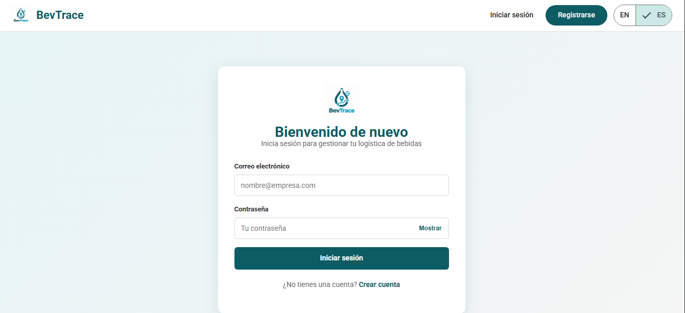
  
<em>Figura: IAM — Pantalla de inicio de sesión con validación de credenciales.</em>

  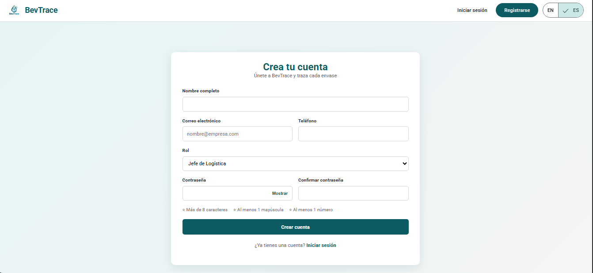
  
<em>Figura: IAM — Pantalla de registro con las reglas de validación de correo y contraseña.</em>

  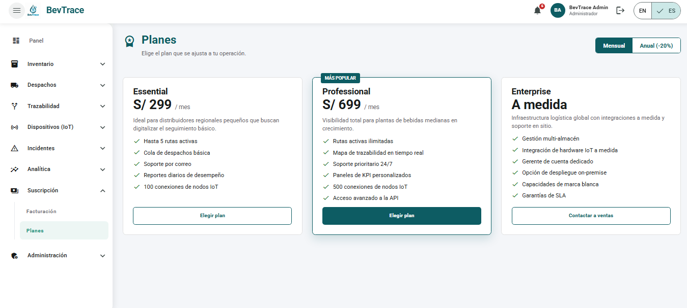
  
<em>Figura: Subscription — Planes de suscripción disponibles y suscripción vigente del cliente.</em>

  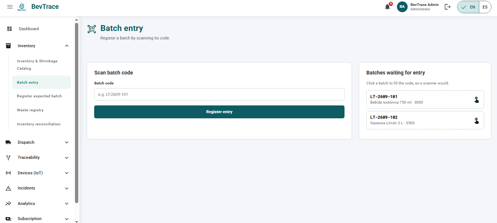
  
<em>Figura: Inventory — Registro de ingreso de lote (US01), con rechazo de códigos inválidos.</em>

  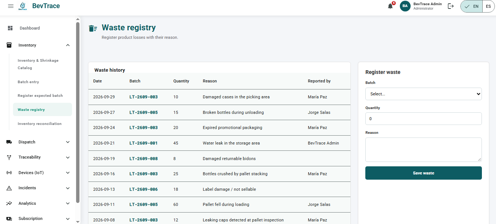
  
<em>Figura: Inventory — Registro de mermas y alertas de discrepancia (US02, US03).</em>

  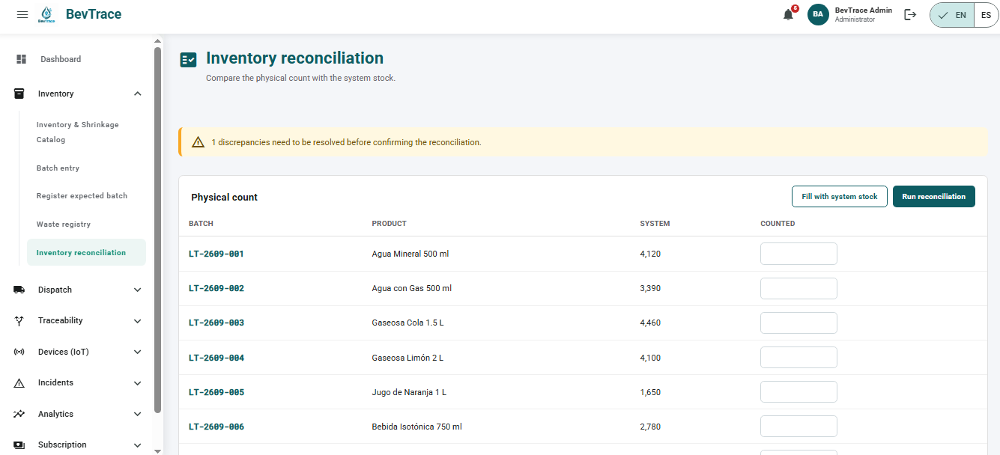
  
<em>Figura: Inventory — Conciliación de inventario físico con el porcentaje de exactitud (ERI) (US04).</em>

  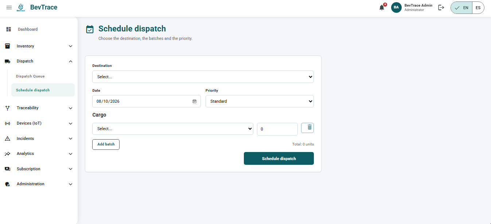
  
<em>Figura: Dispatch — Programación de despacho y lista de órdenes con su estado (US05).</em>

  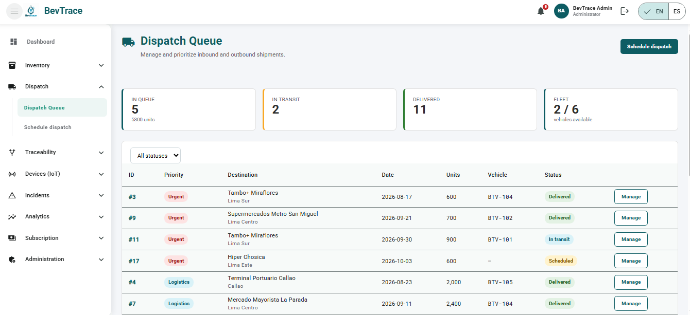
  
<em>Figura: Dispatch — Asignación de vehículo, validación de pallets y registro de salida (US06, US07, US08).</em>

  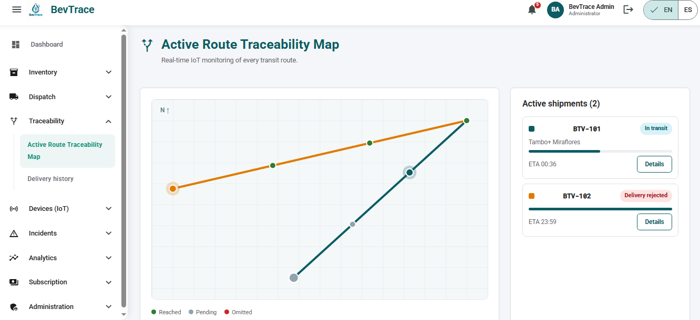
  
<em>Figura: Traceability — Seguimiento de un lote en tránsito, con checkpoints y cierre de la entrega (US09, US10, US11).</em>

  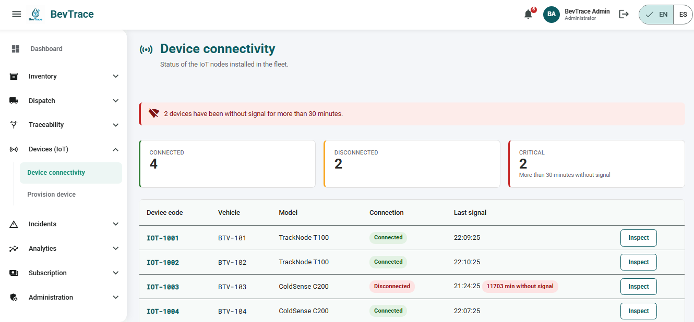
  
<em>Figura: Telemetry — Estado de conectividad de los dispositivos y notificación de reconexión (US12, US13).</em>

  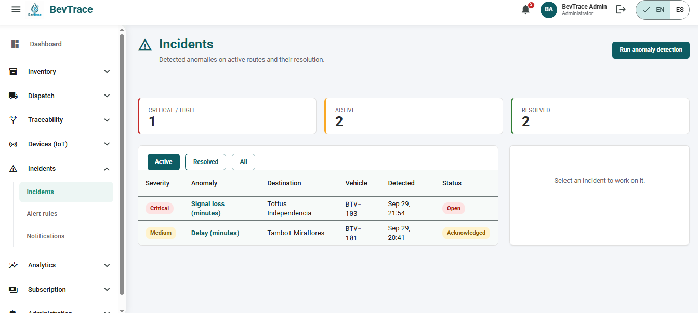
  
<em>Figura: Incident — Incidencias detectadas, resolución y acciones correctivas (US14, US15, US16).</em>

  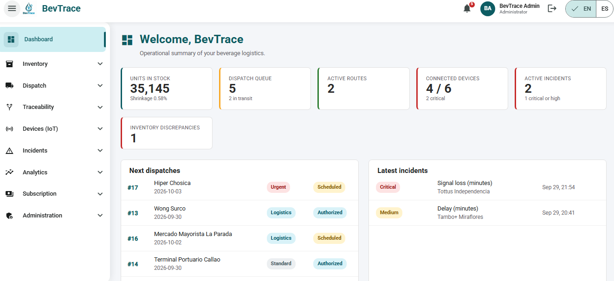
  
<em>Figura: Analytics — Reporte consolidado de indicadores logísticos y tasa de mermas (US17, US18).</em>

En conjunto, estas evidencias muestran que el Sprint 2 entregó una experiencia interna navegable de BevTrace que cubre los nueve contextos. Los datos provienen de una Mock API desplegada en la nube, por lo que la aplicación permitió validar la estructura visual, la navegación, el soporte bilingüe y los flujos operativos que serán conectados a los Web Services reales en los siguientes sprints.

#### 5.2.2.6. Services Documentation Evidence for Sprint Review

En el Sprint 2, la Frontend Web Application consume una <strong>Mock API</strong> construida con <code>json-server</code> (carpeta <code>server</code>), desplegada en Railway. El script <code>seed.mjs</code> genera el archivo <code>db.json</code> con los datos de prueba de todos los contextos, y el archivo <code>routes.json</code> reescribe las rutas para que todos los recursos se expongan bajo el prefijo <code>/api/v1</code>, con la misma convención (kebab-case en plural) definida en el Capítulo V para los Web Services. La implementación y documentación (Swagger/OpenAPI) de los Web Services reales se abordará en los sprints orientados al backend.

<code>json-server</code> admite filtros por campo mediante query params (por ejemplo, <code>?status=OPEN</code>). La tabla resume los recursos utilizados por la aplicación, agrupados por bounded context.

<table border="1" cellpadding="4" cellspacing="0">
  <thead>
    <tr>
      <th>End Point Base (Mock API)</th><th>Método HTTP</th><th>Acción Implementada</th><th>Sintaxis de Llamada (Ejemplo)</th><th>Explicación del Response</th>
    </tr>
  </thead>
  <tbody>
    <tr><td colspan="6" style="text-align:center;"><strong>Bounded Context: IAM</strong></td></tr>
    <tr>
      <td rowspan="3"><code>/api/v1/users</code></td>
      <td><strong>GET</strong></td><td>Autenticar o consultar usuarios (filtro por correo).</td><td><code>GET /api/v1/users?email=alex.rivera@bevtrace.com</code></td><td><code>200 OK</code>: Array de objetos User (<code>id, roleId, name, email, phone, active</code>); vacío si no existe.</td>
    </tr>
    <tr>
      <td><strong>POST</strong></td><td>Registrar un nuevo usuario.</td><td><code>POST /api/v1/users</code></td><td><code>201 Created</code>: Objeto User creado con ID asignado.</td>
    </tr>
    <tr>
      <td><strong>PATCH</strong></td><td>Activar/desactivar o editar un usuario.</td><td><code>PATCH /api/v1/users/{id}</code></td><td><code>200 OK</code>: Objeto User actualizado. <code>404</code> si no existe.</td>
    </tr>
    <tr>
      <td rowspan="1"><code>/api/v1/roles</code></td>
      <td><strong>GET</strong></td><td>Obtener los roles de acceso.</td><td><code>GET /api/v1/roles</code></td><td><code>200 OK</code>: Array de Role (<code>ROLE_ADMIN</code>, <code>ROLE_LOGISTICS_MANAGER</code>, <code>ROLE_WAREHOUSE_OPERATOR</code>).</td>
    </tr>
    <tr><td colspan="6" style="text-align:center;"><strong>Bounded Context: Subscription</strong></td></tr>
    <tr>
      <td rowspan="1"><code>/api/v1/subscription-plans</code></td>
      <td><strong>GET</strong></td><td>Obtener los planes de suscripción.</td><td><code>GET /api/v1/subscription-plans</code></td><td><code>200 OK</code>: Array de SubscriptionPlan (<code>code, priceAmount, billingPeriod, maxRoutes, maxDevices, maxUsers</code>).</td>
    </tr>
    <tr>
      <td rowspan="3"><code>/api/v1/subscriptions</code></td>
      <td><strong>GET</strong></td><td>Consultar la suscripción de un usuario.</td><td><code>GET /api/v1/subscriptions?userId=2</code></td><td><code>200 OK</code>: Array de Subscription.</td>
    </tr>
    <tr>
      <td><strong>POST</strong></td><td>Contratar un plan.</td><td><code>POST /api/v1/subscriptions</code></td><td><code>201 Created</code>: Objeto Subscription creado.</td>
    </tr>
    <tr>
      <td><strong>PATCH</strong></td><td>Cancelar o actualizar la suscripción.</td><td><code>PATCH /api/v1/subscriptions/{id}</code></td><td><code>200 OK</code>: Objeto Subscription actualizado.</td>
    </tr>
    <tr>
      <td rowspan="2"><code>/api/v1/payments</code></td>
      <td><strong>GET</strong></td><td>Consultar pagos de una suscripción.</td><td><code>GET /api/v1/payments?subscriptionId=1</code></td><td><code>200 OK</code>: Array de Payment (<code>amount, status, cardLast4</code>).</td>
    </tr>
    <tr>
      <td><strong>POST</strong></td><td>Registrar un pago.</td><td><code>POST /api/v1/payments</code></td><td><code>201 Created</code>: Objeto Payment creado.</td>
    </tr>
    <tr><td colspan="6" style="text-align:center;"><strong>Bounded Context: Inventory</strong></td></tr>
    <tr>
      <td rowspan="1"><code>/api/v1/products</code></td>
      <td><strong>GET</strong></td><td>Obtener el catálogo de productos (SKU).</td><td><code>GET /api/v1/products</code></td><td><code>200 OK</code>: Array de BeverageProduct.</td>
    </tr>
    <tr>
      <td rowspan="1"><code>/api/v1/zones</code></td>
      <td><strong>GET</strong></td><td>Obtener las zonas del almacén.</td><td><code>GET /api/v1/zones</code></td><td><code>200 OK</code>: Array de WarehouseZone.</td>
    </tr>
    <tr>
      <td rowspan="2"><code>/api/v1/batches</code></td>
      <td><strong>GET</strong></td><td>Obtener los lotes.</td><td><code>GET /api/v1/batches</code></td><td><code>200 OK</code>: Array de ProductBatch.</td>
    </tr>
    <tr>
      <td><strong>POST</strong></td><td>Registrar el ingreso de un lote.</td><td><code>POST /api/v1/batches</code></td><td><code>201 Created</code>: Objeto ProductBatch creado.</td>
    </tr>
    <tr>
      <td rowspan="2"><code>/api/v1/waste-records</code></td>
      <td><strong>GET</strong></td><td>Obtener las mermas registradas.</td><td><code>GET /api/v1/waste-records?batchId=3</code></td><td><code>200 OK</code>: Array de WasteRecord.</td>
    </tr>
    <tr>
      <td><strong>POST</strong></td><td>Registrar una merma.</td><td><code>POST /api/v1/waste-records</code></td><td><code>201 Created</code>: Objeto WasteRecord creado.</td>
    </tr>
    <tr>
      <td rowspan="2"><code>/api/v1/reconciliations</code></td>
      <td><strong>GET</strong></td><td>Obtener las conciliaciones.</td><td><code>GET /api/v1/reconciliations</code></td><td><code>200 OK</code>: Array de Reconciliation (<code>eriPercentage, status</code>).</td>
    </tr>
    <tr>
      <td><strong>POST</strong></td><td>Confirmar una conciliación.</td><td><code>POST /api/v1/reconciliations</code></td><td><code>201 Created</code>: Objeto Reconciliation creado.</td>
    </tr>
    <tr>
      <td rowspan="2"><code>/api/v1/discrepancies</code></td>
      <td><strong>GET</strong></td><td>Obtener las discrepancias de inventario.</td><td><code>GET /api/v1/discrepancies</code></td><td><code>200 OK</code>: Array de Discrepancy (<code>expectedQty, countedQty, status</code>).</td>
    </tr>
    <tr>
      <td><strong>PATCH</strong></td><td>Registrar la resolución de una discrepancia.</td><td><code>PATCH /api/v1/discrepancies/{id}</code></td><td><code>200 OK</code>: Objeto Discrepancy actualizado.</td>
    </tr>
    <tr><td colspan="6" style="text-align:center;"><strong>Bounded Context: Dispatch</strong></td></tr>
    <tr>
      <td rowspan="1"><code>/api/v1/destinations</code></td>
      <td><strong>GET</strong></td><td>Obtener los destinos de entrega.</td><td><code>GET /api/v1/destinations</code></td><td><code>200 OK</code>: Array de DeliveryDestination.</td>
    </tr>
    <tr>
      <td rowspan="1"><code>/api/v1/drivers</code></td>
      <td><strong>GET</strong></td><td>Obtener los conductores.</td><td><code>GET /api/v1/drivers</code></td><td><code>200 OK</code>: Array de Driver.</td>
    </tr>
    <tr>
      <td rowspan="1"><code>/api/v1/vehicles</code></td>
      <td><strong>GET</strong></td><td>Obtener los vehículos y su disponibilidad.</td><td><code>GET /api/v1/vehicles</code></td><td><code>200 OK</code>: Array de TransportVehicle (<code>plateNumber, maxCapacity, isAvailable</code>).</td>
    </tr>
    <tr>
      <td rowspan="3"><code>/api/v1/dispatch-orders</code></td>
      <td><strong>GET</strong></td><td>Obtener las órdenes de despacho.</td><td><code>GET /api/v1/dispatch-orders</code></td><td><code>200 OK</code>: Array de DispatchOrder.</td>
    </tr>
    <tr>
      <td><strong>POST</strong></td><td>Programar un despacho.</td><td><code>POST /api/v1/dispatch-orders</code></td><td><code>201 Created</code>: Objeto DispatchOrder creado.</td>
    </tr>
    <tr>
      <td><strong>PATCH</strong></td><td>Asignar vehículo, validar carga o registrar salida.</td><td><code>PATCH /api/v1/dispatch-orders/{id}</code></td><td><code>200 OK</code>: Objeto DispatchOrder actualizado.</td>
    </tr>
    <tr>
      <td rowspan="2"><code>/api/v1/cargo-assignments</code></td>
      <td><strong>GET</strong></td><td>Obtener la carga de un despacho.</td><td><code>GET /api/v1/cargo-assignments?dispatchOrderId=5</code></td><td><code>200 OK</code>: Array de CargoAssignment (<code>quantity, totalWeight, palletCount</code>).</td>
    </tr>
    <tr>
      <td><strong>POST</strong></td><td>Asignar un lote a un despacho.</td><td><code>POST /api/v1/cargo-assignments</code></td><td><code>201 Created</code>: Objeto CargoAssignment creado.</td>
    </tr>
    <tr><td colspan="6" style="text-align:center;"><strong>Bounded Context: Traceability</strong></td></tr>
    <tr>
      <td rowspan="2"><code>/api/v1/logs</code></td>
      <td><strong>GET</strong></td><td>Obtener los registros de trazabilidad en ruta.</td><td><code>GET /api/v1/logs</code></td><td><code>200 OK</code>: Array de TraceabilityLog (<code>currentStatus, currentLatitude, currentLongitude</code>).</td>
    </tr>
    <tr>
      <td><strong>PATCH</strong></td><td>Actualizar el estado del viaje.</td><td><code>PATCH /api/v1/logs/{id}</code></td><td><code>200 OK</code>: Objeto TraceabilityLog actualizado.</td>
    </tr>
    <tr>
      <td rowspan="2"><code>/api/v1/route-checkpoints</code></td>
      <td><strong>GET</strong></td><td>Obtener los checkpoints de un viaje.</td><td><code>GET /api/v1/route-checkpoints?logId=1</code></td><td><code>200 OK</code>: Array de RouteCheckpoint (<code>sequence, status, reachedAt</code>).</td>
    </tr>
    <tr>
      <td><strong>PATCH</strong></td><td>Registrar un checkpoint alcanzado.</td><td><code>PATCH /api/v1/route-checkpoints/{id}</code></td><td><code>200 OK</code>: Objeto RouteCheckpoint actualizado.</td>
    </tr>
    <tr>
      <td rowspan="2"><code>/api/v1/delivery-records</code></td>
      <td><strong>GET</strong></td><td>Obtener los registros de entrega.</td><td><code>GET /api/v1/delivery-records</code></td><td><code>200 OK</code>: Array de DeliveryRecord.</td>
    </tr>
    <tr>
      <td><strong>POST</strong></td><td>Registrar la entrega o el rechazo.</td><td><code>POST /api/v1/delivery-records</code></td><td><code>201 Created</code>: Objeto DeliveryRecord creado.</td>
    </tr>
    <tr><td colspan="6" style="text-align:center;"><strong>Bounded Context: Telemetry</strong></td></tr>
    <tr>
      <td rowspan="1"><code>/api/v1/devices</code></td>
      <td><strong>GET</strong></td><td>Obtener los dispositivos y su conectividad.</td><td><code>GET /api/v1/devices</code></td><td><code>200 OK</code>: Array de TelemetryDevice (<code>connectionStatus, lastSignalAt</code>).</td>
    </tr>
    <tr>
      <td rowspan="1"><code>/api/v1/models</code></td>
      <td><strong>GET</strong></td><td>Obtener los modelos de dispositivo.</td><td><code>GET /api/v1/models</code></td><td><code>200 OK</code>: Array de DeviceModel.</td>
    </tr>
    <tr>
      <td rowspan="1"><code>/api/v1/location-streams</code></td>
      <td><strong>GET</strong></td><td>Obtener las lecturas de un dispositivo.</td><td><code>GET /api/v1/location-streams?deviceId=1</code></td><td><code>200 OK</code>: Array de LocationStream (<code>latitude, longitude, speed, temperature</code>).</td>
    </tr>
    <tr>
      <td rowspan="1"><code>/api/v1/disconnection-periods</code></td>
      <td><strong>GET</strong></td><td>Obtener los periodos sin conexión.</td><td><code>GET /api/v1/disconnection-periods?deviceId=1</code></td><td><code>200 OK</code>: Array de DisconnectionPeriod.</td>
    </tr>
    <tr><td colspan="6" style="text-align:center;"><strong>Bounded Context: Incident</strong></td></tr>
    <tr>
      <td rowspan="1"><code>/api/v1/rules</code></td>
      <td><strong>GET</strong></td><td>Obtener las reglas de alerta.</td><td><code>GET /api/v1/rules</code></td><td><code>200 OK</code>: Array de AlertRule (<code>conditionType, threshold, severity</code>).</td>
    </tr>
    <tr>
      <td rowspan="3"><code>/api/v1/incidents</code></td>
      <td><strong>GET</strong></td><td>Obtener las incidencias.</td><td><code>GET /api/v1/incidents?status=OPEN</code></td><td><code>200 OK</code>: Array de IncidentRecord.</td>
    </tr>
    <tr>
      <td><strong>POST</strong></td><td>Registrar una incidencia detectada.</td><td><code>POST /api/v1/incidents</code></td><td><code>201 Created</code>: Objeto IncidentRecord creado.</td>
    </tr>
    <tr>
      <td><strong>PATCH</strong></td><td>Reconocer o resolver una incidencia.</td><td><code>PATCH /api/v1/incidents/{id}</code></td><td><code>200 OK</code>: Objeto IncidentRecord actualizado.</td>
    </tr>
    <tr>
      <td rowspan="2"><code>/api/v1/corrective-actions</code></td>
      <td><strong>GET</strong></td><td>Obtener las acciones correctivas.</td><td><code>GET /api/v1/corrective-actions?incidentId=2</code></td><td><code>200 OK</code>: Array de CorrectiveAction.</td>
    </tr>
    <tr>
      <td><strong>POST</strong></td><td>Registrar una acción correctiva.</td><td><code>POST /api/v1/corrective-actions</code></td><td><code>201 Created</code>: Objeto CorrectiveAction creado.</td>
    </tr>
    <tr>
      <td rowspan="2"><code>/api/v1/notifications</code></td>
      <td><strong>GET</strong></td><td>Obtener las notificaciones por rol.</td><td><code>GET /api/v1/notifications?recipientRole=ROLE_LOGISTICS_MANAGER</code></td><td><code>200 OK</code>: Array de Notification.</td>
    </tr>
    <tr>
      <td><strong>PATCH</strong></td><td>Marcar una notificación como leída.</td><td><code>PATCH /api/v1/notifications/{id}</code></td><td><code>200 OK</code>: Objeto Notification actualizado.</td>
    </tr>
    <tr><td colspan="6" style="text-align:center;"><strong>Bounded Context: Analytics</strong></td></tr>
    <tr>
      <td rowspan="2"><code>/api/v1/logistics-reports</code></td>
      <td><strong>GET</strong></td><td>Obtener los reportes logísticos con sus KPI.</td><td><code>GET /api/v1/logistics-reports</code></td><td><code>200 OK</code>: Array de LogisticsReport (<code>periodStart, periodEnd, kpis</code>).</td>
    </tr>
    <tr>
      <td><strong>POST</strong></td><td>Generar un reporte.</td><td><code>POST /api/v1/logistics-reports</code></td><td><code>201 Created</code>: Objeto LogisticsReport creado.</td>
    </tr>
  </tbody>
</table>

#### 5.2.2.7. Software Deployment Evidence for Sprint Review

Durante el Sprint 2 se desplegaron dos artefactos: la <strong>Frontend Web Application</strong> en <strong>Vercel</strong> y la <strong>Mock API</strong> en <strong>Railway</strong>. De este modo la aplicación Angular quedó disponible mediante una URL pública y consume sus datos desde un servicio en la nube, en lugar de un servidor local.

<strong>Despliegue de la Mock API (Railway):</strong>

<ol>
  <li>Se creó un proyecto en Railway a partir del repositorio <code>BevTrace-BackEnd</code>, usando la rama <code>main</code> y la carpeta <code>server</code> como directorio raíz.</li>
  <li>Railway instaló las dependencias definidas en <code>package.json</code> (<code>json-server</code>).</li>
  <li>Se utilizó como comando de inicio <code>npm start</code>, que ejecuta <code>json-server --watch db.json --routes routes.json --port $PORT --host 0.0.0.0</code>, de modo que la API escuche en el puerto asignado por la plataforma.</li>
  <li>Se generó un dominio público para el servicio.</li>
  <li>Se verificó el funcionamiento consultando un recurso, por ejemplo <code>GET https://bevtrace-backend-production.up.railway.app/api/v1/batches</code>.</li>
</ol>

<strong>Despliegue de la Frontend Web Application (Vercel):</strong>

<ol>
  <li>Se importó el repositorio <code>BevTrace-FrontEnd</code> en Vercel.</li>
  <li>Se configuró el build de producción de Angular (<code>ng build</code>) y su directorio de salida.</li>
  <li>Se configuró la reescritura de rutas hacia <code>index.html</code> para el correcto funcionamiento de la SPA.</li>
  <li>Se actualizó la URL base de la API para apuntar a la Mock API en Railway (commit <code>908fa5a</code>).</li>
  <li>Se publicó la aplicación desde la rama <code>main</code> y se validó el acceso desde la URL pública.</li>
</ol>

<strong>URL de producción (Frontend):</strong> <a href="https://bev-trace-front-end.vercel.app" target="_blank">https://bev-trace-front-end.vercel.app</a>

<strong>URL de la Mock API:</strong> <a href="https://bevtrace-backend-production.up.railway.app/api/v1" target="_blank">https://bevtrace-backend-production.up.railway.app/api/v1</a>

  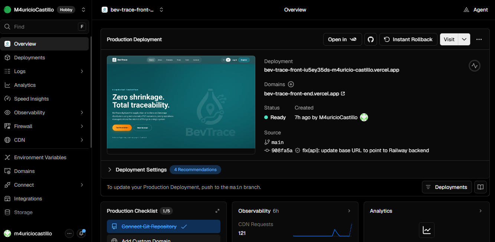
  
<em>Figura: Despliegue de la Frontend Web Application de BevTrace en Vercel</em>

  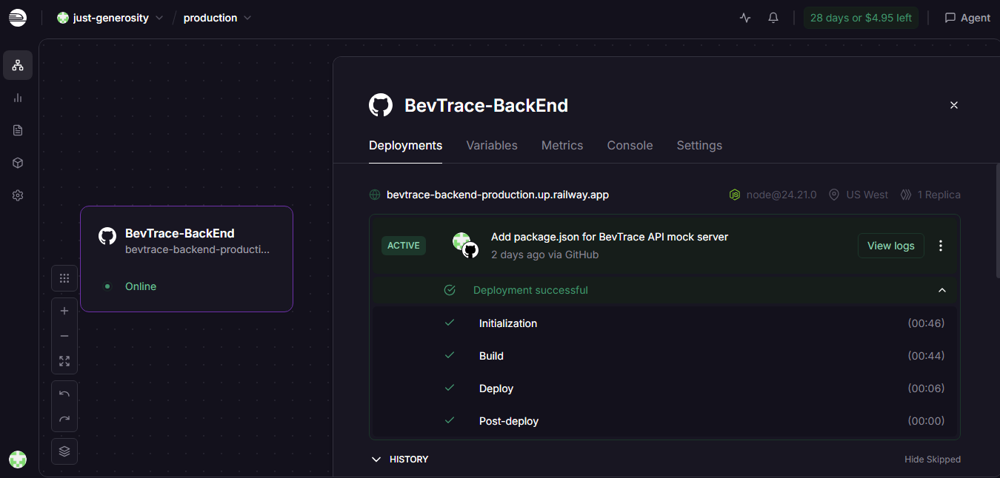
  
<em>Figura: Despliegue de la Mock API de BevTrace en Railway</em>

Este despliegue permitió validar que la aplicación podía ejecutarse íntegramente desde servicios cloud, con navegación entre módulos y datos servidos por la Mock API. Con ello, el Sprint 2 cerró con una versión demostrable de BevTrace, lista para integrarse con los Web Services reales.

#### 5.2.2.8. Team Collaboration Insights during Sprint

Durante el Sprint 2, el esfuerzo del equipo CodeCraft se centró en la implementación de la Frontend Web Application, trabajando en paralelo sobre los distintos bounded contexts. A diferencia del Sprint 1, se aplicó GitFlow con una rama por módulo (<code>feature/shared</code>, <code>feature/analytics</code>, <code>feature/dispatch</code>, <code>feature/inventory</code>, <code>feature/iam</code>, <code>feature/subscription</code>, <code>feature/incident</code>, <code>feature/traceability</code>, <code>feature/telemetry</code> y <code>feature/server</code>), integradas hacia <code>develop</code> mediante 18 Pull Requests y versionadas con Semantic Versioning (<code>0.1.0</code> a <code>1.0.0</code>), cumpliendo la acción de mejora acordada en la retrospectiva del Sprint 1.

El trabajo se distribuyó entre los tres integrantes del equipo, con colaboración mutua en la definición de la arquitectura, la revisión de contextos y la integración final. <strong>Mauricio Castillo</strong> (<code>M4uricioCastillo</code>) desarrolló la mayor parte de la aplicación: el contexto Shared (layout, componentes de interfaz, internacionalización y clases base), Inventory, Dispatch y Analytics, además de la integración mediante Pull Requests, las versiones publicadas y el despliegue en Vercel. En el historial concentra 87 de los 109 commits. <strong>Danitza Heredia</strong> (<code>UDnTzh</code>) implementó los contextos IAM (roles, validación de credenciales, sign-in, sign-up, gestión de usuarios y sesión), Subscription (planes, checkout, facturación, contacto y boletín) e Incident (incidencias, reglas de alerta, acciones correctivas y centro de notificaciones), con 19 commits. <strong>Enrique Ochoa</strong> (<code>EnriqueO-18</code>) implementó los contextos Traceability y Telemetry, y la carpeta <code>server</code> con la Mock API, entregados como módulos completos en 3 commits.

  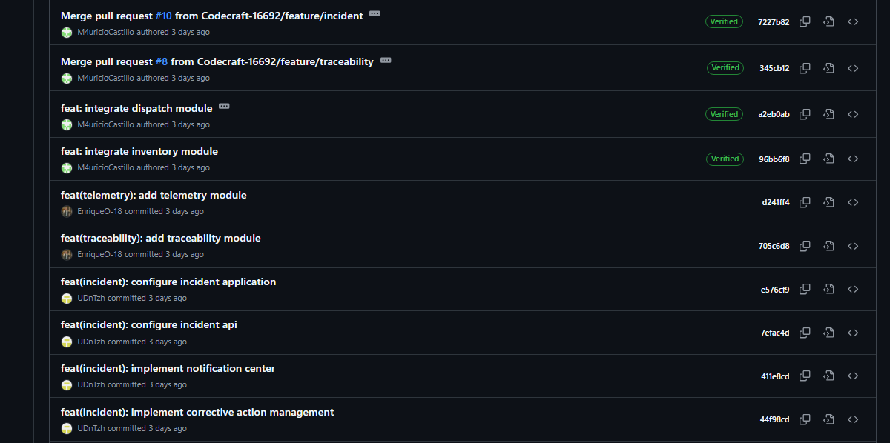
  
<em>Figura: Historial de commits del repositorio BevTrace-FrontEnd durante el Sprint 2.</em>

El Network Graph de GitHub refleja el uso de GitFlow con múltiples feature branches creadas a partir de <code>develop</code> y merges posteriores mediante Pull Requests. Esta estructura permitió que los contextos se desarrollaran en paralelo sin conflictos: Shared proveyó el layout, la internacionalización y las clases base reutilizadas por todos los módulos, mientras IAM, Subscription, Incident, Traceability y Telemetry avanzaron de forma independiente.

  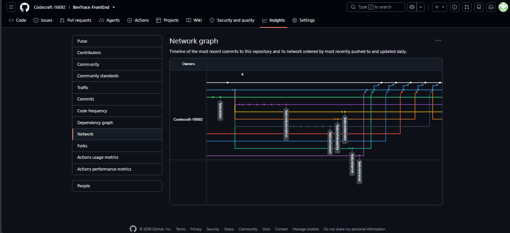
  
<em>Figura: Network Graph del repositorio BevTrace-FrontEnd mostrando el flujo de feature branches y merges durante el Sprint 2.</em>

El seguimiento de las tareas, su estimación y el aporte individual de cada integrante durante el sprint se encuentra en Jira: <strong>https://acortar.link/3wP02w</strong>.

[1]: https://trello.com "Trello"
[2]: https://cucumber.io/docs/gherkin/ "Guía Gherkin"
[3]: https://figma.com "Figma"
[4]: https://code.visualstudio.com "VS Code"
[5]: https://git-scm.com "Git"
[6]: https://pages.github.com "GitHub Pages"
[7]: https://miro.com "Miro"
[8]: https://plantuml.com "PlantUML"
[9]: https://github.com/Codecraft-16692/Codecraft-Report.git "Report"
[10]: https://github.com/Codecraft-16692/Codecraft-LandingPage.git "LandingPage"
[11]: githttps://github.com/Codecraft-16692/Codecraft-FrontEnd.git  "FrontEnd"
[12]: https://github.com/Codecraft-16692/Codecraft-BackEnd.git "BackEnd"

[html-css]: https://google.github.io/styleguide/htmlcssguide.html "Google HTML/CSS Style Guide"
[js]: https://google.github.io/styleguide/jsguide.html "Google JavaScript Style Guide"
[ts]: https://google.github.io/styleguide/tsguide.html "Google TypeScript Style Guide"
[angular]: https://angular.dev/style-guide "Angular Style Guide"
[java]: https://google.github.io/styleguide/javaguide.html "Google Java Style Guide"
[spring]: https://docs.spring.io/spring-boot/documentation.html "Spring Boot Documentation"
[gherkin]: https://cucumber.io/docs/gherkin/reference/ "Gherkin Reference"
