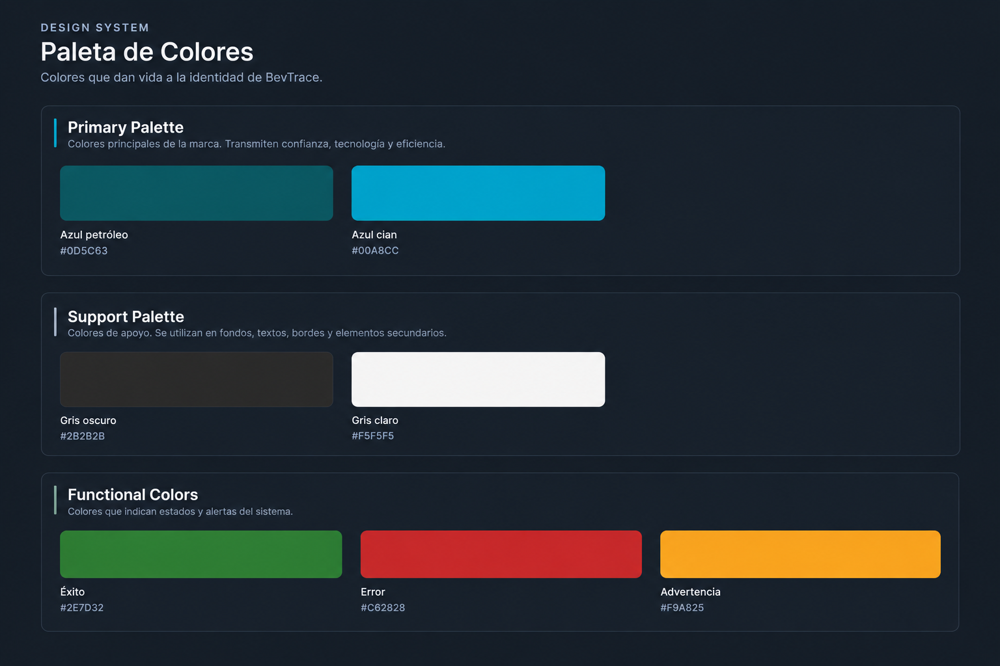
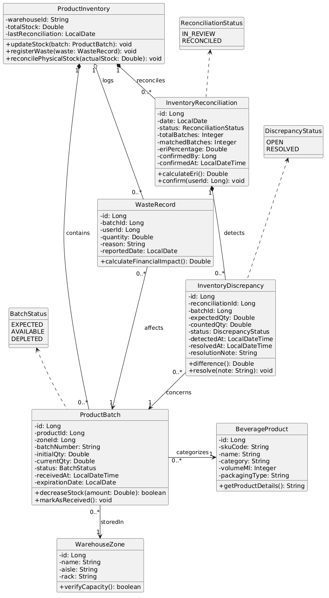
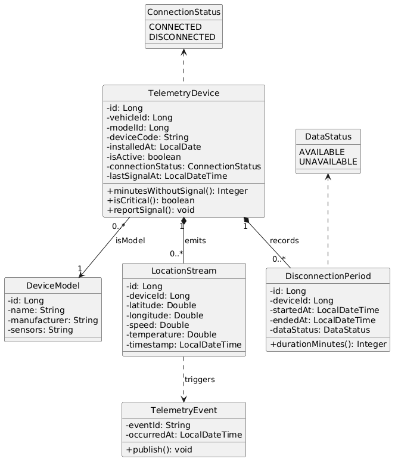
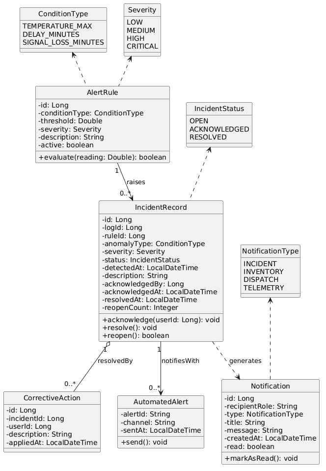
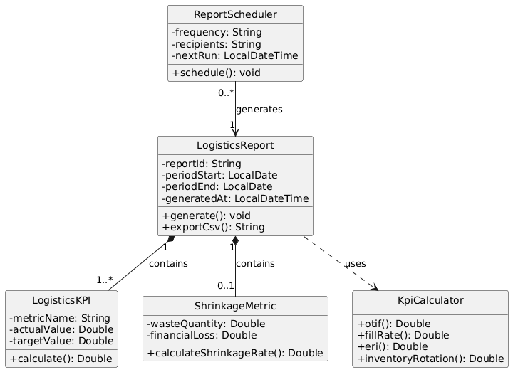

  

  Universidad Peruana de Ciencias Aplicadas 
  Carrera de Ingeniería de Software

<h4 align = "center">
 
  1ASI0730
</h4>
<h4 align = "center">
  Aplicaciones Web
</h4>

  NRC

  XXXXX

<h3 align = "center">
  Informe del Trabajo Final
</h3>

  Docente

<h4 align = "center">
  Velásquez Nuñez, Angel Augusto
</h4>
  
Equipo 
  

  <h4 align = "center">
  CodeCraft
  </h4>
  
Proyecto

  <h4 align = "center">
  BevTrace
  </h4>
<h4 align = "center">
  Integrantes
</h4>

|| Código     | Apellidos y Nombres                           |
| :--- |:-----------|:----------------------------------------------|
|1| U202411222 | Ochoa Prado, Enrique Augusto                  |
|2|            | Castillo Yataco, Mauricio Sebastian           |
|3|            | Heredia Hoyos, Danitza Ivonne                 |

<h4 align = "center">
  Período 202620
</h4>
<h4 align = "center">
  Octubre 2026
</h4>

# Registro de versiones del informe

| Versión | Fecha | Autor | Descripción de modificación |
| :--- | :--- | :--- | :--- |
| 0.1.0 | 15/09/26 | CodeCraft | Creación del repositorio y estructura inicial del informe (capítulos I-V) |
| 0.2.0 | 20/09/26 | CodeCraft | Entrevistas, needfinding, user stories y diseño UX/UI agregados |
| 0.3.0 | 05/10/26 | CodeCraft | Wireflows y user flows por user goal, alineados a las rutas del frontend Angular |
| 1.0.0 | 07/10/26 | CodeCraft | Entrega de la primera versión del informe (TB1) |

## Project Report Collaboration Insights

  

<i>Insights de colaboración del equipo CodeCraft en el repositorio del informe.</i>

# Table of Contents

***
## Capítulo I: Introducción
  - [1.1. Startup Profile](11-chapter_1.1.md)
    - [1.1.1. Descripción de la Startup](11-chapter_1.1.md#111-descripción-de-la-startup)
    - [1.1.2. Perfiles de integrantes del equipo](11-chapter_1.1.md#112-perfiles-de-integrantes-del-equipo)
  - [1.2. Solution Profile](12-chapter_1.2.md)
    - [1.2.1. Antecedentes y problemática](12-chapter_1.2.md#121-antecedentes-y-problemática)
    - [1.2.2. Lean UX Process](12-chapter_1.2.md#122-lean-ux-process)
  - [1.3. Segmentos objetivo](13-chapter_1.3.md)

***
## Capítulo II: Requirements Elicitation & Analysis
  - [2.1. Competidores](21-chapter_2.1.md)
    - [2.1.1. Análisis competitivo](21-chapter_2.1.md#211-análisis-competitivo)
    - [2.1.2. Estrategias y tácticas frente a competidores](21-chapter_2.1.md#212-estrategias-y-tácticas-frente-a-competidores)
  - [2.2. Entrevistas](22-chapter_2.2.md)
    - [2.2.1. Diseño de entrevistas](22-chapter_2.2.md#221-diseño-de-entrevistas)
    - [2.2.2. Registro de entrevistas](22-chapter_2.2.md#222-registro-de-entrevistas)
    - [2.2.3. Análisis de entrevistas](22-chapter_2.2.md#223-análisis-de-entrevistas)
  - [2.3. Needfinding](23-chapter_2.3.md)
    - [2.3.1. User Personas](23-chapter_2.3.md#231-user-personas)
    - [2.3.2. User Task Matrix](23-chapter_2.3.md#232-user-task-matrix)
    - [2.3.3. User Journey Mapping](23-chapter_2.3.md#233-user-journey-mapping)
    - [2.3.4. Empathy Mapping](23-chapter_2.3.md#234-empathy-mapping)
  - [2.4. Big Picture Event Storm](24-chapter_2.4.md)
  - [2.5. Ubiquitous Language](25-chapter_2.5.md)

***
## Capítulo III: Requirements Specification
- [3.1. User Stories](31-chapter_3.1.md)
- [3.2. Impact Mapping](32-chapter_3.2.md)
- [3.3. Product Backlog](33-chapter_3.3.md)

***
## Capítulo IV: Product Design

- [4.1. Style Guidelines](41-chapter_4.1.md)
  - [4.1.1. General Style Guidelines](41-chapter_4.1.md#411-general-style-guidelines)
- [4.2. Information Architecture](42-chapter_4.2.md)
- [4.3. Landing Page UI Design](43-chapter_4.3.md)
  - [4.3.1. Landing Page Wireframe](43-chapter_4.3.md#431-landing-page-wireframe)
  - [4.3.2. Landing Page Mock-up](43-chapter_4.3.md#432-landing-page-mock-up)
- [4.4. Web Applications UX/UI Design](44-chapter_4.4.md)
  - [4.4.1. Web Applications Wireframes](44-chapter_4.4.md#441-web-applications-wireframes)
  - [4.4.2. Web Applications Wireflow Diagrams](44-chapter_4.4.md#442-web-applications-wireflow-diagrams)
  - [4.4.3. Web Applications Mock-ups](44-chapter_4.4.md#443-web-applications-mock-ups)
  - [4.4.4. Web Applications User Flow Diagrams](44-chapter_4.4.md#444-web-applications-user-flow-diagrams)
- [4.5. Web Applications Prototyping](45-chapter_4.5.md)
- [4.6. Domain-Driven Software Architecture](46-chapter_4.6.md)
  - [4.6.1. Design-Level Event Storming](46-chapter_4.6.md#461-design-level-event-storming)
  - [4.6.2. Software Architecture Context Diagram](46-chapter_4.6.md#462-software-architecture-context-diagram)
  - [4.6.3. Software Architecture Container Diagrams](46-chapter_4.6.md#463-software-architecture-container-diagrams)
  - [4.6.4. Software Architecture Components Diagrams](46-chapter_4.6.md#464-software-architecture-components-diagrams)
- [4.7. Software Object-Oriented Design](47-chapter_4.7.md)
- [4.8. Database Design](48-chapter_4.8.md)

***
## Capítulo V: Product Implementation, Validation & Deployment
- [5.1. Software Configuration Management](51-chapter_5.1.md)
- [5.2. Landing Page, Services & Applications Implementation](52-chapter_5.2.md)
- [5.3. Validation Interviews](53-chapter_5.3.md)
- [5.4. Video About-the-Product](54-chapter_5.4.md)

***
## Cierre
- [Conclusiones](97-conclusions.md)
- [Bibliografía](98-bibliographic_references.md)

## Student Outcome

El curso contribuye al cumplimiento del student outcome ABET:

**ABET – EAC – Student Outcome 5**
Criterio: La capacidad de funcionar efectivamente en un equipo cuyos miembros juntos proporcionan liderazgo, crean un entorno de colaboración e inclusivo, establecen objetivos, planifican tareas y cumplen objetivos.

| Criterio específico | Acciones realizadas | Conclusiones |
|---|---|---|
| Trabaja en equipo para proporcionar liderazgo en forma conjunta | **Castillo Yataco, Mauricio Sebastian**   **TB1:** Lideré el diseño de la experiencia de usuario de BevTrace y la implementación del módulo de inventario.    **Heredia Hoyos, Danitza Ivonne**   **TB1:** Lideré la recolección de requerimientos mediante entrevistas y la documentación del Event Storming.    **Ochoa Prado, Enrique Augusto**   **TB1:** Lideré la implementación del frontend Angular por bounded contexts y la coordinación del equipo. | **----------TB1----------**   El equipo CodeCraft estructuró el desarrollo de BevTrace por bounded contexts alineados a las épicas del Product Backlog, con liderazgo compartido por módulo (IAM, suscripción, inventario, despachos, trazabilidad, telemetría, incidencias y analítica). La coordinación se sostuvo sobre GitFlow con Conventional Commits y reuniones semanales, entregando el frontend completo con sus wireflows, user flows y documentación de arquitectura dentro del cronograma del TB1. |

# Capítulo I: Introducción

## 1.1. Startup Profile

### 1.1.1. Descripción de la Startup

En una industria donde la eficiencia logística y el control de mermas dictan la rentabilidad, **BevTrace** nace con el propósito de digitalizar y automatizar la cadena de suministro de empresas embotelladoras y distribuidoras de consumo masivo, específicamente en la distribución de bebidas en envases PET no retornables. 

Nuestra propuesta de valor es un sistema SaaS integral que une la gestión operativa con el Internet de las Cosas (IoT). Buscamos eliminar la dependencia de reportes manuales e inventarios estáticos mediante una arquitectura tecnológica que permite el monitoreo en tiempo real, la gestión centralizada de despachos y la trazabilidad inmutable del producto desde el almacén hasta su destino.

<h4 id="Mision">Misión</h4>

Desarrollar una solución tecnológica SaaS robusta y escalable que permita a las empresas embotelladoras digitalizar sus procesos de distribución y trazabilidad logística. En BevTrace nos enfocamos en mitigar la pérdida de inventario (mermas) y optimizar la asignación de despachos integrando telemetría IoT, proporcionando datos exactos y en tiempo real para la toma de decisiones.

<h4 id="Vision">Visión</h4>

Ser la plataforma logística líder en el sector de consumo masivo a nivel regional, estandarizando la trazabilidad inteligente y la digitalización de almacenes, convirtiendo el control de despachos en un proceso totalmente automatizado, transparente e impulsado por datos.

### 1.1.2. Perfiles de integrantes del equipo (CodeCraft)
<table border="1" width="100%">
  <colgroup>
    <col style="width:140px">
    <col>
  </colgroup>
  <tr>
    <td width="140" valign="top" align="center">
      
    </td>
    <td valign="top">
      <strong>Mauricio Sebastian Castillo Yataco</strong> - Ingeniería de Software  
      Mi nombre es Mauricio Castillo y me encuentro realizando mis estudios universitarios en la carrera de Ingeniería de Software en la UPC. Durante mi formación académica, he adquirido conocimientos fundamentales en el desarrollo de software, abarcando áreas clave como programación, bases de datos y desarrollo web. Las dinámicas de trabajo colaborativo han sido una constante en mi experiencia estudiantil, donde he demostrado capacidad de integración y trabajo en equipo. Mi compromiso se centra en aplicar una metodología rigurosa y perseverante que permita alcanzar resultados óptimos en conjunto con mis compañeros de proyecto..
    </td>
  </tr>
  <tr>
    <td width="140" valign="top" align="center">
      
    </td>
    <td valign="top">
      <strong>Danitza Ivonne Heredia Hoyos</strong> - Ingeniería de Software  
      [Insertar descripción manual aquí].
    </td>
  </tr>
  <tr>
    <td width="140" valign="top" align="center">
      
    </td>
        <td valign="top" align="justify">
      <strong>Enrique Augusto Ochoa Prado</strong> - Ingeniería de Software  
      Mi nombre es Enrique Augusto Ochoa Prado y actualmente tengo 19 años de edad. Me encuentro realizando mis estudios universitarios en el sexto ciclo de la carrera de Ingeniería de Software en la UPC. Durante este período académico, he adquirido conocimientos fundamentales en el desarrollo de software, abarcando áreas como programación, bases de datos y desarrollo web. Las dinámicas de trabajo colaborativo han sido una constante en mi experiencia estudiantil, donde he demostrado capacidad de integración y liderazgo en diversos equipos. Esta trayectoria me ha brindado la confianza necesaria para enfrentar desafíos de mayor alcance. Mi compromiso se centra en mantener una metodología rigurosa y perseverante que permita alcanzar resultados óptimos en conjunto con mis compañeros de proyecto.
    </td>
  </tr>
</table>

## 1.2. Solution Profile
### 1.2.1. Antecedentes y problemática

*   **What (¿Qué?):** Pérdida de inventario (mermas), desorganización en la asignación de despachos y nula trazabilidad del estado físico del producto durante las operaciones logísticas.
*   **Why (¿Por qué?):** Porque los procesos dependen de verificaciones manuales y desconectadas. No existe un ecosistema que integre la lectura masiva de productos ni el monitoreo ambiental/físico de la carga en los vehículos.
*   **Who (¿Quién?):** Afecta financieramente a las empresas embotelladoras y distribuidoras. Operativamente impacta a los Jefes/Gerentes de Logística y a los Operarios de Almacén.
*   **When (¿Cuándo?):** Durante los procesos de preparación de pedidos (picking), asignación de rutas, carga de vehículos y transporte hacia los distribuidores finales.
*   **Where (¿Dónde?):** En los centros de distribución, almacenes de las embotelladoras y durante la ruta de los camiones de transporte.
*   **How (¿Cómo?):** Se soluciona implementando una plataforma SaaS que centralice la información y se integre con hardware IoT (sensores de peso, humedad, temperatura y antenas de lectura masiva RFID) para automatizar el registro y monitorear el estado de los envases.
*   **How much (¿Cuánto?):** Las pérdidas por mermas no detectadas a tiempo y las ineficiencias en despachos representan millones en sobrecostos operativos anuales para la industria de bebidas masivas.

### 1.2.2. Lean UX Process

#### 1.2.2.1. Lean UX Problem Statements

<b>Problem Statement</b>

El estado actual de la gestión logística en empresas embotelladoras se ha enfocado en sistemas transaccionales básicos y registros en papel. Lo que este proceso no logra es proporcionar visibilidad en tiempo real y automatizar el control físico de la mercadería. Nuestro producto (BevTrace) abordará esta brecha ofreciendo un SaaS integral que combina Dashboards de KPI, gestión automatizada de despachos y monitoreo IoT, lo que reducirá las mermas y optimizará el flujo de trabajo operativo.

#### 1.2.2.2. Lean UX Assumptions

Los siguientes supuestos representan las creencias iniciales del equipo respecto al negocio, los resultados esperados, los usuarios, los beneficios y las funcionalidades que conformarán la solución BevTrace.

<b>Business Assumptions</b>

- Creemos que las empresas embotelladoras y distribuidoras de bebidas están dispuestas a adoptar soluciones SaaS para digitalizar y optimizar sus procesos logísticos.
- Creemos que reducir las mermas y mejorar el control de los despachos representa un beneficio económico relevante para las empresas del sector.
- Creemos que un modelo SaaS puede resultar viable para empresas que buscan digitalizar sus operaciones sin asumir el desarrollo y mantenimiento de una solución tecnológica propia.
- Creemos que la integración de tecnologías IoT puede representar un elemento diferenciador frente a soluciones que únicamente permiten administrar inventarios y operaciones de manera tradicional.

<b>Business Outcome Assumptions</b>
- Creemos que BevTrace permitirá reducir las discrepancias entre el inventario registrado y el inventario real.
- Creemos que BevTrace permitirá reducir las pérdidas de productos asociadas a mermas durante el proceso de distribución.
- Creemos que BevTrace permitirá mejorar la eficiencia de la gestión de despachos.
- Creemos que disponer de información actualizada permitirá mejorar la toma de decisiones relacionadas con las operaciones logísticas.

<b>User Assumptions</b>
- Creemos que los responsables de almacén necesitan consultar y actualizar información relacionada con el inventario de productos.
- Creemos que los responsables de logística necesitan registrar, gestionar y supervisar los despachos realizados por la empresa.
- Creemos que los responsables de distribución necesitan conocer el estado y recorrido de los productos durante su traslado.
- Creemos que los responsables de operaciones necesitan consultar información consolidada sobre el desempeño de las operaciones logísticas.

<b>User Outcome and Benefit Assumptions</b>
- Creemos que los responsables de almacén podrán identificar con mayor rapidez las diferencias entre el inventario registrado y el inventario disponible.
- Creemos que los responsables de logística podrán gestionar y supervisar los despachos de manera más eficiente al disponer de información centralizada y actualizada.
- Creemos que los responsables de distribución podrán conocer el estado y recorrido de los productos durante el proceso de traslado.
- Creemos que los responsables de operaciones podrán tomar decisiones más oportunas al disponer de información confiable sobre inventarios, despachos y distribución.

<b>Feature Assumptions</b>

1. <b>Gestión de inventarios</b>
 Creemos que un módulo digital para registrar, consultar y actualizar el inventario permitirá a los responsables de almacén mantener un control más preciso de los productos disponibles. 
2. <b>Gestión de despachos</b>
 Creemos que un módulo centralizado para registrar, asignar y supervisar los despachos permitirá a los responsables de logística mejorar el control de las operaciones de distribución. 
3. <b>Trazabilidad de productos</b>
 Creemos que una funcionalidad de trazabilidad permitirá a los responsables de distribución consultar el recorrido y estado de los productos desde el almacén hasta su destino. 
4. <b>Monitoreo mediante IoT</b>
 Creemos que la integración con dispositivos IoT permitirá obtener información de telemetría en tiempo real sobre los productos durante su distribución. 
5. <b>Alertas de incidencias</b>
 Creemos que un sistema automatizado de alertas permitirá identificar oportunamente eventos o inconsistencias que puedan afectar el inventario o la distribución de los productos. 
6. <b>Dashboard de indicadores</b>
 Creemos que un dashboard con indicadores logísticos permitirá a los responsables de operaciones visualizar información consolidada sobre inventarios, despachos y trazabilidad para apoyar la toma de decisiones. 

#### 1.2.2.3. Lean UX Hypothesis Statements
- <b>Hipótesis 1:</b> Creemos que lograremos reducir las discrepancias de inventario si los responsables de almacén obtienen mayor precisión y visibilidad sobre los productos disponibles mediante un módulo centralizado de gestión de inventarios. Sabremos que esto es cierto cuando al menos el 70% de los responsables de almacén que utilicen la solución reporten una reducción de las diferencias entre el inventario registrado y el inventario real durante el periodo de validación.
- <b>Hipótesis 2:</b> Creemos que lograremos mejorar la eficiencia de los despachos si los responsables de logística obtienen mayor control y visibilidad sobre las operaciones de distribución mediante un módulo centralizado de gestión de despachos. Sabremos que esto es cierto cuando al menos el 70% de los responsables de logística que utilicen la solución reporten una mejora en el seguimiento y gestión de los despachos durante el periodo de validación.
- <b>Hipótesis 3:</b> Creemos que lograremos incrementar la visibilidad de los productos durante el proceso de distribución si los responsables de distribución obtienen acceso al estado y recorrido de los productos mediante una funcionalidad de trazabilidad. Sabremos que esto es cierto cuando al menos el 80% de los responsables de distribución puedan consultar correctamente el estado y recorrido de los productos durante las pruebas de validación.
- <b>Hipótesis 4:</b> Creemos que lograremos detectar oportunamente eventos ocurridos durante la distribución si los responsables de logística y distribución obtienen información operativa en tiempo real mediante la integración de dispositivos IoT. Sabremos que esto es cierto cuando al menos el 80% de los eventos generados durante las pruebas sean detectados y visualizados correctamente por los usuarios responsables.
- <b>Hipótesis 5:</b> Creemos que lograremos reducir las incidencias de inventario y distribución no detectadas oportunamente si los responsables de almacén y logística reciben información sobre eventos relevantes mediante un sistema automatizado de alertas. Sabremos que esto es cierto cuando al menos el 80% de las alertas generadas durante las pruebas sean recibidas y reconocidas correctamente por los usuarios responsables.
- <b>Hipótesis 6:</b> Creemos que lograremos mejorar la toma de decisiones logísticas si los responsables de operaciones obtienen una visión consolidada de los indicadores de inventario, despachos y trazabilidad mediante un dashboard de indicadores. Sabremos que esto es cierto cuando al menos el 80% de los responsables de operaciones puedan identificar correctamente los principales indicadores y utilizarlos para analizar situaciones relacionadas con inventarios y despachos durante las pruebas de validación.

#### 1.2.2.4. Lean UX Canvas

### 1.3. Segmentos objetivo

Basados en la distinción entre *Buyer Persona* (quien toma la decisión de compra) y *User Persona* (quien interactúa diariamente con la herramienta), se definen los siguientes segmentos:

<h3 id="segment1">Segmento Objetivo 1: Buyer Persona - Jefes y Gerentes de Logística</h3>

Este segmento es el encargado de adquirir la plataforma SaaS. Su motivación principal es el retorno de inversión (ROI) a través de la optimización de procesos.

*   **Demografía:** Profesionales entre 35 y 55 años, Ingenieros Industriales o Administradores con especialización en Supply Chain Management.
*   **Necesidades:** Visibilidad total de la operación, control estricto de mermas y KPIs actualizados al segundo para reportar a la alta gerencia.
*   **Relación con el sistema:** Interactúan principalmente con el Dashboard de KPI, configuraciones de reglas de negocio y reportes de trazabilidad IoT.

<h3 id="segment2">Segmento Objetivo 2: User Persona - Operarios y Supervisores de Almacén</h3>

Este segmento es el usuario final y operativo del sistema. El éxito de la implementación depende de que la plataforma les resulte intuitiva y eficiente.

*   **Demografía:** Hombres y mujeres entre 20 y 45 años, con educación técnica o secundaria completa.
*   **Necesidades:** Herramientas rápidas que no entorpezcan su labor física, interfaces claras para leer órdenes de trabajo y evitar el conteo manual repetitivo.
*   **Relación con el sistema:** Interactúan con el módulo de Gestión y Asignación de Despachos, operando los escáneres/antenas de lectura masiva y validando la carga física contra el sistema antes del despliegue de las unidades de transporte.

# Capítulo II: Requirements Elicitation & Analysis

## 2.1. Competidores.

Para desarrollar una solución realmente útil, es fundamental comprender el entorno competitivo y las alternativas que actualmente utilizan las empresas embotelladoras y distribuidoras. Este análisis permite identificar cómo se gestionan hoy los procesos logísticos y qué limitaciones presentan las soluciones existentes.

En esta etapa, se analizan distintos tipos de competidores con el objetivo de entender sus fortalezas y debilidades, y así posicionar a BevTrace como una propuesta que responda de manera más efectiva a las necesidades reales del sector.

### 2.1.1. Análisis competitivo.

### Competitive Analysis Landscape

|          **¿Por qué llevar a cabo este análisis?**              |    Identificar fortalezas, debilidades y estrategias de los principales competidores en logística de embotelladoras y trazabilidad del proceso (Verial, WebFleet, SAP EWM) para poder posicionar nuestra plataforma en el mercado.            |      Objetivo: Determinar que valor agredado ofrece nuestro producto para diferenciarse de la competencia y que     |                         
|------------------------|----------------------------------------------|---|

| Categoría              | Aspecto                                      |  |  |  |  |  
|:------------------------|:----------------------------------------------|:---:|:---:|:---:|:---:|
| Perfil                 | Overview                                      |  SaaS que digitaliza y automatiza la cadena de suministro de em- botelladoras/distribuidoras de be- bidas en envases PET no retornables, uniendo gestión operativa con IoT   |   ERP español specializado en distribución de bebidas: preventa, autoventa, rutas y trazabilidad de lotes.  |  Plataforma SaaS de telemática y gestión de flotas de Bridgestone, con foco en localización y navegación.   |  Módulo empresarial de SAP para gestión avanzada de almacenes (Extended Warehouse Management).    | 
| Perfil                 | Ventaja competitiva (¿qué valor ofrece?)      |   Monitoreo en tiempo real vía telemetría IoT,  trazabilidad inmutable del producto desde almacén hasta destino y gestión centralizada de despachos, especializado en PET no retornable  |Cumplimiento normativo (Verifactu), control de lote origen y del destino específico para HORECA y retail de bebidas|   Precisión GPS en tiempo real, marca reconocida globalmente, integraciones con hardware vehicular certificado.  |  Robustez enterprise, integración nativa con todo el ecosistema SAP (finanzas, MM, SD) ya instalado en grandes embotelladoras   |   
| Perfil de Marketing    | Mercado objetivo                              |  Empresas embotelladoras/distribuidoras de consumo masivo con envases PET no retornables; usuarios: responsables de almacén, logística, distribución y operaciones    |  PyMEs (pequeñas y medianas empresas ) y distribuidoras mayoristas de bebidas en España.   |  Empresas con flotas de transporte de cualquier industria, a nivel global.   |   Grandes corporativos y embotelladoras multinacionales (ej. grupos AB InBev, Coca-Cola FEMSA)  |   
| Perfil de Marketing    | Estrategias de marketing                      |    Mostrar nuestra especialidad en el sector de embotelladoras con campañas y comerciales que comparan nuestros producto con otros competidores |   Versiones de prueba gratuitas de 30 días, marketing de contenido enfocado en dolor operativo (cuadres de caja/lote)  |   Alianzas con fabricantes de vehículos, presencia en ferias de logística internacionales.   |   Venta consultiva B2B (asesoramiento) de largo ciclo, a través de partners certificados SAP.   |    
| Perfil de Producto     | Productos & Servicios                         |   Gestión de inventarios, gestión de despachos, trazabilidad de productos, monitoreo IoT, alertas de incidencias, dashboard de indicadores |   Preventa, autoventa, TPV (Terminal Punto de Venta), trazabilidad de lote, facturación electrónica  |  Rastreo GPS, navegación profesional, analítica de conducción y combustible.   |   Gestión de inventario multi-almacén, picking/packing, integración con RFID/IoT.  |    
| Perfil de Producto     | Precios & Costos                              | Suscripción SaaS para medianas y pequeñas empresas     |   Suscripción SaaS de gama media, accesible para PyME.   |   Suscripción por vehículo/mes; costo medio-alto según hardware  |   Licenciamiento enterprise de alto costo, requiere implementación por consultora.  |   
| Perfil de Producto     | Canales de distribución (Web y/o Móvil)       |  Web y app movil para los jefes de logistica y los operarios de almacen   |   Web y app móvil para vendedores/repartidores.  |   App móvil y hardware IoT propietario instalado en vehículo  |   Web (Fiori) y integraciones vía SAP Cloud Platform.  |     
| Análisis SWOT          | Fortalezas                                    |  Enfoque único que combina IoT con trazabilidad del proceso y especialización en empresas que usan PET    |  Especialización vertical profunda en bebidas   |   Marca global, hardware confiable y probado  |  Escala enterprise, soporte 24/7, ecosistema completo.    |    
| Análisis SWOT          | Debilidades                                   |  Por ser una nueva Startup carece de una base solida de usuarios y de experiencias reales con la aplicación   |   Sin telemetría IoT propia; trazabilidad principalmente documental/manual.   |  No gestiona inventario de almacén ni mermas de producto.    |  Costo y complejidad de implementación inaccesibles para PyMEs embotelladoras.   |    
| Análisis SWOT          | Oportunidades                                 |   Brecha de mercado explícita: ningún competidor combina hoy información operativa y telemetría IoT en un solo producto  |    Podría integrar sensores IoT como partner en vez de competidor |    Podría expandirse a trazabilidad de producto, no solo de vehículo. |Interés creciente en módulos IoT dentro de su propio roadmap (SAP Leonardo/IoT)|    
| Análisis SWOT          | Amenazas                                      | ERPs de bebidas (Verial) podrían incorporar IoT como feature; consultoras locales replican el mismo enfoque a medida para clientes grandes    |    Nuevos entrantes con IoT nativo (como BevTrace) le quitan el diferencial de trazabilidad.  |  Jugadores locales más baratos y especializados en el sector de bebidas   |   Soluciones SaaS ágiles y económicas capturando el segmento medio antes de que el cliente crezca a ”talla SAP”.   |    

### 2.1.2. Estrategias y tácticas frente a competidores.

A partir del análisis SWOT, BevTrace no compite en igualdad de condiciones con los tres competidores identificados: cada uno domina una porción distinta de la cadena de valor (gestión comercial, telemetría de transporte, o infraestructura enterprise), y ninguno cubre el problema completo — información operativa + IoT + trazabilidad, pero ninguno cubre los puntos que identificamos de la problematica. Por eso, la estrategia general de BevTrace no es "competir de frente" en ningún segmento, sino posicionarse en el espacio vacío que estos tres dejan entre sí, y usar tácticas específicas para neutralizar el riesgo de que cada uno se mueva hacia ese espacio.

**Frente a Verial:** 
Estrategia: Desplazamiento por profundidad tecnológica. Posicionarnos como el siguiente paso natural para un cliente que ya usa un ERP de bebidas y quiere pasar de trazabilidad documental a trazabilidad medida en tiempo real. 

Tactica: Comunicación comparativa directa (Excel/ERP vs. IoT en tiempo real) y evaluar integrarnos como complemento IoT en vez de exigir reemplazo total

**Frente a WebFleet:**

Estrategia: Redefinición del problema. Cambiar el eje de comparación de "quién rastrea mejor un vehículo" a "quién rastrea mejor un producto en todo su recorrido"

Tactica: Mensaje de complementariedad ("sigue usando tu GPS de flota, nosotros cubrimos lo que él no ve") dirigido a clientes que ya tienen GPS de flota pero siguen con problemas de almacén no resueltos.

**Frente a SAP EWM:**

Estrategia: Apela al segmento desatendido. No pelear en cuentas grandes donde SAP ya está instalado; capturar el segmento medio que SAP excluye por costo y complejidad.

Tactica: Mensaje dirigido a empresas que "superaron el Excel pero no pueden pagar/operar un SAP", con tiempo de implementación como argumento de venta.

## 2.2. Entrevistas.

Las entrevistas son clave para la metodología de diseño centrado en el usuario al permitirnos recolectar información cualitativa directamente de los actores que enfrentan la problemática identificada. A través del diálogo estructurado, se busca comprender las necesidades, comportamientos, frustraciones y expectativas de los segmentos objetivos, validando o refutando las hipótesis planteadas previamente.

### 2.2.1. Diseño de entrevistas.

Teniendo en cuenta la importancia en la información que nos pueden proveer los entrevistados, se presentan las preguntas clave para cada segmento objetivo. Para eso se consideran dos tipos de preguntas: las personales, orientadas a conocer el perfil del entrevistado y las específicas, las cuales están enfocadas en los procesos actuales, herramientas utilizadas, desafíos operativos y expectativas frente a una solución tecnológica como BevTrace.

<h4 id="Segmento1">Segmento objetivo: Jefes y Gerentes de Logística</h4>

**Objetivo:** Conocer cómo supervisan la distribución y qué información necesitan para tomar decisiones.

<h4 id="PreguntaPersonal1">Preguntas Personales</h4>

*   ¿Cuál es su nombre?
*   ¿Cuál es su edad?
*   ¿Cuál es su cargo actual dentro de la distribuidora o embotelladora?
*   ¿Cuál es su formación académica?
*   ¿Qué dispositivos o canales digitales utilizas con mayor frecuencia en tu trabajo?

<h4 id="PreguntasEspe1">Preguntas específicas:</h4>

*   ¿Cómo realizas actualmente el seguimiento de los productos durante su distribución?
*   ¿Cómo registran actualmente el control de inventario y las variables físicas (peso, humedad) durante el almacenamiento y transporte?
*   ¿Cuáles son los principales problemas que enfrentas al supervisar las operaciones?
*   ¿Cómo gestionan la trazabilidad de los despachos hacia los distribuidores finales?
*   En los últimos cierres de mes, ¿con qué frecuencia han tenido discrepancias por mermas no detectadas a tiempo o registros incompletos?
*   ¿Cuánto tiempo les toma preparar la consolidación de datos y reportes de eficiencia logística?
*   ¿Qué tan dispuestos estarían a reemplazar los registros manuales por una plataforma digital que capture automáticamente datos de sensores IoT en los vehículos?
*   ¿Cuáles son las principales barreras que han enfrentado para digitalizar el control de almacén y despachos?
*   ¿Qué funcionalidades debería tener una herramienta digital para facilitar la supervisión de las operaciones?

<h4 id="Segmento2">Segmento objetivo: Operarios y Supervisores de Almacén</h4>

**Objetivo:** Conocer cómo gestionan inventarios y despachos e identificar sus principales dificultades.

<h4 id="PreguntaPersonal2">Preguntas Personales</h4>

*   ¿Cuál es su nombre?
*   ¿Cuál es su edad?
*   ¿Cuál es su rol dentro del almacén o centro de distribución?
*   ¿Cuál es su nivel de estudios?
*   ¿Qué dispositivos utilizas con mayor frecuencia durante tu trabajo?

<h4 id="PreguntasEspe2">Preguntas específicas:</h4>

*   ¿Cómo gestionas actualmente el inventario y los despachos de la empresa?
*   ¿Qué procesos de preparación de pedidos, picking o carga aún dependen de registros en papel o sistemas no integrados?
*   ¿Cómo gestionan hoy la validación y lectura masiva de pallets de envases PET antes de su salida?
*   ¿Qué desafíos específicos han enfrentado relacionados con el conteo manual y la integridad de los datos de inventario?
*   ¿Cómo se enteran de un daño en la mercadería o discrepancia en la carga? ¿Existe algún mecanismo de alerta temprana?
*   ¿Cuánto tiempo y esfuerzo destinan a registrar manualmente la salida de unidades de transporte?
*   ¿Qué requisitos de facilidad de uso serían indispensables para que adopten una plataforma SaaS en su rutina diaria de almacén?
*   ¿Qué características debería tener una herramienta digital para facilitar tus actividades?
*   ¿Qué tipo de capacitación o acompañamiento necesitaría su equipo para migrar del conteo manual a un sistema de lectura masiva con IoT?
*   ¿Qué información necesitas consultar con mayor frecuencia para realizar tu trabajo?

### 2.2.2. Registro de entrevistas

**Segmento objetivo: Jefes y Gerentes de Logística**

<table>
    <colgroup></colgroup>
    <thead>
        <tr>
            <th colspan="2">Entrevista #1 </th>
        </tr>
    </thead>
    <tbody>
        <tr>
            <td>Nombre</td>
            <td>David</td>
        </tr>
        <tr>
            <td>Apellidos</td>
            <td>Castillo</td>
        </tr>
        <tr>
            <td>Edad</td>
            <td>45 años</td>
        </tr>
        <tr>
            <td>Distrito</td>
            <td>Chorrillos</td>
        </tr>
        <tr>
            <td>Evidencia</td>
            <td>

</td>
        </tr>
        <tr>
            <td>Link</td>
            <td>https://sl1nk.com/qgqi6qh</td>
        </tr>
        <tr>
            <td>Timing donde inicia la entrevista </td>
            <td></td>
        </tr>
        <tr>
            <td>Duración de la entrevista </td>
            <td>8:31 min</td>
</tr>
        <tr>
            <td>Resumen</td>
            <td>
            El Sr. David Castillo, de 45 años, es Jefe de distribución de materiales con formación en administración[cite: 3]. Gestiona la recepción y distribución de materia prima hacia las plantas de producción utilizando principalmente el sistema SAP[cite: 3]. Su labor exige una coordinación precisa con proveedores y transportistas, ya que los principales cuellos de botella se generan por incumplimientos en los tiempos de entrega (adelantos o retrasos), lo que impacta directamente en la capacidad espacial del almacén y genera riesgos de quiebres de stock[cite: 3].
               
            <b>Comportamiento y Necesidades:</b> Es un profesional enfocado en la exactitud de los datos y la revisión de indicadores de rendimiento logístico (como ERI, OTIF, Fill Rate y rotación de inventario)[cite: 3]. Realiza controles diarios de inventario y auditorías mensuales para corregir discrepancias de inmediato[cite: 3]. Identifica que el mayor desafío en la gestión de almacenes no es el fallo del sistema, sino el error humano y la mala calidad de la información al ingresar los datos tarde o de forma incorrecta[cite: 3]. Necesita que cualquier herramienta digital a implementar sea altamente flexible y adaptable a la cultura y ritmo cambiante de cada operación específica, evitando flujos rígidos[cite: 3]. 
               
            <b>Tecnología, Marcas y Canales:</b> Está altamente familiarizado con plataformas ERP robustas (SAP) y software de rastreo para el seguimiento de unidades de transporte[cite: 3]. Utiliza diariamente laptop, celular y herramientas en la nube de forma simultánea[cite: 3]. Confía en la estabilidad de sus sistemas actuales, remarcando que las caídas de servidor son inusuales, por lo que su disposición a adoptar nuevas tecnologías dependerá de qué tan bien solucionen el ingreso manual de datos y se adapten a sus procesos sin entorpecerlos[cite: 3].
            </td>
        </tr>
    </tbody>
</table>

**Segmento objetivo: Operarios y Supervisores de Almacén**

<table>
    <colgroup></colgroup>
    <thead>
        <tr>
            <th colspan="2">Entrevista #1 </th>
        </tr>
    </thead>
    <tbody>
        <tr>
            <td>Nombre</td>
            <td>Maria</td>
        </tr>
        <tr>
            <td>Apellidos</td>
            <td>Lopez</td>
        </tr>
        <tr>
            <td>Edad</td>
            <td>32 años</td>
        </tr>
        <tr>
            <td>Distrito</td>
            <td>Chorrillos</td>
        </tr>
        <tr>
            <td>Evidencia</td>
            <td>

</td>
        </tr>
        <tr>
            <td>Link</td>
            <td>https://l1nq.com/k758tyw</td>
        </tr>
        <tr>
            <td>Timing donde inicia la entrevista </td>
            <td></td>
        </tr>
        <tr>
            <td>Duración de la entrevista </td>
            <td>9:27 min</td>
</tr>
        <tr>
            <td>Resumen</td>
            <td>
            La Sra. María López, de 32 años, es operaria de almacén encargada de apoyar en la recepción, organización, conteo y preparación de la mercadería antes del despacho. Su día a día involucra la verificación manual de cargas y pallets, un proceso que actualmente depende de una mezcla ineficiente de anotaciones en papel impreso y registros posteriores en computadora. Esto genera redundancia operativa, ya que los operarios deben revisar la información varias veces para confirmar que todo coincida, provocando retrasos cuando hay un alto volumen de movimiento.
               
            <b>Comportamiento y Necesidades:</b> María busca agilidad y la reducción de tareas repetitivas. Reconoce que el conteo manual propicia errores humanos y que la falta de un mecanismo de alerta automática hace que los daños o discrepancias en la mercadería se detecten tarde, a menudo mediante simples revisiones visuales. Necesita un sistema intuitivo, rápido, con botones grandes y pocos pasos que le permita ver el inventario en tiempo real, identificar pallets fácilmente y recibir alertas automáticas. Además, requiere que cualquier transición tecnológica se acompañe de capacitaciones prácticas en campo y con soporte técnico presencial durante las primeras semanas.
               
            <b>Tecnología, Marcas y Canales:</b> Está habituada al uso de celulares y computadoras de manera cotidiana, y emplea lectores de códigos de barras de forma ocasional cuando están disponibles. Valora las interfaces sencillas que no exigen conocimientos técnicos avanzados, priorizando herramientas en tiempo real que se puedan usar desde los dispositivos móviles que ya maneja en el almacén para registrar automáticamente entradas y salidas, eliminando definitivamente la dependencia del papel y la transcripción manual de datos.
            </td>
        </tr>
    </tbody>
</table>

### 2.2.3. Análisis de entrevistas

## 2.3. Needfinding
### 2.3.1. User Personas

Para el segmento de los Jefes y Gerentes de Logistica:

Para el segmento de Operarios y Supervisores de almacén

### 2.3.2. User Task Matrix

El User Task Matrix presenta las tareas que realizan los User Persona para cumplir sus objetivos en su día a día, independientemente de si usan nuestro software o no. Se evalúa la frecuencia y la importancia de cada tarea para identificar dónde aportar valor.

#### 2.3.2.1. Segmento: Jefes y Gerentes de Logística

|Tarea (Task)|Jefe de Distribución (David) Frecuencia|Jefe de Distribución (David) Importancia|
|:----|:----:|:----:|
|Seguimiento de la orden de compra y recepción de materiales en SAP|Often|High|
|Registro de parámetros de carga (peso, altura, unidad de medida) al ingreso|Often|High|
|Verificación de guías de remisión, facturas y certificados de calidad|Often|High|
|Monitoreo del cumplimiento del plan de abastecimiento|Often|High|
|Seguimiento del indicador ERI (exactitud de inventario)|Often|High|
|Coordinación con proveedores ante retrasos o incumplimientos|Occasionally|High|
|Auditorías internas de inventario|Monthly|High|
|Consolidación de reportes de indicadores logísticos (OTIF, Fill Rate, etc.)|Monthly|Medium|

**Análisis del Task Matrix:** Se observa que las tareas *Seguimiento de la orden de compra*, *Registro de parámetros de carga* y *Monitoreo del cumplimiento del plan de abastecimiento* tienen una Importancia **High** y Frecuencia **Often**, lo cual confirma que estas tareas son el **Core** del negocio y deben ser priorizadas mediante automatización e integración con SAP. Además, la tarea *Coordinación con proveedores ante retrasos*, aunque es **Occasionally**, tiene una importancia **High**, validando la necesidad de mecanismos de alerta temprana ante desviaciones del plan. Por su parte, las *Auditorías internas* y la *Consolidación de reportes*, si bien son de frecuencia **Monthly**, concentran una carga operativa considerable (hasta dos días por consolidación), lo que las convierte en candidatas claras para automatización de reportería.

 

#### 2.3.2.2. Segmento: Operarios y Supervisores de Almacén

|Tarea (Task)|Operaria de Almacén (María) Frecuencia|Operaria de Almacén (María) Importancia|
|:----|:----:|:----:|
|Recepción y conteo de mercadería|Often|High|
|Registro de información de inventario tras el conteo|Often|High|
|Preparación de pedidos (picking)|Often|High|
|Verificación de la carga antes del despacho|Often|High|
|Validación manual de pallets contra la orden de despacho|Often|High|
|Detección de daños o discrepancias en la mercadería|Occasionally|High|
|Registro manual de salida de unidades de transporte|Often|Medium|
|Conciliación de información entre documentos en papel y sistema|Occasionally|Medium|

**Análisis del Task Matrix:** Las tareas de *Recepción y conteo de mercadería*, *Preparación de pedidos* y *Verificación de la carga* presentan Frecuencia **Often** e Importancia **High**, confirmando que constituyen el **Core operativo** del almacén y deben priorizarse mediante lectura masiva y automatización (ej. códigos de barras). La *Detección de daños o discrepancias*, aunque es **Occasionally**, mantiene una importancia **High**, evidenciando la necesidad de alertas automáticas que hoy no existen y que dependen únicamente de la revisión visual del personal. Asimismo, la *Conciliación entre papel y sistema* refleja un problema estructural: procesos no integrados que generan doble verificación y retrasos, siendo un punto clave a resolver con una plataforma digital unificada.

### 2.3.3. User Journey Mapping

Para el segmento de Jefes y Gerentes de Logistica

Para el segmento de Operarios y Supervidores de Almacen:

### 2.3.4. Empathy Mapping

Para el segmento de Jefes y Gerentes de Logistica

Para el segmento de Operarios y Supervidores de Almacen:

## 2.4. Big Picture Event Storm

Antes de definir funcionalidades, módulos o componentes técnicos para <strong>BevTrace</strong>,
el equipo realizó una sesión de <strong>Big Picture Event Storming</strong> con el objetivo de
comprender el dominio del negocio desde una perspectiva general. Esta actividad permitió
visualizar los principales eventos que ocurren dentro de la cadena de suministro, desde
la gestión de inventarios y lotes de bebidas hasta la planificación de despachos, control
de mermas, seguimiento de rutas mediante telemetría de datos externos, alertas de incidencias
y reportes de rendimiento operativo.

El proceso se desarrolló de manera colaborativa, priorizando el descubrimiento del negocio
sin enfocarse inicialmente en pantallas, bases de datos, integraciones externas o detalles de implementación.
El equipo recopiló eventos significativos del dominio y los organizó como una primera
aproximación visual al flujo general de la organización. Esta dinámica permitió identificar
procesos clave, posibles cuellos de botella en los despachos, riesgos de pérdida de mercadería (mermas) 
y oportunidades para mejorar la trazabilidad y la eficiencia logística.

La primera etapa consistió en recolectar eventos de dominio. En esta fase, los integrantes
propusieron sucesos relevantes expresados en pasado, como hechos que ya ocurrieron dentro
del negocio. Esta forma de redacción permitió representar acontecimientos reales del dominio,
por ejemplo: un lote de producto fue registrado, el stock de inventario fue actualizado,
un despacho fue autorizado, un punto de control fue alcanzado, una anomalía de distribución 
fue detectada o un reporte logístico fue generado.

  
  
<em>Figura: Primera etapa del Big Picture Event Storming, enfocada en la recolección de eventos de dominio para BevTrace.</em>

Como resultado de esta etapa, se identificaron grupos iniciales de eventos relacionados con
la administración de inventarios, gestión de mermas, programación de despachos, monitoreo de 
rutas (mediante integración de datos externos), resolución de incidencias y análisis de métricas.
Esta exploración permitió reconocer que el dominio de BevTrace no se limita únicamente al
control estático de almacén, sino que integra flujos operativos y de transporte que deben
mantenerse conectados para asegurar la trazabilidad del producto hasta su destino.

A partir de los eventos recolectados, el equipo pudo detectar áreas críticas del negocio:
el registro preciso de entradas y salidas, la asignación eficiente de cargas a los vehículos, 
la detección oportuna de discrepancias de inventario, el reporte de anomalías en tránsito y 
la evaluación de las tasas de pérdida. Estos elementos fueron considerados como insumos 
principales para la posterior identificación de procesos, bounded contexts y funcionalidades del sistema.

## 2.5. Ubiquitous Language

Este glosario asegura que el equipo de desarrollo, los responsables de almacén y los 
supervisores de logística compartan un marco conceptual idéntico, garantizando que el 
producto final sea una extensión fiel de las operaciones de distribución de consumo masivo. 
Los términos definidos aquí reflejan estrictamente el lenguaje del negocio y rigen toda 
la comunicación del proyecto.

| Término | Definición |
|---|---|
| **Distribution Hub** | Centro logístico principal donde se recepcionan, almacenan y preparan las bebidas para su distribución. Es el punto de origen de la cadena operativa. |
| **Product Batch** | Agrupación específica de bebidas en envases PET que comparten características de producción. Es la unidad fundamental para rastrear ingresos y salidas. |
| **Inventory Stock** | Cantidad total de productos disponibles físicamente en el almacén en un momento dado, listos para ser asignados a nuevas órdenes de despacho. |
| **Inventory Discrepancy** | Diferencia detectada entre la cantidad de producto que debería existir según los registros documentales y la cantidad física real hallada. |
| **Product Waste (Merma)** | Pérdida irrecuperable de producto ocurrida por daños, vencimientos o manipulación inadecuada dentro del almacén o durante el traslado. |
| **Dispatch Order** | Instrucción formal que autoriza la preparación, carga y salida de un volumen específico de productos hacia un destino preestablecido. |
| **Cargo** | Conjunto de productos que han sido separados del inventario general y asignados a un vehículo de transporte para cumplir con un despacho programado. |
| **Route Traceability** | Capacidad de reconstruir el historial y la progresión de un despacho a lo largo de su viaje, basándose en confirmaciones de avance y puntos de control. |
| **Checkpoint** | Ubicación geográfica o hito de control en el proceso de distribución donde se registra una actualización válida sobre el estado del despacho. |
| **Telemetry Stream** | Flujo de datos operativos continuos recibidos a través de fuentes externas (como servicios de rastreo de terceros) para actualizar el estado del despacho. |
| **Distribution Anomaly** | Evento inesperado que altera el plan original de entrega, como un retraso prolongado, una desviación de ruta o un problema con la carga. |
| **Corrective Action** | Medida inmediata y documentada tomada por el personal de logística para resolver una incidencia en ruta y asegurar la continuidad de la distribución. |
| **Proof of Delivery** | Confirmación oficial que certifica que los productos correspondientes a un despacho fueron recibidos exitosamente en el destino planificado. |
| **Shrinkage Rate** | Indicador clave que mide el porcentaje de inventario perdido (mermas) en relación con el volumen total operado en un periodo específico. |

**Beneficios esperados del lenguaje ubicuo:**

- Elimina ambigüedades entre los miembros del equipo técnico y los expertos del negocio al
  estandarizar los conceptos operativos de la logística y distribución de bebidas.
- Asegura que cualquier conversación, requerimiento o documentación del proyecto se exprese
  en términos de la cadena de suministro real, facilitando la validación del sistema.
- Previene interpretaciones erróneas sobre el manejo de mermas, inventarios y entregas al
  definir límites claros y responsabilidades para cada concepto operativo.
- Mantiene la consistencia del negocio independientemente de las herramientas o fuentes de datos
  externas empleadas para registrar el comportamiento de los despachos.

# Capítulo III: Requirements Specification

## 3.1. User Stories.

 

**Epics**

<table border="1" style="border-collapse:collapse; width:100%; table-layout:fixed;">
<tr>
  <th style="width:15%;">Epic /  Story/ ID</th>
  <th style="width:15%;">Título</th>
  <th style="width:35%;">Descripción</th>
  <th style="width:25%;">Criterios de Aceptación</th>
  <th style="width:10%;">Relacionado con (Epic ID)</th>
</tr>
<tr>
  <td>EP01</td>
  <td>Gestión de Lotes e Inventario</td>
  <td>
    <b>Como</b> Operario de Almacén o Jefe de Distribución,
    
<b>deseo</b> registrar, actualizar y conciliar el inventario de lotes de producto de forma automática,

    
<b>para</b> mantener la exactitud del inventario (ERI) y reducir los errores del conteo manual.

  </td>
  <td>-</td>
  <td>-</td>
</tr>
<tr>
  <td>EP02</td>
  <td>Gestión de Despachos</td>
  <td>
    <b>Como</b> Jefe de Distribución u Operario de Almacén,
    
<b>deseo</b> programar, autorizar y validar un despacho antes de su salida,

    
<b>para</b> asegurar que la carga coincida con la orden antes de que el transporte abandone el almacén.

  </td>
  <td>-</td>
  <td>-</td>
</tr>
<tr>
  <td>EP03</td>
  <td>Trazabilidad de Ruta</td>
  <td>
    <b>Como</b> Jefe de Distribución,
    
<b>deseo</b> dar seguimiento en tiempo real a la ubicación y estado de un lote en tránsito,

    
<b>para</b> confirmar su entrega sin depender de llamadas telefónicas con el transportista.

  </td>
  <td>-</td>
  <td>-</td>
</tr>
<tr>
  <td>EP04</td>
  <td>Monitoreo IoT y Telemetría</td>
  <td>
    <b>Como</b> Developer,
    
<b>deseo</b> vincular dispositivos IoT a los lotes de producto y capturar su telemetría (temperatura, ubicación, estado de conexión),

    
<b>para</b> proveer datos objetivos que alimenten la trazabilidad y la detección de anomalías.

  </td>
  <td>-</td>
  <td>-</td>
</tr>
<tr>
  <td>EP05</td>
  <td>Gestión de Incidencias</td>
  <td>
    <b>Como</b> Operario de Almacén o Jefe de Distribución,
    
<b>deseo</b> que el sistema detecte y notifique automáticamente anomalías en la distribución,

    
<b>para</b> reaccionar antes de que el problema se descubra recién en la etapa de entrega.

  </td>
  <td>-</td>
  <td>-</td>
</tr>
<tr>
  <td>EP06</td>
  <td>Reportería e Indicadores Operativos</td>
  <td>
    <b>Como</b> Jefe de Distribución,
    
<b>deseo</b> consolidar automáticamente los indicadores logísticos (OTIF, Fill Rate, ERI, rotación de inventario),

    
<b>para</b> presentarlos a la alta dirección sin invertir días en su elaboración manual.

  </td>
  <td>-</td>
  <td>-</td>
</tr>
<tr>
  <td>EP07</td>
  <td>Sitio Web Estático (Landing Page)</td>
  <td>
    <b>Como</b> visitante,
    
<b>deseo</b> conocer la propuesta de valor de BevTrace y sus beneficios para mi segmento,

    
<b>para</b> evaluar si es la solución adecuada para mi operación antes de contactar al equipo comercial.

  </td>
  <td>-</td>
  <td>-</td>
</tr>

<tr>
  <td>EP08</td>
  <td>Seguridad y Gestión de Accesos (IAM)</td>
  <td>
    <b>Como</b> usuario de BevTrace,
    
<b>deseo</b> autenticarme de forma segura y que el sistema administre mi cuenta y rol,

    
<b>para</b> que cada persona acceda únicamente a las funciones de su perfil.

  </td>
  <td>-</td>
  <td>-</td>
</tr>
<tr>
  <td>EP09</td>
  <td>Gestión de Suscripciones y Pagos</td>
  <td>
    <b>Como</b> Administrador,
    
<b>deseo</b> gestionar el ciclo de vida de las suscripciones de BevTrace con pago simulado,

    
<b>para</b> controlar el acceso comercial a la plataforma y mantener el registro de facturación.

  </td>
  <td>-</td>
  <td>-</td>
</tr>
<tr>
  <td>EP10</td>
  <td>Panel Operativo y Experiencia de Uso</td>
  <td>
    <b>Como</b> usuario de BevTrace,
    
<b>deseo</b> contar con un panel que consolide la operación y una interfaz en mi idioma,

    
<b>para</b> iniciar cada jornada con una visión general y usar la plataforma en mi preferencia de idioma.

  </td>
  <td>-</td>
  <td>-</td>
</tr>
</table>

 

**User Stories**

<table border="1" style="border-collapse:collapse; width:100%; table-layout:fixed;">
<tr>
  <th style="width:15%;">Epic /  Story/ ID</th>
  <th style="width:15%;">Título</th>
  <th style="width:35%;">Descripción</th>
  <th style="width:25%;">Criterios de Aceptación</th>
  <th style="width:10%;">Relacionado con (Epic ID)</th>
</tr>
<tr>
  <td>US01</td>
  <td>Registro automático de ingreso de lote</td>
  <td>
    <b>Como</b> Operario de Almacén, 
    <b>deseo</b> registrar el ingreso de un lote escaneando su código, 
    <b>para</b> actualizar el inventario sin digitación manual.
  </td>
  <td>
    <b>Escenario 1: Registro exitoso de lote</b> 
    <b>Dado</b> que un lote de producto llega al centro de acopio con un código válido, 
    <b>Cuando</b> el operario escanea el código del lote, 
    <b>Entonces</b> el sistema registra el ingreso y actualiza el inventario disponible.  
    <b>Escenario 2: Código de lote inválido</b> 
    <b>Dado</b> que el código escaneado no corresponde a un lote registrado, 
    <b>Cuando</b> el operario intenta registrar el ingreso, 
    <b>Entonces</b> el sistema rechaza el registro y solicita verificación manual.
  </td>
  <td>EP01</td>
</tr>
<tr>
  <td>US02</td>
  <td>Alerta de discrepancia de inventario</td>
  <td>
    <b>Como</b> Jefe de Distribución, 
    <b>deseo</b> recibir una alerta cuando se detecte una discrepancia de inventario, 
    <b>para</b> investigarla antes del cierre del turno.
  </td>
  <td>
    <b>Escenario 1: Discrepancia detectada</b> 
    <b>Dado</b> que el inventario físico conciliado no coincide con el inventario registrado en el sistema, 
    <b>Cuando</b> se ejecuta la conciliación diaria, 
    <b>Entonces</b> el sistema genera una alerta de discrepancia dirigida al Jefe de Distribución.  
    <b>Escenario 2: Sin discrepancias</b> 
    <b>Dado</b> que el inventario físico coincide con el inventario registrado, 
    <b>Cuando</b> se ejecuta la conciliación diaria, 
    <b>Entonces</b> el sistema marca el inventario como conciliado sin generar alertas.
  </td>
  <td>EP01</td>
</tr>
<tr>
  <td>US03</td>
  <td>Registro de mermas de producto</td>
  <td>
    <b>Como</b> Operario de Almacén, 
    <b>deseo</b> registrar el desperdicio o merma de un producto dañado, 
    <b>para</b> mantener el inventario actualizado con la cantidad real disponible.
  </td>
  <td>
    <b>Escenario 1: Registro de merma exitoso</b> 
    <b>Dado</b> que un producto presenta daño visible durante la manipulación, 
    <b>Cuando</b> el operario registra la merma indicando el motivo, 
    <b>Entonces</b> el sistema descuenta la cantidad del inventario disponible y guarda el motivo registrado.  
    <b>Escenario 2: Registro sin motivo especificado</b> 
    <b>Dado</b> que el operario intenta registrar una merma sin indicar el motivo, 
    <b>Cuando</b> se envía el registro, 
    <b>Entonces</b> el sistema rechaza el registro y solicita completar el motivo de la merma.
  </td>
  <td>EP01</td>
</tr>
<tr>
  <td>US04</td>
  <td>Conciliación de inventario físico</td>
  <td>
    <b>Como</b> Jefe de Distribución, 
    <b>deseo</b> confirmar la conciliación del inventario físico frente al inventario registrado en el sistema, 
    <b>para</b> cerrar el ciclo de auditoría diaria sin discrepancias pendientes.
  </td>
  <td>
    <b>Escenario 1: Conciliación conforme</b> 
    <b>Dado</b> que el conteo físico registrado coincide con el inventario del sistema, 
    <b>Cuando</b> el Jefe de Distribución confirma la conciliación, 
    <b>Entonces</b> el sistema marca el periodo como conciliado y actualiza el indicador ERI.  
    <b>Escenario 2: Conciliación con diferencias pendientes</b> 
    <b>Dado</b> que existen discrepancias sin resolver al momento de conciliar, 
    <b>Cuando</b> el Jefe de Distribución intenta confirmar la conciliación, 
    <b>Entonces</b> el sistema impide el cierre y lista las discrepancias pendientes de resolución.
  </td>
  <td>EP01</td>
</tr>
<tr>
  <td>US05</td>
  <td>Programación de un despacho</td>
  <td>
    <b>Como</b> Jefe de Distribución, 
    <b>deseo</b> programar un despacho indicando los lotes y el destino, 
    <b>para</b> planificar la salida de mercadería con anticipación.
  </td>
  <td>
    <b>Escenario 1: Programación exitosa</b> 
    <b>Dado</b> que los lotes seleccionados están disponibles en inventario, 
    <b>Cuando</b> el Jefe de Distribución programa el despacho con un destino y fecha, 
    <b>Entonces</b> el sistema crea el despacho en estado programado.  
    <b>Escenario 2: Lote no disponible</b> 
    <b>Dado</b> que uno de los lotes seleccionados no cuenta con stock suficiente, 
    <b>Cuando</b> se intenta programar el despacho, 
    <b>Entonces</b> el sistema rechaza la programación e indica el lote con stock insuficiente.
  </td>
  <td>EP02</td>
</tr>
<tr>
  <td>US06</td>
  <td>Asignación de vehículo a despacho</td>
  <td>
    <b>Como</b> Jefe de Distribución, 
    <b>deseo</b> asignar un vehículo de transporte a un despacho programado, 
    <b>para</b> autorizar la salida de la mercadería.
  </td>
  <td>
    <b>Escenario 1: Asignación exitosa</b> 
    <b>Dado</b> que existe un despacho programado y un vehículo disponible, 
    <b>Cuando</b> el Jefe de Distribución asigna el vehículo al despacho, 
    <b>Entonces</b> el sistema autoriza el despacho y notifica al equipo de almacén.  
    <b>Escenario 2: Vehículo no disponible</b> 
    <b>Dado</b> que el vehículo seleccionado ya está asignado a otro despacho, 
    <b>Cuando</b> el Jefe de Distribución intenta asignarlo, 
    <b>Entonces</b> el sistema rechaza la asignación e indica que el vehículo no está disponible.
  </td>
  <td>EP02</td>
</tr>
<tr>
  <td>US07</td>
  <td>Validación masiva de pallets antes del despacho</td>
  <td>
    <b>Como</b> Operario de Almacén, 
    <b>deseo</b> validar mediante lectura masiva que los pallets cargados coincidan con la orden de despacho, 
    <b>para</b> evitar errores antes de la salida del transporte.
  </td>
  <td>
    <b>Escenario 1: Carga coincide con la orden</b> 
    <b>Dado</b> que los pallets cargados fueron leídos mediante el lector masivo, 
    <b>Cuando</b> el sistema compara la lectura contra la orden de despacho, 
    <b>Entonces</b> el sistema autoriza la salida del transporte.  
    <b>Escenario 2: Discrepancia entre carga y orden</b> 
    <b>Dado</b> que la lectura masiva detecta un pallet no incluido en la orden, 
    <b>Cuando</b> el sistema realiza la comparación, 
    <b>Entonces</b> el sistema bloquea la salida y notifica la discrepancia al operario.
  </td>
  <td>EP02</td>
</tr>
<tr>
  <td>US08</td>
  <td>Registro de salida de un despacho</td>
  <td>
    <b>Como</b> Operario de Almacén, 
    <b>deseo</b> registrar la salida del transporte una vez autorizado el despacho, 
    <b>para</b> dejar constancia del inicio del trayecto.
  </td>
  <td>
    <b>Escenario 1: Registro de salida exitoso</b> 
    <b>Dado</b> que el despacho fue autorizado y la carga validada, 
    <b>Cuando</b> el operario registra la salida del transporte, 
    <b>Entonces</b> el sistema marca el despacho como en tránsito y registra la hora de salida.  
    <b>Escenario 2: Intento de salida sin autorización</b> 
    <b>Dado</b> que el despacho no cuenta con autorización previa, 
    <b>Cuando</b> el operario intenta registrar la salida, 
    <b>Entonces</b> el sistema impide el registro e indica que el despacho no está autorizado.
  </td>
  <td>EP02</td>
</tr>
<tr>
  <td>US09</td>
  <td>Seguimiento en tiempo real de un lote en tránsito</td>
  <td>
    <b>Como</b> Jefe de Distribución, 
    <b>deseo</b> visualizar la ubicación en tiempo real de un lote en tránsito, 
    <b>para</b> dar seguimiento a la entrega sin depender de llamadas telefónicas.
  </td>
  <td>
    <b>Escenario 1: Lote con señal activa</b> 
    <b>Dado</b> que un lote en tránsito cuenta con un dispositivo IoT conectado, 
    <b>Cuando</b> el Jefe de Distribución consulta el estado del lote, 
    <b>Entonces</b> el sistema muestra la ubicación y el estado actualizados.  
    <b>Escenario 2: Pérdida de conectividad del dispositivo</b> 
    <b>Dado</b> que el dispositivo IoT del lote pierde conectividad, 
    <b>Cuando</b> el sistema detecta la pérdida de señal, 
    <b>Entonces</b> el sistema marca la última ubicación conocida y notifica la pérdida de conectividad.
  </td>
  <td>EP03</td>
</tr>
<tr>
  <td>US10</td>
  <td>Registro de checkpoint en ruta</td>
  <td>
    <b>Como</b> Jefe de Distribución, 
    <b>deseo</b> que el sistema registre automáticamente cuando un lote alcanza un checkpoint de ruta, 
    <b>para</b> conocer su avance sin depender de reportes manuales.
  </td>
  <td>
    <b>Escenario 1: Checkpoint alcanzado</b> 
    <b>Dado</b> que un lote en tránsito ingresa al radio de un checkpoint definido, 
    <b>Cuando</b> el sistema detecta la posición del dispositivo IoT, 
    <b>Entonces</b> el sistema registra el checkpoint alcanzado con fecha y hora.  
    <b>Escenario 2: Checkpoint omitido</b> 
    <b>Dado</b> que un lote pasa de un checkpoint a otro sin registrar el intermedio, 
    <b>Cuando</b> el sistema detecta el salto en la secuencia, 
    <b>Entonces</b> el sistema marca el checkpoint como omitido y genera una observación en la trazabilidad.
  </td>
  <td>EP03</td>
</tr>
<tr>
  <td>US11</td>
  <td>Finalización de la trazabilidad de un lote</td>
  <td>
    <b>Como</b> Jefe de Distribución, 
    <b>deseo</b> que la trazabilidad del lote se finalice automáticamente al confirmarse la entrega, 
    <b>para</b> contar con el expediente completo del lote sin gestión manual adicional.
  </td>
  <td>
    <b>Escenario 1: Entrega confirmada en destino</b> 
    <b>Dado</b> que el lote alcanza el checkpoint final de destino, 
    <b>Cuando</b> el sistema registra la llegada, 
    <b>Entonces</b> el sistema finaliza la trazabilidad del lote y consolida el expediente.  
    <b>Escenario 2: Entrega rechazada</b> 
    <b>Dado</b> que el cliente rechaza la entrega en destino, 
    <b>Cuando</b> el operario registra el rechazo, 
    <b>Entonces</b> el sistema mantiene el lote en estado abierto y registra el motivo del rechazo.
  </td>
  <td>EP03</td>
</tr>
<tr>
  <td>US12</td>
  <td>Visualización de estado de conectividad de dispositivos</td>
  <td>
    <b>Como</b> Jefe de Distribución, 
    <b>deseo</b> visualizar qué dispositivos IoT están conectados o han perdido señal, 
    <b>para</b> actuar antes de perder visibilidad de un lote en tránsito.
  </td>
  <td>
    <b>Escenario 1: Dispositivos con estado visible</b> 
    <b>Dado</b> que existen dispositivos IoT vinculados a lotes activos, 
    <b>Cuando</b> el Jefe de Distribución consulta el panel de conectividad, 
    <b>Entonces</b> el sistema muestra el estado (conectado / desconectado) de cada dispositivo.  
    <b>Escenario 2: Dispositivo sin reportar señal por un periodo prolongado</b> 
    <b>Dado</b> que un dispositivo no reporta señal por más de 30 minutos, 
    <b>Cuando</b> el sistema evalúa el estado de conectividad, 
    <b>Entonces</b> el sistema resalta el dispositivo como crítico dentro del panel.
  </td>
  <td>EP04</td>
</tr>
<tr>
  <td>US13</td>
  <td>Notificación de reconexión de dispositivo</td>
  <td>
    <b>Como</b> Operario de Almacén, 
    <b>deseo</b> que el sistema notifique cuando un dispositivo recupera la conectividad, 
    <b>para</b> confirmar que el monitoreo del lote continúa con normalidad.
  </td>
  <td>
    <b>Escenario 1: Reconexión exitosa</b> 
    <b>Dado</b> que un dispositivo IoT que había perdido señal vuelve a transmitir datos, 
    <b>Cuando</b> el sistema detecta la reconexión, 
    <b>Entonces</b> el sistema notifica al operario y reanuda el monitoreo del lote.  
    <b>Escenario 2: Reconexión con datos incompletos</b> 
    <b>Dado</b> que el dispositivo se reconecta pero reporta datos incompletos, 
    <b>Cuando</b> el sistema valida la telemetría recibida, 
    <b>Entonces</b> el sistema marca el periodo de desconexión como información no disponible.
  </td>
  <td>EP04</td>
</tr>
<tr>
  <td>US14</td>
  <td>Detección de anomalía en la distribución</td>
  <td>
    <b>Como</b> Operario de Almacén, 
    <b>deseo</b> que el sistema genere una alerta automática cuando detecte una anomalía en la carga o en ruta, 
    <b>para</b> reportarla de inmediato sin depender de una revisión visual.
  </td>
  <td>
    <b>Escenario 1: Anomalía detectada</b> 
    <b>Dado</b> que la telemetría de un lote excede los parámetros de rango permitido, 
    <b>Cuando</b> el sistema evalúa los datos del sensor, 
    <b>Entonces</b> el sistema genera una alerta automática y notifica al responsable.  
    <b>Escenario 2: Parámetros dentro de rango</b> 
    <b>Dado</b> que la telemetría del lote se mantiene dentro de los parámetros permitidos, 
    <b>Cuando</b> el sistema evalúa los datos del sensor, 
    <b>Entonces</b> el sistema no genera ninguna alerta.
  </td>
  <td>EP05</td>
</tr>
<tr>
  <td>US15</td>
  <td>Notificación de resolución de incidencia</td>
  <td>
    <b>Como</b> Jefe de Distribución, 
    <b>deseo</b> recibir una notificación cuando se resuelva una incidencia reportada en ruta, 
    <b>para</b> mantener actualizado el estado del despacho.
  </td>
  <td>
    <b>Escenario 1: Incidencia resuelta</b> 
    <b>Dado</b> que una incidencia en ruta fue marcada como resuelta por el responsable asignado, 
    <b>Cuando</b> el sistema actualiza el estado de la incidencia, 
    <b>Entonces</b> el sistema notifica al Jefe de Distribución la resolución del caso.  
    <b>Escenario 2: Incidencia reabierta</b> 
    <b>Dado</b> que una incidencia marcada como resuelta reaparece dentro de las siguientes 24 horas, 
    <b>Cuando</b> el sistema detecta la recurrencia, 
    <b>Entonces</b> el sistema reabre la incidencia y notifica al equipo responsable.
  </td>
  <td>EP05</td>
</tr>
<tr>
  <td>US16</td>
  <td>Registro de acción correctiva</td>
  <td>
    <b>Como</b> Jefe de Distribución, 
    <b>deseo</b> registrar la acción correctiva tomada ante una incidencia, 
    <b>para</b> dejar evidencia de cómo se resolvió el problema.
  </td>
  <td>
    <b>Escenario 1: Registro exitoso de acción correctiva</b> 
    <b>Dado</b> que una incidencia se encuentra en estado reconocido, 
    <b>Cuando</b> el Jefe de Distribución registra la acción correctiva aplicada, 
    <b>Entonces</b> el sistema asocia la acción a la incidencia y actualiza su estado.  
    <b>Escenario 2: Incidencia sin reconocer</b> 
    <b>Dado</b> que la incidencia aún no ha sido reconocida por ningún responsable, 
    <b>Cuando</b> se intenta registrar una acción correctiva, 
    <b>Entonces</b> el sistema exige primero el reconocimiento de la incidencia.
  </td>
  <td>EP05</td>
</tr>
<tr>
  <td>US17</td>
  <td>Reporte consolidado de indicadores logísticos</td>
  <td>
    <b>Como</b> Jefe de Distribución, 
    <b>deseo</b> generar un reporte consolidado de indicadores logísticos (OTIF, Fill Rate, ERI, rotación de inventario), 
    <b>para</b> presentarlo a la alta dirección sin invertir días en su consolidación manual.
  </td>
  <td>
    <b>Escenario 1: Generación exitosa del reporte</b> 
    <b>Dado</b> que existe información operativa registrada para el periodo seleccionado, 
    <b>Cuando</b> el Jefe de Distribución solicita el reporte consolidado, 
    <b>Entonces</b> el sistema genera el reporte con los cuatro indicadores en menos de un minuto.  
    <b>Escenario 2: Periodo sin información suficiente</b> 
    <b>Dado</b> que el periodo seleccionado no cuenta con información operativa registrada, 
    <b>Cuando</b> se solicita el reporte, 
    <b>Entonces</b> el sistema notifica que no hay datos suficientes para consolidar el periodo.
  </td>
  <td>EP06</td>
</tr>
<tr>
  <td>US18</td>
  <td>Cálculo automático de la tasa de mermas</td>
  <td>
    <b>Como</b> Jefe de Distribución, 
    <b>deseo</b> que el sistema calcule automáticamente la tasa de mermas del periodo, 
    <b>para</b> identificar tendencias sin tener que hacerlo manualmente.
  </td>
  <td>
    <b>Escenario 1: Cálculo con datos disponibles</b> 
    <b>Dado</b> que existen registros de mermas para el periodo evaluado, 
    <b>Cuando</b> el sistema calcula el indicador de shrinkage rate, 
    <b>Entonces</b> el sistema muestra el porcentaje de merma del periodo y su variación respecto al periodo anterior.  
    <b>Escenario 2: Sin registros de mermas</b> 
    <b>Dado</b> que no se registraron mermas durante el periodo evaluado, 
    <b>Cuando</b> el sistema calcula el indicador, 
    <b>Entonces</b> el sistema muestra una tasa de merma de 0% para dicho periodo.
  </td>
  <td>EP06</td>
</tr>
<tr>
  <td>US19</td>
  <td>Conocer la propuesta de valor de BevTrace</td>
  <td>
    <b>Como</b> visitante del segmento Jefes y Gerentes de Logística, 
    <b>deseo</b> conocer los beneficios de BevTrace para mi operación, 
    <b>para</b> evaluar si es la solución adecuada para mi empresa.
  </td>
  <td>
    <b>Escenario 1: Visualización de la propuesta de valor</b> 
    <b>Dado</b> que un visitante ingresa a la Landing Page de BevTrace, 
    <b>Cuando</b> navega a la sección dirigida a su segmento, 
    <b>Entonces</b> el sitio muestra los beneficios y casos de uso relevantes para su rol.  
    <b>Escenario 2: Solicitud de contacto</b> 
    <b>Dado</b> que el visitante desea más información, 
    <b>Cuando</b> completa el formulario de contacto, 
    <b>Entonces</b> el sitio confirma el envío y registra la solicitud para el equipo comercial.
  </td>
  <td>EP07</td>
</tr>
<tr>
  <td>US20</td>
  <td>Suscripción a información comercial</td>
  <td>
    <b>Como</b> visitante, 
    <b>deseo</b> suscribirme para recibir más información sobre BevTrace, 
    <b>para</b> mantenerme al tanto de futuras actualizaciones del producto.
  </td>
  <td>
    <b>Escenario 1: Suscripción exitosa</b> 
    <b>Dado</b> que el visitante ingresa un correo electrónico válido, 
    <b>Cuando</b> confirma la suscripción, 
    <b>Entonces</b> el sitio registra el correo y muestra un mensaje de confirmación.  
    <b>Escenario 2: Correo ya suscrito</b> 
    <b>Dado</b> que el correo ingresado ya se encuentra suscrito, 
    <b>Cuando</b> el visitante intenta suscribirse nuevamente, 
    <b>Entonces</b> el sitio indica que el correo ya está registrado, sin duplicar la suscripción.
  </td>
  <td>EP07</td>
</tr>
<tr>
  <td>TS01</td>
  <td>Endpoint de consulta de nivel de stock por lote</td>
  <td>
    <b>Como</b> Developer, 
    <b>deseo</b> exponer un endpoint REST que retorne el nivel de stock actual de un lote, 
    <b>para</b> integrarlo con sistemas externos como SAP.
  </td>
  <td>
    <b>Escenario 1: Consulta exitosa</b> 
    <b>Dado</b> un identificador de lote válido, 
    <b>Cuando</b> el sistema externo realiza una solicitud GET al endpoint de stock, 
    <b>Entonces</b> el API responde con código 200 y el nivel de stock actual en formato JSON.  
    <b>Escenario 2: Lote inexistente</b> 
    <b>Dado</b> un identificador de lote que no existe en el sistema, 
    <b>Cuando</b> se realiza la solicitud GET, 
    <b>Entonces</b> el API responde con código 404 y un mensaje de error correspondiente.
  </td>
  <td>EP01</td>
</tr>
<tr>
  <td>TS02</td>
  <td>Endpoint de consulta de estado de despacho</td>
  <td>
    <b>Como</b> Developer, 
    <b>deseo</b> consultar mediante un endpoint REST el estado actual de un despacho, 
    <b>para</b> integrarlo con sistemas externos como SAP.
  </td>
  <td>
    <b>Escenario 1: Consulta exitosa</b> 
    <b>Dado</b> un identificador de despacho válido, 
    <b>Cuando</b> el sistema externo realiza una solicitud GET al endpoint de despachos, 
    <b>Entonces</b> el API responde con código 200 y el estado actual del despacho en formato JSON.  
    <b>Escenario 2: Despacho inexistente</b> 
    <b>Dado</b> un identificador de despacho que no existe en el sistema, 
    <b>Cuando</b> el sistema externo realiza la solicitud GET, 
    <b>Entonces</b> el API responde con código 404 y un mensaje de error correspondiente.
  </td>
  <td>EP02</td>
</tr>
<tr>
  <td>TS03</td>
  <td>Webhook de notificación de despacho completado</td>
  <td>
    <b>Como</b> Developer, 
    <b>deseo</b> que el sistema envíe un webhook cuando un despacho se marque como completado, 
    <b>para</b> que sistemas externos actualicen su información sin consultar constantemente el API.
  </td>
  <td>
    <b>Escenario 1: Envío exitoso del webhook</b> 
    <b>Dado</b> que un despacho cambia su estado a completado, 
    <b>Cuando</b> el sistema dispara el evento correspondiente, 
    <b>Entonces</b> el API envía una solicitud POST al endpoint suscrito con el detalle del despacho y recibe una respuesta 200.  
    <b>Escenario 2: Endpoint suscrito no disponible</b> 
    <b>Dado</b> que el endpoint suscrito no responde a la notificación, 
    <b>Cuando</b> el sistema intenta enviar el webhook, 
    <b>Entonces</b> el sistema reintenta el envío hasta 3 veces y registra el fallo si no se recibe respuesta.
  </td>
  <td>EP02</td>
</tr>
<tr>
  <td>TS04</td>
  <td>Endpoint de historial de trazabilidad de un lote</td>
  <td>
    <b>Como</b> Developer, 
    <b>deseo</b> exponer un endpoint REST que retorne el historial completo de checkpoints de un lote, 
    <b>para</b> soportar auditorías de trazabilidad end-to-end.
  </td>
  <td>
    <b>Escenario 1: Historial disponible</b> 
    <b>Dado</b> un lote con checkpoints registrados, 
    <b>Cuando</b> el sistema externo realiza una solicitud GET al endpoint de historial, 
    <b>Entonces</b> el API responde con código 200 y la lista ordenada de checkpoints en formato JSON.  
    <b>Escenario 2: Lote sin checkpoints registrados</b> 
    <b>Dado</b> un lote que aún no registra checkpoints, 
    <b>Cuando</b> se realiza la solicitud GET, 
    <b>Entonces</b> el API responde con código 200 y una lista vacía.
  </td>
  <td>EP03</td>
</tr>
<tr>
  <td>TS05</td>
  <td>Endpoint de aprovisionamiento de dispositivo IoT</td>
  <td>
    <b>Como</b> Developer, 
    <b>deseo</b> exponer un endpoint REST para aprovisionar un nuevo dispositivo IoT en el sistema, 
    <b>para</b> prepararlo antes de vincularlo a un lote.
  </td>
  <td>
    <b>Escenario 1: Aprovisionamiento exitoso</b> 
    <b>Dado</b> un identificador de dispositivo único no registrado previamente, 
    <b>Cuando</b> el sistema externo realiza una solicitud POST al endpoint de aprovisionamiento, 
    <b>Entonces</b> el API responde con código 201 y los datos del dispositivo aprovisionado.  
    <b>Escenario 2: Dispositivo ya aprovisionado</b> 
    <b>Dado</b> un identificador de dispositivo ya registrado en el sistema, 
    <b>Cuando</b> se realiza la solicitud POST con el mismo identificador, 
    <b>Entonces</b> el API responde con código 409 indicando conflicto.
  </td>
  <td>EP04</td>
</tr>
<tr>
  <td>TS06</td>
  <td>Servicio de ingesta de telemetría de sensores</td>
  <td>
    <b>Como</b> Developer, 
    <b>deseo</b> exponer un endpoint de ingesta de alta frecuencia para los datos de sensores, 
    <b>para</b> capturar la telemetría de temperatura y ubicación sin pérdida de datos.
  </td>
  <td>
    <b>Escenario 1: Ingesta exitosa</b> 
    <b>Dado</b> un dispositivo IoT vinculado y autenticado, 
    <b>Cuando</b> el dispositivo envía una solicitud POST con datos de telemetría válidos, 
    <b>Entonces</b> el API responde con código 202 y encola el dato para su procesamiento.  
    <b>Escenario 2: Payload de telemetría inválido</b> 
    <b>Dado</b> que el payload enviado no cumple con el esquema esperado, 
    <b>Cuando</b> el dispositivo envía la solicitud POST, 
    <b>Entonces</b> el API responde con código 400 y detalla el campo inválido.
  </td>
  <td>EP04</td>
</tr>
<tr>
  <td>TS07</td>
  <td>Endpoint de consulta de incidencias abiertas</td>
  <td>
    <b>Como</b> Developer, 
    <b>deseo</b> exponer un endpoint REST que permita consultar las incidencias abiertas, 
    <b>para</b> integrarlas con el sistema de monitoreo central de la planta.
  </td>
  <td>
    <b>Escenario 1: Consulta exitosa</b> 
    <b>Dado</b> que existen incidencias en estado abierto o reconocido, 
    <b>Cuando</b> el sistema externo realiza una solicitud GET al endpoint de incidencias, 
    <b>Entonces</b> el API responde con código 200 y la lista de incidencias abiertas en formato JSON.  
    <b>Escenario 2: Sin incidencias abiertas</b> 
    <b>Dado</b> que no existen incidencias abiertas al momento de la consulta, 
    <b>Cuando</b> se realiza la solicitud GET, 
    <b>Entonces</b> el API responde con código 200 y una lista vacía.
  </td>
  <td>EP05</td>
</tr>
<tr>
  <td>TS08</td>
  <td>Endpoint de exportación de indicadores operativos</td>
  <td>
    <b>Como</b> Developer, 
    <b>deseo</b> exponer un endpoint REST que permita exportar los indicadores operativos consolidados en formato JSON/CSV, 
    <b>para</b> integrarlos con herramientas externas de Business Intelligence.
  </td>
  <td>
    <b>Escenario 1: Exportación exitosa</b> 
    <b>Dado</b> un periodo con indicadores consolidados disponibles, 
    <b>Cuando</b> el sistema externo realiza una solicitud GET indicando el formato deseado, 
    <b>Entonces</b> el API responde con código 200 y el archivo de indicadores en el formato solicitado.  
    <b>Escenario 2: Formato no soportado</b> 
    <b>Dado</b> que el sistema externo solicita un formato no soportado por el API, 
    <b>Cuando</b> se realiza la solicitud GET, 
    <b>Entonces</b> el API responde con código 400 e indica los formatos disponibles.
  </td>
  <td>EP06</td>
</tr>

<tr>
  <td>US21</td>
  <td>Inicio de sesión con credenciales</td>
  <td>
    <b>Como</b> usuario de BevTrace, 
    <b>deseo</b> iniciar sesión con mi correo y contraseña, 
    <b>para</b> acceder al panel operativo asignado a mi rol.
  </td>
  <td>
    <b>Escenario 1: Inicio de sesión exitoso</b> 
    <b>Dado</b> que el usuario está registrado con credenciales válidas, 
    <b>Cuando</b> ingresa su correo y contraseña y confirma el inicio de sesión, 
    <b>Entonces</b> el sistema crea la sesión, muestra su nombre y rol en la barra de navegación y lo redirige a la vista que intentaba visitar o al panel principal.  
    <b>Escenario 2: Credenciales inválidas</b> 
    <b>Dado</b> el usuario ingresa un correo con formato inválido o una contraseña que no corresponde a su cuenta, 
    <b>Cuando</b> intenta iniciar sesión, 
    <b>Entonces</b> el sistema no crea la sesión y muestra un mensaje de error indicando que las credenciales son incorrectas.  
    <b>Escenario 3: Bloqueo temporal por intentos fallidos</b> 
    <b>Dado</b> el usuario ingresó una contraseña incorrecta varias veces consecutivas, 
    <b>Cuando</b> intenta iniciar sesión nuevamente antes de que transcurra el periodo de bloqueo, 
    <b>Entonces</b> el sistema no evalúa las credenciales e indica los segundos restantes para volver a intentarlo.
  </td>
  <td>EP08</td>
</tr>

<tr>
  <td>US22</td>
  <td>Registro de nueva cuenta de usuario</td>
  <td>
    <b>Como</b> nuevo usuario, 
    <b>deseo</b> registrarme proporcionando mis datos y una contraseña segura, 
    <b>para</b> obtener una cuenta con la que acceder a la plataforma.
  </td>
  <td>
    <b>Escenario 1: Registro exitoso</b> 
    <b>Dado</b> el nuevo usuario ingresa su nombre, un correo con formato válido, un rol y una contraseña de más de ocho caracteres con al menos una mayúscula y un número, 
    <b>Cuando</b> confirma el registro y la confirmación de contraseña coincide, 
    <b>Entonces</b> el sistema crea la cuenta, muestra la confirmación de registro y redirige al usuario a la vista de inicio de sesión.  
    <b>Escenario 2: Contraseña que no cumple la política</b> 
    <b>Dado</b> el nuevo usuario ingresa una contraseña sin mayúscula, sin número o con ocho caracteres o menos, 
    <b>Cuando</b> intenta enviar el registro, 
    <b>Entonces</b> el sistema no crea la cuenta e indica las reglas de contraseña que no se cumplen.
  </td>
  <td>EP08</td>
</tr>

<tr>
  <td>US23</td>
  <td>Persistencia y cierre de sesión</td>
  <td>
    <b>Como</b> usuario de BevTrace, 
    <b>deseo</b> que mi sesión se mantenga activa al recargar la aplicación y poder cerrarla, 
    <b>para</b> no repetir el ingreso innecesariamente y terminar mi turno de forma segura.
  </td>
  <td>
    <b>Escenario 1: Sesión restaurada</b> 
    <b>Dado</b> el usuario tiene una sesión activa no expirada, 
    <b>Cuando</b> recarga la aplicación o abre una nueva pestaña, 
    <b>Entonces</b> el sistema restaura la sesión y mantiene al usuario autenticado en la vista solicitada.  
    <b>Escenario 2: Cierre de sesión</b> 
    <b>Dado</b> el usuario tiene una sesión activa, 
    <b>Cuando</b> selecciona la opción de cerrar sesión, 
    <b>Entonces</b> el sistema elimina la sesión persistida, deja de enviar el token en las peticiones y redirige al usuario a la página de inicio.
  </td>
  <td>EP08</td>
</tr>

<tr>
  <td>US24</td>
  <td>Protección de vistas por sesión y rol</td>
  <td>
    <b>Como</b> usuario de BevTrace, 
    <b>deseo</b> que las vistas operativas requieran sesión iniciada y que la administración esté reservada al Administrador, 
    <b>para</b> la información operativa no sea accesible sin autorización.
  </td>
  <td>
    <b>Escenario 1: Acceso sin sesión</b> 
    <b>Dado</b> un visitante intenta navegar directamente a una vista protegida sin sesión activa, 
    <b>Cuando</b> el sistema evalúa el acceso a la ruta, 
    <b>Entonces</b> el sistema redirige al visitante al inicio de sesión y, tras autenticarse, lo regresa a la vista originalmente solicitada.  
    <b>Escenario 2: Acceso sin rol de administrador</b> 
    <b>Dado</b> un usuario autenticado sin el rol de administrador intenta acceder a la gestión de usuarios, 
    <b>Cuando</b> el sistema evalúa el acceso a la ruta, 
    <b>Entonces</b> el sistema bloquea la navegación y no muestra la administración de usuarios.
  </td>
  <td>EP08</td>
</tr>

<tr>
  <td>US25</td>
  <td>Administración de usuarios y roles</td>
  <td>
    <b>Como</b> Administrador, 
    <b>deseo</b> ver los usuarios registrados, cambiar su rol y activarlos o desactivarlos, 
    <b>para</b> mantener el acceso de la operación bajo control.
  </td>
  <td>
    <b>Escenario 1: Gestión de rol y estado</b> 
    <b>Dado</b> el Administrador visualiza la lista de usuarios registrados, 
    <b>Cuando</b> cambia el rol asignado a un usuario o alterna su estado entre activo e inactivo, 
    <b>Entonces</b> el sistema actualiza el rol o estado del usuario y refleja el cambio en la lista y en el resumen de usuarios por rol.  
    <b>Escenario 2: Autogestión impedida</b> 
    <b>Dado</b> el Administrador intenta cambiar el rol o desactivar su propia cuenta, 
    <b>Cuando</b> confirma la acción, 
    <b>Entonces</b> el sistema rechaza el cambio e indica que un administrador no puede modificarse a sí mismo.
  </td>
  <td>EP08</td>
</tr>

<tr>
  <td>TS09</td>
  <td>Endpoint de autenticación de usuarios</td>
  <td>
    <b>Como</b> Developer, 
    <b>deseo</b> exponer un endpoint REST que valide credenciales y retorne un token de sesión, 
    <b>para</b> que el frontend autentique a los usuarios contra la API.
  </td>
  <td>
    <b>Escenario 1: Autenticación exitosa</b> 
    <b>Dado</b> un usuario registrado y activo, 
    <b>Cuando</b> se realiza una solicitud POST al endpoint de autenticación con correo y contraseña correctos, 
    <b>Entonces</b> la API responde con código 200 y el token junto a los datos y roles del usuario en formato JSON.  
    <b>Escenario 2: Credenciales incorrectas</b> 
    <b>Dado</b> un correo o contraseña que no corresponden a un usuario activo, 
    <b>Cuando</b> se realiza la solicitud POST al endpoint de autenticación, 
    <b>Entonces</b> la API responde con código 401 y un mensaje de credenciales inválidas.
  </td>
  <td>EP08</td>
</tr>

<tr>
  <td>TS10</td>
  <td>Endpoint de registro de usuario</td>
  <td>
    <b>Como</b> Developer, 
    <b>deseo</b> exponer un endpoint REST para registrar nuevos usuarios con su rol, 
    <b>para</b> que el frontend pueda crear cuentas desde el formulario de registro.
  </td>
  <td>
    <b>Escenario 1: Registro exitoso</b> 
    <b>Dado</b> un nombre, correo, rol y contraseña que cumple la política de contraseñas, 
    <b>Cuando</b> se realiza una solicitud POST al endpoint de registro de usuarios, 
    <b>Entonces</b> la API responde con código 201 y los datos del usuario creado sin exponer la contraseña.  
    <b>Escenario 2: Correo ya registrado</b> 
    <b>Dado</b> un correo que ya pertenece a un usuario existente, 
    <b>Cuando</b> se realiza la solicitud POST al endpoint de registro, 
    <b>Entonces</b> la API responde con código 409 e indica que el correo ya se encuentra registrado.
  </td>
  <td>EP08</td>
</tr>

<tr>
  <td>US26</td>
  <td>Consulta de planes de suscripción</td>
  <td>
    <b>Como</b> Administrador, 
    <b>deseo</b> ver los planes de suscripción disponibles con sus características, 
    <b>para</b> elegir el plan adecuado para la operación.
  </td>
  <td>
    <b>Escenario 1: Visualización de planes</b> 
    <b>Dado</b> existen planes de suscripción registrados, 
    <b>Cuando</b> el usuario accede a la vista de planes, 
    <b>Entonces</b> el sistema muestra cada plan con su nombre, precio y características diferenciadas.  
    <b>Escenario 2: Sin planes disponibles</b> 
    <b>Dado</b> no existen planes de suscripción registrados, 
    <b>Cuando</b> el usuario accede a la vista de planes, 
    <b>Entonces</b> el sistema muestra un estado vacío indicando que no hay planes disponibles.
  </td>
  <td>EP09</td>
</tr>

<tr>
  <td>US27</td>
  <td>Pago simulado y activación de suscripción</td>
  <td>
    <b>Como</b> Administrador, 
    <b>deseo</b> suscribirme a un plan completando un pago simulado con tarjeta, 
    <b>para</b> activar el acceso de la organización a la plataforma.
  </td>
  <td>
    <b>Escenario 1: Pago aprobado</b> 
    <b>Dado</b> el usuario seleccionó un plan e ingresó los datos de una tarjeta válida, 
    <b>Cuando</b> confirma el pago en la vista de checkout, 
    <b>Entonces</b> el sistema registra la suscripción en estado activo, registra el pago con su fecha y muestra la confirmación de activación.  
    <b>Escenario 2: Pago rechazado</b> 
    <b>Dado</b> el usuario ingresó una tarjeta rechazada por el sistema de pago simulado, 
    <b>Cuando</b> confirma el pago, 
    <b>Entonces</b> el sistema no activa la suscripción, no registra el pago e informa el rechazo para permitir reintentarlo.
  </td>
  <td>EP09</td>
</tr>

<tr>
  <td>US28</td>
  <td>Cancelación de suscripción</td>
  <td>
    <b>Como</b> Administrador, 
    <b>deseo</b> cancelar una suscripción activa, 
    <b>para</b> detener el servicio cuando la organización ya no lo requiera.
  </td>
  <td>
    <b>Escenario 1: Cancelación exitosa</b> 
    <b>Dado</b> existe una suscripción en estado activo, 
    <b>Cuando</b> el Administrador solicita su cancelación, 
    <b>Entonces</b> el sistema actualiza la suscripción al estado cancelado y refleja el cambio en la lista de suscripciones.  
    <b>Escenario 2: Suscripción ya cancelada</b> 
    <b>Dado</b> una suscripción ya se encuentra en estado cancelado, 
    <b>Cuando</b> se intenta cancelarla nuevamente, 
    <b>Entonces</b> el sistema indica que no puede cancelarse una suscripción ya cancelada y mantiene su estado.
  </td>
  <td>EP09</td>
</tr>

<tr>
  <td>US29</td>
  <td>Consulta de facturación e historial de pagos</td>
  <td>
    <b>Como</b> Administrador, 
    <b>deseo</b> consultar mis suscripciones y el historial de pagos realizados, 
    <b>para</b> llevar el control de facturación de la organización.
  </td>
  <td>
    <b>Escenario 1: Historial con pagos</b> 
    <b>Dado</b> existen pagos registrados para la organización, 
    <b>Cuando</b> el Administrador accede a la vista de facturación, 
    <b>Entonces</b> el sistema lista los pagos ordenados del más reciente al más antiguo con su monto, plan y fecha.  
    <b>Escenario 2: Sin pagos registrados</b> 
    <b>Dado</b> la organización no ha registrado pagos, 
    <b>Cuando</b> el Administrador accede a la vista de facturación, 
    <b>Entonces</b> el sistema muestra un estado vacío indicando que no existen pagos registrados.
  </td>
  <td>EP09</td>
</tr>

<tr>
  <td>US30</td>
  <td>Administración de suscripciones</td>
  <td>
    <b>Como</b> Administrador, 
    <b>deseo</b> ver el estado de todas las suscripciones registradas, 
    <b>para</b> supervisar el estado comercial de las organizaciones en la plataforma.
  </td>
  <td>
    <b>Escenario 1: Panel de administración</b> 
    <b>Dado</b> existen suscripciones registradas, 
    <b>Cuando</b> el Administrador accede a la vista de administración de suscripciones, 
    <b>Entonces</b> el sistema muestra cada suscripción con su plan, estado y organización asociada.  
    <b>Escenario 2: Acceso restringido</b> 
    <b>Dado</b> un usuario autenticado sin rol de administrador intenta acceder a la administración de suscripciones, 
    <b>Cuando</b> el sistema evalúa el acceso a la ruta, 
    <b>Entonces</b> el sistema bloquea la navegación y no muestra la información comercial.
  </td>
  <td>EP09</td>
</tr>

<tr>
  <td>TS11</td>
  <td>Endpoint de creación de suscripción con pago</td>
  <td>
    <b>Como</b> Developer, 
    <b>deseo</b> exponer un endpoint REST que registre una suscripción a un plan y procese el pago simulado, 
    <b>para</b> que el frontend active suscripciones desde el checkout.
  </td>
  <td>
    <b>Escenario 1: Suscripción creada</b> 
    <b>Dado</b> un plan vigente y datos de tarjeta válidos, 
    <b>Cuando</b> se realiza una solicitud POST al endpoint de suscripciones, 
    <b>Entonces</b> la API responde con código 201, la suscripción en estado activo y el registro del pago asociado.  
    <b>Escenario 2: Pago rechazado</b> 
    <b>Dado</b> datos de tarjeta rechazados por el procesador simulado, 
    <b>Cuando</b> se realiza la solicitud POST al endpoint de suscripciones, 
    <b>Entonces</b> la API responde con código 402 e indica que el pago fue rechazado sin crear la suscripción.
  </td>
  <td>EP09</td>
</tr>

<tr>
  <td>TS12</td>
  <td>Endpoint de consulta de pagos</td>
  <td>
    <b>Como</b> Developer, 
    <b>deseo</b> exponer un endpoint REST que retorne el historial de pagos registrados, 
    <b>para</b> que el frontend muestre la facturación de cada organización.
  </td>
  <td>
    <b>Escenario 1: Consulta exitosa</b> 
    <b>Dado</b> existen pagos registrados, 
    <b>Cuando</b> se realiza una solicitud GET al endpoint de pagos, 
    <b>Entonces</b> la API responde con código 200 y la lista de pagos ordenada del más reciente al más antiguo en formato JSON.  
    <b>Escenario 2: Sin pagos registrados</b> 
    <b>Dado</b> no existen pagos para la organización consultada, 
    <b>Cuando</b> se realiza la solicitud GET al endpoint de pagos, 
    <b>Entonces</b> la API responde con código 200 y una lista vacía.
  </td>
  <td>EP09</td>
</tr>

<tr>
  <td>US31</td>
  <td>Consulta del catálogo de inventario</td>
  <td>
    <b>Como</b> Operario de Almacén, 
    <b>deseo</b> consultar el catálogo de productos y zonas con su stock disponible, 
    <b>para</b> conocer la disponibilidad antes de programar las operaciones.
  </td>
  <td>
    <b>Escenario 1: Visualización del catálogo</b> 
    <b>Dado</b> existen productos, zonas y lotes registrados, 
    <b>Cuando</b> el usuario accede al catálogo de inventario, 
    <b>Entonces</b> el sistema lista los productos con sus lotes, el stock disponible y la zona de almacenamiento.  
    <b>Escenario 2: Catálogo sin productos</b> 
    <b>Dado</b> no existen productos registrados, 
    <b>Cuando</b> el usuario accede al catálogo, 
    <b>Entonces</b> el sistema muestra un estado vacío sin errores.
  </td>
  <td>EP01</td>
</tr>

<tr>
  <td>US32</td>
  <td>Recepción física de un lote</td>
  <td>
    <b>Como</b> Operario de Almacén, 
    <b>deseo</b> registrar la recepción física de un lote pendiente escaneando su código, 
    <b>para</b> confirmar que la mercadería está disponible para el despacho.
  </td>
  <td>
    <b>Escenario 1: Recepción exitosa</b> 
    <b>Dado</b> un lote se encuentra en estado pendiente de recepción con un código válido, 
    <b>Cuando</b> el operario ingresa el código y confirma la recepción, 
    <b>Entonces</b> el sistema marca el lote como disponible, asigna su stock inicial como cantidad actual y registra la fecha de recepción.  
    <b>Escenario 2: Código de lote inválido</b> 
    <b>Dado</b> el código ingresado no corresponde a ningún lote registrado, 
    <b>Cuando</b> el operario confirma la recepción, 
    <b>Entonces</b> el sistema rechaza el registro e indica que el código es inválido.  
    <b>Escenario 3: Lote ya recibido</b> 
    <b>Dado</b> el lote ya fue recibido previamente, 
    <b>Cuando</b> se intenta registrar su recepción nuevamente, 
    <b>Entonces</b> el sistema rechaza la operación e indica que el lote ya fue recibido.
  </td>
  <td>EP01</td>
</tr>

<tr>
  <td>US33</td>
  <td>Resolución de una discrepancia de inventario</td>
  <td>
    <b>Como</b> Jefe de Distribución, 
    <b>deseo</b> resolver una discrepancia detectada registrando el ajuste aplicado, 
    <b>para</b> cerrar la auditoría con la trazabilidad del ajuste de stock.
  </td>
  <td>
    <b>Escenario 1: Resolución con ajuste de stock</b> 
    <b>Dado</b> una discrepancia fue identificada durante la conciliación, 
    <b>Cuando</b> el Jefe registra su resolución con una nota explicativa, 
    <b>Entonces</b> el sistema marca la discrepancia como resuelta y ajusta el stock del lote a la cantidad contada.  
    <b>Escenario 2: Nota de resolución insuficiente</b> 
    <b>Dado</b> la nota de resolución tiene menos de tres caracteres, 
    <b>Cuando</b> se intenta registrar la resolución, 
    <b>Entonces</b> el sistema rechaza la operación y solicita una nota explicativa.
  </td>
  <td>EP01</td>
</tr>

<tr>
  <td>US34</td>
  <td>Consulta de la cola de despachos</td>
  <td>
    <b>Como</b> Jefe de Distribución, 
    <b>deseo</b> consultar la cola de despachos con el detalle de cada orden, 
    <b>para</b> priorizar y supervisar las salidas del día.
  </td>
  <td>
    <b>Escenario 1: Visualización de la cola</b> 
    <b>Dado</b> existen despachos registrados, 
    <b>Cuando</b> el Jefe accede a la cola de despachos, 
    <b>Entonces</b> el sistema lista las órdenes con su estado, prioridad y destino, y al seleccionar una muestra su detalle con los lotes y el vehículo asignados.  
    <b>Escenario 2: Cola sin despachos</b> 
    <b>Dado</b> no existen despachos registrados, 
    <b>Cuando</b> el Jefe accede a la cola, 
    <b>Entonces</b> el sistema muestra un estado vacío.
  </td>
  <td>EP02</td>
</tr>

<tr>
  <td>US35</td>
  <td>Cambio de prioridad de un despacho</td>
  <td>
    <b>Como</b> Jefe de Distribución, 
    <b>deseo</b> cambiar la prioridad de un despacho programado, 
    <b>para</b> atender con urgencia las salidas críticas.
  </td>
  <td>
    <b>Escenario 1: Prioridad actualizada</b> 
    <b>Dado</b> un despacho se encuentra en estado programado o autorizado, 
    <b>Cuando</b> el Jefe cambia su prioridad, 
    <b>Entonces</b> el sistema actualiza la prioridad de la orden y refleja el cambio en la cola.  
    <b>Escenario 2: Orden no editable</b> 
    <b>Dado</b> un despacho se encuentra en tránsito o completado, 
    <b>Cuando</b> se intenta cambiar su prioridad, 
    <b>Entonces</b> el sistema rechaza el cambio e indica que la orden ya no es editable.
  </td>
  <td>EP02</td>
</tr>

<tr>
  <td>US36</td>
  <td>Cancelación de una orden de despacho</td>
  <td>
    <b>Como</b> Jefe de Distribución, 
    <b>deseo</b> cancelar una orden de despacho programada, 
    <b>para</b> liberar el stock reservado cuando la salida ya no procede.
  </td>
  <td>
    <b>Escenario 1: Cancelación con liberación de stock</b> 
    <b>Dado</b> un despacho se encuentra en estado programado o autorizado, 
    <b>Cuando</b> el Jefe cancela la orden, 
    <b>Entonces</b> el sistema marca la orden como cancelada y libera el stock reservado de los lotes asignados.  
    <b>Escenario 2: Cancelación no permitida</b> 
    <b>Dado</b> un despacho se encuentra en tránsito o completado, 
    <b>Cuando</b> se intenta cancelar la orden, 
    <b>Entonces</b> el sistema rechaza la cancelación e indica que la orden ya no es editable.
  </td>
  <td>EP02</td>
</tr>

<tr>
  <td>US37</td>
  <td>Confirmación de entrega del despacho</td>
  <td>
    <b>Como</b> Jefe de Distribución, 
    <b>deseo</b> que el despacho se complete al confirmarse la entrega del lote en destino, 
    <b>para</b> cerrar la orden con la evidencia de entrega para los indicadores.
  </td>
  <td>
    <b>Escenario 1: Entrega confirmada</b> 
    <b>Dado</b> un despacho se encuentra en tránsito y su trazabilidad registra la llegada del lote al destino final, 
    <b>Cuando</b> se confirma la recepción de la carga en destino, 
    <b>Entonces</b> el sistema marca el despacho como entregado, registra la cantidad entregada y la fecha de entrega, y consolida los datos para el cálculo de OTIF.  
    <b>Escenario 2: Entrega pendiente</b> 
    <b>Dado</b> la entrega del lote aún no ha sido confirmada en el destino, 
    <b>Cuando</b> se consulta el estado del despacho, 
    <b>Entonces</b> el sistema lo mantiene en tránsito sin registrar fecha de entrega.
  </td>
  <td>EP02</td>
</tr>

<tr>
  <td>US38</td>
  <td>Visualización del mapa de ruta</td>
  <td>
    <b>Como</b> Jefe de Distribución, 
    <b>deseo</b> visualizar la ruta de un lote en el mapa con sus checkpoints, 
    <b>para</b> conocer gráficamente el avance de la entrega.
  </td>
  <td>
    <b>Escenario 1: Ruta con checkpoints</b> 
    <b>Dado</b> un lote tiene trazabilidad iniciada y checkpoints registrados, 
    <b>Cuando</b> el Jefe abre el mapa de ruta, 
    <b>Entonces</b> el sistema dibuja la ruta con los checkpoints alcanzados y los pendientes.  
    <b>Escenario 2: Lote sin trazabilidad</b> 
    <b>Dado</b> un lote no tiene trazabilidad iniciada, 
    <b>Cuando</b> se abre su mapa de ruta, 
    <b>Entonces</b> el sistema indica que no existe información de ruta para el lote.
  </td>
  <td>EP03</td>
</tr>

<tr>
  <td>US39</td>
  <td>Consulta del historial de entregas</td>
  <td>
    <b>Como</b> Jefe de Distribución, 
    <b>deseo</b> consultar el historial de entregas con el expediente de cada lote, 
    <b>para</b> auditar las operaciones completadas sin revisar registros manuales.
  </td>
  <td>
    <b>Escenario 1: Expediente completo</b> 
    <b>Dado</b> existen registros de entrega, 
    <b>Cuando</b> el Jefe accede al historial, 
    <b>Entonces</b> el sistema lista las entregas y al seleccionar una muestra el expediente con sus checkpoints y registros de ruta.  
    <b>Escenario 2: Historial sin registros</b> 
    <b>Dado</b> no existen registros de entrega, 
    <b>Cuando</b> el Jefe accede al historial, 
    <b>Entonces</b> el sistema muestra un estado vacío.
  </td>
  <td>EP03</td>
</tr>

<tr>
  <td>US40</td>
  <td>Aprovisionamiento de un dispositivo IoT</td>
  <td>
    <b>Como</b> Jefe de Distribución, 
    <b>deseo</b> registrar un nuevo dispositivo IoT con su código y modelo, 
    <b>para</b> dejarlo listo para vincularse a los vehículos y lotes en tránsito.
  </td>
  <td>
    <b>Escenario 1: Aprovisionamiento exitoso</b> 
    <b>Dado</b> el código de dispositivo es único y el modelo es válido, 
    <b>Cuando</b> se registra el dispositivo, 
    <b>Entonces</b> el sistema lo crea y lo muestra en el panel de dispositivos listo para vincular.  
    <b>Escenario 2: Código duplicado</b> 
    <b>Dado</b> el código ingresado ya pertenece a otro dispositivo, 
    <b>Cuando</b> se intenta aprovisionar, 
    <b>Entonces</b> el sistema rechaza el registro e indica que el código ya existe.
  </td>
  <td>EP04</td>
</tr>

<tr>
  <td>US41</td>
  <td>Consulta de lecturas y desconexiones</td>
  <td>
    <b>Como</b> Jefe de Distribución, 
    <b>deseo</b> consultar las lecturas de ubicación y los periodos de desconexión de un dispositivo, 
    <b>para</b> evaluar la calidad del monitoreo del lote.
  </td>
  <td>
    <b>Escenario 1: Telemetría disponible</b> 
    <b>Dado</b> un dispositivo tiene lecturas registradas, 
    <b>Cuando</b> el Jefe lo selecciona en el panel, 
    <b>Entonces</b> el sistema muestra sus lecturas de ubicación y sus periodos de desconexión.  
    <b>Escenario 2: Dispositivo sin lecturas</b> 
    <b>Dado</b> un dispositivo no tiene lecturas registradas, 
    <b>Cuando</b> el Jefe lo selecciona, 
    <b>Entonces</b> el sistema indica que no hay información de telemetría disponible.
  </td>
  <td>EP04</td>
</tr>

<tr>
  <td>US42</td>
  <td>Reconocimiento de una incidencia</td>
  <td>
    <b>Como</b> Jefe de Distribución, 
    <b>deseo</b> reconocer una incidencia generada por una alerta, 
    <b>para</b> asignar responsable antes de tratar el caso.
  </td>
  <td>
    <b>Escenario 1: Incidencia reconocida</b> 
    <b>Dado</b> una incidencia fue generada por una alerta, 
    <b>Cuando</b> el Jefe la reconoce, 
    <b>Entonces</b> el sistema actualiza su estado a reconocido y registra el reconocimiento.  
    <b>Escenario 2: Reconocimiento previo requerido</b> 
    <b>Dado</b> la incidencia aún no ha sido reconocida, 
    <b>Cuando</b> se intenta registrar una acción correctiva sobre ella, 
    <b>Entonces</b> el sistema exige el reconocimiento previo de la incidencia.
  </td>
  <td>EP05</td>
</tr>

<tr>
  <td>US43</td>
  <td>Resolución de una incidencia</td>
  <td>
    <b>Como</b> Jefe de Distribución, 
    <b>deseo</b> marcar como resuelta una incidencia atendida, 
    <b>para</b> cerrar el caso con la evidencia de su atención.
  </td>
  <td>
    <b>Escenario 1: Resolución exitosa</b> 
    <b>Dado</b> una incidencia está reconocida y cuenta con una acción correctiva registrada, 
    <b>Cuando</b> el Jefe la marca como resuelta, 
    <b>Entonces</b> el sistema actualiza su estado a resuelta y registra la fecha de resolución.  
    <b>Escenario 2: Acción correctiva requerida</b> 
    <b>Dado</b> una incidencia no registra ninguna acción correctiva, 
    <b>Cuando</b> se intenta marcarla como resuelta, 
    <b>Entonces</b> el sistema rechaza la resolución e indica que se requiere registrar primero una acción correctiva.
  </td>
  <td>EP05</td>
</tr>

<tr>
  <td>US44</td>
  <td>Configuración de reglas de alerta</td>
  <td>
    <b>Como</b> Jefe de Distribución, 
    <b>deseo</b> crear reglas de alerta con umbrales para los parámetros de telemetría, 
    <b>para</b> que las anomalías se detecten según los criterios de la operación.
  </td>
  <td>
    <b>Escenario 1: Regla creada</b> 
    <b>Dado</b> una regla define parámetro, condición y umbral, 
    <b>Cuando</b> el Jefe la crea, 
    <b>Entonces</b> el sistema la registra y la aplica en la detección de anomalías.  
    <b>Escenario 2: Regla con datos incompletos</b> 
    <b>Dado</b> una regla no define completamente sus datos, 
    <b>Cuando</b> se intenta crear, 
    <b>Entonces</b> el sistema rechaza el registro y solicita completar la información de la regla.
  </td>
  <td>EP05</td>
</tr>

<tr>
  <td>US45</td>
  <td>Activación de reglas de alerta</td>
  <td>
    <b>Como</b> Jefe de Distribución, 
    <b>deseo</b> activar o desactivar reglas de alerta, 
    <b>para</b> ajustar la detección de anomalías a la operación vigente.
  </td>
  <td>
    <b>Escenario 1: Estado actualizado</b> 
    <b>Dado</b> una regla de alerta está configurada, 
    <b>Cuando</b> el Jefe alterna su estado entre activa e inactiva, 
    <b>Entonces</b> el sistema actualiza el estado de la regla y la detección la aplica o la omite según corresponda.  
    <b>Escenario 2: Regla desactivada</b> 
    <b>Dado</b> una regla se encuentra desactivada, 
    <b>Cuando</b> ocurre una condición que solo esa regla cubre, 
    <b>Entonces</b> el sistema no genera la alerta correspondiente.
  </td>
  <td>EP05</td>
</tr>

<tr>
  <td>US46</td>
  <td>Centro de notificaciones</td>
  <td>
    <b>Como</b> usuario de BevTrace, 
    <b>deseo</b> consultar las notificaciones del sistema y marcarlas como leídas, 
    <b>para</b> mantener bajo control los avisos de la operación.
  </td>
  <td>
    <b>Escenario 1: Listado de notificaciones</b> 
    <b>Dado</b> existen notificaciones generadas, 
    <b>Cuando</b> el usuario abre el centro de notificaciones, 
    <b>Entonces</b> el sistema lista las notificaciones distinguiendo las leídas de las no leídas.  
    <b>Escenario 2: Marcado de lectura</b> 
    <b>Dado</b> una notificación se encuentra sin leer, 
    <b>Cuando</b> el usuario la marca como leída, 
    <b>Entonces</b> el sistema actualiza su estado y el contador de no leídas.
  </td>
  <td>EP05</td>
</tr>

<tr>
  <td>US47</td>
  <td>Comparación de indicadores por periodo</td>
  <td>
    <b>Como</b> Jefe de Distribución, 
    <b>deseo</b> comparar los indicadores del periodo seleccionado contra el periodo anterior, 
    <b>para</b> identificar tendencias sin construir comparativos manuales.
  </td>
  <td>
    <b>Escenario 1: Comparativo disponible</b> 
    <b>Dado</b> existen datos operativos registrados, 
    <b>Cuando</b> el usuario selecciona un periodo de la vista de KPIs, 
    <b>Entonces</b> el sistema muestra los indicadores del periodo comparados con el periodo anterior de igual duración.  
    <b>Escenario 2: Periodo sin datos</b> 
    <b>Dado</b> el periodo seleccionado no contiene datos operativos, 
    <b>Cuando</b> se solicita la visualización, 
    <b>Entonces</b> el sistema muestra los indicadores en cero e indica que el periodo no contiene datos.
  </td>
  <td>EP06</td>
</tr>

<tr>
  <td>US48</td>
  <td>Gestión de suscriptores y solicitudes de contacto</td>
  <td>
    <b>Como</b> Administrador, 
    <b>deseo</b> consultar los suscriptores del newsletter y las solicitudes de contacto, 
    <b>para</b> dar seguimiento comercial a los prospectos.
  </td>
  <td>
    <b>Escenario 1: Registros comerciales</b> 
    <b>Dado</b> existen suscriptores del newsletter y solicitudes de contacto, 
    <b>Cuando</b> el Administrador accede a la administración, 
    <b>Entonces</b> el sistema lista ambos registros con sus datos.  
    <b>Escenario 2: Sin registros</b> 
    <b>Dado</b> no existen suscriptores ni solicitudes, 
    <b>Cuando</b> el Administrador accede a la administración, 
    <b>Entonces</b> el sistema muestra un estado vacío.
  </td>
  <td>EP09</td>
</tr>

<tr>
  <td>US49</td>
  <td>Panel de control operativo</td>
  <td>
    <b>Como</b> usuario de BevTrace, 
    <b>deseo</b> contar con un panel que consolide el estado de los módulos operativos, 
    <b>para</b> iniciar cada jornada con una visión general de la operación.
  </td>
  <td>
    <b>Escenario 1: Consolidado visible</b> 
    <b>Dado</b> el usuario inicia sesión con éxito, 
    <b>Cuando</b> accede al panel de control, 
    <b>Entonces</b> el sistema muestra el resumen consolidado de inventario, despachos, trazabilidad, telemetría e incidencias con datos actualizados.  
    <b>Escenario 2: Módulo sin datos</b> 
    <b>Dado</b> un módulo no registra datos, 
    <b>Cuando</b> se visualiza el panel, 
    <b>Entonces</b> el sistema muestra sus indicadores en cero sin impedir la visualización del resto.
  </td>
  <td>EP10</td>
</tr>

<tr>
  <td>US50</td>
  <td>Cambio de idioma de la interfaz</td>
  <td>
    <b>Como</b> usuario de BevTrace, 
    <b>deseo</b> cambiar el idioma de la interfaz entre español e inglés, 
    <b>para</b> usar la plataforma en mi idioma preferido.
  </td>
  <td>
    <b>Escenario 1: Idioma cambiado</b> 
    <b>Dado</b> el usuario se encuentra en cualquier vista de la aplicación, 
    <b>Cuando</b> selecciona el idioma en el selector de la barra de navegación, 
    <b>Entonces</b> la interfaz muestra los textos en el idioma seleccionado en todas las vistas.  
    <b>Escenario 2: Idioma persistente</b> 
    <b>Dado</b> el usuario cambió previamente el idioma, 
    <b>Cuando</b> navega a otra vista de la aplicación, 
    <b>Entonces</b> la interfaz mantiene el idioma seleccionado.
  </td>
  <td>EP10</td>
</tr>
</table>

## 3.2. Impact Mapping.

En esta sección se presenta el Impact Mapping para nuestro modelo de negocio digital, elaborado mediante la herramienta UXPressia. Este artefacto estratégico nos permite alinear nuestras iniciativas de desarrollo de software con los objetivos comerciales de BevTrace.

Para la construcción del mapa, definimos la meta de negocio (Business Goal) bajo criterios SMART:

> Alcanzar una retención del 85 % de clientes B2B (embotelladoras y distribuidoras de bebidas) en el primer año, demostrando una mejora operativa: reducción del 30 % de los errores de inventario, trazabilidad completa del 95 % de los despachos en ruta y una tasa de mermas inferior al 2 %, medidos sobre los clientes del plan Business en Lima Metropolitana.

A partir de esta meta, estructuramos el mapa identificando a los actores clave (nuestros User Personas: José Peréz y María Paz) que nos ayudarán a lograr el objetivo. Luego, definimos los impactos (Impacts) esperados en su comportamiento diario, los entregables (Deliverables) que nuestra plataforma proveerá para provocar dichos cambios, y finalmente, las Historias de Usuario (User Stories) en el formato *"Como... deseo... para..."* que guiarán la implementación técnica de las funcionalidades.

### User Persona 1: José Peréz (Jefe de Logística)

    

**URL para una mejor visión**: [Impact Mapping BevTrace](<URL-de-UXPressia>)

### User Persona 2: María Paz (Operaria de Almacén)

Ambos segmentos se encuentran representados en el mapa presentado: el impacto de cada persona se conecta con los entregables de la plataforma y estos, a su vez, con las user stories especificadas en la sección 3.1.

## 3.3. Product Backlog

El Product Backlog se encuentra organizado por valor de negocio siguiendo la secuencia natural de la operación: primero la difusión comercial (Landing Page), a continuación la seguridad del acceso — prerequisito de todo el panel operativo — junto con el panel de control general, luego el flujo logístico en su orden de proceso (ingreso y conciliación de inventario, despacho, trazabilidad en ruta, telemetría, incidencias y reportería de indicadores), posteriormente la gestión comercial de suscripciones y, finalmente, la administración de usuarios y las preferencias de la plataforma. Dentro de cada caso de negocio, las technical stories de la API anteceden a las user stories de negocio que dependen de ellas, y ninguna funcionalidad aparece antes que la que la hace posible (por ejemplo, el endpoint de stock por lote antecede a la consulta del catálogo, y el endpoint de autenticación antecede al acceso al panel operativo). Los story points siguen la escala de Fibonacci (1 / 2 / 3 / 5 / 8).

<table border="1" style="border-collapse:collapse; width:100%; table-layout:fixed;">
<tr>
  <th style="width:8%; word-wrap:break-word; white-space:normal;"># Orden</th>
  <th style="width:12%; word-wrap:break-word; white-space:normal;">User Story Id</th>
  <th style="width:28%; word-wrap:break-word; white-space:normal;">Título</th>
  <th style="width:40%; word-wrap:break-word; white-space:normal;">Descripción</th>
  <th style="width:12%; word-wrap:break-word; white-space:normal;">Story Points   (1 / 2 / 3 / 5 / 8)</th>
</tr>
<tr>
  <td>1</td>
  <td>US19</td>
  <td>Conocer la propuesta de valor de BevTrace</td>
  <td>Landing Page con la propuesta de valor y beneficios de BevTrace por segmento.</td>
  <td>3</td>
</tr>
<tr>
  <td>2</td>
  <td>US20</td>
  <td>Suscripción a información comercial</td>
  <td>Formulario de suscripción para recibir información comercial de BevTrace.</td>
  <td>1</td>
</tr>
<tr>
  <td>3</td>
  <td>TS09</td>
  <td>Endpoint de autenticación de usuarios</td>
  <td>Endpoint REST que valida credenciales y retorna el token de sesión.</td>
  <td>2</td>
</tr>
<tr>
  <td>4</td>
  <td>TS10</td>
  <td>Endpoint de registro de usuario</td>
  <td>Endpoint REST que registra nuevos usuarios aplicando la política de contraseñas.</td>
  <td>2</td>
</tr>
<tr>
  <td>5</td>
  <td>US21</td>
  <td>Inicio de sesión con credenciales</td>
  <td>Iniciar sesión con correo y contraseña para acceder al panel del rol asignado.</td>
  <td>3</td>
</tr>
<tr>
  <td>6</td>
  <td>US22</td>
  <td>Registro de nueva cuenta de usuario</td>
  <td>Registrarme con una contraseña segura para obtener una cuenta de acceso.</td>
  <td>3</td>
</tr>
<tr>
  <td>7</td>
  <td>US23</td>
  <td>Persistencia y cierre de sesión</td>
  <td>Mantener la sesión activa entre recargas y cerrarla al finalizar el turno.</td>
  <td>2</td>
</tr>
<tr>
  <td>8</td>
  <td>US24</td>
  <td>Protección de vistas por sesión y rol</td>
  <td>Proteger las vistas operativas requiriendo sesión y rol de administrador.</td>
  <td>3</td>
</tr>
<tr>
  <td>9</td>
  <td>US49</td>
  <td>Panel de control operativo</td>
  <td>Consolidar el estado de los módulos operativos en un panel general.</td>
  <td>3</td>
</tr>
<tr>
  <td>10</td>
  <td>US01</td>
  <td>Registro automático de ingreso de lote</td>
  <td>Registrar el ingreso de un lote escaneando su código para actualizar el inventario.</td>
  <td>5</td>
</tr>
<tr>
  <td>11</td>
  <td>TS01</td>
  <td>Endpoint de consulta de nivel de stock por lote</td>
  <td>Endpoint REST que retorna el nivel de stock actual de un lote.</td>
  <td>2</td>
</tr>
<tr>
  <td>12</td>
  <td>US31</td>
  <td>Consulta del catálogo de inventario</td>
  <td>Consultar el catálogo de productos y zonas con el stock disponible.</td>
  <td>3</td>
</tr>
<tr>
  <td>13</td>
  <td>US32</td>
  <td>Recepción física de un lote</td>
  <td>Confirmar la recepción física de un lote escaneando su código.</td>
  <td>2</td>
</tr>
<tr>
  <td>14</td>
  <td>US03</td>
  <td>Registro de mermas de producto</td>
  <td>Registrar el desperdicio o merma de un producto dañado.</td>
  <td>2</td>
</tr>
<tr>
  <td>15</td>
  <td>US02</td>
  <td>Alerta de discrepancia de inventario</td>
  <td>Alertar al Jefe de Distribución cuando se detecte una discrepancia de inventario.</td>
  <td>3</td>
</tr>
<tr>
  <td>16</td>
  <td>US33</td>
  <td>Resolución de una discrepancia de inventario</td>
  <td>Resolver una discrepancia de inventario registrando el ajuste aplicado.</td>
  <td>3</td>
</tr>
<tr>
  <td>17</td>
  <td>US04</td>
  <td>Conciliación de inventario físico</td>
  <td>Confirmar la conciliación del inventario físico frente al inventario registrado.</td>
  <td>3</td>
</tr>
<tr>
  <td>18</td>
  <td>US05</td>
  <td>Programación de un despacho</td>
  <td>Programar un despacho indicando los lotes y el destino.</td>
  <td>3</td>
</tr>
<tr>
  <td>19</td>
  <td>US34</td>
  <td>Consulta de la cola de despachos</td>
  <td>Consultar la cola de despachos con el detalle de cada orden.</td>
  <td>3</td>
</tr>
<tr>
  <td>20</td>
  <td>US35</td>
  <td>Cambio de prioridad de un despacho</td>
  <td>Cambiar la prioridad de un despacho programado para atender salidas urgentes.</td>
  <td>2</td>
</tr>
<tr>
  <td>21</td>
  <td>TS02</td>
  <td>Endpoint de consulta de estado de despacho</td>
  <td>Endpoint REST para consultar el estado actual de un despacho.</td>
  <td>2</td>
</tr>
<tr>
  <td>22</td>
  <td>US06</td>
  <td>Asignación de vehículo a despacho</td>
  <td>Asignar un vehículo de transporte a un despacho programado y autorizar su salida.</td>
  <td>3</td>
</tr>
<tr>
  <td>23</td>
  <td>US07</td>
  <td>Validación masiva de pallets antes del despacho</td>
  <td>Validar mediante lectura masiva que los pallets cargados coincidan con la orden de despacho.</td>
  <td>5</td>
</tr>
<tr>
  <td>24</td>
  <td>US36</td>
  <td>Cancelación de una orden de despacho</td>
  <td>Cancelar una orden de despacho liberando el stock reservado.</td>
  <td>2</td>
</tr>
<tr>
  <td>25</td>
  <td>US08</td>
  <td>Registro de salida de un despacho</td>
  <td>Registrar la salida del transporte una vez autorizado el despacho.</td>
  <td>2</td>
</tr>
<tr>
  <td>26</td>
  <td>TS03</td>
  <td>Webhook de notificación de despacho completado</td>
  <td>Webhook que notifica a sistemas externos cuando un despacho se completa.</td>
  <td>3</td>
</tr>
<tr>
  <td>27</td>
  <td>US37</td>
  <td>Confirmación de entrega del despacho</td>
  <td>Completar el despacho al confirmarse la entrega del lote en destino.</td>
  <td>3</td>
</tr>
<tr>
  <td>28</td>
  <td>US09</td>
  <td>Seguimiento en tiempo real de un lote en tránsito</td>
  <td>Visualizar la ubicación en tiempo real de un lote en tránsito.</td>
  <td>8</td>
</tr>
<tr>
  <td>29</td>
  <td>TS04</td>
  <td>Endpoint de historial de trazabilidad de un lote</td>
  <td>Endpoint REST que retorna el historial completo de checkpoints de un lote.</td>
  <td>3</td>
</tr>
<tr>
  <td>30</td>
  <td>US10</td>
  <td>Registro de checkpoint en ruta</td>
  <td>Registrar automáticamente cuando un lote alcanza un checkpoint de ruta.</td>
  <td>5</td>
</tr>
<tr>
  <td>31</td>
  <td>US11</td>
  <td>Finalización de la trazabilidad de un lote</td>
  <td>Finalizar automáticamente la trazabilidad del lote al confirmarse la entrega en destino.</td>
  <td>3</td>
</tr>
<tr>
  <td>32</td>
  <td>US38</td>
  <td>Visualización del mapa de ruta</td>
  <td>Visualizar la ruta de un lote en el mapa con sus checkpoints.</td>
  <td>3</td>
</tr>
<tr>
  <td>33</td>
  <td>US39</td>
  <td>Consulta del historial de entregas</td>
  <td>Consultar el historial de entregas y el expediente de cada lote.</td>
  <td>3</td>
</tr>
<tr>
  <td>34</td>
  <td>TS05</td>
  <td>Endpoint de aprovisionamiento de dispositivo IoT</td>
  <td>Endpoint REST para aprovisionar un nuevo dispositivo IoT en el sistema.</td>
  <td>3</td>
</tr>
<tr>
  <td>35</td>
  <td>TS06</td>
  <td>Servicio de ingesta de telemetría de sensores</td>
  <td>Endpoint de ingesta de alta frecuencia para datos de sensores IoT.</td>
  <td>8</td>
</tr>
<tr>
  <td>36</td>
  <td>US40</td>
  <td>Aprovisionamiento de un dispositivo IoT</td>
  <td>Aprovisionar un dispositivo IoT con código y modelo únicos.</td>
  <td>3</td>
</tr>
<tr>
  <td>37</td>
  <td>US41</td>
  <td>Consulta de lecturas y desconexiones</td>
  <td>Consultar las lecturas de ubicación y desconexiones de un dispositivo.</td>
  <td>3</td>
</tr>
<tr>
  <td>38</td>
  <td>US12</td>
  <td>Visualización de estado de conectividad de dispositivos</td>
  <td>Visualizar qué dispositivos IoT están conectados o han perdido señal.</td>
  <td>3</td>
</tr>
<tr>
  <td>39</td>
  <td>US13</td>
  <td>Notificación de reconexión de dispositivo</td>
  <td>Notificar cuando un dispositivo recupera la conectividad.</td>
  <td>2</td>
</tr>
<tr>
  <td>40</td>
  <td>US14</td>
  <td>Detección de anomalía en la distribución</td>
  <td>Generar una alerta automática cuando se detecte una anomalía en la carga o en ruta.</td>
  <td>5</td>
</tr>
<tr>
  <td>41</td>
  <td>TS07</td>
  <td>Endpoint de consulta de incidencias abiertas</td>
  <td>Endpoint REST que permite consultar las incidencias abiertas.</td>
  <td>2</td>
</tr>
<tr>
  <td>42</td>
  <td>US42</td>
  <td>Reconocimiento de una incidencia</td>
  <td>Reconocer una incidencia generada por una alerta para asignar responsable.</td>
  <td>2</td>
</tr>
<tr>
  <td>43</td>
  <td>US43</td>
  <td>Resolución de una incidencia</td>
  <td>Resolver una incidencia con acción correctiva registrada.</td>
  <td>2</td>
</tr>
<tr>
  <td>44</td>
  <td>US16</td>
  <td>Registro de acción correctiva</td>
  <td>Registrar la acción correctiva tomada ante una incidencia.</td>
  <td>2</td>
</tr>
<tr>
  <td>45</td>
  <td>US15</td>
  <td>Notificación de resolución de incidencia</td>
  <td>Notificar al Jefe de Distribución cuando se resuelva una incidencia reportada en ruta.</td>
  <td>2</td>
</tr>
<tr>
  <td>46</td>
  <td>US44</td>
  <td>Configuración de reglas de alerta</td>
  <td>Crear reglas de alerta con umbrales para la detección de anomalías.</td>
  <td>3</td>
</tr>
<tr>
  <td>47</td>
  <td>US45</td>
  <td>Activación de reglas de alerta</td>
  <td>Activar o desactivar reglas de alerta según la operación.</td>
  <td>2</td>
</tr>
<tr>
  <td>48</td>
  <td>US46</td>
  <td>Centro de notificaciones</td>
  <td>Gestionar las notificaciones del centro con marcado de lectura.</td>
  <td>2</td>
</tr>
<tr>
  <td>49</td>
  <td>US47</td>
  <td>Comparación de indicadores por periodo</td>
  <td>Comparar los indicadores del periodo seleccionado contra el periodo anterior.</td>
  <td>5</td>
</tr>
<tr>
  <td>50</td>
  <td>US18</td>
  <td>Cálculo automático de la tasa de mermas</td>
  <td>Calcular automáticamente la tasa de mermas del periodo.</td>
  <td>3</td>
</tr>
<tr>
  <td>51</td>
  <td>US17</td>
  <td>Reporte consolidado de indicadores logísticos</td>
  <td>Generar un reporte consolidado de OTIF, Fill Rate, ERI y rotación de inventario.</td>
  <td>5</td>
</tr>
<tr>
  <td>52</td>
  <td>TS08</td>
  <td>Endpoint de exportación de indicadores operativos</td>
  <td>Endpoint REST que exporta los indicadores operativos consolidados en JSON/CSV.</td>
  <td>2</td>
</tr>
<tr>
  <td>53</td>
  <td>US26</td>
  <td>Consulta de planes de suscripción</td>
  <td>Consultar los planes de suscripción disponibles con sus características.</td>
  <td>3</td>
</tr>
<tr>
  <td>54</td>
  <td>US27</td>
  <td>Pago simulado y activación de suscripción</td>
  <td>Activar una suscripción mediante un pago simulado con tarjeta.</td>
  <td>5</td>
</tr>
<tr>
  <td>55</td>
  <td>TS11</td>
  <td>Endpoint de creación de suscripción con pago</td>
  <td>Endpoint REST que registra la suscripción y procesa el pago simulado.</td>
  <td>3</td>
</tr>
<tr>
  <td>56</td>
  <td>US28</td>
  <td>Cancelación de suscripción</td>
  <td>Cancelar una suscripción activa cuando la organización ya no la requiera.</td>
  <td>2</td>
</tr>
<tr>
  <td>57</td>
  <td>US29</td>
  <td>Consulta de facturación e historial de pagos</td>
  <td>Consultar el historial de pagos y la facturación de la organización.</td>
  <td>3</td>
</tr>
<tr>
  <td>58</td>
  <td>TS12</td>
  <td>Endpoint de consulta de pagos</td>
  <td>Endpoint REST que retorna el historial de pagos registrados.</td>
  <td>2</td>
</tr>
<tr>
  <td>59</td>
  <td>US30</td>
  <td>Administración de suscripciones</td>
  <td>Supervisar el estado de todas las suscripciones registradas.</td>
  <td>3</td>
</tr>
<tr>
  <td>60</td>
  <td>US48</td>
  <td>Gestión de suscriptores y solicitudes de contacto</td>
  <td>Consultar los suscriptores del newsletter y las solicitudes de contacto.</td>
  <td>2</td>
</tr>
<tr>
  <td>61</td>
  <td>US25</td>
  <td>Administración de usuarios y roles</td>
  <td>Gestionar usuarios, roles y estado de cuentas desde la administración.</td>
  <td>3</td>
</tr>
<tr>
  <td>62</td>
  <td>US50</td>
  <td>Cambio de idioma de la interfaz</td>
  <td>Cambiar el idioma de la interfaz entre español e inglés.</td>
  <td>1</td>
</tr>
</table>

 

# Capítulo IV: Product Design

## 4.1. Style Guidelines.

### 4.1.1. General Style Guidelines.

Las decisiones visuales de BevTrace responden a la naturaleza operativa del producto: una plataforma pensada para que gerentes de logística y distribución supervisen despachos y trazabilidad sin fricción visual ni ambigüedad en la lectura de datos. Por ello, el equipo CodeCraft prioriza un diseño funcional y sobrio por encima de elementos ornamentales, buscando que cada componente de la interfaz refuerce la percepción de control y confiabilidad sobre la cadena de distribución.

A continuación se describen los criterios de estilo adoptados para BevTrace, aplicando principios de Diseño de Experiencia de Usuario (UX) e Interfaz de Usuario (UI) orientados a un público empresarial (B2B) del sector de bebidas embotelladas, cuyo objetivo principal al interactuar con el producto es reducir el tiempo de respuesta ante incidencias logísticas y eliminar el registro manual de información.

#### Branding

La marca BevTrace se apoya en dos ideas centrales: la ruta (el trayecto que recorre el producto desde el almacén hasta el punto de destino) y el registro confiable de esa información. El isotipo del logotipo integra un trazo tipo ruta o checkpoint, evocando el seguimiento en tiempo real de despachos, junto con un wordmark de trazo sólido y sin adornos que refuerza la seriedad del producto ante un público de decisión (gerentes de operaciones, logística y TI). Se descarta cualquier elemento gráfico superfluo que reste claridad al isotipo, tanto en formatos grandes (Landing Page, presentaciones comerciales) como en formatos reducidos (ícono de aplicación, favicon del sistema).

Para preservar la legibilidad del logotipo, se define un área de resguardo mínima equivalente a la altura de la letra inicial del wordmark, dentro de la cual no puede ubicarse ningún otro elemento visual. Asimismo, se establecen dos variantes de uso: una versión a color para fondos claros y una versión invertida (blanca) para fondos oscuros o imágenes de fondo, evitando en ambos casos distorsiones de proporción o rotaciones del isotipo.

  

#### Typography

BevTrace adopta <strong>Roboto</strong> como tipografía principal para toda la interfaz, al ser la fuente predeterminada de Material Design y, por consiguiente, de Angular Material, framework de componentes utilizado en el desarrollo de la Web Application. Esta decisión asegura consistencia tipográfica entre el Landing Page y la aplicación web, sin necesidad de cargar fuentes adicionales que impacten el rendimiento. Para la visualización de datos técnicos y numéricos (identificadores de lote, coordenadas GPS, códigos de despacho, timestamps de trazabilidad) se emplea <strong>Roboto Mono</strong>, cuyo espaciado monoespaciado facilita la alineación tabular y evita confusión entre caracteres similares (0, O, 1, l) en reportes operativos donde la exactitud del dato es crítica.

La jerarquía tipográfica se establece de la siguiente manera, tomando como referencia la escala tipográfica de Angular Material, a fin de mantener coherencia entre el diseño planteado y su futura implementación:

- **Encabezado principal (H1)**: 2.5rem (40px) en escritorio, 2rem (32px) en móvil.
- **Subtítulos de sección (H2)**: 2rem (32px) en escritorio, 1.75rem (28px) en móvil.
- **Títulos de componente (H3/H4)**: 1.5rem (24px) a 1.25rem (20px).
- **Cuerpo de texto (p)**: 1rem (16px), con interlineado (line-height) de 1.6 para facilitar la lectura de párrafos extensos.
- **Etiquetas y botones (span/button)**: 0.875rem (14px) a 1rem (16px).

  

Esta jerarquía tipográfica busca garantizar una lectura clara de la información operativa en todas las resoluciones, priorizando el contraste suficiente entre el texto y el fondo según las pautas WCAG 2.1 AA, en línea con el enfoque de accesibilidad adoptado para el producto.

#### Colors

La paleta de colores de BevTrace refuerza los atributos de confianza, precisión y monitoreo en tiempo real que caracterizan al producto, dirigido a un público B2B del sector logístico. Se organiza en tres categorías: colores de marca, colores neutros y colores funcionales de estado.

**Paleta principal**

| Color | Uso | Valor |
|---|---|---|
| Azul Petróleo (Primario) | Identidad de marca, elementos clave de navegación | `#0D5C63` |
| Azul Cian (Secundario) | Acentos, elementos interactivos | `#00A8CC` |

**Colores neutros**

| Color | Uso | Valor |
|---|---|---|
| Neutro oscuro | Texto principal, fondos oscuros | `#2B2B2B` |
| Neutro claro | Fondos de sección, tarjetas | `#F5F5F5` |

**Colores funcionales**

| Color | Uso | Valor |
|---|---|---|
| Verde (Éxito) | Confirmaciones, despachos completados | `#2E7D32` |
| Ámbar (Alerta) | Advertencias, retrasos en tránsito | `#F9A825` |
| Rojo (Error) | Errores, incidencias críticas de trazabilidad | `#C62828` |

  

Esta distribución cromática busca transmitir a los clientes de BevTrace una imagen de control operativo y confiabilidad, reservando los colores funcionales exclusivamente para estados del sistema, a fin de evitar ambigüedad en la comunicación visual de alertas críticas de la cadena de distribución.

#### Spacing

BevTrace utiliza un sistema de espaciado modular basado en una unidad base de 8px, múltiplo estándar compatible con el sistema de grid de Angular Material. Esta unidad se multiplica para definir los distintos niveles de espaciado en la interfaz, garantizando consistencia visual y un ritmo predecible entre secciones, componentes y elementos internos.

- **Espaciado base**: 8px, unidad mínima del sistema.
- **Espaciado entre elementos relacionados** (ej. ítems de una lista de despachos): 16px (2 unidades).
- **Espaciado entre componentes** (ej. tarjetas de monitoreo): 24px (3 unidades).
- **Padding de secciones principales**: 48px (6 unidades), para separar bloques de contenido en el Landing Page.

#### Tono de Comunicación

La voz y el tono de BevTrace están diseñados para reflejar la precisión y confiabilidad que caracterizan al producto, dirigiéndose principalmente a gerentes de logística, operaciones y tecnología de empresas embotelladoras y distribuidoras. La comunicación busca proyectar control operativo y transparencia en cada etapa de la cadena de distribución.

- **Tono**: Formal y profesional, orientado a la confiabilidad operativa.
- **Actitud**: Resolutiva y directa, enfocada en comunicar beneficios concretos (reducción de reportes manuales, visibilidad en tiempo real, trazabilidad inmutable del producto).
- **Lenguaje**: Claro y preciso, evitando ambigüedad en mensajes relacionados con el estado de despachos o alertas del sistema.
- **Voz**: Experta y confiable, posicionando a BevTrace como una solución tecnológica sólida para la gestión logística del sector de bebidas embotelladas.

Este enfoque comunicacional busca generar confianza en los clientes de BevTrace, asegurando que la plataforma automatiza y centraliza la gestión de despachos de forma segura, eliminando la dependencia de reportes manuales propensos a error.

### 4.1.2. Web Style Guidelines.

Las directrices de estilo web de BevTrace se centran en la claridad operativa, la coherencia visual entre el Landing Page y la Web Application, y la eficiencia en la visualización de datos de trazabilidad en tiempo real.

**1) Layout**

- **Sistema de Grid**: Se utiliza un diseño de cuadrícula flexible mediante Angular Material, permitiendo que las tarjetas de monitoreo y los paneles de despacho se adapten a distintas resoluciones.
- **Headers y Footers**: El encabezado se mantiene fijo, brindando acceso constante a la navegación principal. El pie de página centraliza enlaces legales e información de contacto.
- **Cards**: Las tarjetas son el componente principal para mostrar información de despachos, estados de trazabilidad y métricas operativas, utilizando bordes redondeados y sombras suaves consistentes con Angular Material.

**2) Responsive Design**

- **Desktop**: Navegación principal totalmente visible, contenido distribuido en múltiples columnas para aprovechar el espacio en estaciones de monitoreo.
- **Tablet**: Adaptación a diseño de dos columnas, manteniendo elementos táctiles de tamaño adecuado.
- **Mobile**: Diseño de una sola columna, con navegación colapsada en menú desplegable, priorizando el acceso rápido a alertas y estados críticos desde dispositivos móviles.

**3) Interaction Design**

- **Botones**: Utilizan los colores de marca (Azul Petróleo y Azul Cian), con retroalimentación visual al interactuar, priorizando la confirmación clara de acciones críticas (por ejemplo, registrar un despacho).
- **Formularios**: Diseñados para minimizar errores de entrada de datos, con validaciones visuales inmediatas en campos críticos como identificadores de lote o coordenadas.

**4) Images and Icons**

- **Imágenes**: Se prioriza el uso de imágenes relacionadas al entorno logístico e industrial (almacenes, flotas de distribución, plantas embotelladoras).
- **Íconos**: Estilo lineal y minimalista, representando conceptos clave como monitoreo (radar/GPS), trazabilidad (ruta) y estado de despacho.

## 4.2. Information Architecture.

### 4.2.1. Organization Systems.

### 4.2.2. Labeling Systems.

### 4.2.3. SEO Tags and Meta Tags

### 4.2.4. Searching Systems.

### 4.2.5. Navigation Systems.

## 4.3. Landing Page UI Design.

### 4.3.1. Landing Page Wireframe.

En esta sección se presenta el wireframe de la Landing Page de BevTrace, donde se define la estructura de cada sección: hero de propuesta de valor, segmentos objetivo, beneficios de trazabilidad, características principales, planes de suscripción, equipo y formulario de contacto.

  

<i>Wireframe de la Landing Page — versión estructural en escala de grises (Desktop 1440 px)</i>

### 4.3.2. Landing Page Mock-up.

Los mock-ups aplican el sistema visual definitivo de BevTrace sobre la estructura validada en el wireframe: tipografía Roboto, paleta verde institucional y tarjetas limpias para cada sección.

  

<i>Mock-up de la Landing Page — Desktop 1440 px</i>

## 4.4. Web Applications UX/UI Design.

### 4.4.1. Web Applications Wireframes.

### 4.4.2. Web Applications Wireflow Diagrams.

Los wireflows se organizan **por objetivo de usuario (user goal)**: cada diagrama conecta en escala de grises las pantallas de un objetivo mediante flechas de navegación etiquetadas con los disparadores de cada transición, siguiendo las rutas reales implementadas en el frontend Angular. Las pantallas corresponden a los wireframes del producto.

  

<i>Wireflow User Goal 1 — Acceder a la plataforma y gestionar la cuenta</i>

  

<i>Wireflow User Goal 2 — Gestionar la suscripción institucional</i>

  

<i>Wireflow User Goal 3 — Registrar y controlar el inventario de lotes</i>

  

<i>Wireflow User Goal 4 — Programar y ejecutar despachos</i>

  

<i>Wireflow User Goal 5 — Trazar los lotes en ruta</i>

  

<i>Wireflow User Goal 6 — Monitorear dispositivos IoT</i>

  

<i>Wireflow User Goal 7 — Gestionar incidencias y alertas</i>

  

<i>Wireflow User Goal 8 — Consultar indicadores y reportes</i>

### 4.4.3. Web Applications Mock-ups.

### 4.4.4. Web Applications User Flow Diagrams.

Cada objetivo de usuario se documenta con su **user flow en mock-ups de alta fidelidad**, incluyendo el happy path y los flujos alternativos, sobre las rutas reales del frontend:

  

<i>User Flow User Goal 1 — Acceder a la plataforma y gestionar la cuenta</i>

  

<i>User Flow User Goal 2 — Gestionar la suscripción institucional</i>

  

<i>User Flow User Goal 3 — Registrar y controlar el inventario de lotes</i>

  

<i>User Flow User Goal 4 — Programar y ejecutar despachos</i>

  

<i>User Flow User Goal 5 — Trazar los lotes en ruta</i>

  

<i>User Flow User Goal 6 — Monitorear dispositivos IoT</i>

  

<i>User Flow User Goal 7 — Gestionar incidencias y alertas</i>

  

<i>User Flow User Goal 8 — Consultar indicadores y reportes</i>

## 4.5. Web Applications Prototyping.

## 4.6.4. Software Architecture Components Diagrams

En el nivel de componentes se detalla la descomposición interna de los contenedores, mostrando los bloques estructurales que conforman cada uno y las relaciones entre ellos. Dado que la **Database** se aborda en su respectivo diseño, en esta sección se pone especial énfasis en el contenedor **API Application** (C# / .NET Core), donde reside la mayor parte de la lógica de negocio y las reglas logísticas, y en la organización por bounded contexts de la **SPA**.

El component diagram de la **SPA** refleja sus nueve bounded contexts: **IAM**, **Subscription**, **Inventory**, **Dispatch**, **Traceability**, **Telemetry**, **Incident**, **Analytics** y **Shared**. Todos los contextos utilizan el **Shared** (BaseApiEndpoint, BaseStore, layout, internacionalización y notificaciones). Además, el contexto Dispatch consulta a Inventory para validar stock y capacidad, Traceability valida la carga por pallet con Dispatch, Incident genera incidentes a partir de las alertas de Telemetry y Analytics lee los despachos para calcular los KPIs. Cada contexto consume su componente homólogo en la API Application.

El component diagram de la **API Application** agrupa la arquitectura interna siguiendo los bounded contexts definidos en el dominio de BevTrace. Cada módulo backend representa un componente principal dentro del contenedor:

- **IAM & Subscriptions Component:** gestiona la autenticación, los roles (administrador, Logistics Manager y Warehouse Operator), los usuarios, los planes de suscripción y los pagos. Se integra con el **Payment Gateway** para procesar los pagos con tarjeta.

- **Inventory Management Component:** se encarga de gestionar la entrada de lotes de bebidas, el registro de mermas (waste), la reconciliación física y la actualización del stock disponible. Interactúa estrechamente con la base de datos para garantizar la consistencia del inventario en el almacén.

- **Dispatch Management Component:** orquesta la programación de salidas. Gestiona la creación de la orden de despacho, la asignación de carga y vehículos con validación de capacidad y la autorización final de salida. Consulta al Inventory Management Component para validar el stock disponible y se integra con la **Maps API** para calcular rutas y validar las direcciones de destino.

- **Product Traceability Component:** registra el avance de la ruta una vez que el vehículo abandona el almacén. Gestiona el registro de puntos de control (checkpoints), la validación de la carga por pallet con el Dispatch Management Component y el cambio de estado hasta la confirmación de entrega. Se integra con el **Cloud Storage Service** para guardar las evidencias y el Proof of Delivery (PoD).

- **IoT Telemetry Component:** obtiene las lecturas de la **Telemetry Mock API** (ubicación, temperatura, humedad y conectividad), las almacena y las traduce a eventos de dominio internos. Identifica además las unidades con conectividad crítica.

- **Incident & Alert Component:** constituye el motor de control de excepciones. Evalúa los datos del IoT Telemetry Component para detectar anomalías operativas (desvíos de ruta, retrasos o variaciones fuera de umbral) y registra y da seguimiento a los incidentes. Al detectar una incidencia crítica, se integra con el **Notification Gateway** para despachar alertas automáticas a los responsables.

- **Operations Analytics Component:** consolida la información de inventarios, despachos e incidencias para calcular métricas de rendimiento (OTIF, Fill Rate, ERI, rotación y mermas). Lee los despachos del Dispatch Management Component y genera los reportes logísticos gerenciales.

- **Shared Component:** provee la seguridad, la persistencia, los value objects comunes, las clases base, los eventos de dominio y los mecanismos de infraestructura transversales utilizados por todos los módulos backend, favoreciendo la reutilización de código en .NET.

En el diagrama se refleja cómo:

- Cada contexto de la **SPA** consume los servicios expuestos por su componente homólogo en la **API Application**, utilizando endpoints REST específicos por contexto.
- El **IoT Telemetry Component** y el **Incident & Alert Component** trabajan en conjunto: el primero obtiene la data de telemetría y publica el evento correspondiente; el segundo lo evalúa y, si detecta una anomalía, dispara la notificación externa.
- Las integraciones externas se delegan a sus respectivos contextos (IAM & Subscriptions procesa pagos con el Payment Gateway, Dispatch calcula rutas con Maps API, Incident envía notificaciones, IoT Telemetry consulta la Telemetry Mock API y Traceability guarda archivos en la nube).
- Todos los módulos backend reutilizan las capacidades del **Shared Component**, que persiste el estado de los Aggregates en la **Database** compartida.

De esta forma, los component diagrams muestran cómo los contenedores se descomponen en componentes coherentes con los bounded contexts del dominio logístico y cómo estos colaboran entre sí para orquestar la distribución de BevTrace.

# 4.7 Software Object-Oriented Design

### 4.7.1 Class Diagram

El siguiente diagrama de clases general representa la vista global del modelo de dominio de BevTrace, integrando los 7 contextos delimitados (Bounded Contexts) del dominio en un solo esquema: IAM & Subscriptions, Inventory Management, Dispatch Management, Product Traceability, IoT Telemetry, Incident & Alert Management y Operations Analytics. Se modela la herencia de los actores principales (`Administrator`, `LogisticsManager` y `WarehouseOperator`) desde una clase base genérica `User`, cuyo rol determina las funcionalidades a las que puede acceder en la plataforma. Asimismo, expone cómo interactúan las entidades transversales del sistema; por ejemplo, cómo una orden de despacho se conecta con la trazabilidad en ruta, o cómo un vehículo físico se vincula con un dispositivo de telemetría. Este diseño de alto nivel promueve una separación clara de responsabilidades y facilita la implementación de una arquitectura basada en el enfoque de Domain-Driven Design (DDD), la misma que se replica en el frontend mediante las capas `domain`, `application`, `infrastructure` y `presentation` de cada contexto.

#### Bounded Context: Inventory Management

El diagrama de clases presentado pertenece al contexto delimitado de **Inventory Management**, el cual representa el núcleo de las funcionalidades relacionadas con el control del almacén de bebidas. Este contexto tiene como **Aggregate Root principal a `ProductInventory`**, el cual orquesta las relaciones con otras entidades y garantiza la consistencia del stock físico. El inventario se compone de múltiples lotes (`ProductBatch`), los cuales a su vez categorizan productos específicos (`BeverageProduct`) y se ubican en zonas físicas del almacén (`WarehouseZone`). Adicionalmente, la entidad `WasteRecord` encapsula los datos relacionados con las mermas operativas, permitiendo calcular su impacto financiero. El contexto también incorpora la conciliación entre el stock físico y el registrado, detectando discrepancias que deben ser revisadas por el Warehouse Operator.

#### Bounded Context: Dispatch Management

Este diagrama representa el contexto de **Dispatch Management**, el cual centraliza la programación y orquestación de salidas. En este contexto, el **Aggregate Root es `DispatchOrder`**, el cual contiene la lógica para autorizar y planificar la distribución. El diseño separa claramente las responsabilidades: la orden agrupa la carga física (`CargoAssignment`), traza la ruta planificada (`RoutePlan` y `DeliveryDestination`), y se asigna a un vehículo específico (`TransportVehicle`), el cual es conducido por un chofer autorizado (`Driver`). Esta estructura modular permite validar capacidades y disponibilidades antes de iniciar cualquier despacho, preservando la integridad del modelo logístico: la carga asignada no puede exceder la capacidad del vehículo ni el stock disponible, y la salida solo se autoriza cuando las paletas han sido validadas mediante su escaneo.

#### Bounded Context: Product Traceability

El contexto **Product Traceability** encapsula todo lo relacionado con el seguimiento en tiempo real y el ciclo de vida de la distribución en ruta. Aquí, el **Aggregate Root es `TraceabilityLog`**, que actúa como la bitácora principal del viaje. Este registro está compuesto por múltiples puntos de control (`RouteCheckpoint`) y mantiene un historial inmutable de cambios de estado (`StatusTransition`), lo que permite identificar los puntos de control omitidos. Finalmente, concluye su ciclo de vida relacionándose con la entidad `DeliveryRecord`, la cual sella la entrega, ya sea exitosa o rechazada, validando la firma del cliente mediante `SignatureValidator`.

#### Bounded Context: IoT Telemetry

El diagrama de clases presentado pertenece al contexto delimitado de **IoT Telemetry**, el cual representa la obtención y procesamiento de los datos de rastreo. El **Aggregate Root es `TelemetryDevice`**, que simula el hardware instalado en los vehículos. Este dispositivo recibe flujos constantes de ubicación (`LocationStream`) y mantiene un registro de conectividad (`ConnectionStatus`), considerando crítica una unidad que supera los 30 minutos sin señal. Para evitar acoplamientos fuertes con el resto del sistema, los datos procesados disparan un `TelemetryEvent`, permitiendo notificar al sistema sobre actualizaciones de ubicación de forma asíncrona.

#### Bounded Context: Incident & Alert Management

Este diagrama representa el contexto de **Incident & Alert Management**, el cual gestiona el control de excepciones y anomalías operativas. El **Aggregate Root es `IncidentRecord`**, que encapsula los detalles de un problema detectado en ruta (ej. desvíos, excesos de tiempo, variaciones fuera de umbral). Este contexto opera a través de un motor de reglas (`AlertRule`) que, al cumplirse, genera el incidente y dispara notificaciones externas automáticas (`AutomatedAlert`). Además, permite a los usuarios registrar soluciones formales a través de la entidad `CorrectiveAction`. Un incidente cerrado puede reabrirse dentro de las 24 horas posteriores a su cierre.

#### Bounded Context: Operations Analytics

El contexto **Operations Analytics** encapsula la evaluación del rendimiento gerencial y el cálculo de métricas de la cadena de suministro. El **Aggregate Root es `LogisticsReport`**, que consolida la información de un periodo específico. El reporte está compuesto por indicadores clave de rendimiento (`LogisticsKPI`), entre ellos OTIF, Fill Rate, ERI y rotación de inventario, y por evaluaciones financieras de pérdida (`ShrinkageMetric`). Para automatizar la inteligencia de negocios, la entidad `ReportScheduler` permite configurar la generación y distribución periódica de estos documentos gerenciales, que también pueden exportarse en formato CSV.

#### Bounded Context: IAM & Subscriptions

El contexto **IAM & Subscriptions** gestiona la identidad, el acceso y la contratación de la plataforma. Su **Aggregate Root es `User`**, que representa a toda persona registrada y se especializa en `Administrator`, `LogisticsManager` y `WarehouseOperator`; el rol asignado determina qué contextos puede consumir cada usuario. El registro valida que el correo contenga "@" y que la contraseña tenga más de 8 caracteres, al menos una mayúscula y al menos un número. Junto a la identidad, el contexto administra los planes de suscripción (`SubscriptionPlan`), la suscripción vigente de cada cliente (`Subscription`), los pagos con tarjeta validados mediante el algoritmo de Luhn (`Payment`), la facturación asociada y las solicitudes de contacto enviadas por los visitantes desde la landing page (`ContactRequest`).

## 4.8 Database Design

### 4.8.1 Database Diagram

El siguiente diagrama general representa la arquitectura de base de datos relacional completa para la plataforma BevTrace. Este esquema unifica todos los Bounded Contexts logísticos, junto con la gestión de identidad y suscripciones, ilustrando las relaciones principales mediante el uso de llaves foráneas (Foreign Keys). El diseño emplea restricciones de integridad referencial entre las tablas de cada contexto y evita la redundancia de datos separando las entidades maestras (productos, zonas, vehículos, conductores, destinos y modelos de dispositivo) de las tablas transaccionales que las referencian. Los estados de negocio (por ejemplo, el estado de un lote, de un despacho o de un incidente) se almacenan como columnas controladas por la capa de dominio.

#### Bounded Context: IAM & Subscriptions

Este esquema detalla el contexto de identidad, acceso y contratación de la plataforma. La tabla `roles` define los perfiles de autorización (administrador, Logistics Manager y Warehouse Operator) y se relaciona con `users`, que almacena el nombre, correo, contraseña, teléfono, estado de la cuenta y fecha de creación de cada persona registrada. La contratación se modela con `subscription_plans`, que describe cada plan por su código, precio, moneda, periodo de facturación y límites de rutas, dispositivos y usuarios. Cada cliente se vincula a un plan mediante la tabla `subscriptions`, que registra la empresa, el ciclo de facturación, el estado y el periodo vigente. Los cobros asociados se guardan en `payments`, conservando únicamente los últimos cuatro dígitos de la tarjeta, el monto y el resultado del pago. Finalmente, `newsletter_subscribers` y `contact_requests` almacenan los correos suscritos al boletín y las solicitudes comerciales enviadas desde la landing page.

#### Bounded Context: Inventory Management

Este esquema detalla el contexto de gestión de inventario, estructurado para ofrecer un control granular del almacén. La tabla maestra `products` define los SKU, categoría, volumen y tipo de empaque de cada bebida. El control físico recae sobre la tabla `product_batches`, la cual registra cada lote ingresado, su número, cantidad inicial y actual, estado y fecha de expiración, y se vincula tanto a `products` como a `warehouse_zones` (para ubicar el lote en pasillos o estantes del almacén). La tabla `waste_records` permite auditar cualquier pérdida o merma asociada a un lote específico, registrando el usuario que la reportó, la cantidad afectada, el motivo y la fecha. Para garantizar la consistencia del stock, `inventory_reconciliations` registra cada conciliación física con su porcentaje de exactitud (ERI) y el usuario que la confirmó, mientras que `inventory_discrepancies` guarda las diferencias detectadas entre la cantidad esperada y la contada de cada lote, junto con su estado y nota de resolución.

#### Bounded Context: Dispatch Management

Este esquema representa la lógica de orquestación de salidas. El núcleo es la tabla `dispatch_orders`, que consolida el plan de despacho asociando un gerente responsable (`users`), la fecha programada, el estado, la prioridad, el peso estimado y las cantidades solicitada y entregada, además de la marca de validación de la carga y los instantes de salida y entrega. Para garantizar la entrega, la orden se relaciona con `delivery_destinations`, que almacena la dirección, las coordenadas y la región del cliente receptor. En cuanto a los recursos móviles, el sistema relaciona la orden con `transport_vehicles`, tabla que especifica la placa, la capacidad máxima y la disponibilidad del camión. Estos vehículos son operados por los conductores definidos en la tabla `drivers`, que registra su nombre, número de licencia y estado. Por último, la tabla `cargo_assignments` actúa como el detalle de la orden, vinculando los lotes específicos del inventario con la orden de despacho correspondiente, especificando la cantidad, el peso exacto y el número de paletas cargadas.

#### Bounded Context: Product Traceability

Este esquema modela la trazabilidad en ruta de los despachos. La tabla central `traceability_logs` mantiene un registro vivo del viaje, referenciando a la orden de despacho y al dispositivo de telemetría del vehículo, e indicando el estado actual, los instantes de inicio y fin, el tiempo estimado de llegada, la posición actual y el motivo de rechazo cuando corresponde. Durante el recorrido, el sistema almacena los hitos geográficos en la tabla `route_checkpoints`, que registra el orden, el lugar, las coordenadas, el estado (pendiente, alcanzado u omitido), la hora de llegada y las observaciones. Una vez concluido el viaje, se genera un registro en `delivery_records`, que documenta quién recibió la carga, el enlace a la firma, el momento de la entrega, el resultado (entregado o rechazado) y el motivo del rechazo.

#### Bounded Context: IoT Telemetry

Este esquema encapsula la ingesta de datos provenientes de los simuladores de telemetría. La tabla `telemetry_devices` vincula a un vehículo con su identificador de hardware específico, su fecha de instalación y su estado de actividad, basándose en la especificación técnica almacenada en el catálogo `device_models` (nombre, fabricante y sensores). El estado de conectividad y la hora de la última señal se mantienen en la propia tabla de dispositivos, lo que permite identificar las unidades en estado crítico tras más de 30 minutos sin señal. La ingesta se realiza en la tabla `location_streams`, optimizada para altos volúmenes de registros, donde se guardan las coordenadas (latitud y longitud), la velocidad, la temperatura y el instante de cada lectura. Finalmente, `disconnection_periods` registra cada intervalo en que un dispositivo estuvo sin conexión, indicando su inicio, su fin y si los datos de ese periodo están disponibles.

#### Bounded Context: Incident & Alert Management

Este esquema representa el motor lógico de manejo de excepciones en ruta. La base del sistema recae en la tabla `alert_rules`, que define las condiciones (temperatura máxima, minutos de retraso o minutos de pérdida de señal), los umbrales de tolerancia operativos y la severidad asignada a cada regla. Cuando se rompe una regla durante la ruta, se genera una entrada en la tabla `incident_records`, detallando el tipo de anomalía, la severidad, el log de trazabilidad afectado, el estado (abierto, reconocido o resuelto), los instantes de detección, reconocimiento y resolución, el usuario que lo reconoció y el número de veces que fue reabierto. Paralelamente, los usuarios pueden registrar las acciones de mitigación tomadas a través de la tabla `corrective_actions`, indicando la descripción de la solución, el usuario que la aplicó y el momento de aplicación. Los avisos dirigidos al personal quedan almacenados en la tabla `notifications`, con su rol destinatario, categoría, mensaje y estado de lectura.

#### Bounded Context: Operations Analytics

Este esquema representa la estructura de almacenamiento orientada al análisis gerencial. La generación de informes se centraliza en la tabla `logistics_reports`, que registra el usuario que lo generó, el periodo evaluado y la fecha de creación. Cada reporte consolida sus indicadores en la tabla `logistics_kpis`, donde se guarda el nombre de la métrica (OTIF, Fill Rate, ERI, rotación de inventario o merma), su valor actual y, de existir, la meta definida. Los valores de estos indicadores se calculan a partir de la información de los contextos de inventario, despacho e incidentes, por lo que este contexto solo conserva el resultado de cada cálculo para su consulta histórica y su exportación.

# Capítulo V: Product Implementation, Validation & Deployment

## 5.1. Software Configuration Management.

En esta sección se describen y explican las desiciones, convenciones y herramientas utilizadas por el equipo CodeCraft para la gestion, implementación y despliegue de BevTrace.

El proyecto desarrollo tres artefactos cómo solución a la problematica: Landing Page, FrontEnd Web Application y BackEnd Web Services.

### 5.1.1. Software Development Environment Configuration.

En este segmento se presentara las herramientas utilizadas en el ciclo de vida del proyecto BevTrace.

|        Actividad     |     Herramienta/Guía   |    Proposito  |  Tipo de acceso/Ruta (links)   | 
|:---: |:---: |:--: |:--: | 
|Gestión de proyecto|Trello|Organizar y dar seguimiento a las tareas asignadas|[Trello][1]|
|Gestión de requerimientos|Gherkin Conventions|Definir criterios de aceptación y validación para los user stories|[Guía Gherkin][2]|
|Producto UI/UX|Figma|Diseño de interfaces (wireframes y mockups) y prototipos|[Figma][3]|
|Landing Page|Visual Studio Code|Edición y desarrollo del código de las pantallas|[VS Code][4]|
|Control de versiones|Git|Gestión de versiones del código de la Landing Page, FrontEnd y BackEnd|[Git][5]|
|Despliegue|GitHub Pages|Publicación de la aplicación web|[GitHub Pages][6]|
|Event Storming|Miro|Colaboración y modelado de los procesos involucrados en los Bounded Context|[Miro][7]|
|Diagramas|PlantUML|Generación de diagramas UML requeridos de la aplicación|[PlantUML][8]|

### 5.1.2. Source Code Management.

Para el manejo del codigo fuente de BevTrace se organiza en repositorios independientes que facilita la gestión, revisión y el despliegue de los diferentes artefactos del proyecto.

|     Artefacto     |     URL del Repositorio  |   
|:---: |:---: | 
| Proyect Report  | [Report][9] |
| Landing Page  | [LandingPage][10] |
| FrontEnd Web Application  | [FrontEnd][11] |
| BackEnd Web Services  | [Backend][12] |

##### GitFlow WorFlow

Se implemento GitFlow cómo flujo de trabajo para organizar el desarrollo de los artefactos por funcionalidades, mantener una separación del codigo para evitar errores y mantener ramas de desarrollos especificas para cada módulo o bounded context

###### Ramas principales

1.  main: Rama pincipal para versiones estables y desplegables de los artefactos
2.  develop: Rama de integración utilizada para consolidar las funcionalidades o cambios previos a la versión final del producto

###### Ramas de soporte

1.  feature/*:  Rama creada a partir del develop para poder implementar nuevas funcionalidades.

Convención: `feature/<nombre-corto-descriptivo>`
Ejemplo: `feature/chapter 1`

2.  docs/*: Ramas creadas para los cambios relacionados a la documentación del proyecto.

Convención: ` docs/<parte-del-documento>`  
Ejemplo: `docs/sources`

3.  fix/*: Ramas utilizadas para corregir errores criticos en los artefactos.

Convención:  `hotfix/<descripción-corta>`
Ejemplo: `hotfix/fix-item-validation`

##### Semantic Versioning

Se aplica Semantic Versioning 2.0.0, con el formato:

- **MAJOR**: Cambios incompatibles con las versiones anteriores del artefacto.
- **MINOR**: Nuevas funcionalidades compatibles con versiones anteriores del artefacto.
- **PATCH**: Correcciones menores y ajustes sin afectar funcionalidades del artefacto.

Ejemplo de versión: `v1.3.2`

##### Conventional Commits

La organización utilizó la especificación de los Conventional Commits para mantener un orden y claridad en los mensajes de cada commit realizado por los integrantes. En este caso la estructura general de cada commit seria la siguiente: ` tipo(enfoque opcional): <descripción> `

Ejemplos de los commits utilizados

-  **chore: setup initial folder structure and empty markdown files**
-  **docs(chap-5): added headers for Chapter 5**
-  **fix(chap 1-2): fix merging problems for Chapter 1 and 2**

### 5.1.3. Source Code Style Guide & Conventions.

En esta sección se describen las convenciones de estilo y nomenclatura adoptadas para los lenguajes y frameworks utilizados en BevTrace.

|Tecnología o Lenguaje|Guía de estilo|
|:----|:----|
| HTML/CSS|[Google HTML/CSS Style Guide][html-css]|
| JavaScript|[Google JavaScript Style Guide][js]|
| TypeScript|[Google TypeScript Style Guide][ts]|
|Angular |[Angular Style Guide][angular]|
| Java|[Google Java Style Guide][java]|
|Spring Boot |[Spring Boot Documentation][spring]|
|Gherkin |[Gherkin Reference][gherkin]|

##### Nomenclatura general

| Elemento | Convención | Ejemplo |
|:----|:----|:----|
| Clases Java/TypeScript | PascalCase | `BatchCommandServiceImpl`, `EquipmentApiEndpoint` |
| Interfaces TypeScript | PascalCase | `SignInRequest`, `CreateBatchCommand` |
| Métodos y funciones | camelCase | `getBatchById()`, `registerEquipment()` |
| Variables | camelCase | `laboratoryId`, `selectedPlanCode` |
| Constantes | SCREAMING_SNAKE_CASE | `API_BASE_URL`, `DEFAULT_LANGUAGE` |
| Archivos Angular | kebab-case | `billing-summary.ts`, `equipment-detail.html` |
| Clases CSS | kebab-case | `.summary-card`, `.toolbar-actions` |
| Endpoints REST | kebab-case plural | `/api/v1/batches`, `/api/v1/equipments` |

**Convenciones frontend**

- Uso de Angular standalone components.
- Separación por bounded context dentro de `src/app`.
- Organización por capas: domain, application, infrastructure y presentation.
- Uso de stores y signals para gestión de estado.
- Uso de servicios/endpoints para encapsular comunicación HTTP.
- Uso de archivos de traducción para soporte bilingüe ES/EN.
- Uso de nombres en inglés para componentes, entidades, comandos y recursos.

**Convenciones backend**

- Organización por bounded context dentro del paquete `platform`.
- Uso de capas domain, application, infrastructure e interfaces.
- Uso de REST controllers dentro de `interfaces.rest`.
- Uso de resources y assemblers para transformar datos de entrada y salida.
- Uso de command services y query services para separar casos de uso.
- Uso de repositorios como puertos de persistencia del dominio.
- Uso de entidades JPA, assemblers y adapters dentro de infrastructure.
- Uso de endpoints REST con recursos en plural y parámetros de recurso por path.
- Uso de Javadoc para clases públicas relevantes.

### 5.1.4. Software Deployment Configuration.

## 5.2. Landing Page, Services & Applications Implementation.

### 5.2.X. Sprint n

### 5.2.X.1. Sprint Planning n.

### 5.2.X.2. Aspect Leaders and Collaborators.

### 5.2.X.3. Sprint Backlog n.

### 5.2.X.4. Development Evidence for Sprint Review.

### 5.2.X.5. Execution Evidence for Sprint Review.

### 5.2.X.6. Services Documentation Evidence for Sprint Review.

### 5.2.X.7. Software Deployment Evidence for Sprint Review.

### 5.2.X.8. Team Collaboration Insights during Sprint.

## 5.3. Validation Interviews.

### 5.3.1. Diseño de Entrevistas.

### 5.3.2. Registro de Entrevistas.

### 5.3.3. Evaluaciones según heurísticas.

## 5.4. Video About-the-Product.

[1]: https://trello.com "Trello"
[2]: https://cucumber.io/docs/gherkin/ "Guía Gherkin"
[3]: https://figma.com "Figma"
[4]: https://code.visualstudio.com "VS Code"
[5]: https://git-scm.com "Git"
[6]: https://pages.github.com "GitHub Pages"
[7]: https://miro.com "Miro"
[8]: https://plantuml.com "PlantUML"
[9]: https://github.com/Codecraft-16692/Codecraft-Report.git "Report"
[10]: https://github.com/Codecraft-16692/Codecraft-LandingPage.git "LandingPage"
[11]: githttps://github.com/Codecraft-16692/Codecraft-FrontEnd.git  "FrontEnd"
[12]: https://github.com/Codecraft-16692/Codecraft-BackEnd.git "BackEnd"

[html-css]: https://google.github.io/styleguide/htmlcssguide.html "Google HTML/CSS Style Guide"
[js]: https://google.github.io/styleguide/jsguide.html "Google JavaScript Style Guide"
[ts]: https://google.github.io/styleguide/tsguide.html "Google TypeScript Style Guide"
[angular]: https://angular.dev/style-guide "Angular Style Guide"
[java]: https://google.github.io/styleguide/javaguide.html "Google Java Style Guide"
[spring]: https://docs.spring.io/spring-boot/documentation.html "Spring Boot Documentation"
[gherkin]: https://cucumber.io/docs/gherkin/reference/ "Gherkin Reference"

# Conclusiones

## Conclusiones y recomendaciones.

## Video About-the-Team.

# Bibliografía

